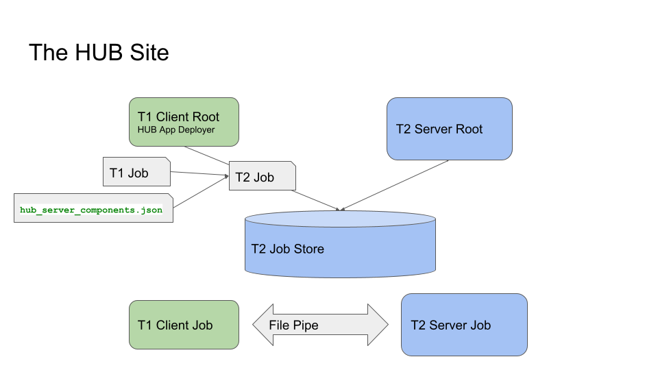
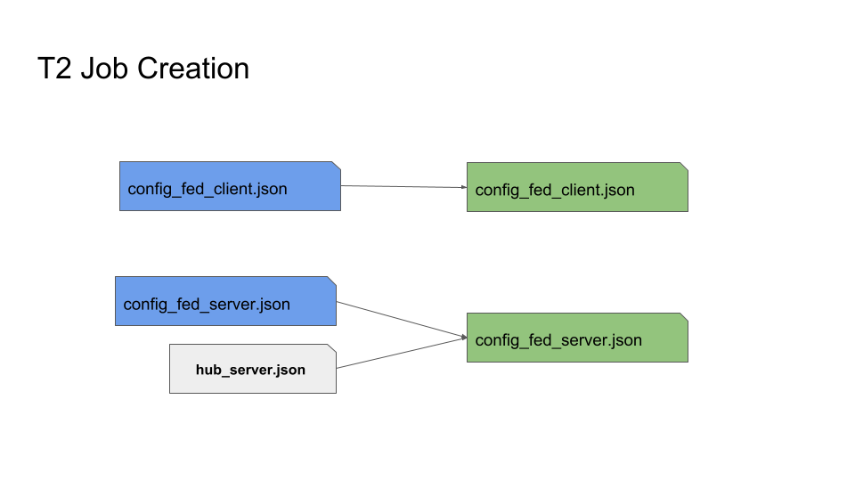
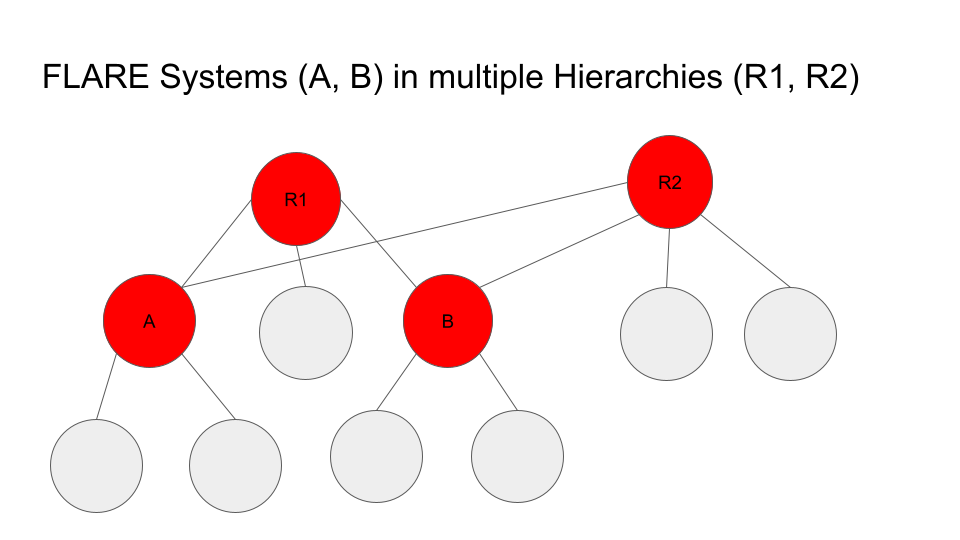

:orphan:

.. _hierarchy_unification_bridge:

.. deprecated:: 2.7
   Hierarchy Unification Bridge(HUB)は非推奨です。現在の階層型FLアプローチについては :ref:`Hierarchical Architecture <flare_hierarchical_architecture>` を参照してください。

############################
Hierarchy Unification Bridge
############################

.. notes::
    非推奨です。新しい階層型連合学習の使用を推奨します。

**************************
背景と動機
**************************
ユーザーの間では、複数のFLシステムを連携させて共通のモデルをトレーニングするというアイデアが検討されてきました。各FLシステムは独自のサーバーとクライアントを持ち、
同一または異なるFLフレームワークで実装されています。これらすべてのFLシステムは、FL Hub と呼ばれる中央サーバーによって管理され、FL Hub は
各FLシステムが秩序立って連携して動作するよう調整する責任を持ちます。

この構想では、すべてのFLフレームワークが共通の相互作用プロトコルに従う必要がありますが、そのプロトコルはまだ定義されていません。そのため最初のステップとして、
スコープを FLARE ベースのFLシステム同士を連携させることに絞ります。

FLARE は組織単位のコラボレーションをサポートするように設計されています。これは、システムあたりのクライアント数に上限(100未満)があることを意味します。Hierarchy Unification Bridge(HUB)は、
複数の FLARE システムを階層的に連携させることで、この上限を超えるシステムをサポートできるソリューションです。階層の最上位にはルートシステムがあり、
これはFLサーバーと複数のFLクライアントを持つ通常の FLARE システムにすぎません。各クライアントサイトは、通常のトレーニングを実行する単純なサイトでもよいし、独自のサーバーと
クライアントを持つ独立した FLARE システムでもかまいません。この方式を何度も繰り返すことで、必要なだけ深い階層を形成できます。

******
設計
******
この論理的な階層を実装する鍵は、下位ティアのシステム(Tier 2 または T2)を上位ティアのシステム(Tier 1 または T1)のクライアントにすることです。

次の図は、これがどのように行われるかを示しています。

この図では、緑のブロックが T1 システムのコンポーネントを、青のブロックが T2 システムのコンポーネントを表しています。T1 と T2 の
システムは互いに独立していますが、同じ組織に属しています。同じVM上にある必要はありませんが、共有ファイルシステムにアクセスできる必要が
あります。

一般的な処理の流れは次のとおりです。

    - T1 サーバーは、通常どおり T1 クライアントへジョブのスケジュールとデプロイを試みます
    - T1 Client Root がジョブを受け取り、デプロイを試みます
    - Deployer は、T1 のジョブと事前設定された情報に基づいて T2 システム用のジョブを作成します
    - Deployer は、作成したジョブを T2 のジョブストアに書き込みます
    - T2 Server Root は、通常どおり T2 のジョブをスケジュールしデプロイします
    - T1 サーバーが T1 のジョブを開始すると、T1 Client Job セル上で T1 のジョブが開始されます
    - 同様に、T2 サーバーが T2 のジョブを開始し、T2 Server Job セルを作成します
    - これでジョブが実行中になります
    - T1 Client Job セルと T2 Server Job セルは、File Pipe を介して互いに通信し、タスクデータとタスク結果を交換します
    - T1 Client Job セルと T1 Server Job セルは、通常どおりタスクデータ/結果を交換します

**********
課題
**********

この設計には主に2つの課題があります。

    - T1 システムのジョブを、どのように T2 システムのジョブに変換するか?
    - T1 システムの制御ロジックのセマンティクスを保証するための T2 システムのワークフローコントローラーは何か?

この2つの問いは密接に関連しています。ジョブの制御ロジックは、最終的には T1 のサーバーで実行されるワークフローによって決まります。
制御ロジックはかなり複雑になり得ます。たとえば、SAG コントローラーは、クライアントが実行すべきタスク、使用するアグリゲーター、
実行するラウンド数を決定します。すべてのシステムはラウンド単位で連携しなければなりません。
つまり、すべてのシステムのクライアントが各ラウンドのトレーニングに参加し、各ラウンドの終わりに T1 サーバーで集約が行われる必要が
あります。各システムがジョブ全体に対して独自の SAG を実行し、その最終結果を T1 サーバーで集約するというものではありません。

ご存じのとおり、FLクライアントには制御ロジックがありません。サーバーから割り当てられたタスクを実行し、タスク結果を提出するだけです。
T2 システムは T1 システムのクライアントのようなものなので、その目的は、割り当てられたタスクを自身のクライアントで適切に実行することに尽きます。ここで問題になるのは、
T2 サーバーはタスクを自身のクライアントにどう割り当てればよいかを、どうやって知るのかということです。たとえば、T1 サーバーが割り当てたタスクが単なる "train" である場合、
T2 サーバーは "train" タスクを自身のクライアントにブロードキャストすべきか、それともリレー方式で実行すべきかをどう判断するのでしょうか。ブロードキャストの場合、
クライアントから提出された結果はどう扱うべきでしょうか。ローカルで集約してから T1 システムに送り返すべきか、それとも単に収集して T1 システムに送り返すべきでしょうか。

**********************************
オペレーション駆動ワークフロー
**********************************

まず、いくつかの用語を定義します。

FLオペレーション
================
FLオペレーションは、FLタスクをどのように実行するかを記述します。FLARE は2種類のオペレーションをサポートしています: *broadcast*\ (bcast)と *relay* です。

*broadcast* オペレーションは、Controller の ``broadcast_and_wait`` メソッドのすべての属性(min_targets、wait_time_after_min_received、
timeout など)を指定します。さらに、集約をどのように行うか(アグリゲーターコンポーネントID)も指定します。

同様に、*relay* オペレーションは Controller の ``relay_and_wait`` メソッドのすべての属性を指定します。加えて、shareable generator と
persistor のコンポーネントIDを指定することもできます。

FLオペレーター
===============
オペレーターは、オペレーションを実装した単なる Python クラスです。サポートされる各オペレーションに対して、そのセマンティクスを Controller API を
用いて実装したオペレーターが存在します。

HUB Controller
--------------
HUB Controller は T2 の Server Job セルで実行され、ワークフローを制御します。これは汎用のオペレーションベースのコントローラーで、シンプルな制御ロジックを持ちます。

    - T1 システム(HubExecutor)からタスクデータを受信する
    - タスクデータのヘッダーおよび/またはジョブ設定に基づいて、実行すべきオペレーションを決定する
    - 要求されたオペレーションに対応するオペレーターを見つける
    - オペレーターを呼び出してオペレーションを実行する
    - 結果を要求元に送り返す

HUB Executor
------------
HUB Executor は T1 の Client Job セルで実行されます。HUB Controller と連携して、割り当てられたタスクを完了させ、結果を T1 サーバーに返します。

HUB Executor/Controller の相互作用
-----------------------------------
HUB Executor と HUB Controller は、File Pipe と呼ばれるファイルベースのメカニズムを使用して相互にやり取りします。

    - Executor は T1 サーバーからタスクを受信するのを待ちます。
    - Executor は受信したタスクデータのファイルを作成し、T2 システムからのタスク結果ファイルを待ちます。
    - Controller は、Shareable オブジェクトを含むタスクデータファイルを読み取ります。
    - タスクデータオブジェクトのヘッダーと事前設定されたオペレーション情報から、Controller は実行すべきFLオペレーションを決定し、対応するオペレーターを見つけます。
    - Controller はオペレーターを呼び出し、自身のクライアントにタスクを実行させます。
    - Controller はオペレーターからの結果を待ち、タスク結果ファイルを作成します。
    - Executor はタスク結果を読み取り、T1 サーバーに送り返します。

本質的に、このオペレーションベースのコントローラーは、T2 システムをFLオペレーション処理エンジン(FLOPE)にします。T2 システムは、別のシステムから要求されたオペレーションを実行するだけです。
これにより、実際のFL制御ロジックをどこでも実行できるようになります。たとえば、研究者が自分のマシン上でトレーニングループを実行し、トレーニングのオペレーションだけを T2 システムに送って実行させる、といったことが可能です。

ジョブの変更
-----------------
HUB を機能させるためには、T1 のクライアントは(通常のクライアントトレーナーの代わりに)HUB Executor を実行し、T2 のサーバーは(T1 のサーバーで設定された通常のワークフローの代わりに)
HUB Controller を実行する必要があります。そのためには、T1 クライアント用に T1 ジョブを変更し、T2 システム用に T2 ジョブを作成する必要があります。

    - T1 の config_fed_client.json は、すべてのタスクに HUB Executor を使用するテンプレート(hub_client.json)で置き換えられます。このテンプレートは、T2 上の HUB Controller との通信に使用する File Pipe も定義します。
    - T2 の config_fed_client.json は、元の T1 の config_fed_client.json と同じです。
    - T2 の config_fed_server.json は、HUB Controller を定義するテンプレート(hub_server.json)に基づきます。このテンプレートは、T1 上の HUB Executor との通信に使用する File Pipe も定義します。
    - T1 の config_fed_server.json には、すべてのタスクのオペレーション記述を含める必要がある場合があります。この情報は T2 の config_fed_server.json に追加され、HUB Controller がオペレーターを決定し呼び出すために使用されます。

次の図は、T1 の元のジョブ(青色)に基づき、hub_server.json で拡張して T2 ジョブ(緑色)が作成される様子を示しています。

これらのテンプレートの例を次に示します。

hub_client.json
^^^^^^^^^^^^^^^

.. code-block:: json

    {
        "format_version": 2,
        "executors": [
            {
                "tasks": [
                    "*"
                ],
                "executor": {
                    "id": "Executor",
                    "path": "nvflare.app_common.hub.hub_executor.HubExecutor",
                    "args": {
                        "pipe_id": "pipe",
                        "task_wait_time": 600,
                        "result_poll_interval": 0.5
                    }
                }
            }
        ],
        "components": [
            {
                "id": "pipe",
                "path": "nvflare.fuel.utils.pipe.file_pipe.FilePipe",
                "args": {
                    "root_path": "/tmp/nvflare/hub/pipe/a"
                }
            }
        ]
    }

hub_server.json
^^^^^^^^^^^^^^^

.. code-block:: json

    {
        "format_version": 2,
        "workflows": [
            {
                "id": "controller",
                "path": "nvflare.app_common.hub.hub_controller.HubController",
                "args": {
                    "pipe_id": "pipe",
                    "task_wait_time": 60,
                    "task_data_poll_interval": 0.5
                }
            }
        ],
        "components": [
            {
                "id": "pipe",
                "path": "nvflare.fuel.utils.pipe.file_pipe.FilePipe",
                "args": {
                    "root_path": "/tmp/nvflare/hub/pipe/a"
                }
            }
        ]
    }

テンプレートに示されているように、両側の File Pipe は同じルートパスを使用するように設定されていなければなりません。

T1 App Deployer と T2 ジョブストア
^^^^^^^^^^^^^^^^^^^^^^^^^^^^^^^^^^^^
T1 のアプリデプロイヤーは、上で説明したジョブの変更と作成を行う HubAppDeployer に置き換える必要があります。

App Deployer が T2 ジョブを作成したら、それを T2 のジョブストアに書き込む必要があります。そのためには、T1 クライアントが T2 のジョブストアにアクセスできる必要があります。

これらはどちらも、T1 のローカルリソースを変更することで実現します。

.. code-block:: json

    {
        "format_version": 2,
        "client": {
            "retry_timeout": 30,
            "compression": "Gzip"
        },
        "components": [
            {
                "id": "resource_manager",
                "path": "nvflare.app_common.resource_managers.list_resource_manager.ListResourceManager",
                "args": {
                    "resources": {
                        "gpu": [0, 1, 2, 3]
                    }
                }
            },
            {
                "id": "resource_consumer",
                "path": "nvflare.app_common.resource_consumers.gpu_resource_consumer.GPUResourceConsumer",
                "args": {}
            },
            {
                "id": "job_manager",
                "path": "nvflare.apis.impl.job_def_manager.SimpleJobDefManager",
                "args": {
                    "uri_root": "/tmp/nvflare/hub/jobs/t2a",
                    "job_store_id": "job_store"
                }
            },
            {
                "id": "job_store",
                "path": "nvflare.app_common.storages.filesystem_storage.FilesystemStorage"
            },
            {
                "id": "app_deployer",
                "path": "nvflare.app_common.hub.hub_app_deployer.HubAppDeployer"
            }
        ]
    }

この例では、App Deployer の設定が末尾にあり、ジョブストアへのアクセス設定は、その上にある2つのコンポーネントで構成されています。

ジョブの提出
^^^^^^^^^^^^^^
ユーザーは T1 システムに通常のジョブを提出するだけで、そのジョブが複数のシステムでどのように実行されるかを意識する必要はありません。T2 システムは、そのジョブの単なるクライアントです。T2 システムはオペレーションベースのコントローラーを使用するため、
受信したタスクに対するオペレーションを決定できる必要があります。そこで、ユーザーは各タスクにどのオペレーションを使用するかについての追加情報を提供する必要があります。これは、ジョブ設定の
config_fed_server.json でオペレーターを定義することで実現します。

.. code-block:: json

    {
        "format_version": 2,
        "operators": {
            "train": {
                "method": "bcast",
                "aggregator": "aggregator",
                "timeout": 600,
                "min_targets": 1
            },
            "submit_model": {
                "method": "bcast",
                "aggregator": "model_collector",
                "timeout": 600,
                "min_targets": 1
            },
            "validate": {
                "method": "bcast",
                "aggregator": "val_collector",
                "timeout": 600,
                "min_targets": 1
            }
        },
        "components": [
            {
                "id": "aggregator",
                "path": "nvflare.app_common.aggregators.intime_accumulate_model_aggregator.InTimeAccumulateWeightedAggregator",
                "args": {
                    "expected_data_kind": "WEIGHTS"
                }
            },
            {
                "id": "model_collector",
                "path": "nvflare.app_common.aggregators.dxo_collector.DXOCollector",
                "args": {}
            },
            {
                "id": "val_collector",
                "path": "nvflare.app_common.aggregators.dxo_collector.DXOCollector",
                "args": {}
            }
        ]
    }

この例は、``train``、``submit_model``、``validate`` の各タスクに対してオペレーターを設定する方法を示しています。いずれも ``bcast`` メソッドを使用していますが、異なる集約手法を使用している点に注意してください。

.. note::

    注記: すべての HUB システムのジョブは、ルートシステムが作成した同一のジョブIDを使用します。これにより、すべてのシステム間でジョブを対応付けることが容易になります。

********************************
HUB サイトのセットアップ方法
********************************

上に示したように、HUB サイトでは2つのエンティティが動作します: T1 システム用のFLクライアントと、T2 システム用のFLサーバーです。この2つのエンティティは共有ファイルシステムにアクセスできる必要がありますが、同じVM上にある必要はありません。

T2 のFLサーバーに対して特別なことをする必要はありません。それは単なる通常の FLARE システムです。セットアップ作業はすべて T1 のFLクライアント側にあります。

ステップ1: T1 システムのクライアントを作成する
====================================================
これは T1 システムの通常のプロビジョニングとセットアップのプロセスです。完了すると、クライアントの構成(ワークスペース、スタートアップキット、local フォルダなど)が作成されているはずです。

ステップ2: "<workspace>/local/resources.json" を変更する
=================================================================

.. code-block:: json

    {
        "format_version": 2,
        "client": {
            "retry_timeout": 30,
            "compression": "Gzip",
            "communication_timeout": 30
        },
        "components": [
            {
                "id": "resource_manager",
                "path": "nvflare.app_common.resource_managers.gpu_resource_manager.GPUResourceManager",
                "args": {
                    "num_of_gpus": 0,
                    "mem_per_gpu_in_GiB": 0
                }
            },
            {
                "id": "resource_consumer",
                "path": "nvflare.app_common.resource_consumers.gpu_resource_consumer.GPUResourceConsumer",
                "args": {}
            },
            {
                "id": "job_manager",
                "path": "nvflare.apis.impl.job_def_manager.SimpleJobDefManager",
                "args": {
                    "uri_root": "/tmp/nvflare/jobs-storage/a",
                    "job_store_id": "job_store"
                }
            },
            {
                "id": "job_store",
                "path": "nvflare.app_common.storages.filesystem_storage.FilesystemStorage"
            },
            {
                "id": "app_deployer",
                "path": "nvflare.app_common.hub.hub_app_deployer.HubAppDeployer"
            }
        ]
    }

次の3つのコンポーネントを追加する必要があります。

    - ``job_manager`` - "uri_root" が、T2 のサーバー設定で使用されている正しいパスに設定されていることを確認してください。
    - ``job_store`` - T2 システムとまったく同じ設定になっていることを確認してください。
    - ``app_deployer`` - 何も変更する必要はありません。

ステップ3: クライアントの "<workspace>/local" フォルダに hub_client.json を作成する
=========================================================================================

.. code-block:: json

    {
        "format_version": 2,
        "executors": [
            {
                "tasks": [
                    "*"
                ],
                "executor": {
                    "id": "executor",
                    "path": "nvflare.app_common.hub.hub_executor.HubExecutor",
                    "args": {
                        "pipe_id": "pipe"
                    }
                }
            }
        ],
        "components": [
            {
                "id": "pipe",
                "path": "nvflare.fuel.utils.pipe.file_pipe.FilePipe",
                "args": {
                    "root_path": "/tmp/nvflare/pipe/a"
                }
            }
        ]
    }

上記コンポーネントの ``root_path`` パラメータは調整することができ、また調整すべきです。

    - ``root_path`` - T1 システムが T2 システムとデータを交換するために使用するルートパスです。このパスが T1 と T2 の両方のシステムからアクセス可能であること、およびステップ4と同じ値に設定されていることを確認してください。

HubExecutor の設定
-----------------------
HubExecutor は、次の引数でさらに設定できます。

    - ``task_wait_time`` - 指定した場合、HubExecutor が T2 システムからのタスク結果を待つ時間(秒)です。T2 システムがタスクを完了するのに十分な時間を確保してください。そうしないと、T1 がジョブを途中で中断してしまう可能性があります。値を指定する必要はありません。デフォルトでは、HubExecutor は結果を受信するかピアが切断されるまで待ち続けます。
    - ``result_poll_interval`` - HubExecutor がパイプからタスク結果の読み取りを試みる頻度です。デフォルトは0.1秒です。この値を変更する必要はないはずです。
    - ``task_read_wait_time`` - ピアにタスクを送信した後、ピアがタスクデータを読み取るのを待つ時間です。この時間内にピアがタスクを読み取らなかった場合、ジョブは中断されます。これは通常、T2 システムが稼働していないか、ジョブのスケジュールまたはデプロイができなかったことが原因です。この引数のデフォルト値は10秒です。変更する場合は、T2 がジョブをスケジュールして開始するのに十分な時間を確保してください。T2 システム自体もマルチティアである場合、これは特に重要です。

ステップ4: クライアントの "<workspace>/local" フォルダに hub_server.json を作成する

.. code-block:: json

    {
        "format_version": 2,
        "workflows": [
            {
                "id": "controller",
                "path": "nvflare.app_common.hub.hub_controller.HubController",
                "args": {
                    "pipe_id": "pipe"
                }
            }
        ],
        "components": [
            {
                "id": "pipe",
                "path": "nvflare.fuel.utils.pipe.file_pipe.FilePipe",
                "args": {
                    "root_path": "/tmp/nvflare/pipe/a"
                }
            }
        ]
    }

上記コンポーネントの ``root_path`` パラメータは調整することができ、また調整すべきです。

    - root_path - T2 システムが T1 システムとデータを交換するために使用するルートパスです。このパスが T1 と T2 の両方のシステムからアクセス可能であること、およびステップ3と同じ値に設定されていることを確認してください。

HubController の設定

HubController は、次の引数でさらに設定できます。

    - ``task_wait_time`` - T2 の HubController が T1 システムからのタスク割り当てを待つ時間(秒)です。この値を指定する場合は、T1 がタスクデータを取得するのに十分な時間を確保してください。そうしないと、T2 がジョブを途中で中断してしまう可能性があります。値を指定する必要はありません。デフォルトでは、HubController はタスクを受信するかピアが切断されるまで待ち続けます。
    - ``task_data_poll_interval`` - パイプからタスクデータの読み取りを試みる頻度です。デフォルトは0.1秒です。この値を変更する必要はないはずです。

********************
複数の階層
********************
この設計では、次に示すように、1つの FLARE システムが複数の階層に属することができます。

この例では、システム A と C は R1 と R2 の2つの階層に属しています。

これを実装するには、HUB サイトが階層ごとに1つの T1 設定を持つだけで済みます。たとえば、サイト A は2つの T1 設定を持ちます: R1 用と R2 用です。
両方の設定は、job_manager、job_store、パイプパスについて同じセットアップを共有しなければなりません。

可能性
==========
すべてのシステムを連携させる鍵は、オペレーション駆動ワークフロー(HubController)です。これは本質的に、FLARE システムをオペレーションのエグゼキューターにします。現在、
オペレーションは File Pipe を通じて HubExecutor からのみ呼び出せますが、メッセージング経由で呼び出せるようにすることも容易に実現可能です。たとえば、FLARE API を
拡張してオペレーションを呼び出せるようにすると、次のようになります。

.. code-block:: python

    from nvflare.fuel.flare_api.flare_api import Session, new_secure_session

    sess = new_secure_session()
    task_data = ...
    for r in range(100):
        result = sess.call_operation(
            method="bcst",
            task=task_data,
            aggregator="InTimeWeightAggregator",
            timeout=300,
            min_clients=3
        )
        # process result...
        task_data = result

制限事項
===========

下位レベルでは Deploy Map をサポートできない
----------------------------------------------
ジョブはルートシステムのレベルで提出されます。下位レベルのシステムのFLクライアントは、研究者がデプロイマップを設定するために利用できません。その結果、下位レベルのシステムは、そのすべてのクライアントにタスクをデプロイします。

プレフィックスを使わない限り、オペレーターは一度しか設定できない
------------------------------------------------------------------------
異なるレベルが異なるプロジェクト名でプロビジョニングされていれば、レベルごとに異なるオペレーターを設定できます!

特定のレベルにオペレーターを設定するには、ジョブの config_fed_server.json でタスク名のプレフィックスとしてそのプロジェクト名を追加するだけです。

.. code-block:: json

    "operators": {
        "train": {
            "method": "bcast",
            "aggregator": "aggregator",
            "timeout": 60,
            "min_targets": 1,
            "wait_time_after_min_received": 30
        },
        "BC.train": {
            "method": "relay"
        }
    }

この例では、プロジェクト "BC" はタスク "train" に対して "relay" メソッドを使用するように設定されており、他のすべてのレベル(プロジェクト)はデフォルトの "bcast" メソッドを使用します。

下位レベルのシステムではジョブ署名を検証できない
--------------------------------------------------------
これは、下位レベルのシステムに提出されるジョブが元のジョブから変更されているためです。そのため、(元のジョブ定義に基づく)ジョブ署名は、変更後のジョブ定義に対してはもはや検証できません。

HUB が作成したジョブでは、ジョブ署名の検証は無効化されます。

下位レベルの不可視性
------------------------------
各システムは独立してプロビジョニングされ、独自の管理サーバーを持ちます。ユーザーはこれらのシステムに個別にアクセスできますが、ルートシステムを通じて下位レベルの
システムの詳細を見ることはできません。すべてのレベルに影響を与えるコマンドは ``submit_job`` と ``abort_job`` のみです。

あるレベルで発行された ``submit_job`` コマンドは、そのレベルとその下位レベルのシステムにのみ影響します。したがって、すべてのレベルでジョブを実行するには、コマンドをルートレベルで発行する必要があります。

あるレベルで発行された ``abort_job`` コマンドは、そのレベルとその下位レベルのシステムにのみ影響します。したがって、すべてのレベルでジョブを中止するには、コマンドをルートレベルで発行する必要があります。

タイミングは保証されない
---------------------------
ジョブが提出された後、それをスケジュールするかどうかは下位レベルのシステム次第です。すべてのシステムが同時にジョブを開始できるとは保証されず、下位レベルのシステムで
ジョブがスケジュールすらされない可能性もあります。そのような場合、下位レベルのシステムが時間内にジョブをスケジュールできないと、ジョブが中止されることがあります。

.. note::

    注記: T1 クライアント(HubExecutor)は T2 からの応答を待ちます。設定された時間内に T2 が応答しない場合、ジョブをキャンセルします。同様に、開始後、
    T2 のコントローラー(HubController)は T1 からのタスクデータを待ちます。設定された時間内に T1 がタスクを作成しない場合、ジョブをキャンセルします。
