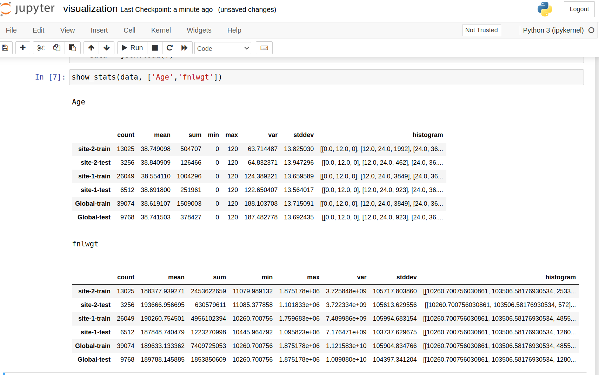
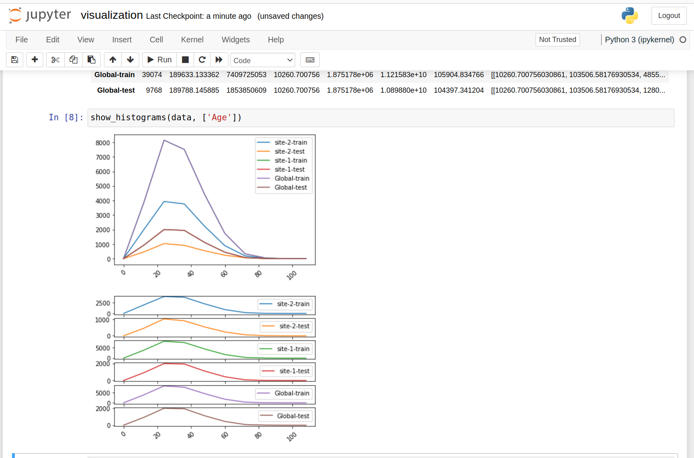
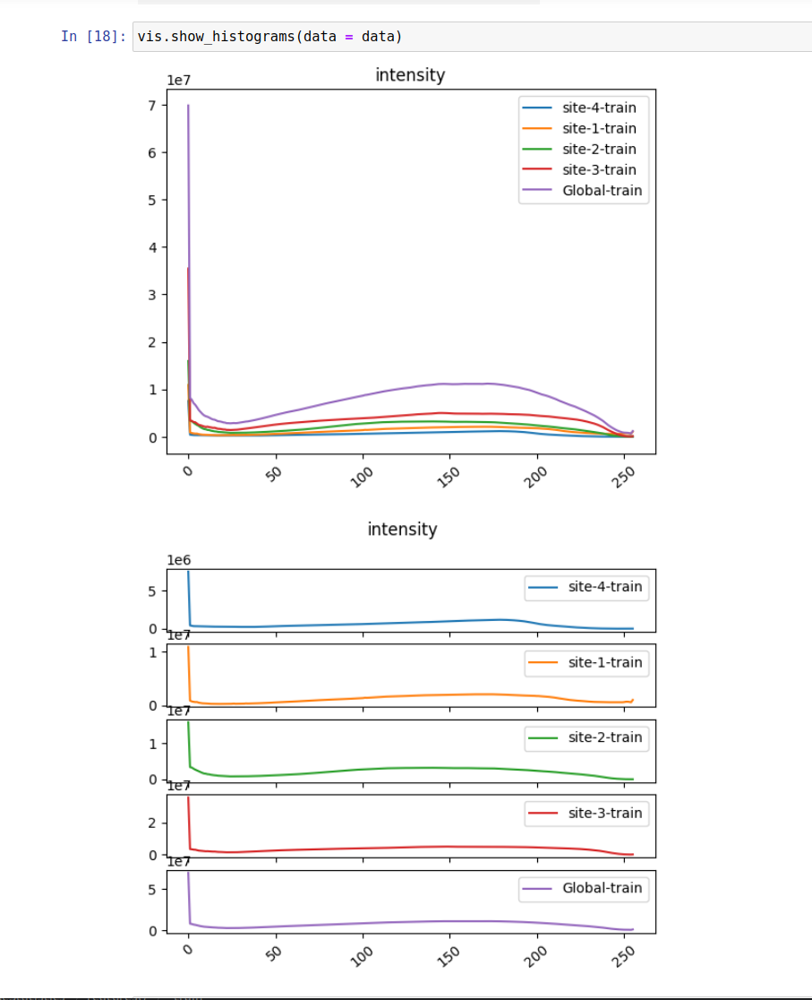

.. _federated_statistics:

連合統計の概要
*****************************

目的
=========
NVIDIA FLARE は、ローカルのクライアント側統計に基づいてグローバル統計を生成できる、組み込みの連合統計オペレーター(コントローラーとエグゼキューター)を提供します。

各クライアントサイトには、1つ以上のデータセット("train" や "test" データセットなど)が存在し得ます。各データセットは多数の特徴量を持つことがあります。データセット内の各特徴量について統計を計算し、それらを結合してすべての数値特徴量のグローバル統計を生成します。出力は、各クライアントおよびグローバルの、すべてのデータセットに対する完全な統計となります。

ここでの統計とは、一般的に使われる統計量です: 数値特徴量に対する count、sum、mean、std_dev、histogram です。max と min は、クライアントのデータプライバシーを侵害する可能性があるため含まれていません。median はアルゴリズムが複雑なため含まれていません。統計量として sum と count が選択されている場合、mean は count と sum から計算されます。

クライアントは、statistics_spec の :class:`Statistics<nvflare.app_common.abstract.statistic_spec.Statistics>` クラスのうち、選択したメソッドのみを実装すれば済みます。

結果は、すべてのサイトのすべてのデータセットのすべての特徴量に対する統計と、グローバルな集約値になります。結果は、ノートブックの可視化ユーティリティで可視化できます。

前提
-----------

クライアントは次のものを提供すると想定します。

* 対象とする統計量(count、histogram のみ、など)
* 対象統計量に対するローカル統計(`statistic_spec` を実装することによる)
* データセットとデータセットの特徴量(特徴量名、データ型)

.. note::

    注記: count は常に必須です。count はデータプライバシーポリシーの適用に使用されるためです。数値特徴量のみをサポートし、カテゴリカル特徴量はサポートしません。クライアントはすべての型の特徴量を返すことができますが、数値以外の特徴量は除去されます。

例
--------

オペレーターをどのように使用すべきかを示すために、いくつかの例を提供しています。

表形式データの例
~~~~~~~~~~~~~~~~~~~~

最初の例は、表形式データの統計を計算するものです。データは Pandas DataFrame に読み込むことができ、メモリにキャッシュ可能で、DataFrame と Numpy を活用してローカル統計を計算できます。

**Data frame statistics**

結果は json 形式でジョブのワークスペースに保存され、Pandas DataFrame に読み込むことができます。jupyter ノートブックでは、提供されている可視化ユーティリティで結果を可視化できます。例として、この表は特定の特徴量 "Age" の統計を、各サイトおよび各データセットについて示しています。

各データセットのすべての特徴量について、グローバルの特徴量統計とクライアントの特徴量統計を並べて比較できます。

ヒストグラムプロットの例を次に示します。

主な手順は次のとおりです。

    * 対象統計量とその設定、および出力先を指定するサーバー側設定を提供する
    * ローカル統計ジェネレーター(statistics_spec)を実装する
    * データ入力先を指定するクライアント側設定を提供する
    * 詳細な例の手順は :github_nvflare_link:`Data frame statistics <examples/advanced/federated-statistics/df_stats/README.md>` を参照してください

COVID-19 放射線画像の例
~~~~~~~~~~~~~~~~~~~~~~~~~~~~~~~~~
2つ目の例は、画像ヒストグラムの例です。表形式データの例とは異なり、画像の例では次の点を示しています。

* :github_nvflare_link:`client.py <examples/advanced/federated-statistics/image_stats/client.py>` は count と histogram の対象統計量のみを計算すればよいため、ユーザーは count、failure_count、histogram の計算関数を提供するだけで済みます。他のメトリクス関数(sum、mean、std_dev など)を実装する必要はありません(get_failure_count はデフォルトで 0 を返します)。
* 各サイトのデータセットには数千枚の画像があり、ローカルヒストグラムは、すべての画像ヒストグラムを集約したヒストグラムです。
* 画像ファイルは大きいため、すべてをメモリに読み込んでから統計を計算することはできません。計算のたびにファイルを順に処理する必要があります。この例のように特徴量が1つであれば問題ありません。複数チャネルなど複数の特徴量がある場合、チャネルごとにヒストグラム計算のために画像をメモリに再読み込みするのは非常に無駄が多くなります。
* :github_nvflare_link:`Data frame statistics <examples/advanced/federated-statistics/df_stats/README.md>` とは異なり、ヒストグラムビンのグローバル範囲はユーザーによって [0, 256] と事前定義されています。Data frame statistics では、"Age" を除き、他のすべての特徴量のヒストグラムのグローバルビン範囲は、ローカルの min/max 値に基づいて動的に推定されます。

画像ヒストグラムの一部を次に示します(対象の画像ファイルは1チャネルのみです)。

脾臓CT画像を用いた Monai 統計の例
~~~~~~~~~~~~~~~~~~~~~~~~~~~~~~~~~~~~~~~~

この例 :github_nvflare_link:`Spleen CT Image Statistics <integration/monai/examples/spleen_ct_segmentation_local>` は、連合統計についてさらにいくつかの詳細を示しています。

* 各画像に対してローカルでヒストグラムを計算する代わりに、この例では MONAI FLARE インテグレーションを介して monai からローカル統計を取得する方法を示します。
* 特徴量ごとに同じ画像をメモリに再読み込みするのを避けるため、この例では pre_run() メソッドを使用して、外部で計算された統計を読み込んでキャッシュできることを示します。サーバー側のコントローラーは対象メトリクスを pre_run メソッドに渡すため、これを統計の読み込みに利用できます。

プライバシーポリシーとプライバシーフィルター
----------------------------------------------------

NVFLARE はプライバシーフィルター :ref:`privacy-management <site_policy_management>` を通じてデータプライバシー保護を提供します。各サイトは独自のプライバシーポリシーを持つことができます。

ローカルプライバシーポリシー
~~~~~~~~~~~~~~~~~~~~~~~~~~~~~~

privacy.json は、ローカルサイト固有のプライバシーポリシーを提供します。このポリシーは通常、企業によって策定され、プロジェクトの組織管理者によって実装されます。スコープやカテゴリの種類によって、異なる種類のポリシーが存在し得ます。

プライバシー設定
~~~~~~~~~~~~~~~~~~~~~

NVFLARE のプライバシー設定は、タスクデータフィルターとタスク結果フィルターのセットで構成されます。

* タスクデータフィルターは、クライアントのエグゼキューターが実行される前に適用されます
* タスク結果フィルターは、クライアントのエグゼキューターの実行後、サーバーに送信される前に適用されます
* データフィルターと結果フィルターのどちらも、スコープを介してグループ化されます

各ジョブはプライバシースコープを持つ必要があります。指定されていない場合は、デフォルトスコープが使用されます。デフォルトスコープが定義されておらず、ジョブがプライバシースコープを指定していない場合、ジョブのデプロイメントは失敗し、ジョブは実行されません。

プライバシーポリシーの適用方法
~~~~~~~~~~~~~~~~~~~~~~~~~~~~~~~~~~~~

ユースケースに応じて、プライバシーフィルターを設定するにはいくつかの方法があります。

研究者としてプライバシーポリシーを設定する
^^^^^^^^^^^^^^^^^^^^^^^^^^^^^^^^^^^^^^^^^^^^^^^^
config_fed_client.json で "task_result_filters" を指定して、プライバシー制御を指定できます。これは、これらのフィルターを開発する際に便利です。

組織管理者としてサイトのプライバシーポリシーを設定する
^^^^^^^^^^^^^^^^^^^^^^^^^^^^^^^^^^^^^^^^^^^^^^^^^^^^^^^^^^^^
企業が個々のジョブとは独立に特定のプライバシーポリシーを適用すると決めた場合、local ディレクトリの privacy.json の内容をクライアントのローカルの privacy.json にコピー(上書きではなくマージ)できます。この例では、アプリが1つしかないため、local ディレクトリの private.json を ``site-1/local/privacy.json`` と ``site-2/local/privacy.json`` に単純にコピーするだけで済みます。

**二重フィルタリング**\ を避けるため、config_fed_client.json のジョブ定義から同じフィルターを削除する必要があります。これは "task_result_filters" を空のリストに設定するだけです。

.. code-block::

    "task_result_filters": []

ジョブのフィルターと private.json のフィルター
^^^^^^^^^^^^^^^^^^^^^^^^^^^^^^^^^^^^^^^^^^^^^^^^^^^^

プライバシーフィルターは、プライバシースコープ内で定義されます。ジョブのプライバシースコープが定義されているか、デフォルトスコープを持つ場合、スコープのフィルター(あれば)がジョブで指定されたフィルター(あれば)より先に適用されます。このルールは、タスク実行時に適用されます。

このルールにより、タスク結果フィルターとプライバシースコープのフィルターの両方がある場合、プライバシーフィルターが先に適用され、次にジョブのフィルターが適用されることを理解しておく必要があります。

統計プライバシーフィルター
^^^^^^^^^^^^^^^^^^^^^^^^^^^^^^

統計プライバシーフィルターはタスク結果フィルターです。統計用のフィルターはすでに用意されています。

:class:`StatisticsPrivacyFilter<nvflare.app_common.filters.statistics_privacy_filter.StatisticsPrivacyFilter>` は、クライアントからサーバーへ送信される統計に焦点を当てた、複数の ``StatisticsPrivacyCleansers`` で構成されます。

:class:`StatisticsPrivacyCleanser<nvflare.app_common.statistics.statistics_privacy_cleanser.StatisticsPrivacyCleanser>` は、結果がサーバーに届く前のインターセプターと考えることができます。現在、データプライバシーを守るために3つの ``StatisticsPrivacyCleansers`` を使用しています。個別のフィルターではなく ``StatisticsPrivacyCleanser`` を構築した理由は、データの逆シリアル化が繰り返されるのを避けるためです。

**MinCountCleanser**

各データセット・各特徴量について、クライアントから返された count の数をチェックします。

min_count が満たされない場合、クライアントの実データが漏えいする潜在的リスクがあります。その場合、このクライアントの結果からその特徴量の統計を除去します。

**HistogramBinsCleanser**

ヒストグラム計算では、count に比べてビン数が大きすぎてはいけません。ビン数 = count の場合、実データが漏えいすることになります。このチェックは、ビン数が count の X パーセント未満であることを確認します。X = max_bins_percent はパーセント値で、10 は 10% を意味します。ヒストグラムのビン数がこの指定条件を満たさない場合、サーバーに送信する前に、結果のヒストグラムは統計から除去されます。

**AddNoiseToMinMax**

ヒストグラム計算において、特徴量のヒストグラムビンの範囲が指定されていない場合、ローカルデータの min と max の値を使ってグローバルの min/max 値を計算し、そのグローバル min/max 値をヒストグラム計算のビン範囲として使用する必要があります。しかし、ローカルの min/max 値をサーバーに送ると、クライアントの実データが漏えいします。データプライバシーを守るため、ローカルの min/max 値にノイズを加えます。

min/max のランダム化は、(min_noise_level と max_noise_level)の間のランダムノイズを生成するために使用されます。たとえば、ランダムノイズを(0.1 と 0.3)の範囲、すなわち 10% から 30% のレベルとします。このノイズにより、ローカルの min 値は真のローカル min 値より小さくなり、max 値は真のローカル max 値より大きくなります。その結果、推定されるグローバルの max/min 値(すなわちノイズ付き)は、依然として真のグローバル min/max 値を包含する境界となり、次の関係が成り立ちます。

.. code-block::

    est. global min value <
        true global min value <
            client's min value <
                client's max value <
                    true global max <
                            est. global max value

動作の仕組み
------------------

ローカル統計の一部(count、failure count、sum など)は1ラウンドで計算できますが、stddev やヒストグラム(グローバルビン範囲が指定されていない場合)などの統計は2ラウンドの計算が必要です。私たちは、クライアントへ実質的に3回のやり取りを行うワークフローを設計しました。

* pre_run() -- コントローラーがクライアントに対象メトリクスの情報を送信します
* 1回目の統計タスク -- コントローラーがクライアントに1回目の対象メトリクスのセットを送信し、グローバル min/max の推定が必要な場合はローカルの max/min も送信します
* 2回目の統計タスク -- 集約されたグローバル統計に基づいて2回目を実行し、(グローバル平均を用いた)VAR と、グローバル範囲(または推定グローバル範囲)に基づくヒストグラムを計算します

統計量
----------

連合統計には、次の数値統計量が含まれます。

* count
* mean
* sum
* std_dev
* histogram
* quantile

データプライバシー上の懸念を避けるため、min、max の値は含めていません。

分位数
~~~~~~~~~

分位数統計とは、確率分布またはデータセットを等しい確率または割合の区間に分割する統計的尺度を指します。分位数は、値がどのように分布しているかを示す代表的な点を提供することで、データの分布を要約するのに役立ちます。

主な分位数:

* 中央値(50パーセンタイル): データセットを2等分する中央の値
* 四分位数(25、50、75パーセンタイル): データを4等分する
* 十分位数(10、20、...、90パーセンタイル): データを10等分する
* パーセンタイル(1、2、...、99): データを100等分する

分位数の用途:

* 記述統計: データの広がりを要約する
* 外れ値検出: 極端な値の特定に役立つ
* 機械学習: 特徴量エンジニアリング、正規化、決定木アルゴリズムで使用される
* リスク分析: 金融で使用される(例: バリュー・アット・リスク、VaR)

実装の詳細:

連合分位数を計算するために、次の制約を満たす fastdigest パッケージを使用します。

* 分散システムで動作する
* 元のデータをコピーしない(プライバシー漏えいを回避)
* 大量のデータの送信を回避する
* システムレベルの依存関係がない

``fastdigest`` は ``0.4.0`` に固定してください。

.. code-block:: text

    pip install fastdigest==0.4.0

新しい ``fastdigest`` リリースでは TDigest API が変更されており、後のブランチで採用される予定です。

tdigest アルゴリズムはクラスタ座標のみを保持し、初期状態では各データポイントがそれぞれ独自のクラスタに属します。デフォルトでは、max_bin = sqrt(datasize) で座標を圧縮するため、データが漏えいすることはありません。圧縮の度合いを増減したい場合は、いつでも max_bins をオーバーライドできます。

詳細な実装手順と設定例については、:github_nvflare_link:`Federated Statistics README <examples/advanced/federated-statistics/README.md>` を参照してください。

プライバシーに関する考慮事項:

* 分位数の計算には、クラスタ座標のみを保持する tdigest アルゴリズムを使用します
* データ圧縮はデフォルトで適用されます(max_bin = sqrt(datasize))
* 元のデータが送信されたり公開されたりすることはありません
* 実装は既存のプライバシーフィルターの枠組みの中で動作します

まとめ
-------
異なるデータサイトと特徴量に対するローカル統計を簡単に集約・可視化できる連合統計オペレーターを提供しました。
この機能により、連合データ分析がより容易になることを願っています。詳細については、:github_nvflare_link:`Federated Statistics (Github) <examples/advanced/federated-statistics/README.md>` を参照してください。
