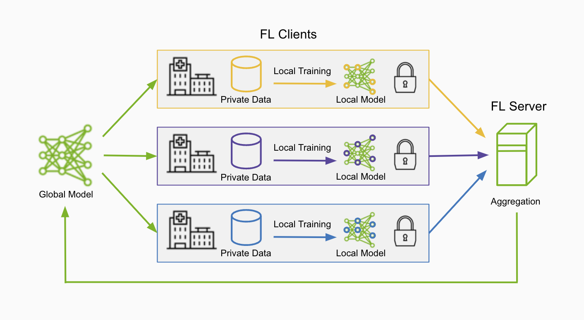

.. _fl_introduction:

##########################################
フェデレーテッドラーニングとは何か？
##########################################

フェデレーテッドラーニングは、それぞれが独自のローカルデータセットを持つ複数のクライアントにまたがって学習が行われる分散学習のパラダイムです。
これにより、機密性の高いローカルデータを共有することなく共通の頑健なモデルを構築でき、データのプライバシーとセキュリティの問題を解決する助けとなります。

フェデレーテッドラーニングはどのように動作するのか？
=========================================================
フェデレーテッドラーニング (FL) サーバーは、まず初期モデルを FL クライアントに送信することで、複数のクライアントの協調をオーケストレーションします。
クライアントは自身のローカルデータセットで学習を行い、その後モデルの更新を FL サーバーに送り返して集約し、グローバルモデルを形成します。
このプロセスがフェデレーテッドラーニングの1ラウンドを構成し、複数のラウンドを経ることで頑健なグローバルモデルを開発できます。

FL の用語と定義
================

- FLサーバー: ジョブのライフサイクルを管理し、ワークフローをオーケストレーションし、クライアントにタスクを割り当て、集約を実行します
- FLクライアント: タスクを実行し、ローカルデータセットを使ってローカルな計算・学習を行い、結果を FL サーバーに提出します
- FLアルゴリズム: FedAvg、FedOpt、FedProx など、ワークフローとして実装されます

.. note::

    ここでは、FL サーバーがアグリゲータノードの役割を担う中央集権型の FL を説明しています。ただし、swarm learning のような
    分散型のバージョンでは、代わりに FL クライアントがアグリゲータノードとして機能することもあります。

- FL の種類

  - 水平FL (horizontal FL): クライアントが同じ特徴量について異なるデータサンプルを保持します
  - 垂直FL (vertical FL): クライアントが重複するデータサンプルの集合について異なる特徴量を保持します
  - swarm learning: オーケストレーションと集約をクライアントが行う、FL の分散型サブセットです

主なメリット
=============

データのプライバシーとセキュリティの向上
------------------------------------------
フェデレーテッドラーニングは、データが各サイトに留まることを保証することで、データのプライバシーとデータのローカリティを促進します。
さらに、準同型暗号や差分プライバシーのフィルタといったプライバシー保護技術を活用して、転送されるデータをさらに保護することもできます。

精度と多様性の向上
-------------------
異なるクライアントにまたがる多様なデータソースで学習することで、不均質なデータセットをより良く表現する、頑健で汎化性能の高いグローバルモデルを開発できます。

スケーラビリティとネットワーク効率
------------------------------------
エッジで学習を実行できる能力により、フェデレーテッドラーニングは世界規模で高いスケーラビリティを持てます。
さらに、データセット全体ではなくモデルの重みだけを転送すればよいため、ネットワークリソースを効率的に利用できます。

応用分野
=========
フェデレーテッドラーニングの重要な応用分野の一つはヘルスケア分野です。この分野では、データプライバシー規制や患者記録の機密性のためにモデルの学習が難しくなっています。
フェデレーテッドラーニングは、こうしたヘルスケアデータのサイロを打ち破り、病院や医療機関がデータを共有することなく協調して医療知識を持ち寄れるようにします。
一般的なユースケースには、分類・検出タスク、フェデレーテッドなタンパク質LLMによる創薬、医療機器上でのフェデレーテッドアナリティクスなどがあります。

さらに、金融の不正検知、自動運転車、HPC、モバイルアプリケーションなど、他にも多くの領域や産業があり、
そこではデータのプライバシーを維持しながら分散したデータサイロを活用できることが、より良いモデルの開発に不可欠です。

FLARE が、研究から本番環境までのフェデレーテッドラーニングを実現する柔軟なフェデレーテッドコンピューティングフレームワークとしてどのように構築されているかを、この先で読み進めてください。
