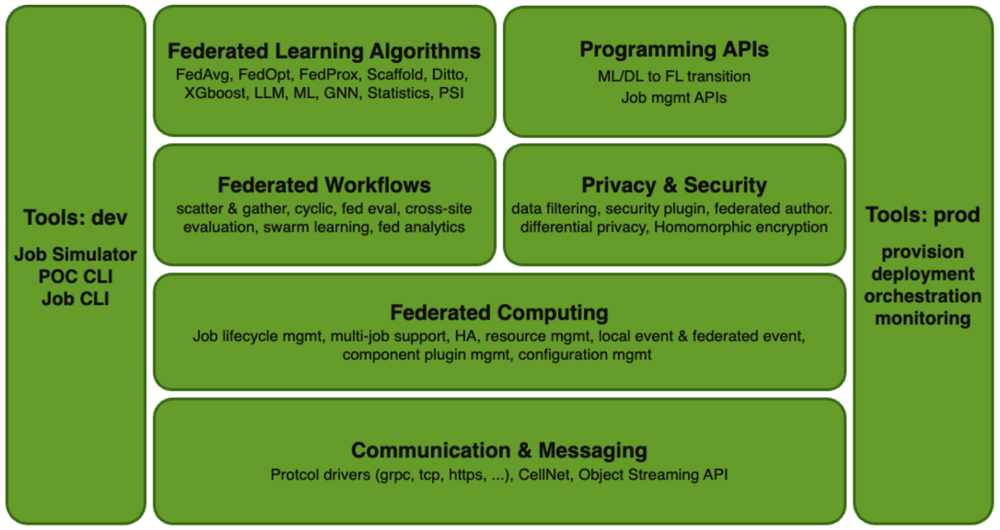
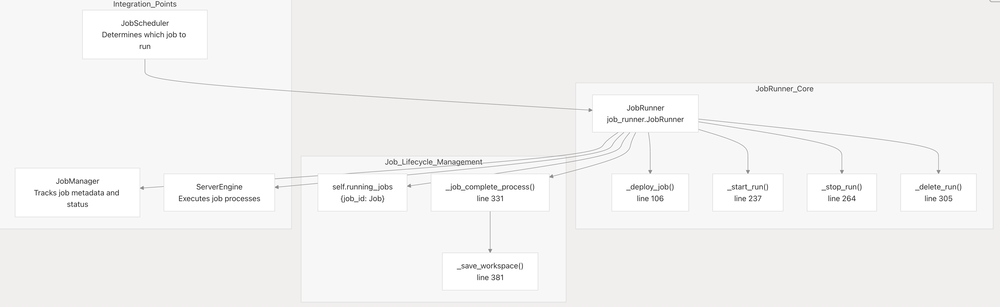

.. _flare_system_architecture:

NVIDIA FLARE システムアーキテクチャ
=======================================

.. |system_arch| image:: resources/system_architecture.png
   :alt: FLARE Job Processing Architecture
   :width: 45%

|flare_overview| |system_arch|

本ドキュメントでは、NVIDIA FLARE の全体的なシステムアーキテクチャについて、レイヤ構造、主要なサブシステム、
およびそれらがどのように相互作用するかを説明します。サーバ側とクライアント側の両方のランタイムコンポーネント、通信フレームワーク、
そしてプロセスモデルを扱います。

FLARE のアーキテクチャ（上図）は、3 つの主要なレイヤで構成されます。

- **基盤レイヤ（Foundation Layer）** - 通信インフラストラクチャ、メッセージングプロトコル、プライバシー保護ツール、およびセキュアなプラットフォーム管理。
- **アプリケーションレイヤ（Application Layer）** - フェデレーションワークフローや学習アルゴリズムを含む、フェデレーテッドラーニングのためのビルディングブロック。
- **ツール（Tooling）** - 実験やシミュレーションのための FL Simulator と POC CLI、加えて本番ワークフローのためのデプロイおよび管理ツール。

コアコンポーネントとコード構造
------------------------------------

主要なシステムモジュール
##############################

.. list-table:: **FLARE のコアコンポーネント**
   :header-rows: 1
   :widths: 20 35 45

   * - コンポーネント
     - 主なクラス／モジュール
     - 目的
   * - FL Runtime
     - ServerEngine, ClientEngine, JobRunner
     - フェデレーテッドラーニングの中核的なオーケストレーションと実行
   * - Job Management
     - ジョブの定義、ストレージ、スケジューリング
   * - Communication
     - Cell, CoreCell, StreamCell, Pipe
     - ストリーミングをサポートする、参加者間のセキュアな通信
   * - Client Integration
     - ClientAPI (flare.receive(), flare.send()), LauncherExecutor
     - ML フレームワークとの統合と外部プロセスの管理
   * - Administration
     - ダッシュボードおよびプログラマティック／GUI ベースのシステム管理
   * - Deployment
     - ProvisionerSpec, WorkspaceBuilder
     - 証明書の生成、設定、およびセキュアなデプロイ
   * - Workflows
     - ScatterAndGather, FedAvg, ModelController
     - 組み込みのフェデレーテッドラーニングアルゴリズムとパターン

プロセスの責務
#########################

**Server Parent (SP)**

- FederatedServer を実行します
- クライアントの登録とハートビート監視を管理します
- JobRunner を介してジョブスケジューリングを統括する ServerEngine を保持します
- ジョブランチャーに応じて、アクティブなジョブごとに Server Job (SJ) プロセスまたは docker／pod を起動します。

**Server Job (SJ)**

- ServerRunner を実行します
- ワークフローの Controller（例: ScatterAndGather）を実行します
- クライアントジョブへタスクをブロードキャストし、結果を集約します
- 分離のため、ジョブごとに別プロセスとなります

**Client Parent (CP)**

- FederatedClient を実行します
- サーバへのクライアント登録を管理します
- ジョブ実行を調整する ClientEngine を保持します
- ジョブランチャーに応じて、割り当てられたジョブごとに Client Job (CJ) プロセスまたは docker／pod を起動します。

**Client Job (CJ)**

- ClientRunner を実行します
- Cell ネットワークを介してサーバからタスクを取得します
- JobExecutor を使用して学習プロセスを起動します
- Pipe を介して学習プロセスとの間でタスクデータをルーティングします

**Training Process**

- ユーザーの ML 学習スクリプトです
- Client API を使用します: flare.init(), flare.receive(), flare.send()
- FilePipe（ファイルベース）または CellPipe（ネットワークベース）を介して CJ と通信します

通信メカニズム
########################

**Cell ネットワーク**: すべての親プロセスおよびジョブプロセスは、次の機能を提供する F3 Cell オブジェクトを介して通信します。

- FQCN（Fully Qualified Cell Name）によるアドレッシング（例: server.job_123）
- チャネルベースのルーティング（SERVER_MAIN, CLIENT_MAIN, AUX_COMMUNICATION）
- 認証を伴うセキュアで暗号化されたメッセージング
- 大容量データ転送のためのストリーミングサポート

**Pipe 抽象化**: CJ と学習プロセス間の通信には Pipe インターフェースを使用します。

- FilePipe: 同一マシン上のプロセス向けの、ファイルシステムベースの IPC
- CellPipe: 学習プロセスを別マシン上で実行できる、ネットワークベースの IPC

デプロイモード
################

NVFLARE は 3 つのデプロイモードを提供します。これらは同じコアランタイムを共有しますが、パッケージング、セキュリティ、デプロイの複雑さが異なります。この設計により、開発から本番までの一貫性が確保されます。

デプロイモードの比較
^^^^^^^^^^^^^^^^^^^^^^^^^^^^

.. list-table:: デプロイモードの比較
   :header-rows: 1
   :widths: 15 30 15 20 20

   * - モード
     - ユースケース
     - セキュリティ
     - プロセス
     - セットアップ時間
   * - Simulator
     - 迅速なプロトタイピング、アルゴリズムのテスト
     - なし
     - 複数スレッド（場合によっては複数プロセスを生成することもあります）
     - 数秒
   * - POC
     - ローカルでのマルチクライアントテスト、ワークフローの検証
     - オプション
     - 1 台のマシン上の複数プロセス
     - 数分
   * - Production
     - 実世界でのデプロイ
     - 完全な PKI/TLS
     - 複数マシンにまたがる分散プロセス
     - 数時間（プロビジョニングを含む）

コア FL ランタイム
------------------------

コア FL ランタイムは、フェデレーテッドラーニングのジョブプロセスとオーケストレーションを管理する実行エンジンです。
本ページでは、プロセスのライフサイクル管理、タスクの調整、および実行モードを担うランタイムコンポーネントについて説明します。

スコープとコンポーネント
############################

コア FL ランタイムは次の要素で構成されます。

- **ServerEngine** : サーバ側のプロセスオーケストレーションとジョブのライフサイクル管理
- **ClientEngine** : クライアント側のプロセス管理と通信処理
- **JobRunner** : ジョブのスケジューリング、デプロイ、監視
- **SimulatorRunner** : 開発向けの単一マシンシミュレーション

プロセスタイプ
#############

.. list-table:: **プロセスタイプ**
   :header-rows: 1
   :widths: 20 35 45

   * - プロセスタイプ
     - コードシンボル
     - 説明
   * - SP
     - ProcessType.SERVER_PARENT
     - ServerEngine を実行するサーバ親プロセス
   * - SJ
     - ProcessType.SERVER_JOB
     - ServerRunner を実行するサーバジョブプロセス
   * - CP
     - ProcessType.CLIENT_PARENT
     - ClientEngine を実行するクライアント親プロセス
   * - CJ
     - ProcessType.CLIENT_JOB
     - ClientRunner を実行するクライアントジョブプロセス

プロセス間通信
###########################

ランタイムは、親プロセスとジョブプロセスの間で Cell ベースの通信を使用します。

Cell 通信チャネル
^^^^^^^^^^^^^^^^^^^^^^^^^^^^

.. list-table:: **Cell 通信チャネル**
   :header-rows: 1
   :widths: 35 35 30

   * - チャネル
     - 目的
     - 利用者
   * - CellChannel.SERVER_MAIN
     - クライアントからサーバへの FL メッセージ
     - CP から SP へ
   * - CellChannel.CLIENT_MAIN
     - サーバからクライアントへの FL メッセージ
     - SP から CP へ
   * - CellChannel.SERVER_COMMAND
     - サーバジョブへのコマンド
     - SP から SJ へ
   * - CellChannel.CLIENT_COMMAND
     - クライアントジョブへのコマンド
     - CP から CJ へ
   * - CellChannel.SERVER_PARENT_LISTENER
     - SJ からの親プロセス向けコマンド
     - SJ から SP へ
   * - CellChannel.AUX_COMMUNICATION
     - 補助メッセージ
     - すべてのプロセス

JobRunner のアーキテクチャ
###############################

JobRunner のコンポーネント構造
^^^^^^^^^^^^^^^^^^^^^^^^^^^^^^^^^^

通信フレームワーク
-----------------------------

目的とスコープ
#################

通信フレームワークは F3（FLARE Foundation Framework）または Cellnet とも呼ばれ、NVIDIA FLARE における
すべての通信の基盤となるメッセージングインフラストラクチャを提供します。サーバ、クライアント、および管理コンポーネント間の
すべてのやり取りを処理する、セキュアでスケーラブルかつ機能豊富なメッセージングレイヤを実装しています。

このセクションでは、通信フレームワークのアーキテクチャ、コアコンポーネント、および基本的な概念の概要を説明します。

- **CellNet アーキテクチャ** - 詳細なアーキテクチャとデザインパターン
- **Cell 通信パターン** - メッセージ送信パターンとチャネルルーティング
- **ストリーミングとデータ転送** - 大容量データ転送とストリーミングプロトコル
- **セキュリティと暗号化** - 証明書管理とメッセージの暗号化

詳細については cellnet アーキテクチャ :ref:`cellnet_architecture` を参照してください

セキュリティアーキテクチャ
--------------------------------

セキュリティアーキテクチャについては :ref:`flare_security_overview` を参照してください。
