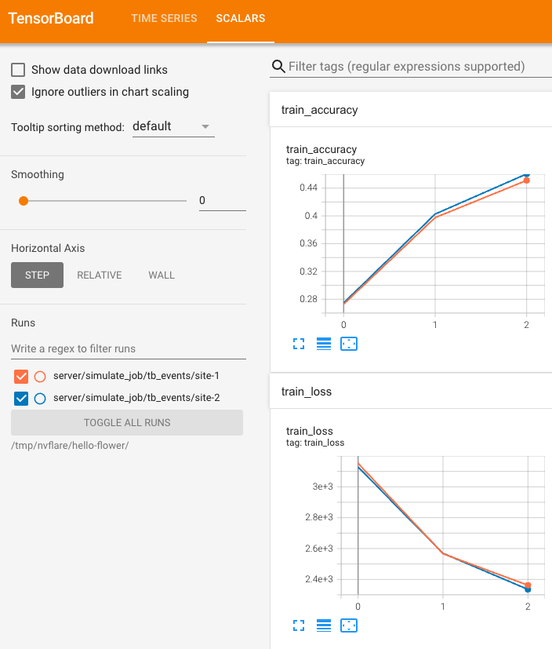

Hello Flower (PyTorch)
========================

この例では、NVIDIA FLARE と Flower を組み合わせて、連合平均(FedAvg)を用いて画像分類器をトレーニングする方法を示します。
完全なサンプルコードは `hello-flower ディレクトリ <https://github.com/NVIDIA/NVFlare/tree/main/examples/hello-world/hello-flower>`_ にあります。
仮想環境を作成し、すべてを virtualenv 内で実行することを推奨します。

NVIDIA FLAREのインストール
------------------------------------------------

完全なインストール手順については、`Installation <https://nvflare.readthedocs.io/en/main/installation.html>`_ を参照してください。

.. code-block:: bash

   pip install nvflare

GitHubからサンプルコードを取得します:

.. code-block:: bash

   git clone https://github.com/NVIDIA/NVFlare.git

次に ``hello-flower`` ディレクトリに移動します:

.. code-block:: bash

   git switch <release branch>
   cd examples/hello-world/hello-flower

依存関係をインストールします:

.. code-block:: bash

   pip install -r requirements.txt

.. warning::

   この ``main`` ブランチの例では、Flower 1.26以降と新しい Flower SuperLink
   設定フローを使用します。NVFlare 2.8 リリース候補系列
   (``nvflare~=2.8.0rc``)を使用するか、そのパッケージがまだ PyPI から
   入手できない場合は、このリポジトリから NVFlare をインストールしてください。

   リリース済みの NVFlare 2.7.x を使用している場合は、この例の 2.7 ブランチまたは
   タグに切り替え、``flwr>=1.16,<1.26`` を使用してください。NVFlare 2.7.x は
   Flower のレガシーな ``--federation-config`` CLI オプションを引き続き使用しますが、
   このオプションは Flower 1.26以降では無視されます。

コード構造
--------------------

.. code-block:: bash

   hello-flower
   ||
   ||-- flwr-pt/           # Flower PyTorch app
   ||   |-- flwr_pt/
   ||   |   |-- client.py   # <-- contains `ClientApp`
   ||   |   |-- __init__.py # <-- to register the python module
   ||   |   |-- server.py   # <-- contains `ServerApp`
   ||   |   |-- task.py     # <-- task-specific code (model, data)
   ||   |-- pyproject.toml  # <-- Flower project file
   ||-- flwr-pt-tb/        # Flower PyTorch app with TensorBoard streaming
   ||   |-- flwr_pt_tb/
   ||   |   |-- client.py   # <-- contains `ClientApp` with TensorBoard
   ||   |   |-- __init__.py # <-- to register the python module
   ||   |   |-- server.py   # <-- contains `ServerApp`
   ||   |   |-- task.py     # <-- task-specific code (model, data)
   ||   |-- pyproject.toml  # <-- Flower project file
   ||-- job.py             # job recipe that defines client and server configurations
   ||-- requirements.txt   # dependencies

データ
------------

この例では `CIFAR-10 <https://www.cs.toronto.edu/~kriz/cifar.html>`_ データセットを使用します。

実際のFL実験では、各クライアントはローカルトレーニングに使用する独自のデータセットを持ちます。
CIFAR-10 データセットは、torchvision の ``datasets`` モジュールを介してインターネットからダウンロードできます。
各クライアントが独自のデータセットを持つように、データセットをクライアントごとに分割することもできます。
簡単のため、この例では各クライアントで同じデータセットを使用します。

モデル
------------

PyTorch では、ニューラルネットワークは ``nn.Module`` を拡張するクラスを定義することで実装されます。
ネットワークのアーキテクチャは ``__init__`` メソッドで設定され、``forward`` メソッドは入力データがレイヤーをどのように流れるかを決定します。計算を高速化するため、利用可能であればモデルはハードウェアアクセラレーター(CUDA GPUなど)に転送され、利用できない場合はCPU上で実行されます。このモデルの実装は、Flower アプリディレクトリ内の ``task.py`` ファイルにあり、「PyTorch: A 60 Minute Blitz」を基にしたシンプルなCNNです。

クライアントコード
------------------------------------

``client.py`` のクライアントコードはローカルトレーニングを担当し、**Flower Client App**\ を含みます。

サーバーコード
----------------------------

この例では、Flower 組み込みの連合平均\ **Strategy**\ を使用します。
サーバーコードは、各 Flower アプリディレクトリ内の ``server.py`` で定義されています。
Flower が FedAvg の実装を提供しているため、この例ではカスタマイズしたサーバーコードを定義する必要はありません。

ジョブレシピコード
------------------------------------

ジョブレシピには Flower アプリの設定が含まれており、それを NVFlare 内にデプロイします。

**BYOCモード**\ (Flower アプリをジョブのZIPにパッケージする場合):

.. code-block:: python

    recipe = FlowerRecipe(
        name="hello-flower",
        min_clients=n_clients,
        num_rounds=num_rounds,
        flower_content="./flwr-pt",  # Local directory path
        stream_metrics=stream_metrics,
    )

    env = SimEnv(num_clients=n_clients, num_threads=n_clients)
    recipe.execute(env=env)

**事前デプロイモード**\ (Flower アプリがすでにサーバー上にある場合):

.. code-block:: python

    recipe = FlowerRecipe(
        name="hello-flower",
        min_clients=n_clients,
        num_rounds=num_rounds,
        flower_app_path="local/custom/flwr-pt", # local/custom is the mandatory location for flower apps.
        stream_metrics=stream_metrics,
    )

    env = SimEnv(num_clients=n_clients, num_threads=n_clients)
    recipe.execute(env=env)

ジョブの実行
------------------------

ターミナルからコードを実行します:

NVFlareシミュレーションで ``flwr-pt`` を実行する(BYOCモード)
~~~~~~~~~~~~~~~~~~~~~~~~~~~~~~~~~~~~~~~~~~~~~~~~~~~~~~~~~~~~~~~~~~~~~~~~~~~~~~~~~~~~~~~~

これは、NVFlare のシミュレーターを使用して、2つの Flower クライアントと1つの Flower サーバーを並列で実行します。

.. code-block:: bash

   python job.py --job_name "flwr-pt" --content_dir "./flwr-pt"

NVFlareシミュレーションで ``flwr-pt`` を実行する(事前デプロイモード)
~~~~~~~~~~~~~~~~~~~~~~~~~~~~~~~~~~~~~~~~~~~~~~~~~~~~~~~~~~~~~~~~~~~~~~~~~~~~~~~~~~~~~~~~~~~~

Flower アプリがサーバー上に事前デプロイされている場合(クライアントは Flower の FAB 配布経由でアプリを受け取ります):

.. code-block:: bash

   python job.py --job_name "flwr-pt" --flower_app_path "local/custom/flwr-pt"

NVFlareシミュレーションとTensorBoardストリーミングで ``flwr-pt`` を実行する
~~~~~~~~~~~~~~~~~~~~~~~~~~~~~~~~~~~~~~~~~~~~~~~~~~~~~~~~~~~~~~~~~~~~~~~~~~~~~~~~~~~~~~~~~~~~~~~~~~~~

これは、NVFlare を使用して2つの Flower クライアントと1つの Flower サーバーを並列で実行しながら、
NVFlare のメトリクスストリーミングを使用して、各イテレーションで TensorBoard メトリクスをサーバーにストリーミングします。

.. code-block:: bash

   python job.py --job_name "flwr-pt-tb" --content_dir "./flwr-pt-tb" --stream_metrics

サーバーにストリーミングされたメトリクスは、TensorBoard を使用して可視化できます。

.. code-block:: bash

   tensorboard --logdir /tmp/nvflare/hello-flower

実際のデプロイメントでの実行
~~~~~~~~~~~~~~~~~~~~~~~~~~~~~~~~~~~~~~~~~~~~~~~~~~~~~~~~~~~~

まず、デプロイメントガイド :ref:`deployment_overview` を確認してください。

``job.py`` スクリプト内の ``SimEnv`` を ``ProdEnv`` に変更することで、本番環境でジョブを実行できます。

出力の概要
--------------------

初期化
~~~~~~~~~~~~

* **TensorBoard**: ログは ``/tmp/nvflare/hello-flower`` にあります。
* **ワークフロー**: NVFlare 統合のための ``FlowerRecipe``。
* **グローバルモデルの初期化**: Strategy から提供された初期グローバルパラメータを使用します。

ラウンド1
~~~~~~~~~~~~

* **モデルの読み込み**: 初期モデルを Flower アプリから読み込みます。
* **サンプリングされたクライアント**: ``site-1``、``site-2``。
* **トレーニング**:

  * グローバルモデルのパラメータが両サイトに送信されます。
  * Flower クライアントが指定されたエポック数でローカルトレーニングを実行します。

* **集約**: モデルが集約され、サーバー上でグローバルモデルが更新されます。

ラウンド2
~~~~~~~~~~~~

...

ラウンド3
~~~~~~~~~~~~

* **サンプリングされたクライアント**: ``site-1``、``site-2``。
* **トレーニング**:

  * ラウンド1と同様のプロセス。

* **集約**: モデルが集約され、サーバー上でグローバルモデルが更新されます。

完了
~~~~~~~~

* **FedAvgプロセス**: 正常に終了しました。
* **Flower統合**: Flower と NVFlare のシームレスな統合が完了しました。
* **サマリーの出力**:

.. code-block:: text

   [FLWR-SL@simulator_server] INFO :      [SUMMARY]
   [FLWR-SL@simulator_server] INFO :      Run finished 3 round(s) in 87.25s
   [FLWR-SL@simulator_server] INFO :      	History (metrics, distributed, fit):
   [FLWR-SL@simulator_server] INFO :      	{'train_accuracy': [(1, 0.29286), (2, 0.39183), (3, 0.4405)],
   [FLWR-SL@simulator_server] INFO :      	 'train_loss': [(1, 3024.705621123314),
   [FLWR-SL@simulator_server] INFO :      	                (2, 2582.9437326192856),
   [FLWR-SL@simulator_server] INFO :      	                (3, 2389.465917825699)],
   [FLWR-SL@simulator_server] INFO :      	 'val_accuracy': [(1, 0.2988), (2, 0.3931), (3, 0.43765)],
   [FLWR-SL@simulator_server] INFO :      	 'val_loss': [(1, 19282.4288251698),
   [FLWR-SL@simulator_server] INFO :      	              (2, 16474.469832401723),
   [FLWR-SL@simulator_server] INFO :      	              (3, 15261.50008890964)]}
