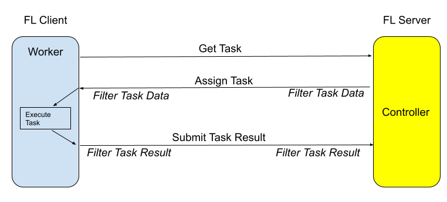

.. _controllers:

コントローラーとController API
==========================================================
:class:`controller API <nvflare.apis.controller_spec.ControllerSpec>` を使用すると、FLサーバー上で実行される
FLワークフローにおいて、任意のクライアント調整ロジックを作成できます。

Controller/Workerの相互作用
------------------------------------------------------

NVFlareの協調コンピューティングは、Controller/Workerの相互作用を通じて実現されます。次の図は、
ControllerとWorkerがどのように相互作用するかを示しています。

Controllerは、ジョブを完了させるためにWorkerを制御または調整するPythonオブジェクトです。コントローラーは
FLサーバー上で実行されます(右側で強調表示)。

Workerはタスクを実行する能力を持ちます。WorkerはFLクライアント上で実行されます。

Controllerはその制御ロジックの中で、Workerにタスクを割り当て、Workerからのタスク結果を処理します。

Workerは、Controllerから終了を指示される(特別なEND_RUNタスク)まで、次に実行すべきタスクを要求し続け、タスクを実行し、
結果をControllerに提出します。

Controller API
--------------

:mod:`Controller API<nvflare.apis.controller_spec>` は、さまざまな方法でWorker(FLクライアント)に
タスクを割り当てるためのメソッドを提供します:

   - タスクを複数のクライアントにブロードキャストする
   - タスクを単一のクライアントに送信する
   - タスクを複数のクライアントが順番に実行するように手配する

同梱の :class:`Controller<nvflare.apis.impl.controller.Controller>` 実装と、以下のコントローラーワークフローの
完全なリファレンス実装を参照してください:

.. toctree::
   :maxdepth: 1

   scatter_and_gather_workflow
   cross_site_model_evaluation.rst
   cyclic_workflow.rst
   initialize_global_weights.rst

ソースコードを学習し、独自のコントローラーワークフローを作成する際の出発点として使用できます。

.. _tasks:

タスクのライフサイクル
--------------------------------------------

Controller APIの中心的な概念は :class:`Task<nvflare.apis.controller_spec.Task>` です。

:class:`Task<nvflare.apis.controller_spec.Task>` は、Controllerによってクライアントのワーカーに割り当てられる作業の単位です。タスクの割り当て方法(broadcast、send、relay)に応じて、タスクは1つ以上のクライアントによって実行されます。

ControllerのTask Managerは、タスクのライフサイクルを管理します:

    - まず、プログラマがタスクを作成し、タスクの名前とデータを指定します。
    - 次に、プログラマがタスクメソッドのいずれか(例: broadcast、send、relayなど)を呼び出します。これらのメソッドが行うのは、タスクをタスクキューに追加することだけです。これでタスクは、クライアントが取得しに来るのを待つ状態になります。キューには複数のタスクが存在し得ることに注意してください。
    - クライアントが次のタスクを取得しに来ると、Task Managerはキュー内のどのタスクをそのクライアントに割り当てるべきかを決定します。一般的なルールとして、タスクはキュー内の順序に従って1つずつ検査されます。クライアントがタスクの候補であり、そのタスクをまだ実行しておらず、かつタスク固有のルールがそのクライアントへの割り当てを許可する場合、タスクはクライアントに割り当てられ、新しいClientTaskレコードが作成されてタスクのclient_tasksリストに追加されます。before_task_sentコールバック(CB)が提供されている場合、タスクをクライアントに送信する前に呼び出されます。
    - クライアントに対するタスクが見つからない場合、Task Managerはクライアントに後で再試行するように伝えます。
    - クライアントが割り当てられたタスクを完了して結果を提出しに戻ってくると、そのクライアントに対応するclient_taskが見つけられ、result_received CB(提供されている場合)が呼び出されます。結果はclient_taskレコードに記録され、client_taskは"result received"としてマークされます。
    - 最終的に、次のいずれかの条件が満たされるとタスクは完了します:
        - タスク自体がタイムアウトした(タスクのタイムアウトが指定されている場合)
        - 割り当てられたすべてのタスクがクライアントから結果を受信した
        - タスク固有の終了ルールが満たされた(例: broadcastの場合、最小応答数を受信し、その後十分な時間待機した)
        - タスクが明示的にキャンセルされた
        - 致命的エラーが発生し(タスクデータのフィルタリングエラー)、システムによってタスクがキャンセルされた
    - タスクが完了すると、タスクが完了した条件に基づいてcompletion_statusが設定され、タスクはタスクキューから削除されます。task_done CBが提供されている場合は呼び出されます。これがタスクのライフサイクルの終わりです。

.. note::

    注記: NVIDIA FLAREでは、基盤となる通信はgRPCを通じて行われます。
    クライアントが常にサーバーへリクエストを送信して応答を受け取るという形で通信を開始します。
    「サーバーがクライアントにタスクを送信する」というシナリオに言及する場合、
    これは概念的な表現であることに注意してください。
    実際には、gRPCではクライアントが「次のタスクの要求」をサーバーに送信することでやり取りを開始し、
    サーバーがタスクデータを提供することで応答します。
