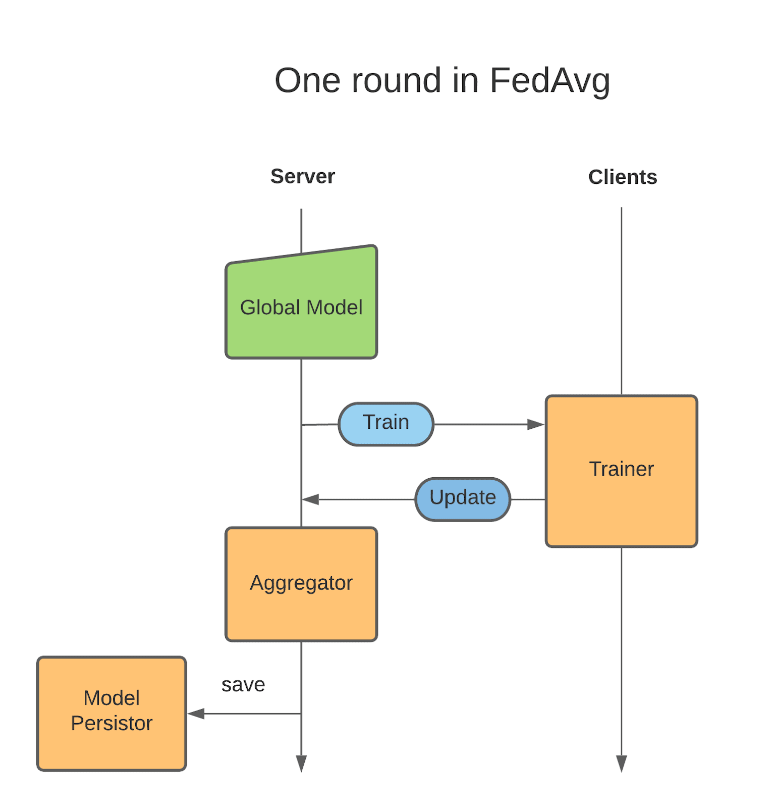

.. _scatter_and_gather_workflow:

Scatter and Gather ワークフロー
---------------------------------
連合 Scatter and Gather ワークフローは、NVIDIA FLARE の以前のバージョンにおけるデフォルトワークフローのリファレンス実装として同梱されているもので、
トレーナーから共有可能な結果を生成したクライアントの結果をサーバーが集約します。

中核として、:class:`nvflare.app_common.workflows.scatter_and_gather.ScatterAndGather` の ``control_flow`` は for ループです:

Trainer
^^^^^^^
:class:`Trainer<nvflare.app_common.executors.trainer.Trainer>` は、NVIDIA FLARE における :class:`Executor<nvflare.apis.executor.Executor>` の一種です。

``execute()`` メソッドは、``Shareable`` から必要な情報を取得し、
それをトレーニング処理で使用したうえで、ローカルのトレーニング結果を ``Shareable`` として返す必要があります。

独自の ``Trainer`` は config_fed_client.json で設定する必要があります。
FL 設定の例は :ref:`application` にあります。

Learnable
^^^^^^^^^
:class:`Learnable<nvflare.app_common.abstract.learnable.Learnable>` は、FL アプリケーションの成果物です。
たとえば、ディープラーニングのシナリオではモデル重みであり得ます。
AutoML の場合には、ネットワークアーキテクチャであり得ます。

:class:`LearnablePersistor<nvflare.app_common.abstract.learnable_persistor.LearnablePersistor>` は、``Learnable`` の読み込みと
保存の方法を定義します。``Learnable`` は、モデルファイル(LR スケジュールなどの他のデータを含み得る)のうち、
モデル重みのように学習の対象となる部分集合です。

.. _aggregator:

Aggregator
^^^^^^^^^^
:class:`Aggregator<nvflare.app_common.abstract.aggregator.Aggregator>` は、``Shareable`` を集約するための集約アルゴリズムを定義します。
たとえば、単純なアグリゲーターであれば、同じラウンドのすべての ``Shareable`` を単に平均するだけのものになります。

以下はアグリゲーターのシグネチャです。

.. literalinclude:: ../../../nvflare/app_common/abstract/aggregator.py
    :language: python
    :lines: 22-

Scatter and Gather ワークフローを使った例
^^^^^^^^^^^^^^^^^^^^^^^^^^^^^^^^^^^^^^^^^^^
Scatter and Gather ワークフローを使ったアプリケーションの例については、
:github_nvflare_link:`Hello Numpy Example <examples/hello-world/hello-numpy>` を参照してください。
