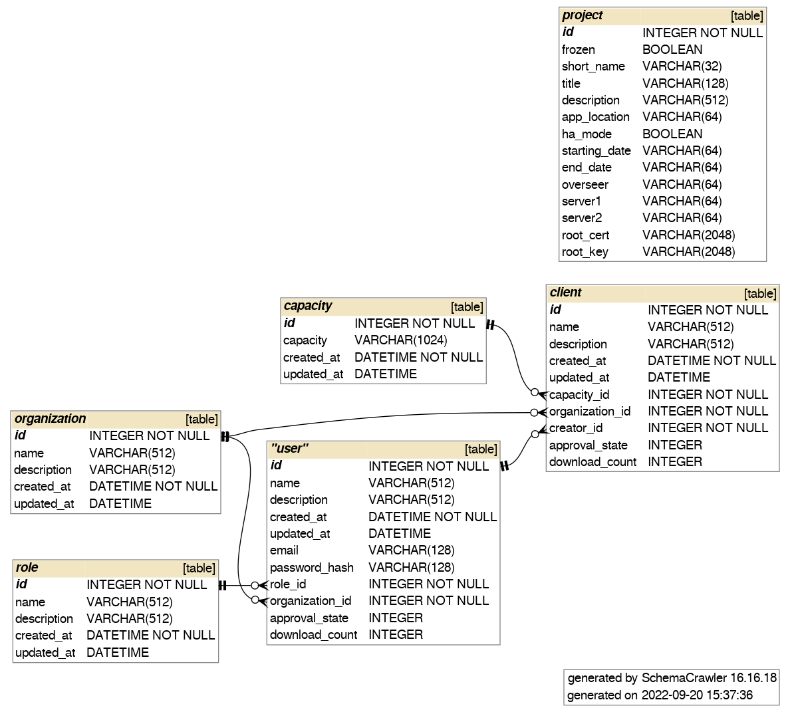

.. _dashboard_api:

#####################################
NVIDIA FLARE のダッシュボード
#####################################

:ref:`provisioning` で述べたように、NVIDIA FLARE システムでは、コンポーネント間の安全な通信のために、
秘密鍵と証明書(ルート CA によって署名されたもの)を含む一連のスタートアップキットが必要です。
NVIDIA FLARE の :ref:`nvflare_dashboard_ui` は、さまざまな組織のクライアントやユーザーに関する情報を効率的に収集し、
ユーザーがダウンロードできるスタートアップキットを生成する手段を提供します。

プロビジョニングの詳細については、:ref:`provisioning` を参照してください。このセクションでは、ダッシュボードとのユーザーの対話と、そのバックエンド API に焦点を当てます。

.. include:: nvflare_cli/dashboard_command.rst

*******************************************
NVIDIA FLARE ダッシュボードバックエンド API
*******************************************

アーキテクチャ
==============

ダッシュボードのバックエンド API は RESTful の原則に従い、Project、Organizations、Client、User という4つの主要リソースを定義します。デプロイメントごとに Project はちょうど1つ存在し、
サーバーに関する情報を含みます。Client は NVIDIA FLARE クライアントインスタンスを表し、User は NVIDIA FLARE 管理コンソールのユーザーを表します。
Organizations エンドポイントは読み取り専用の操作で、現在登録されている組織のリストを返します。

詳細
====

API
----

以下は、OpenAPI 3.0 構文で記述されたバックエンド API の完全な定義です。開発者は、同じ API エンドポイントとの互換性を維持しながら、
これらの API を別のプログラミング言語で実装したり、カスタム UI を作成したりできます。

NVIDIA FLARE 2.6 では、すべての API エンドポイントに ``/nvflare-dashboard/api/v1/`` というプレフィックスが付きます。たとえば、
ログインエンドポイントは ``/nvflare-dashboard/api/v1/login`` です。

.. literalinclude:: ../../nvflare/dashboard/dashboard.yaml
  :language: yaml

認証と認可
----------

ほとんどのバックエンド API では、認可のための JWT を取得するためにユーザー認証が必要です。JWT にはユーザーの組織とロールに関するクレームが含まれ、
常にユーザーのメールアドレス(ログイン用のユーザー ID として機能します)が含まれます。

前のセクションで示したように、ログイン資格情報なしでアクセスできるのは以下のエンドポイントのみです:

   - ``GET /project``
   - ``GET /users``
   - ``GET /organizations``

project_admin ロールを持つユーザーは、すべてのリソースへのフルアクセス権を持ちます。

プロジェクトの凍結
------------------

プロジェクト設定にはクライアントとユーザーが必要とする情報が含まれるため、クライアントやユーザーの作成後にプロジェクト情報を変更すると、
依存関係の問題が発生する可能性があります。project_admin は、プロジェクト関連のすべての情報を確定した後にプロジェクトを凍結して、ユーザーのサインアップを可能にする必要があります。
一度凍結されると、ダッシュボードの Web インターフェースからプロジェクトの凍結を解除することはできません。

データベーススキーマ
--------------------

次の図は、バックエンド API が使用する基盤データベースのスキーマを示しています:

