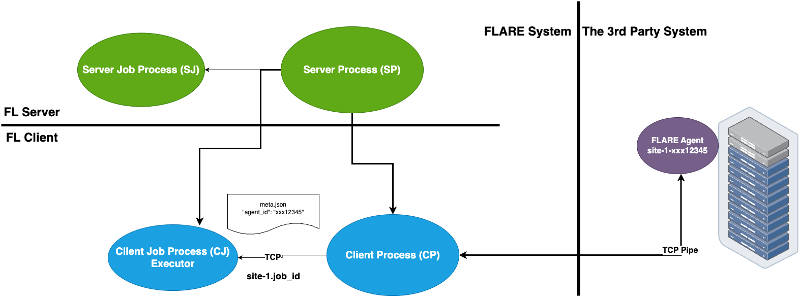

.. _3rd_party_integration:

##################################################
サードパーティシステムとの統合
##################################################

NVFLARE は、FLARE システムとサードパーティの外部トレーニングシステムとの
シームレスな統合をサポートしています。
これは、FLARE クライアントに容易に適応させることができない既存の ML/DL
トレーニングシステムインフラがある場合に特に役立ちます。

FL クライアントは、:class:`TaskExchanger<nvflare.app_common.executors.task_exchanger>`
エグゼキューターを使ってタスクを受信し、結果を FLARE サーバーに提出します。
サードパーティシステムは、:class:`FlareAgent<nvflare.client.flare_agent>` を使って
TaskExchanger とやり取りし、タスクの取得と結果の提出を行います。

この統合パターンを以下の図に示します:

要件
====

- この統合を実現する鍵は "agent_id" であり、両方のシステムに知らせておく必要があります。
  FL クライアントはこの情報をジョブの config_fed_client から取得し、
  サードパーティのトレーナーは自身の起動プロセスから取得します。
- ジョブごとに "agent_id" を動的に生成し、その情報を使ってトレーナープロセスを
  起動する手段を顧客がすでに持っていることを前提とします。
- 各 FL クライアントは、トレーナーが接続できるようにアドレス(host:port)を開けられなければなりません。
  トレーナーがどこで動作しているかに応じて、接続をセキュアモード(TLS)にする必要がある場合とない場合があります。
- NVFlare のプロビジョニングシステム用に "project.yml" を修正し、
  参加する各サイト用に新しいパッケージフォルダーを生成する必要があります
- トレーナーは、NVFlare ライブラリと統合できる Python プログラムでなければなりません。
- トレーナーは、サーバーに加えて、FL クライアントが動的に開くアドレスにも
  接続できなければなりません。

トレーナーの準備
================

まずトレーナーのコードを準備しましょう。プロジェクトのセットアップのための
"project.yml" の修正は次のセクションで行います。

トレーナーの統合には、低レベルのパイプ制御
(:class:`FlareAgent<nvflare.client.flare_agent>`)を使う方法と、より高レベルの
Client API(``nvflare.client``)を使う方法があります。Client API の方式では、FLModel の変換に
:class:`FlareAgentWithFLModel<nvflare.client.flare_agent_with_fl_model.FlareAgentWithFLModel>`
を内部的に使用します。

手順を1つずつ見ていきます:

1. エージェントの作成
---------------------

:class:`FlareAgent<nvflare.client.flare_agent.FlareAgent>` は、FL クライアントと
やり取りしてタスクデータを交換する役割を担います。

各引数の詳細な説明については、API ページを参照してください:

  - :class:`FlareAgent<nvflare.client.flare_agent.FlareAgent>`

次のように、明示的な CellPipe を使って FlareAgent を作成できます:

.. code-block:: python

    from nvflare.client.flare_agent import FlareAgent
    from nvflare.fuel.utils.pipe.cell_pipe import CellPipe
    from nvflare.fuel.utils.pipe.pipe import Mode

    pipe = CellPipe(
        mode=Mode.ACTIVE,
        token=args.agent_id,
        site_name=args.site_name,
        root_url="grpc://server:8002",
        workspace_dir=args.workspace,
        secure_mode=True,
    )
    agent = FlareAgent(
        pipe=pipe,
        submit_result_timeout=2.0,
        heartbeat_timeout=120.0,
    )

2. エージェントの開始
---------------------

エージェントを作成したら、それを開始する必要があります。
``agent.start()`` を呼び出してエージェントを開始できます。
この呼び出しは、タスクを取得しようとする前に行わなければなりません。

例:

.. code-block:: python

    agent.start()

3. タスクの処理
----------------

トレーニングは、タスクの取得、タスクの実行、タスク結果の提出という
連続的なプロセスです。

``agent.get_task()`` を呼び出して、FL クライアントから Task オブジェクトを取得します。
これはブロッキング呼び出しであり、タスクが利用可能になったときにのみ戻ります。
利用可能なタスクがもうない場合(すなわちジョブの終了時)は ``AgentClosed``
例外が発生し、トレーニングの終了を知らせます。

:class:`Task<nvflare.client.flare_agent.Task>` オブジェクトには、task_name、task_id、data の
3つの情報が含まれます。
task_name は、そのタスクが何であるか(例: train)を示します。
task_id は、タスクインスタンスの UUID です。
data には、トレーニング対象のモデルデータが含まれます。

タスクが完了したら、``agent.submit_result()`` を呼び出して結果を FL クライアントに提出できます。
タスクが正常に実行されたかどうかを示すために、リターンコード(``rc``)を提供しなければなりません。
``rc`` が RC.OK でない場合、ジョブは中止されます。

例:

.. code-block:: python

    while True:
        print("getting task ...")
        try:
            task = agent.get_task()
        except AgentClosed:
            print("agent closed - exit")
            break

        print(f"got task: {task}")
        rc, meta, result = train(task.data) # perform train task
        submitted = agent.submit_result(TaskResult(data=result, meta=meta, return_code=rc))
        print(f"result submitted: {submitted}")

4. エージェントの停止
---------------------

トレーニングの最後には、プログラムを適切に終了させるために ``agent.stop()`` を呼び出さなければなりません。
この呼び出しを忘れると、プログラムが正しく終了しない可能性があります。

.. code-block:: python

    agent.stop()

5. 全体の組み立て
-------------------

必要な手順をすべて学んだので、この使用パターンの以下のサンプルコードとして
まとめることができます:

.. literalinclude:: ../../resources/3rd_party_trainer.py
    :language: python

Client API パターン(FLModel)
------------------------------

トレーナーがすでに FLModel のセマンティクスで動作している場合は、CellPipe ベースの
エージェントを手動で作成する代わりに、Client API を直接使用できます。

このパターンでは、``nvflare.client`` が基盤となるエージェントの配線を処理し、
:class:`FlareAgentWithFLModel<nvflare.client.flare_agent_with_fl_model.FlareAgentWithFLModel>`
を内部的に使用します。

.. code-block:: python

    import nvflare.client as flare

    flare.init()
    while flare.is_running():
        model = flare.receive()
        if model is None:
            break

        # train/evaluate with your framework here
        trained_model = model
        flare.send(trained_model)

    flare.shutdown()

注記:

- この(``start``、``get_task``、``submit_result``、``stop``)のパターンは厳密に強制されます。
  パターンに従わない場合(例: ``submit_result`` を呼ばずに ``get_task`` の後に再度 ``get_task`` を呼ぶ)、
  ``CallStateError`` 例外が発生します。
- ジョブが終了したことを知る唯一の方法は、``get_task`` 呼び出しからの ``AgentClosed`` 例外です。
  この例外は、FL クライアントがエージェントにジョブの完了を伝えたとき、
  または FL クライアントが停止したと見なされたとき(設定された期間ハートビートが欠落したとき)に発生します。
- トレーニングアルゴリズムが回復不能なエラーに陥り、ジョブを終了させたい場合は、
  適切なリターンコード(例: ``RC.EXECUTION_EXCEPTION``)を使用すべきです。

プロジェクトのセットアップ
==========================

トレーナーのコードを準備したら、以下の手順に従ってプロジェクトとジョブを
適切にセットアップします。

ステップ 1 - プロビジョニング
------------------------------

FL クライアントサイトは、トレーナーから見ると、接続に関してクライアントとサーバーの両方のように振る舞います。
このため、クライアントサイトには2組の TLS 資格情報が必要です。
プロジェクトをプロビジョニングする際には、project.yml でクライアントの "listening_host" を必ず指定してください。

.. note::
    注記: NVFlare のプロビジョニングを理解していることを前提としています。そうでない場合は :ref:`provisioning` をお読みください。

例は次のようになります:

.. code-block:: yaml

  participants:
  # change example.com to the FQDN of the server
  - name: server
    type: server
    org: nvidia
    fed_learn_port: 8002
    admin_port: 8003
  - name: site_1
    type: client
    org: nvidia
    listening_host: localhost
  - name: site_2
    type: client
    org: nvidia
    listening_host: localhost

プロジェクトがプロビジョニングされたら、クライアント用に生成された "startup" キットを確認してください。
他のファイルとともに、以下のファイルが見つかるはずです:

client.crt, client.key, server.crt, server.key, rootCA.pem

サイトに指定する listening_host は、外部のトレーナーがネットワーク経由で到達できる
ホスト名でなければならない点に注意してください。

ステップ 2 - ジョブ設定の準備
------------------------------

各ジョブについて、config_fed_client.json でエグゼキューターとして
:class:`TaskExchanger<nvflare.app_common.executors.task_exchanger>` を使用するように設定します。

.. code-block::

  {
    "format_version": 2,
    "executors": [
        {
          "tasks": [
            "train"
          ],
          "executor": {
            "path": "nvflare.app_common.executors.task_exchanger.TaskExchanger",
            "args": {
              "pipe_id": "pipe"
              "peer_read_timeout": 30,
              "heartbeat_timeout": 60
            }
          }
        }
      ],
    "task_result_filters": [],
    "task_data_filters": [],
    components =  [
      {
        id = "pipe"
        path = "nvflare.fuel.utils.pipe.cell_pipe.CellPipe"
        args {
          mode = "PASSIVE"
          site_name = "{SITE_NAME}"
          token = "{SITE_NAME}"
          root_url = "{ROOT_URL}"
          secure_mode = "{SECURE_MODE}"
          workspace_dir = "{WORKSPACE}"
        }
      }
    ]
  }

:class:`TaskExchanger<nvflare.app_common.executors.task_exchanger>` のパラメーターが
適切に設定されていることを確認し、必要に応じてデフォルト値を変更してください。

各引数の詳細な説明については、API ページを参照してください:
:class:`TaskExchanger<nvflare.app_common.executors.task_exchanger>`

ステップ 3 - トレーナーのセットアップ
--------------------------------------

各クライアントサイトには、FL クライアントとトレーナープロセスが存在します。

統合を機能させるために、各クライアントサイトで以下の手順に従って
トレーナープロセスをセットアップしてください:

    - トレーナープロセスがローカルファイルシステムにアクセスできることを確認します。
    - このトレーナープロセスが使用する "workspace" フォルダーを作成します。
      このワークスペースはすべてのジョブで使用されます。
    - クライアントサイトの "startup" フォルダーをこの "workspace" フォルダーにコピーします。
      必要であれば、トレーナーが必要とする追加の設定ファイルも
      この "workspace" フォルダーに配置できます。
    - 低レベルの FlareAgent を使用する場合は、上記の手順に従ってトレーナースクリプトを作成し、
      CellPipe の ``workspace_dir`` をこの "workspace" フォルダーに設定します。
      また、トレーナーの ``agent_id`` が、パイプコンポーネント設定の ``token``
      の値と一致していることを確認してください。
    - Client API パターンの場合は、``flare.init()`` にジョブワークスペース内の生成された
      クライアント API 設定を指定し、トレーナーループで ``receive/send`` を使用します。

    .. note::
       注記: 生成されたクライアント API 設定には有効な認証情報が含まれており、
       POSIX システムでは所有者のみアクセス可能(モード ``0600``)で書き込まれます。
       そのため、外部から起動されるトレーナーは、FL クライアントプロセスと\ **同じ OS ユーザー**\ として
       実行するか、オペレーターがトレーナーのアカウント用にファイルの権限を明示的に
       再設定する必要があります。Windows ではファイルモードは NTFS ACL を制限しないため、
       代わりに ACL でワークスペースディレクトリを保護してください。

検証
====

低レベルの TaskExchanger 統合では、FL クライアントとトレーナープロセスを
まったく同時に起動する必要はありません。

先に起動した方が、``heartbeat_timeout`` 秒の間、もう一方を待ちます。
両方が起動して接続されたら、Admin コンソールの ``cells`` コマンドを使って
直接接続されていることを検証できます。

以下の例は、2つのクライアント(site-1、site-2)が agent_id/token "ext_trainer" を介して
外部トレーナーに接続されている様子を示しています:

.. code-block:: shell

  > cells
  server
  server.10d1d3b7-fb50-4c83-9575-e510f32c5d21
  site-1
  site-1.10d1d3b7-fb50-4c83-9575-e510f32c5d21
  site-2
  site-2.10d1d3b7-fb50-4c83-9575-e510f32c5d21
  site-1_ext_trainer_active
  site-2_ext_trainer_active
  site-2_ext_trainer_passive
  site-1_ext_trainer_passive
  Total Cells: 10

``cells`` コマンドはすべてのセルを一覧表示します。

ジョブ ``10d1d3b7-fb50-4c83-9575-e510f32c5d21`` が "site-1" と "site-2" の両方の
クライアントで実行されていることに注目してください。

また、対応するセルのペアが2組
(site-1_ext_trainer_active、site-1_ext_trainer_passive)
と((site-2_ext_trainer_active、site-2_ext_trainer_passive))あることにも注目してください。

オプション - FL クライアントとトレーナー間のアドホック直接接続のセットアップ
================================================================================

FL クライアントとトレーナーは常にサーバー経由で通信できますが、
特にサーバーが遠くにある場合、通信が遅くなる可能性があります。
FL クライアントとトレーナー間のアドホック直接接続を有効にするには、
クライアントサイトで comm_config.json を次のように設定します:

.. code-block:: json

  {
    "allow_adhoc_conns": true,
    "use_aio_grpc": true,
    "adhoc": {
      "scheme": "tcp",
      "resources": {
        "host": "localhost",
        "secure": true
      }
    }
  }

このファイルは、サイトのワークスペース内の "local" フォルダーに配置しなければなりません。

アドホック直接接続の制限と動作については、:ref:`communication_configuration` を参照してください。

以下の点に注意してください:

- ほとんどの場合、最良のパフォーマンスを得るために "scheme" は "tcp" に設定すべきです。
  "tcp" が使えない場合は、"grpc" を使用できます。
- "resources" 内について:

  - FL クライアントとトレーナーが同じ信頼できるネットワーク内にある場合は、
    "secure" を false に設定できます。そうでない場合は true に設定してください。
  - "host" の値は、プロビジョニングで使用したサイトの "listening_host" の値と一致しなければなりません。
