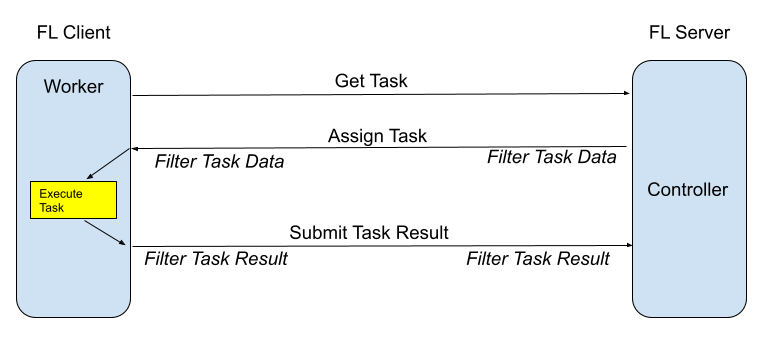
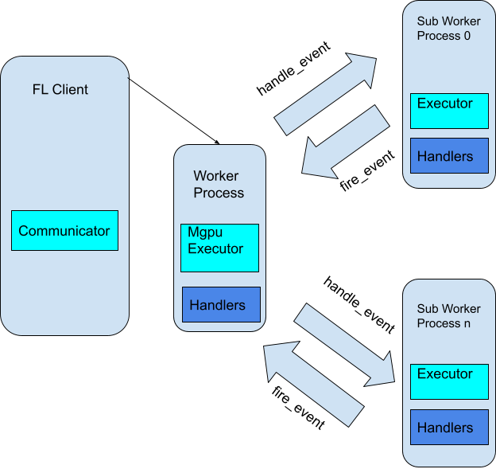

.. _executor:

Executor
========

:class:`Executor<nvflare.apis.executor.Executor>` は、タスクを実行するために FL クライアントで使用される FLComponent です。
``execute`` メソッドは、タスク名、``FLContext``、``abort_signal`` を受け取り、
Shareable オブジェクトを受け取って返します。

.. note::

   Executor API は低レベルのクライアントタスク API です。新しい ML 学習の
   サンプルのほとんどは :ref:`client_api` と :ref:`job_recipe` から始めるべきであり、
   カスタムのタスクコントラクトやフレームワーク統合が必要な場合にのみ
   Executor を直接使用してください。

.. literalinclude:: ../../../nvflare/apis/executor.py
    :language: python
    :lines: 24-

Executor の例としては :class:`Trainer<nvflare.app_common.executors.trainer.Trainer>` や :class:`Validator<nvflare.app_common.executors.validator.Validator>` があります。
いくつかの実装例のソースコードはサンプルアプリの中にあります。クライアント側では、config_fed_client.json で
Executor に対してタスクを設定できます。

.. code-block:: json

    {
      "format_version": 2,
      "handlers": [],
      "executors": [
        {
          "tasks": [
            "train",
            "submit_model"
          ],
          "executor": {
            "path": "np_trainer.NPTrainer",
            "args": {}
          }
        },
        {
          "tasks": [
            "validate"
          ],
          "executor": {
            "path": "np_validator.NPValidator"
          }
        }
      ],
      "task_result_filters": [],
      "task_data_filters": [],
      "components": []
    }

上記の設定は hello_numpy からの例です。各タスクは 1 つの Executor にのみ割り当てられます。

.. _multi_process_executor:

マルチプロセス Executor
-----------------------
:class:`MultiProcessExecutor<nvflare.app_common.executors.multi_process_executor.MultiProcessExecutor>` は、
FL Executor がマルチプロセス実行を簡単にサポートできるように設計されています。FL イベントの発火や処理を含め、
Executor の挙動は変わりません。MultiProcessExecutor により、研究者は複数プロセスの活用方法やマルチ GPU 学習の扱いに
悩むことなく、学習と実行のロジックに集中できます。

実行中、他のコンポーネントから発火されたイベントは、MultiProcessExecutor からすべての
サブワーカープロセスへ中継されます。サブワーカープロセス内でそのイベントを購読しているコンポーネントは、
そのイベントを適切に処理できます。また、サブワーカープロセス内の FL コンポーネントが発火したイベントも、
MultiProcessExecutor によって他のすべてのコンポーネントへ中継され、処理されます。

MultiProcessExecutor は FL Executor と同じ API シグネチャを保っています。FL Executor を
MultiProcessExecutor に変える際は、タスクの executor に MultiProcessExecutor を使うように設定し
(現時点で実装されている MultiProcessExecutor は PTMultiProcessExecutor のみです)、既存の executor を "executor_id" として設定し、
使用するプロセス数を指定します。

.. code-block:: json

    {
      "executors": [
        {
          "tasks": [
            "train"
          ],
          "executor": {
            "path": "nvflare.app_common.pt.pt_multi_process_executor.PTMultiProcessExecutor",
            "args": {
              "executor_id": "trainer",
              "num_of_processes": 2,
              "components": [
                {
                  "id": "trainer",
                  "path": "medl.apps.fed_learn.trainers.client_trainer.ClientTrainer",
                  "args": {
                    "local_epochs": 5,
                    "steps_aggregation": 0,
                    "model_reader_writer": {
                      "path": "nvflare.app_opt.pt.model_reader_writer.PTModelReaderWriter"
                    }
                  }
                }
              ]
            }
          }
        }
      ],
    }
