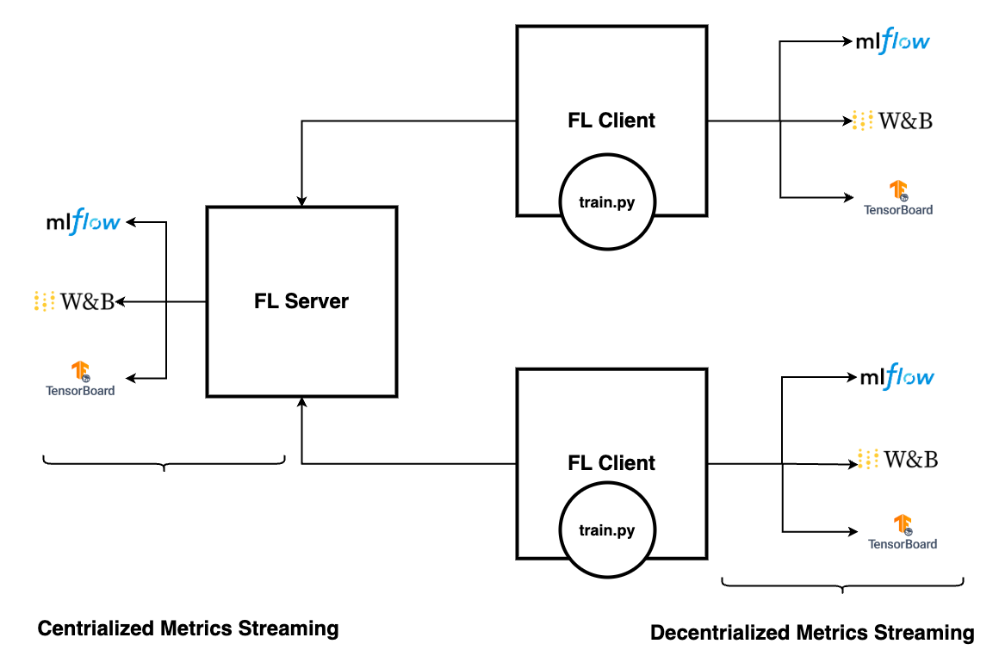

.. _experiment_tracking_apis:

##########################
実験トラッキング API
##########################

精度や損失、AUC といった学習メトリクスを追跡するには、いずれかの実験トラッキングシステムでこれらのメトリクスを記録する必要があります。
ここでは以下のトピックについて説明します。

- MLflow、TensorBoard、Weights & Biases によるメトリクスのロギング
- FL サーバーへのメトリクスのストリーミング
- FL クライアントへのストリーミング

MLflow、TensorBoard、Weights & Biases によるメトリクスのロギング
================================================================

わずか 3 行のコードで MLflow のロギングを統合し、効率的にメトリクスを MLflow サーバーへストリーミングできます。

.. code-block:: python

  from nvflare.client.tracking import MLflowWriter

  mlflow = MLflowWriter()

  mlflow.log_metric("loss", running_loss / 2000, global_step)

この構成では、MLflow の API を直接使う代わりに ``MLflowWriter`` を使用します。
この抽象化は重要で、後ほど詳しく説明するように、ロギングしたメトリクスを任意の宛先へ柔軟にリダイレクトできるようになります。

MLflow、TensorBoard、Weights & Biases のいずれの記法を使っても、収集したメトリクスをサポートされている任意の実験トラッキングシステムへストリーミングできます。
TBWriter、MLflowWriter、WandBWriter のどれを使うかは、既存のコードや要件に応じたユーザーの好みによります。

- ``MLflowWriter`` は MLflow API の操作記法 ``log_metric()`` を使用します
- ``TBWriter`` は TensorBoard の SummaryWriter の操作 ``add_scalar()`` を使用します
- ``WandBWriter`` は Weights & Biases API の操作 ``log()`` を使用します

API は次のとおりです。

.. code-block:: python

  class TBWriter(LogWriter):
    def add_scalar(self, tag: str, scalar: float, global_step: Optional[int] = None, **kwargs):
    def add_scalars(self, tag: str, scalars: dict, global_step: Optional[int] = None, **kwargs):

  class WandBWriter(LogWriter):
    def log(self, metrics: Dict[str, float], step: Optional[int] = None):

  class MLflowWriter(LogWriter):
      def log_param(self, key: str, value: any) -> None:
      def log_params(self, values: dict) -> None:
      def log_metric(self, key: str, value: float, step: Optional[int] = None) -> None:
      def log_metrics(self, metrics: Dict[str, float], step: Optional[int] = None) -> None:
      def log_text(self, text: str, artifact_file_path: str) -> None:
      def set_tag(self, key: str, tag: any) -> None:
      def set_tags(self, tags: dict) -> None:

学習コードを修正したら、NVFlare のジョブ設定を使って、ログが適切にストリーミングされるようにシステムを構成できます。

FL サーバーへのメトリクスのストリーミング
=========================================

すべてのメトリクスのキーと値はイベントとして取得され、最も適した宛先へ柔軟にストリーミングできます。
これらのメトリクスイベントをフェデレーテッドイベントに変換してサーバーへ送るために、``ConvertToFedEvent`` を追加しましょう。

config_fed_client.json に次のコンポーネントを追加します。

.. code-block:: json

    {
        "id": "event_to_fed",
        "path": "nvflare.app_common.widgets.convert_to_fed_event.ConvertToFedEvent",
        "args": {"events_to_convert": ["analytix_log_stats"], "fed_event_prefix": "fed."}
    }

InProcessClientAPIExecutor によるインプロセスの Client API ではなく、ClientAPILauncherExecutor によるサブプロセスの Client API を使用する場合は、
フェデレーテッドイベントを発火するための ``MetricRelay``、メトリクス用の ``CellPipe``、そして Client API 初期化のための ``ExternalConfigurator`` を追加する必要があります。

.. code-block::

    {
      id = "metric_relay"
      path = "nvflare.app_common.widgets.metric_relay.MetricRelay"
      args {
        pipe_id = "metrics_pipe"
        event_type = "fed.analytix_log_stats"
        read_interval = 0.1
      }
    },
    {
      id = "metrics_pipe"
      path = "nvflare.fuel.utils.pipe.cell_pipe.CellPipe"
      args {
        mode = "PASSIVE"
        site_name = "{SITE_NAME}"
        token = "{JOB_ID}"
        root_url = "{ROOT_URL}"
        secure_mode = "{SECURE_MODE}"
        workspace_dir = "{WORKSPACE}"
      }
    },
    {
      id = "config_preparer"
      path = "nvflare.app_common.widgets.external_configurator.ExternalConfigurator"
      args {
        component_ids = ["metric_relay"]
      }
    }

サーバー側では、``config_fed_server.conf`` で以下のいずれかのレシーバーを使って実験トラッキングシステムを設定します。
どの Writer を使用しているかに関わらず、いずれのレシーバーも使用できる点に注意してください。

- MLflow には ``MLflowReceiver``
- TensorBoard には ``TBAnalyticsReceiver``
- Weights & Biases には ``WandBReceiver``

例えば、ここでは components の設定配列に ``MLflowReceiver`` コンポーネントを追加します。

.. code-block:: yaml

  {
    "id": "mlflow_receiver_with_tracking_uri",
    "path": "nvflare.app_opt.tracking.mlflow.mlflow_receiver.MLflowReceiver",
    "args": {
      tracking_uri = "file:///{WORKSPACE}/{JOB_ID}/mlruns"
      "kwargs": {
        "experiment_name": "hello-pt-experiment",
        "run_name": "hello-pt-with-mlflow",
        "experiment_tags": {
          "mlflow.note.content": "markdown for the experiment"
        },
        "run_tags": {
          "mlflow.note.content": "markdown describes details of experiment"
        }
      },
      "artifact_location": "artifacts"
    }
  }

args{} は tracking_uri、experiment_name、tags などのようにユーザーが定義するものであり、どのレシーバーを設定するかによって内容が異なる点に注意してください。

MLflow のトラッキング URL の引数 ``tracking_uri`` はデフォルトでは None であり、その場合は MLflow のデフォルト URL である ``http://localhost:5000`` が使用されます。
別のマシンからアクセスできるようにするには、正しい URL に変更するか、ワークスペース内の ``mlruns`` ディレクトリを指すようにしてください。

::

  tracking_uri = <the Mlflow Server endpoint URL>

::

  tracking_uri = "file:///{WORKSPACE}/{JOB_ID}/mlruns"

experiments、run_name、tags (Markdown 記法を使用)、アーティファクトの保存場所など、その他の引数も変更できます。

次のいずれかのコマンドで MLflow サーバーを起動します。

::

  mlflow server --host 127.0.0.1 --port 5000

::

  mlflow ui -port 5000

FL クライアントへのメトリクスのストリーミング
=============================================

プライバシーやその他の理由で FL サーバーへのメトリクスのストリーミングが望ましくない場合、ユーザーは代わりに FL クライアントへメトリクスをストリーミングできます。
その場合、クライアント側に ``ConvertToFedEvent`` コンポーネントを追加する必要はありません。
また、サーバー側へストリーミングしないため、サーバー設定でレシーバーを構成する必要もありません。

代わりに、クライアント側でレコードを受け取るために、サーバー設定ではなくクライアント設定でメトリクスのレシーバーを構成します。

例えば TensorBoard の設定では、``config_fed_client.conf`` に次のコンポーネントを追加します。

.. code-block:: yaml

  {
    "id": "tb_analytics_receiver",
    "path": "nvflare.app_opt.tracking.tb.tb_receiver.TBAnalyticsReceiver",
    "args": {"events": ["analytix_log_stats"]}
  }

``events`` 引数が ``fed.analytix_log_stats`` ではなく ``analytix_log_stats`` になっている点に注意してください。これはローカルイベントであることを示しています。

``MetricRelay`` コンポーネントを使用する場合も同様に、慣例としてコンポーネントの event_type の値を ``fed.analytix_log_stats`` から ``analytix_log_stats`` に変更できます。
さらに、デフォルトのフェデレーテッドイベントではなくローカルイベントを発火させるために、``MetricRelay`` の引数 ``fed_event`` を ``false`` に設定する必要があります。

.. code-block:: yaml

  {
    id = "metric_relay"
    path = "nvflare.app_common.widgets.metric_relay.MetricRelay"
    args {
      pipe_id = "metrics_pipe"
      event_type = "analytix_log_stats"
      # how fast should it read from the peer
      read_interval = 0.1
      fed_event = false
    }
  }

これにより、メトリクスはクライアントへストリーミングされます。
