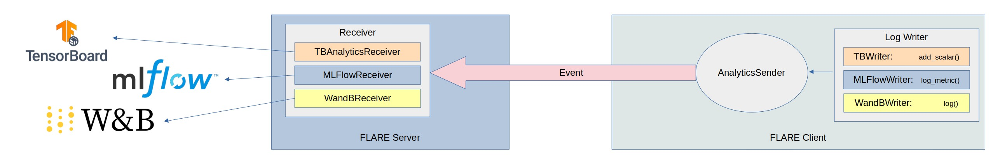

.. _experiment_tracking_log_writer:

##################################
実験トラッキングの Log Writer
##################################

.. note::

    このページでは、:class:`LogWriters <nvflare.app_common.tracking.log_writer.LogWriter>` を用いた実験トラッキングについて説明します。
    LogWriter は FLARE 側のコードで :ref:`executor` や :ref:`model_learner` とともに設定・使用されます。
    Client API を使用する場合は、独自の学習コードに実験トラッキングを追加する方法について :ref:`experiment_tracking_apis` および :ref:`client_api` を参照してください。

************************
概要とアプローチ
************************

フェデレーテッドコンピューティングの環境では、データは複数のデバイスやシステムに分散しており、各クライアントのデータプライバシーを
保護しながら、各デバイス上で独立して学習が実行されます。

1 台のサーバーと多数のクライアントで構成され、サーバーがクライアントの ML 学習を調整するフェデレーテッドシステムを想定すると、
ML 実験トラッキングツールとは 2 通りの方法で連携できます。

    - クライアント側の実験トラッキング: 各クライアントが、ログのメトリクスやパラメータを ML 実験トラッキングサーバー
      (MLflow や Weights and Biases など) またはローカルファイルシステム (tensorboard など) へ直接送信します
    - 集約された実験トラッキング: クライアントがログのメトリクスやパラメータを FL サーバーへ送信し、FL サーバーが
      そのメトリクスを ML 実験トラッキングサーバーまたはローカルファイルシステムへ送信します

これは Receiver によって実現され、FL サーバー、FL クライアント、またはその両方に設定できます。それぞれのアプローチには固有のユースケースと課題があります。
ここでは例を示しながら、サーバー側のアプローチについて説明します。

    - クライアントがトラッキングサーバーへアクセスする必要がないため、クライアントごとの追加認証を避けられます。多くの場合、
      クライアントは異なる組織に属しており、実験トラッキングサーバーをホストしている組織とは異なります。
    - トラッキングサーバーへの接続を N 個の FL クライアントから 1 台の FL サーバーだけに減らせるため、トラッキングサーバーへの
      トラフィックを大幅に削減できます。MLFlow のようなケースでは、イベントをサーバー内でバッファリングし、まとめてトラッキング
      サーバーへ送ることができるため、トラフィックをさらに削減できます。バッファリングは追加のレイテンシを生じさせる可能性があるため、
      トラッキングサーバーがトラフィックを処理できるのであれば、バッファのフラッシュ時間を 0 に設定してバッファリングを無効にできます。
    - サーバー側の実験トラッキングを使うもう 1 つの大きな利点は、メトリクスデータの収集とトラッキングサーバーへの
      メトリクスデータの配送を分離できることです。クライアントはメトリクスの収集のみを担当し、トラッキングサーバーについて知る必要があるのは
      サーバーだけです。これにより、データ収集とデータ配送に別々のツールを使えるようになります。
      例えば、クライアントの学習コードが Tensorboard の記法でロギングしている場合でも、コードを変更することなく、サーバーが
      そのログデータを受け取って MLflow へメトリクスを配送できます。
    - サーバー側の実験トラッキングは、異なるクライアントの結果を別々の実験 Run として整理できるため、結果を並べて簡単に
      比較できるという利点もあります。

****************************************
ツール、Sender、LogWriter、Receiver
****************************************

advanced examples ディレクトリにある "experiment_tracking" のサンプルでは、いくつかの実験トラッキングソリューションを活用して、
実験をリアルタイムに追跡・可視化し、結果を比較する方法を確認できます。

    - `Tensorboard <https://www.tensorflow.org/tensorboard>`_
    - `MLflow <https://mlflow.org/>`_
    - `Weights and Biases <https://wandb.ai/site>`_

.. note::

    Weights and Biases のサービスを利用するにはユーザー自身でサインアップする必要があります。NVFlare がアクセス権を提供することはできません。

フェデレーテッドラーニングのフェーズでは、ユーザーは上記のツールのうち使い慣れた API 記法を選択できます。NVFlare は、これらの API を
模した :class:`LogWriters <nvflare.app_common.tracking.log_writer.LogWriter>` と呼ばれるコンポーネントを開発しました。すべてのクライアントの実験ログは
(:class:`ConvertToFedEvent<nvflare.app_common.widgets.convert_to_fed_event.ConvertToFedEvent>` により) FL サーバーへストリーミングされ、
そこで実際の実験ログが記録されます。これらのログを受け取るコンポーネントは、
:class:`AnalyticsReceiver <nvflare.app_common.widgets.streaming.AnalyticsReceiver>` を基にした Receiver と呼ばれます。
Receiver コンポーネントは実験トラッキングツールを利用し、実験 Run の間にログを記録します。

通常の構成では、Sender と Receiver をペアで用います。いくつかの実装は :mod:`nvflare.app_opt.tracking` に用意されています。

    - TBWriter  <-> TBAnalyticsReceiver
    - MLflowWriter <-> MLflowReceiver
    - WandBWriter <-> WandBReceiver

LogWriter と Receiver は任意の組み合わせで混在させることもできるため、1 つの API で ML コードを書きながら、任意の実験トラッキングツール
(複数可) を使用できます (1 つの Sender から送られた同じログデータに対して複数の Receiver を使用できます)。

******************************
実験ログのストリーミング
******************************

クライアント側では、:class:`LogWriters <nvflare.app_common.tracking.log_writer.LogWriter>` がメトリクスを書き込む際、
ファイルへ書き込む代わりに、実際には NVFLARE のイベント (デフォルトでは `analytix_log_stats` 型) を生成します。
`ConvertToFedEvent` ウィジェットは、ローカルイベント `analytix_log_stats` をフェデレーテッドイベント
`fed.analytix_log_stats` に変換し、サーバー側へ配送します。

サーバー側では、:class:`AnalyticsReceiver <nvflare.app_common.widgets.streaming.AnalyticsReceiver>` が
`fed.analytix_log_stats` イベントを処理するように設定され、受信したログデータを適切なトラッキングソリューションへ書き込みます。

********************************************
カスタム実験トラッキングツールのサポート
********************************************

実験トラッキングツールは数多く存在するため、必要に応じて独自の Writer や Receiver を作成したい場合もあるでしょう。

カスタムの実験トラッキングツールを開発する際には、次の 3 点を考慮する必要があります。

データ型
========

現在サポートされているデータ型は :class:`AnalyticsDataType <nvflare.apis.analytix.AnalyticsDataType>` に列挙されており、必要に応じて他のデータ型を追加できます。

Writer
======
その API 記法で :class:`LogWriter <nvflare.app_common.tracking.log_writer.LogWriter>` インターフェースを実装します。各ツールについて、私たちは基となるツールの API 記法を模しているため、
ユーザーは新しい API を学ぶことなく、慣れ親しんだものを使用できます。
例えば Tensorboard の場合、TBWriter は add_scalar() と add_scalars() を使用します。MLflow の場合は
log_metric()、log_metrics()、log_parameter()、log_parameters() という記法です。W&B の場合、Writer は log() のみを持ちます。
これらの呼び出しで収集されたデータはすべて AnalyticsSender へ送られ、FL サーバーへ配送されます。

Receiver
========

:class:`AnalyticsReceiver <nvflare.app_common.widgets.streaming.AnalyticsReceiver>` インターフェースを実装し、異なるサイトのログをどのように表現するかを決めます。3 つの実装
(Tensorboard、MLflow、WandB) のいずれにおいても、各サイトのログは 1 つの Run として表現されます。個々のツールによって、実装は
異なる場合があります。例えば Tensorboard と MLflow ではどちらもクライアントごとに異なる Run を作成し、サイト名に対応付けます。
WandB の実装では、マルチプロセスを利用して各 Run を別々のプロセスで実行する必要があります。

**********************
サンプルの概要
**********************

:github_nvflare_link:`実験トラッキングのサンプル <examples/advanced/experiment-tracking>` は、
さまざまな Writer と Receiver を活用する方法を示しています。すべてのサンプルは hello-pt のサンプルを基にしています。

TensorBoard
===========
"tensorboard" ディレクトリのサンプルでは、(Sender と Receiver の両方で) Tensorboard のトラッキングツールを使用する方法を示しています。
詳細は :ref:`tensorboard_streaming` を参照してください。

MLflow
======
"mlflow" ディレクトリ配下の "hello-pt-mlflow" ジョブは、MLflow の Sender と Receiver の両方を使ってトラッキングを行う方法を示しています。
"hello-pt-tb-mlflow" ジョブは、Sender に Tensorboard を、Receiver に MLflow を使用する方法を示しています。
詳細は :ref:`experiment_tracking_mlflow` を参照してください。

Weights & Biases
================
:github_nvflare_link:`wandb <examples/advanced/experiment-tracking/wandb>` ディレクトリ配下の
"hello-pt-wandb" ジョブは、メトリクスを記録するために WandBWriter と WandBReceiver を使い、
Weights and Biases で実験トラッキングを行う方法を示しています。

MONAI との統合
==============

:github_nvflare_link:`MONAI との統合 <integration/monai>` では、`NVFlareStatsHandler`
:class:`LogWriterForMetricsExchanger <nvflare.app_common.tracking.LogWriterForMetricsExchanger>` を使って
:class:`MetricsRetriever <nvflare.app_common.metrics_exchange.MetricsRetriever>` に接続します。この設定の詳細については、
:github_nvflare_link:`spleen_ct_segmentation_local <integration/monai/examples/spleen_ct_segmentation_local/jobs/spleen_ct_segmentation_local>`
ジョブを参照してください。
