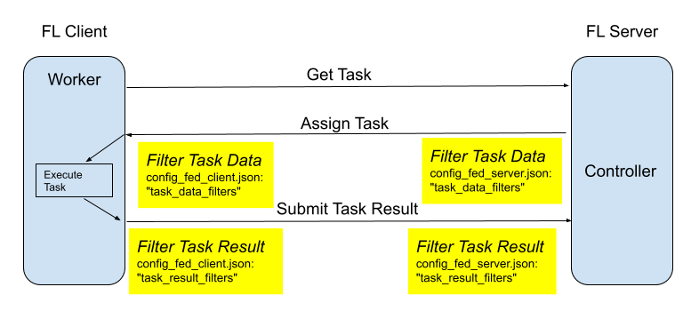

.. _filters:

##############
フィルター
##############
NVIDIA FLAREにおけるフィルター(Filter)は、通信する当事者間で ``Shareable`` オブジェクトを変換するための ``process`` メソッドを持つFLComponentの一種です。``Filter`` を使用すると、送信前または相手(ピア)からの受信後に、shareableデータへ追加の処理を施すことができます。

``Filter`` は ``FLContext`` を利用できます。

.. literalinclude:: ../../nvflare/apis/filter.py
    :language: python
    :lines: 22-

config_fed_server.jsonおよびconfig_fed_client.json(詳細は :ref:`application` を参照)では、
下の画像でハイライトされたポイントでデータを処理するために、
task_result_filtersとtask_data_filtersを設定できます:

.. _dxo_based_filtering:

****************************************
DXOベースのフィルタリング
****************************************

NVFLAREでは、フィルターはタスクの前処理・後処理に使用されます。

サーバー側では、タスクをクライアントに送信する前に、「タスクデータフィルター」(存在する場合)がタスクデータに適用されます。フィルタリングされたタスクデータのみがクライアントに送信されます。同様に、クライアントからタスク結果を受信すると、コントローラーに渡す前に「タスク結果フィルター」が受信した結果に適用されます。

クライアント側では、サーバーからタスクを受信すると、タスクエグゼキューターに渡す前に「タスクデータフィルター」(存在する場合)がタスクデータに適用されます。同様に、エグゼキューターからタスク結果が計算されると、サーバーに送信する前に「タスク結果フィルター」がタスク結果に適用されます。

フィルターは、データプライバシー保護のための主要な技術です。

.. _filters_for_privacy:

フィルターはデータ形式の変換をはじめ、さまざまな処理を行えます。セキュリティの目的で、データに任意の種類の加工を適用できます。実際、プライバシーおよび準同型暗号の技術はすべてフィルターとして実装されています:

    - shareableから変数を除外するExcludeVars (:mod:`nvflare.app_common.filters.exclude_vars`)
    - パーセンタイルによる重みの切り捨てを行うPercentilePrivacy (:mod:`nvflare.app_common.filters.percentile_privacy`)
    - スパースベクトル技術による差分プライバシーのためのSVTPrivacy (:mod:`nvflare.app_common.filters.svt_privacy`)
    - 共有前にデータを暗号化する準同型暗号フィルター (:mod:`nvflare.app_common.homomorphic_encryption.he_model_encryptor.py` および :mod:`nvflare.app_common.homomorphic_encryption.he_model_decryptor`)

フィルターは、モデル更新の圧縮を行うのにも適した場所です。送信前に圧縮し、受信後に展開することで、トレーナーとアグリゲーターのコードは通常のモデル更新をやり取りできます。組み込みのモデル量子化には :ref:`message_quantization` を使用してください。独自の方式を実装する場合は、``DataKind.WEIGHTS`` または ``DataKind.WEIGHT_DIFF`` 向けの ``DXOFilter`` を実装し、クライアントからサーバーへの更新にはタスク結果フィルターとして、サーバーからクライアントへのモデルメッセージにはタスクデータフィルターとして登録します。

DXO - Data Exchange Object
===========================

サーバーとクライアント間で受け渡されるメッセージオブジェクトはShareableクラスです。Shareableはあらゆる種類の通信(タスクのやり取り、auxメッセージ、fedイベントなど)のための汎用的な構造であり、メッセージペイロードに加えて、コンテキスト情報(相手側のFLコンテキストなど)も保持します。NVFLAREのDXOオブジェクトは、メッセージペイロードを自己記述的な形で運ぶことを目的とした汎用構造です。例えるなら、ShareableがHTTPメッセージであるのに対し、DXOはHTTPメッセージによって運ばれるJPEG画像のようなものです。

DXOオブジェクトには以下のプロパティがあります:

    - Data Kind - DXOオブジェクトが運ぶデータの種類(例: WEIGHTS、WEIGHT_DIFF、DXOのCOLLECTIONなど)
    - Meta - データを記述するメタプロパティ(例: 処理済み/暗号化済みかどうか、処理アルゴリズム)。これはdictです。
    - Data - DXOのデータを保持するdict。

DXOオブジェクトはCOLLECTION種別になり得ることに注意してください。この場合、DXOのDataはDXOオブジェクトのdictです。

DXOフィルター
==============

フィルターはShareable内のあらゆるものを処理するように書くことができますが、データプライバシー処理の場合、フィルタリングは通常ペイロード自体に対して行われます。ペイロードがDXOオブジェクトである場合、DXOベースのフィルターは非常に有用です。

DXOFilterはFilterのサブクラスであり、DXOベースのフィルターを簡単に書けるようにするミニフレームワークです。DXOベースのフィルターを書くには、DXOFilterのサブクラスとしてフィルターを作成します。Filterクラスの「process」メソッドを書く代わりに、「process_dxo」メソッドを書きます。「process」メソッドはDXOFilterクラスによって提供されます。

DXOFilterのサブクラスは、DXOFilterの次の機能の恩恵を受けます:

    - DXO構造の処理。DXOはサブDXOのコレクションを含むことができ、それがさらに多くのDXOを含み得るため、DXO全体をDXOノードのツリーとして見ることができます。このツリーの走査はDXOFilterの「process」メソッドが行ってくれます。
    - Data Kindのチェック。あなたのprocess_dxoメソッドは、DXOノードがフィルターの処理対象として設定されたデータ種別である場合にのみ、そのDXOを処理するために呼び出されます。
    - フィルタリング履歴の記録。DXOノードがあなたのフィルターによって処理されると、フィルターのクラス名がDXOの「filter_history」に追加されます。
    - 監査。フィルターが適用されると、フィルターがデータに適用されたという事実を記録するジョブ監査イベントが作成されます。

1対N通信におけるフィルターの挙動
==================================

設計上、フィルターがオブジェクトに適用される際、ローカルでディープコピーを作らずにメモリ効率を高めるため、オブジェクトをその場で(in place)変更することがあります。
これは、クライアントからサーバーへの1対1通信のように、オブジェクトが1つの受信者にのみ送信されることが想定される場合は問題ありません。
しかし、サーバーからクライアントへの1対N通信の場合、オブジェクトは複数の受信者に届くことが想定されます。
共通のフィルターが使用されていると仮定すると、オブジェクトがその場で変更された場合、2番目以降の受信者に送信されるオブジェクトには再度フィルターを適用してはなりません。
そうしないと、最初の受信者に送信されたものと異なってしまう可能性があります。

したがって、フィルターを設計・実装する際は、このような挙動を慎重に考慮する必要があります:

    - オブジェクトをその場で変更する場合、フィルターはそのオブジェクトに一度だけ適用されるべきです。
    - 同じオブジェクトに異なるフィルターを適用することが想定される場合、オブジェクトをその場で変更してはなりません。代わりに、ディープコピーを作成してフィルターで使用すべきです。

DXOフィルターの作成
--------------------

DXOFilterクラスを拡張し、「process_dxo」メソッドを提供することで、新しいDXOベースのフィルターを作成します。

コンストラクタでは、サポートするDXO種別を決定し、それをスーパークラスに知らせる必要があります(supported_data_kinds)。また、フィルターを適用するデータ種別も指定する必要があります(data_kinds_to_filter)。当然ながら、data_kinds_to_filterはsupported_data_kindsのサブセットでなければなりません。通常、data_kinds_to_filterはユーザーが設定可能であるべきです。
supported_data_kindsを指定することでフィルターが何を処理できるかが明確になり、data_kinds_to_filterはこの特定のフィルターがどのように使用されるかを指定します。

あなたが書く「process_dxo」メソッドの戻り値に注意してください。渡されたDXOオブジェクトに何も処理を行わなかった場合は、Noneを返さなければなりません。渡されたDXOに処理を適用した場合は、DXOオブジェクト(渡されたものと同じDXOでも、新しく作成したものでもかまいません)を返さなければなりません。

かつて、フィルターは暗黙的に想定されたデータ種別を前提に書かれていました。どの種類のデータを処理できるかを明示的に指定していなかったのです。フィルターはジョブ設定の中で研究者によってのみ指定でき、研究者は通常どのフィルターがそのジョブに適用可能かを知っているため、これはある程度うまく機能していました。しかし、指定されたフィルターがすべてのジョブに適用されるサイトプライバシーポリシーでは、これは機能しません。DXOベースのフィルターは現在、異なる方法で動作します。データが常に処理対象であると想定するのではなく、DXOFilterはデータ種別に基づいて処理対象として設定されたDXOオブジェクトのみをフィルタリングします。DXOオブジェクトが設定された種別でない場合、処理されません。これにより、Org Adminは制御したいデータ種別に基づいてフィルターを指定するだけで済むようになります。
