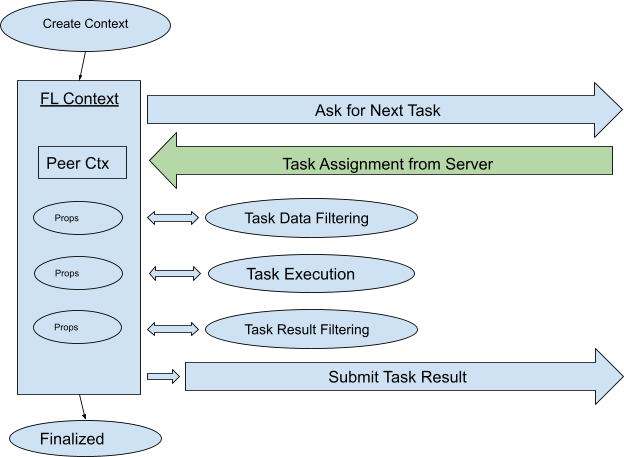

.. _fl_context:

FLContext
=========
.. currentmodule:: nvflare.apis.fl_context.FLContext

NVIDIA FLAREの最も重要な機能の1つが、FLコンポーネント間でデータを受け渡すための :mod:`nvflare.apis.fl_context` です。``FLContext`` は、すべてのFLComponentタイプ(Controller、Aggregator、Filter、Executor、Widget)のすべてのメソッドで利用できます。

FLコンテキストを通じて、コンポーネント開発者は次のことができます:
    - 基盤となるインフラストラクチャが提供するサービスを取得する
    - FLシステムの他のコンポーネントとデータを共有する。相手側エンドポイント(サーバーとクライアント間)のコンポーネントも含まれます

``FLContext`` は、キー/値のペアを格納するPythonの辞書のようなものと考えることができます。``FLContext`` に格納されるデータ項目はプロパティ(略してprop)と呼ばれます。propには2つの属性があります: 可視性(visibility)と永続性(stickiness)です。

可視性(Visibility)
--------------------------
propが同じプロセス内に存在するローカルコンポーネントからのみ見えるのか、相手側エンドポイントに存在するリモートコンポーネントからも見えるのかを決定します:

    - ローカルコンポーネントからのみ見えるpropは\ *private*\ です
    - リモートコンポーネントからも見えるpropは\ *public*\ です。

永続性(Stickiness)
--------------------------
propが現在のFLコンテキストのみをスコープとするのか、それとも将来のすべてのFLコンテキストで利用可能になるのかを決定します:

    - 将来のすべてのFLコンテキストで利用可能になるpropは\ *sticky*\ です。これは、あるコンポーネントが動的に作成したオブジェクトを他のコンポーネントと共有するのに便利です。
    - 現在のFLコンテキストのみをスコープとするpropは\ *non-sticky*\ です。

.. attention::

    publicなpropは相手側エンドポイントと共有されるため、十分に注意してください。プライバシーに関わる機密情報を含めてはいけません! また、propはメッセージを通じて相手側に送信されるため、シリアライズ可能でなければなりません。

FLContextにおけるpropへのアクセス
------------------------------------
FLコンテキストにpropを設定するには、FLContextの :meth:`set_prop()<set_prop>` メソッドを使用します::

    def set_prop(self, key: str, value, private=True, sticky=False)

propがコンテキスト内にすでに存在する場合、その値は新しい値で更新されます。
propがコンテキスト内に存在しない場合、コンテキストに追加されます。

.. note::

    すべてのpropは一意の名前を持ち、名前は文字列でなければなりません。一度propがFLコンテキストに配置されると、その属性を変更することはできません。

propを取得するには、get_prop()メソッドを使用します::

    def get_prop(self, key, default=None)

FLコンテキストからpropを削除するには、remove_prop()メソッドを使用します::

    def remove_prop(self, key: str)

.. note:: propは、remove_propメソッドが呼び出されたFLコンテキストからのみ削除されます。

FLコンテキストには他にも多くの便利なメソッドがあります。詳細はfl_context.pyを参照してください。

.. note::

    propの名前は文字列でなければなりません。ダブルアンダースコア「__」で始まるprop名は使用しないでください。これらはフレームワーク用に予約されています。そのようなpropはFLコンテキストから削除できません。

FLコンテキストにおける永続的なprop
------------------------------------
一部のpropは、フレームワークによって常にFLコンテキストに追加されます。

Engine (fl_ctx.get_engine())
^^^^^^^^^^^^^^^^^^^^^^^^^^^^
engineは、アプリケーションが利用できる基盤サービスを表します。提供されるサービスについては、ServerEngineSpecやClientEngineSpecを参照してください。

Job ID (fl_ctx.get_job_id())
^^^^^^^^^^^^^^^^^^^^^^^^^^^^^^^^^^^^
FLアプリケーションは常にRUNの中で実行され、RUNは一意のID番号を持ちます。NVIDIA FLAREバージョン2.1.0以降、ジョブIDがrun numberとして使用され、整数である必要はなくなりました。

Identity Name (fl_ctx.get_identity_name())
^^^^^^^^^^^^^^^^^^^^^^^^^^^^^^^^^^^^^^^^^^
実行中の各エンドポイントは一意のアイデンティティ名を持ちます。アプリケーションが実行されているエンドポイントのアイデンティティ名を取得できます。

.. _peer_context:

Peer Context (fl_ctx.get_peer_context())
^^^^^^^^^^^^^^^^^^^^^^^^^^^^^^^^^^^^^^^^
他の当事者からのメッセージを処理する際、コールバック関数に渡されるFLContextオブジェクトにはピアコンテキスト(Peer Context)が含まれており、そこには相手側エンドポイントのpublicなpropが含まれます。すべてのFLコンテキストがピアコンテキストを持つわけではないことに注意してください。コールバック関数に渡されるもの(サーバー側のbefore_task_sent、after_task_sent、result_received、およびクライアント側のエグゼキューターのexecute()メソッド)のみがピアコンテキストを持ちます。フィルターはピア間のデータを処理するために呼び出されるため、フィルターに渡されるFLContextにもピアコンテキストが含まれます。

App Root (fl_ctx.get_prop(FLContextKey.APP_ROOT))
^^^^^^^^^^^^^^^^^^^^^^^^^^^^^^^^^^^^^^^^^^^^^^^^^
現在のRUNのappフォルダの名前。

Runtime args (fl_ctx.get_prop(FLContextKey.ARGS))
^^^^^^^^^^^^^^^^^^^^^^^^^^^^^^^^^^^^^^^^^^^^^^^^^
サーバー/クライアントプロセスの起動に使用されたランタイム引数。これはdictです。

Workspace Root (fl_ctx.get_prop(FLContextKey.WORKSPACE_ROOT))
^^^^^^^^^^^^^^^^^^^^^^^^^^^^^^^^^^^^^^^^^^^^^^^^^^^^^^^^^^^^^
ワークスペースのルートフォルダの名前。

Workspace Object (fl_ctx.get_prop(FLContextKey.WORKSPACE_OBJECT))
^^^^^^^^^^^^^^^^^^^^^^^^^^^^^^^^^^^^^^^^^^^^^^^^^^^^^^^^^^^^^^^^^
ワークスペースオブジェクト(:class:`nvflare.apis.workspace.Workspace` 型)。

Secure Mode (fl_ctx.get_prop(FLContextKey.SECURE_MODE, True))
^^^^^^^^^^^^^^^^^^^^^^^^^^^^^^^^^^^^^^^^^^^^^^^^^^^^^^^^^^^^^
NVIDIA FLAREがセキュアモードで実行されているかどうか。

FLコンテキストのライフサイクル
--------------------------------
NVIDIA FLAREシステムはマルチスレッドのメッセージング環境です。新しいメッセージを処理する際に(メッセージングスレッド内で)新しいFLContextインスタンスが作成されます。任意の時点で、FLコンテキストのインスタンスが複数存在し得ます。

以下は、FLコンテキストの一般的なライフサイクルです:

    - **作成(Created)**: FLContext()で直接新しいFLコンテキストを作成しないでください! 必ずengine.new_context()を呼び出してください。engineは、engineに関連付けられたFLコンテキストマネージャー :class:`nvflare.api.fl_context.FLContext` (FLCM)を使って新しいFLコンテキストを作成します。FLCMは、永続的なpropと、コンポーネントによって作成されたすべてのstickyなpropを保持します。新しいFLコンテキストを作成する際、FLCMはこれらのpropを作成されたFLコンテキストにコピーします。
    - **使用(Used)**: FLコンテキストはシステムやアプリケーションのロジックによって使用されます。propが読み取られ、コンテキストに配置されます。FLコンテキストは通常複数のコンポーネントに渡され、これらのコンポーネントは渡されたFLコンテキストを通じてデータを共有できます(あるコンポーネントがpropを作成し、他のコンポーネントがそれを使用します)。
    - **確定(Finalized)**: コンテキストの使用中に作成/更新されたstickyなpropはFLCMに同期され、以降に作成されるFLコンテキストにこれらのpropが含まれるようになります。

stickyなpropの同期は、コンテキストが確定されたときにのみ行われ、propが作成された瞬間には行われないことに注意してください。

共有FLContextで利用可能なデータ
--------------------------------
publicな ``FLContext`` データは、``Shareable`` オブジェクトとともに他の当事者に送信されます。
これには以下の内容が含まれます:

.. csv-table::
    :header: キー, 値, 注記

    FLContextKey.PEER_CONTEXT, 辞書, 相手側の ``FLContext``

.. note::

    FLサーバーにとって、そのピアはFLクライアントです。
    FLクライアントにとって、そのピアはFLサーバーです。

ロールがFLサーバーの場合、ピアコンテキストには以下の内容が含まれます:

.. csv-table::
    :header: キー, 注記

    FLContextKey.CLIENT_NAME, FLクライアントの名前
    AppConstants.CURRENT_ROUND, 現在のトレーニングラウンド
    AppConstants.NUM_STEPS_CURRENT_ROUND, 現在のラウンドで進んだステップ数

共有された ``FLContext`` データを取得するには:

.. code-block:: python

    shared_context = fl_ctx.get_prop(FLContextKey.PEER_CONTEXT)
    client_name = shared_context.get_prop(FLContextKey.CLIENT_NAME)
    current_round = shared_context.get_prop(AppConstants.CURRENT_ROUND)
    number_steps = shared_context.get_prop(AppConstants.NUM_STEPS_CURRENT_ROUND)

クライアント側のFLコンテキスト
--------------------------------

クライアント側のワークフローは、次の単純なループです:
    - 次に実行するタスクを要求する
    - タスクを実行する
    - タスク結果を送信する

各イテレーションでは:
    - サーバーに次のタスクを要求するために、新しいFLContextインスタンスが作成されます。
    - 新しいタスク割り当てを受信すると、サーバーから受信した「ピアコンテキスト」がFLコンテキストに追加されます
    - タスク関連データがFLコンテキストに追加されます:
        - タスク名 (FLContextKey.TASK_NAME)
        - タスクID (FLContextKey.TASK_ID)
        - タスクデータ (FLContextKey.TASK_DATA)
    - このタスクにタスクデータフィルターが設定されている場合、このコンテキストとともにフィルターが呼び出されます。フィルターによって追加のpropが追加されることがあります。
    - その後、FLコンテキストはタスク実行に使用され、その間に追加のpropが追加されることがあります。
    - タスク結果(FLContextKey.TASK_RESULT)がFLコンテキストに追加されます。
    - このタスクにタスク結果フィルターが設定されている場合、このコンテキストとともにフィルターが呼び出されます。フィルターによって追加のpropが追加されることがあります。
    - このFLコンテキストは、タスク結果をサーバーに送信するために使用されます。コンテキスト内のpublicなpropはサーバーに送信されます。
    - 最後に、このコンテキストは確定されます。stickyなprop(存在する場合)がFLCMと同期されます。

.. note::

    処理中に何らかのイベントが発火された場合、このFLContextインスタンスはすべてのイベントハンドラーにも渡され、それらが追加のpropを作成することがあります。

以下の図は、各イテレーションにおけるFLコンテキストのライフサイクルを示しています。

ピアコンテキストでは、サーバーからの以下のpropが利用できます(バージョン2.1.0以降ではジョブIDがrun numberとして使用されます):
    - Run Number: peer_ctx.get_job_id())

サーバー側のFLコンテキスト
----------------------------

タスク要求の処理
^^^^^^^^^^^^^^^^^^
クライアントからの「次のタスクを要求する」リクエストを処理する際、サーバーは新しいFLコンテキストを作成します。このコンテキストは、タスクのbefore_task_sentおよびafter_task_sentコールバック、タスクデータフィルター(存在する場合)、およびタスク要求処理中に発火されるイベント処理に使用されます。

このコンテキストには、クライアントの「ピアコンテキスト」が含まれることに注意してください。

ピアコンテキストでは、クライアントからの以下のpropが利用できます:
    - ジョブID: peer_ctx.get_job_id()
    - クライアント名: peer_ctx.get_identity_name()
    - 追加のpublicなpropが含まれる場合があります

タスク結果の処理
^^^^^^^^^^^^^^^^^^
クライアントからの「タスク結果を送信する」リクエストを処理する際、サーバーは新しいFLコンテキストを作成します。このコンテキストは、タスクのresult_receivedコールバック、タスク結果フィルター(存在する場合)、およびタスク結果処理中に発火されるイベント処理に使用されます。

このコンテキストには、クライアントの「ピアコンテキスト」が含まれることに注意してください。

ピアコンテキストでは、クライアントからの以下のpropが利用できます:
    - ジョブID: peer_ctx.get_job_id()
    - クライアント名: peer_ctx.get_identity_name()
    - タスクID: peer_ctx.get_prop(FLContextKey.TASK_ID)
    - タスク名: peer_ctx.get_prop(FLContextKey.TASK_NAME)
    - 追加のpublicなpropが含まれる場合があります

タスク完了の処理
^^^^^^^^^^^^^^^^^^
タスクが完了すると(正常終了またはタイムアウト)、タスクのtask_doneコールバック(指定されている場合)が呼び出されます。タスク完了時に新しいFLコンテキストが作成されます。このコンテキストは、タスクのtask_doneコールバック、およびタスク完了処理中に発火されるイベント処理に使用されます。

このコンテキストにはピアコンテキストが含まれないことに注意してください。

コントローラーの制御フロー
^^^^^^^^^^^^^^^^^^^^^^^^^^^^
コントローラーのcontrol_flowメソッドは、RUNの開始時に呼び出されます。control_flowが戻ると、RUNは完了します。

RUNの開始時に新しいFLコンテキストが作成され、コントローラーのcontrol_flowメソッドの呼び出しに使用されます。このコンテキストは制御ループの終了まで「生存」します。これは長寿命のコンテキストです。このコンテキストにはピアコンテキストが含まれません。

ピアコンテキスト
------------------
上で説明したように、あらゆるコンポーネントはFLContextにアクセスし、propの取得/設定を行うことができます。これにより、同じプロセス内で動作するコンポーネント同士がデータを共有できます。

データ共有は、同じプロセス(サーバーまたはクライアント)内のコンポーネントに限定されません。データのpropは、通信するピア間でも共有できるのです! これは「ピアコンテキスト」と呼ばれる仕組みを通じて行われます:

    - クライアントが「次のタスクを要求する」リクエストを送信すると、クライアントのFLContext内のpublicなpropもサーバーに送信されます。
    - サーバーがリクエストとクライアントからのpropを受信すると、サーバーはまずリクエスト処理用の新しいFLContextオブジェクトXを準備し、クライアントからのpropを保持する別のFLContextオブジェクトを作成して、そのFLContextオブジェクトをXに設定します。
    - すべての処理ロジックはXにアクセスでき、したがってx.get_peer_context()の呼び出しを通じてピアコンテキストにアクセスできます。
    - 同様に、処理中に、関与するあらゆるコンポーネントはXにpublicなpropを追加でき、そのようなpropはすべてクライアントに送り返され、クライアント側の「ピアコンテキスト」の内容になります。

ピアコンテキストには何が含まれているのでしょうか? それは、相手側に送信される前のFLContextにどのようなpublicなpropが含まれているかに依存します。ただし一般的には、以下のpropが常に利用できます:

    - ジョブID (fl_ctx.get_job_id())。これは相手サイトにおけるRUNのID番号です。
    - アイデンティティ名 (fl_ctx.get_identity_name())。これは相手サイトの一意の名前(クライアント名またはサーバー名)です。

通信のシナリオに応じて、ピアコンテキストから追加のpropが利用できます。

.. note:: ピアコンテキストは読み取り専用として扱うべきです。

アドホックなFLコンテキストの作成
----------------------------------
上で説明したコンテキストはすべて、NVIDIA FLAREフレームワークによって作成・管理されます。ほとんどのニーズはこれらで満たせるはずです。ただし、必要に応じてプログラム内でアドホックなコンテキストを作成できます。スレッドセーフにするため、スレッドごとに新しいFLContextインスタンスを作成すべきです。スレッド間で同じFLContextオブジェクトを共有してはいけません。FLContextオブジェクトを作成するには、次のようにします::

    ctx = engine.new_context()

ベストプラクティスとして、作成したコンテキストを使用する際は「with」ブロックを使用してください。これにより、処理ロジック内で作成されたstickyなpropが、「with」ブロックの終了時にFLCMに同期されます::

    with ctx:
        processing logic

API仕様
------------

プロパティアクセス
^^^^^^^^^^^^^^^^^^^^
.. code-block:: python

    def set_prop(self, key: str, value, private=True, sticky=True)

    def get_prop(self, key, default=None)

``set_prop`` では、キーとオブジェクトの値を指定することで、任意のオブジェクトをコンテキストに設定できます。

``private`` をTrueに設定すると、このプロパティはローカルでのみ使用できます。

``private`` をFalseに設定すると、このプロパティはFL通信中にピアと共有できます。

言い換えると、FLクライアントが他のクライアントと通信するとき、FLContext内のprivateでないプロパティがそれらのクライアントに送信されます。

さまざまな ``FLComponent`` 関数で使用される多くの事前定義済みキーがあります。NVIDIA FLAREが提供するコンポーネントを使用したい場合は、詳細について `共有FLContextで利用可能なデータ`_ と :mod:`nvflare.apis.fl_constant` を参照してください。そうでない場合は、``FLComponent`` を拡張して独自のコンポーネントを書くことができます。
