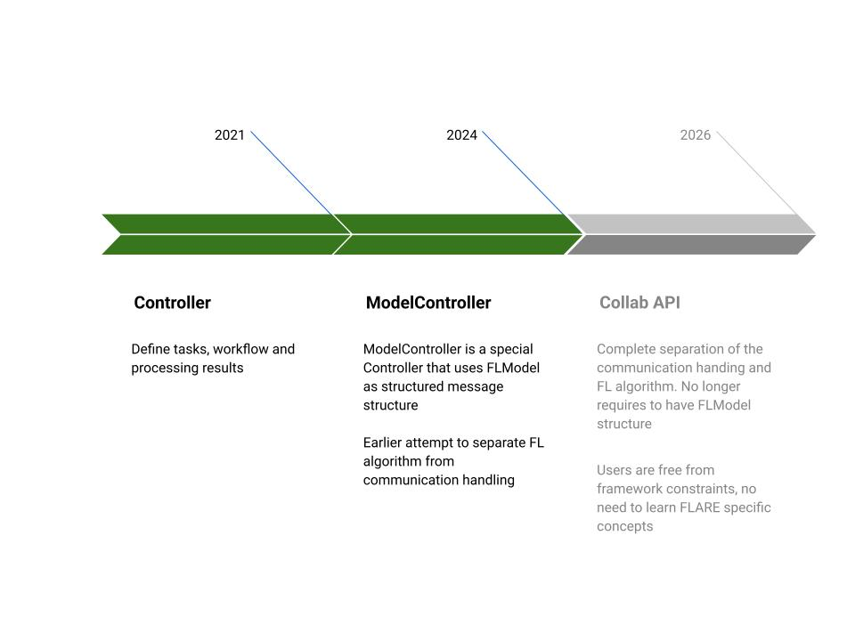
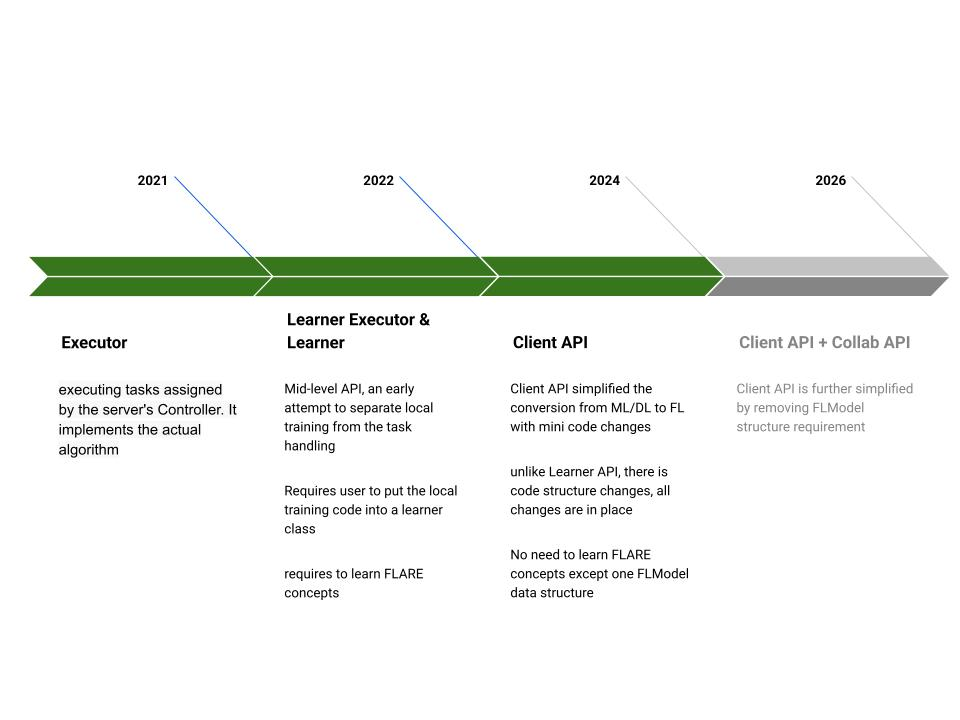
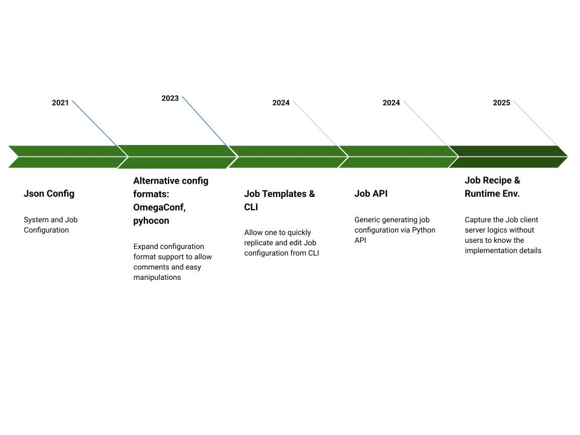

.. _api_evolution:

########################
FLARE APIの進化
########################

どのAPIを使うべきか?
========================

.. list-table::
   :header-rows: 1
   :widths: 30 25 25 20

   * - ロール
     - クライアント側
     - サーバー側
     - ジョブの結線(Wiring)
   * - **データサイエンティスト** — MLワークフローにFLを適用する
     - Client API
     - 組み込みアルゴリズム(FedAvg、FedProxなど)
     - Job Recipe
   * - **FL研究者** — 新しいFLアルゴリズムを開発する
     - Collab API、Client API
     - Collab API
     - Job Recipe
   * - **システムインテグレーター** — プラットフォームやカスタム統合を構築する
     - Collab API、Executor API
     - Collab API、Controller API
     - Job Recipe

.. tip::

   新しいAPIである **Client API**\ 、\ **Job Recipe API**\ 、\ **Collab API** は、シンプルさを重視して設計されており、ほとんどのユースケースをカバーします。
   低レベルのController/Executor APIは、高度なカスタマイズやシステム統合のためのものです。

   新規プロジェクトで避けるべき非推奨API: LearnerExecutor/Learner(Client APIを使用)、ModelController(Collab APIを使用)、Job Template CLI(Job Recipeを使用)。

各APIレイヤーの詳細については、以下の進化の歴史を参照してください。

FLAREサーバー側APIの進化
==================================

Controller
----------

NVIDIA FLAREにおいて、Controllerは連合学習ワークフローをオーケストレーションするサーバー側コンポーネントです。FLアルゴリズムのサーバーロジックを定義し、クライアントにタスクを割り当て、返された結果を処理して、トレーニングや評価のプロセス全体を推進します。クライアントは、タスクベースの対話モデルを用いて、Controllerからタスクを取得(pull)し、結果を送信(push)します。

**Controller API**

Controller APIは、サーバー上で連合ワークフローを実装するための抽象化を提供します。これはタスクの抽象化を中心に構築されており、各タスクは、関連するペイロードを伴うクライアント作業の単位を表します。クライアントは定期的にタスクを要求し、ローカルで実行して、結果をControllerに返します。これにより、連合計算の柔軟でプログラマブルな調整が可能になります。

Model Controller
----------------

NVIDIA FLAREにおいて、ModelControllerは、モデル中心の連合学習ワークフローを管理する特化型のControllerです。

これは、モデルの状態、パラメータ、メタデータをラップするFLModelデータ構造を使用します。汎用的な辞書の代わりに構造化されたインターフェースを提供することで、FLModelはデータサイエンティストがモデルを扱いやすくし、エラーを減らしてワークフローの実装を簡素化しつつ、連合学習に必要な柔軟性も維持します。

このAPI設計は、FLアルゴリズムのロジックを基盤の通信処理から分離しようとする初期の取り組みを反映しており、ユーザーが低レベルのメッセージパッシングやオーケストレーションの詳細を気にすることなく、モデリングと分析に集中しやすくなっています。

Collaborative API (Collab API)
------------------------------

Collaborative APIは、通信処理と連合学習アルゴリズムの完全な分離を実現します。
この設計により、ユーザーはフレームワークの制約からより自由になり、FLAREフレームワークの概念を学ぶことなくアルゴリズムや分析ロジックを実装できます。Collab APIでは、どのような種類のメッセージやデータ構造をやり取りするかをユーザーが決定します。

クライアント側APIの進化
=============================

Executor
--------
FLARE Executor APIは、クライアント側の実行を完全に制御しながら連合ワークフローに直接参加できる低レベルの統合インターフェースです。サーバーからのタスクの受信、FLAREランタイムとのやり取り、結果の返却を担います。このAPIは最大限の柔軟性と拡張性を提供し、システム統合、カスタムプロトコル、非標準のワークフロー、外部システムとの密結合に適しています。
ただし、Executor、タスクのライフサイクル、Shareable、FLContextといったFLARE固有の概念に対する深い理解が必要であり、FLAREの実行モデルに沿ってロジックを構成することが求められます。

そのため、クライアント側APIのExecutorは、きめ細かな制御を必要とし、カスタマイズのためにシンプルさを犠牲にしてもよいと考える上級ユーザーに最も適しています。

Learner Executor & Learner
--------------------------
LearnerExecutorとLearnerのパターンは、NVIDIA FLAREにおける中レベルのクライアント側抽象化で、FLAREのTrainerスタイルの実行モデルを維持しながら、連合オーケストレーションを機械学習ロジックから分離します。LearnerExecutorは、タスクのディスパッチ、実行コンテキスト、ランタイム通信といったFLARE固有の関心事を管理し、すべてのML計算をLearnerに委譲します。Learnerは、トレーニング、評価、更新処理といったフレームワーク固有のロジックをカプセル化します。
ただし、このパターンでもユーザーはShareableやFLContextといったFLARE固有の概念を学び、Executorのライフサイクルによって規定された所定のメソッド構造の中にコードを配置する必要があります。その結果、生のExecutor実装よりはすっきりしているものの、実行モデルを完全に抽象化する高レベルAPIと比べると、フレームワークの制約と学習のオーバーヘッドが残ります。

FLARE Client API
----------------

Client APIは、FLModel抽象化の上に構築された高レベルAPIで、すべての連合通信が単一の制約されたデータ構造を通じて行われます。FLModelには、モデル重み、オプティマイザーのパラメータ、メトリクス、軽量なメタデータのみが含まれ、低レベルの通信や実行の詳細は一切公開されません。この設計により、データサイエンティストはクライアントとサーバーの間でどのような情報が受け渡されるのかを正確に理解しやすくなります。

Client APIは、既存のML/DLコードを最小限のコード変更で連合ワークロードへ変換することを簡単にするよう設計されています。Learner APIとは異なり、ユーザーは既存のトレーニングコードや分析コードを再構成することなく、その場で適応させます。

その結果、ユーザーはExecutor、Controller、Shareable、FLContextといったFLARE固有のフレームワーク概念を学ぶ必要がありません。FLModelデータ構造そのものの理解を除けば、Client APIによりユーザーはMLロジックに集中でき、FLAREが連合通信とオーケストレーションを透過的に処理します。

Client API + Collaborative API (Collab API)
-------------------------------------------

Collaborative APIは、通信処理と連合学習アルゴリズムの完全な分離を実現し、一部のFLアルゴリズム実装を制限するFLModel構造を使用する必要性をなくします。この設計により、ユーザーはフレームワークの制約からより自由になり、FLAREフレームワークの多くの概念を学ぶことなくアルゴリズムや分析ロジックを実装できます。

Client API + Collab APIでは、ユーザーは引き続きFLModelをやり取りすることも、他の任意のデータ構造を選ぶことも自由にできます。

クライアント・サーバー結線APIの進化
======================================

連合学習システムが機能するためには、クライアント側のExecutorとサーバー側のControllerが適切に接続されていなければなりません。FLAREでは、この結線はシステムレベルおよびジョブレベルの設定によって処理されます。これはカスタムコンポーネントのプラグインやシステム統合の開発者にとってはうまく機能しますが、データサイエンティストにとっては煩雑になり得ます。
これに対処するため、FLAREは、クライアント・サーバー統合を簡素化し、典型的な連合学習・分析タスクのセットアップ労力を減らすために設計された、いくつかの高レベルAPIとアプローチを導入してきました。

JSON設定
--------------------

FLAREのジョブは、3つの設定ファイルによって定義されます:

.. code-block:: text

    config_fed_server.json
    config_fed_client.json
    meta.json

JSONファイルの具体的な内容について深く掘り下げる必要はありません。
JSONファイル形式は、動的なプラグインカスタムコンポーネントを定義する手段をシステムに与えます。

代替設定形式のサポート: YAML (OmegaConf)、pyhocon
-------------------------------------------------------------
YAMLとPyhocon (Python HOCON)の両方の設定形式をサポートしており、いずれもコメントと変数置換が可能です:
**Pyhocon** – JSONの派生形式であり、Python向けのHOCON (Human-Optimized Config Object Notation)パーサーです。コメント、変数置換、継承をサポートします。
**OmegaConf** – YAMLベースの階層的設定システムで、こちらもコメントと変数置換をサポートします。
ユーザーは単一の形式で作業することも、複数の形式を組み合わせることもできます。例えば、config_fed_client.confとconfig_fed_server.jsonの組み合わせです。

Job Template & Job CLI
----------------------
FLARE Job Templateは、NVIDIA FLAREにおける事前定義済みのジョブ設定一式です。モデル、トレーニング戦略、クライアント/サーバー設定を定義しており、新しい連合学習ジョブをゼロから書き直すことなく、コピーして変更できるようにします。
これらのテンプレートを使った作業を簡素化するために、FLARE Job CLIも提供しています。これにより、利用可能なテンプレートの一覧表示、テンプレートからのジョブ作成、テンプレート変数の確認、ジョブの投入が行えます。
このアプローチは、ジョブスクリプト作成の自動化に向けた初期のステップを表しています。

Job API
--------

FLARE Job APIは、コンポーネントの定義、クライアント・サーバー接続の結線、連合学習ワークフローの指定(通常はJSON設定として表現される)を行えるPythonインターフェースです。ユーザーは、ワークフロー定義をJSONにエクスポートすることで、Job APIから直接ジョブ設定を生成できます。これにより、Pythonを使ってFLワークフローを正確かつプログラマティックに記述・定義できます。

Job Recipeとランタイム環境
---------------------------------

**Job Recipe**

NVIDIA FLAREにおけるJob Recipeは、連合学習ジョブのランタイムロジックとワークフローを定義します。モデル、トレーナー、アグリゲーターなどのコンポーネントがどのように相互作用するか、トレーニングおよび評価中の操作の順序、特別な手順(検証、早期終了など)を指定します。本質的には、ジョブの挙動を設定とは切り離してエンコードするものであり、同じレシピを異なるデータセットやクライアントで再利用できます。

**ランタイム環境**

ランタイム環境は、FLAREジョブの実行コンテキストを記述します。これには、システムレベルの設定、ソフトウェア依存関係、Pythonパッケージ、ハードウェア要件、クライアントとサーバーでジョブを実行するために必要な通信プロトコルが含まれます。ランタイム環境を定義することで、FLAREは異種のデバイスやプラットフォーム間での一貫性と再現性を確保します。
