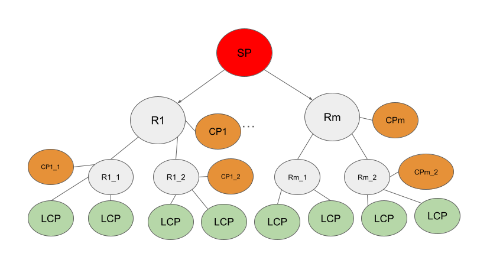
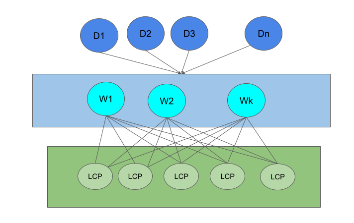
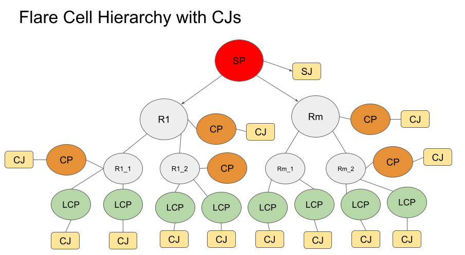
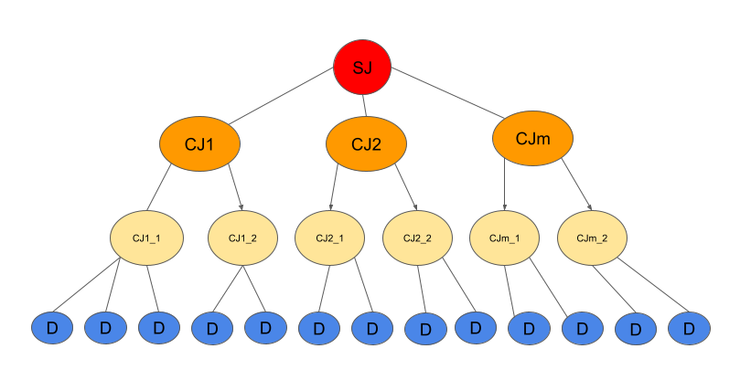
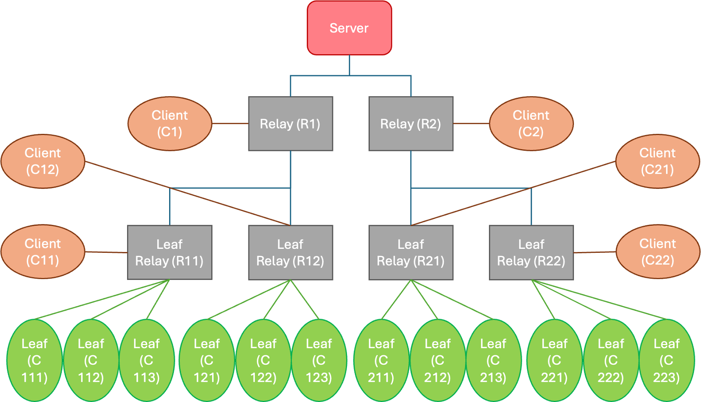

.. _flare_hierarchical_architecture:

階層型FLARE
====================

:ref:`hierarchical_communication` で説明したように、FLAREは通信階層とクライアント階層によって、多数のFLクライアントをサポートするようにスケールできます。適切に設定されていれば、FLAREは非常に効率的な通信と階層的な集約計算を実現します。

以下の図は、通信のために2レベルのリレー(Rノード)を使用する階層型FLAREシステムを示しています。クライアント階層(CPノード)も定義されており、リレーに接続されています。

最適なパフォーマンスのために、クライアント階層はリレー階層に忠実に従っていることに注意してください。例えば、CP1_1とCP1_2はCP1の子であり、R1_1に接続されたLCPはCP1_1の子、R1_2に接続されたLCPはCP1_2の子、という具合です。

このクライアント階層は、デバイストレーニングのための階層的集約アルゴリズムを実装するために使用されます。

Leaf Client Process (LCP)
-------------------------

LCPはクライアント階層の末端ノードです。エッジアプリケーションをサポートする特別な役割を担います。

エッジ通信のインターフェース
~~~~~~~~~~~~~~~~~~~~~~~~~~~~~~~~

LCPは、エッジデバイスからのメッセージのエントリポイントとして機能します。ただし、これらのメッセージはLCPに直接送信されるわけではありません。代わりに、Webノードと呼ばれる中間コンポーネントを経由します。

Webノードとは?
~~~~~~~~~~~~~~~~~~~

Webノードは、エッジデバイスからメッセージを受信し、適切なLCPに転送するルーティングコンポーネントです。負荷分散を管理し、一貫したメッセージルーティングを保証します。

エッジデバイスの推定数と地理的分布に基づいて、複数のWebノードを異なるリージョンにデプロイできます。Webノードは、ルーティング設定に応じて、すべてのLCPまたはその一部に接続できます。

Webノードは通常、以下を目指します:

1. デバイスIDに基づき、同じデバイスからのメッセージを同じLCPにルーティングする
2. 接続されているすべてのLCPにデバイスを均等に分散させる

.. note::
   プライバシー保護のため、「デバイスID」はグローバルに一意な番号であればよく、実際のデバイス識別子である必要はありません。一度生成されたら、このIDは少なくともトレーニングセッションの間は一定に保たれなければなりません。

以下の図は、このアーキテクチャを示しています。

Client Job Process (CJ)へのルーティング
~~~~~~~~~~~~~~~~~~~~~~~~~~~~~~~~~~~~~~~~~~~~

LCPは、受信したエッジメッセージを適切なClient Job Process (CJ)にルーティングします。CJはアプリケーションの処理ロジックを実装します。

生成と消滅を繰り返すCJとは異なり、LCPは永続的であることに注意してください。複数のジョブを同時に実行でき、実行中のジョブごとに1つのCJがLCPに接続されます。LCPは、受信した各エッジメッセージを適切なCJにルーティングします。

以下の図は、ジョブがデプロイされたシステムを示しています。

CJ階層
------------

ジョブがデプロイされると、そのジョブに対して1つのSJ (Server Job)プロセスと、各CP上に1つの専用CJプロセスが存在します。CJ階層は、それぞれのCPの階層を反映します。デバイスメッセージは、LCPに関連付けられたCJによって受信・処理されます。

以下の図は、上記の例に対応するCJ階層を示しています。

リーフCJはLCPに関連付けられています。リーフCJは、Edge Device Interaction Protocol (EDIP)に従ってエッジデバイスと間接的にやり取りします。また、第一線のアグリゲーターとしても機能し、担当デバイスからのトレーニング結果を集約して、その集約結果を親のCJに報告します。すべての中間CJは、子からの結果を集約して集約結果を親に報告し、これがSJまで続きます。SJが最終的な集約結果を生成します。

Routing Proxy (Webノードの実装)
---------------------------------------

現在の実装では、WebノードはRouting Proxyと呼ばれるコンポーネントとして実現されています。

ルーティングロジック
~~~~~~~~~~~~~~~~~~~~~~

Routing Proxyは、各デバイスの一意な識別子に基づくハッシュベースのルーティング戦略を使用します:

- デバイスIDはリクエストで渡されます
- コンシステントハッシュ関数がデバイスIDを特定のLCPにマッピングします
- これにより、同じデバイスからのすべてのメッセージが同じLCPにルーティングされることが保証されます。これはセッションの一貫性のために重要です
- また、利用可能なLCP間でデバイスが均等に分散されることも保証されます

プロビジョニング
------------------

通信階層とクライアント階層は、プロビジョニングツールを使用して適切に作成する必要があります。これは、:ref:`hierarchical_communication` で説明した ``listening_host``、``connect_to``、FQSNの各プロパティで行えますが、このアプローチは、特にノード数が多い場合、手間がかかりミスも起きやすくなります。

FLARE 2.7では、このプロセスを簡素化する ``tree_prov`` というCLIツールを提供しています。このツールでは、通信階層の形状を指定するだけでよく、残り(すなわち、通信階層のトポロジーに従ったクライアント階層の作成)はツールが処理します。

.. note::
   このツールは、単一マシン上での簡単なプロトタイピングを目的としています。すべてのノードはlocalhost上にあると想定されます。本番環境向けのツールは、FLAREの将来のバージョンで提供される予定です。

``tree_prov`` を実行するには:

.. code-block:: bash

   python -m nvflare.lighter.tree_prov options

利用可能なオプション:

- ``--root_dir, -r``: プロビジョニング結果を出力するディレクトリ。必須。
- ``--project_name, -p``: プロジェクト名。必須。
- ``--depth, -d``: リレーツリーの深さ(すなわち、リレー層の数)。必須。
- ``--width, -w``: ツリーの幅(すなわち、各親リレーに対する子リレーノードの数)。これはリレーノードにのみ適用されることに注意してください。指定しない場合、デフォルトは2です。
- ``--clients, -c``: 各リーフリレーノードに対するクライアント(LCP)の数。これはリーフリレーノードにのみ適用されます。
- ``--max_sites, -m``: リレーとFLクライアントを含むサイトの最大数。サイト数は深さに対して指数関数的に増加することに注意してください。この制限は、誤って大きな深さの値が入力された場合に、ツールが過剰な数のサイトを生成するのを防ぎます。デフォルト値は100です。
- ``--lcp_only, -l``: LCPのプロビジョニング結果のみを生成します。プロジェクトのプロビジョニング後に新しいLCPを追加する場合に、ときどき役立ちます。
- ``--analyze, -a``: 指定した場合、プロビジョニング結果を生成せず、トポロジー分析のみを実行します。分析では、階層内のリレーノードとクライアントノードの数が表示されます。
- ``--rp``: Webノードを実装するRouting Proxyのポート番号。

トポロジー分析の例を示します:

.. code-block:: bash

   python -m nvflare.lighter.tree_prov -d 2 -w 2 -a -c 3 -r . -p x

結果は次のとおりです:

- Relays:  leaf=4; non-leaf=2; total=6
- Clients: leaf=12; non-leaf=6; total=18
- Total Sites: 25

リレーノードは合計6つあります: 非リーフノードが2つ、リーフノードが4つです(幅の値が2のため、各非リーフノードは2つのリーフノードを持ちます)。

クライアントノードは合計18個あります。クライアント階層には、6つの非リーフクライアント(各リレーノードに1つ)と12個のリーフクライアント(各リーフリレーノードに3つ)があります。

サイトの合計数は、リレーの総数(6)、クライアントの総数(18)、サーバー(1)の合計で、25になります。

プロビジョニング結果に加えて、``tree_prov`` ツールはWebノードをデプロイするための追加ファイルと便利なスクリプトを生成します。これらのファイルは、プロビジョニング結果の ``scripts`` フォルダに配置されます。特に重要なファイルは以下のとおりです:

- ``lcp_map.json``: WebノードがLCPに接続する際に使用するポート番号を含みます
- ``start_rp.sh``: Webノード(Routing Proxy)を起動するためのシェルスクリプト
- ``rootCA.pem``: プロジェクトのルート証明書を含み、WebノードがLCPへのセキュアな接続を確立するために使用します
