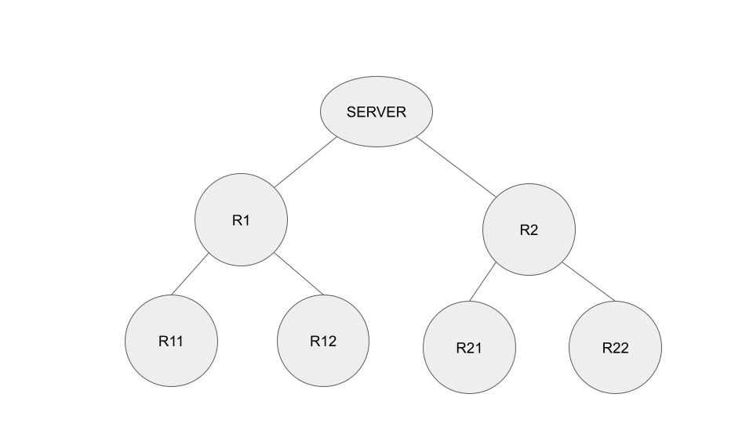
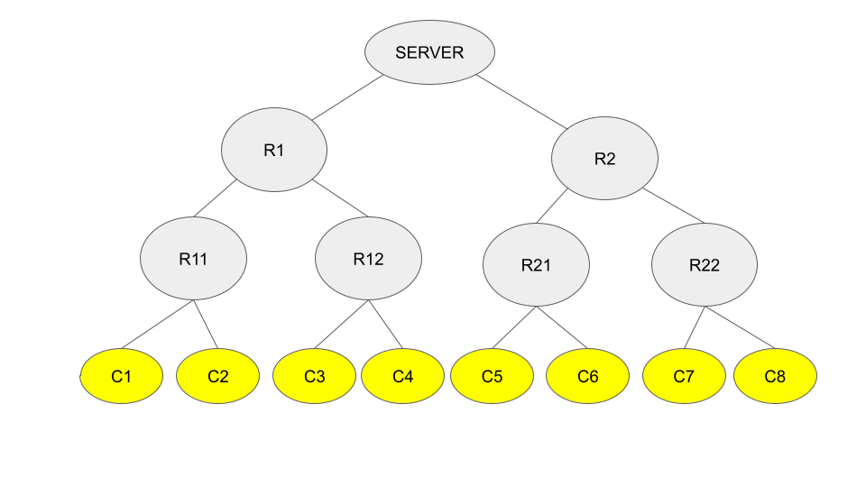
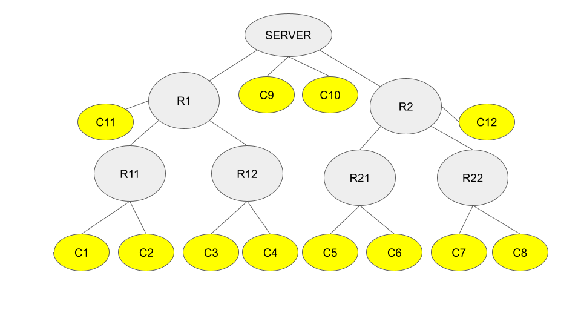
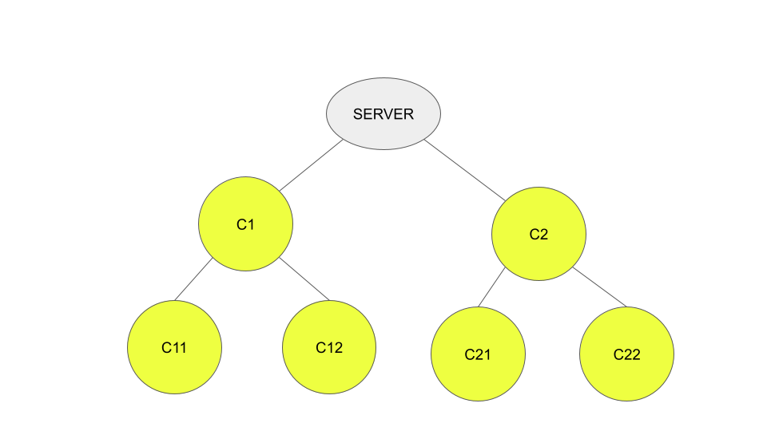
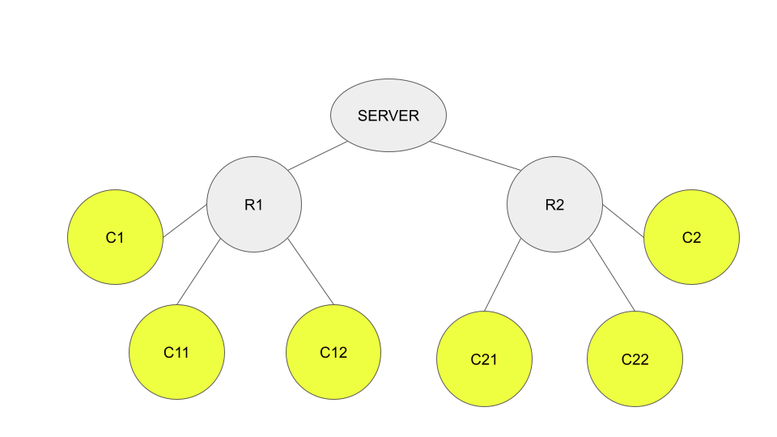
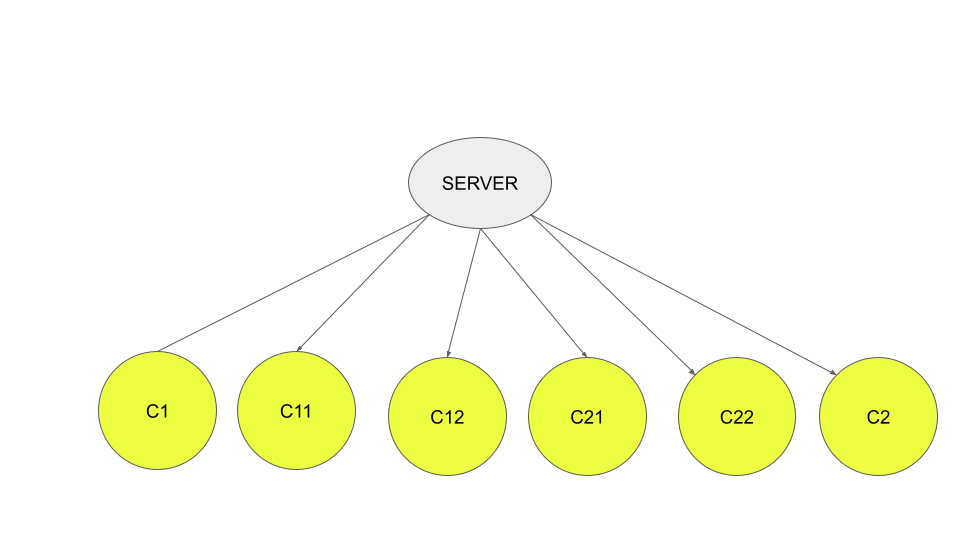

.. _hierarchical_communication:

##########################################
階層型通信とクライアント
##########################################

基本的なFLAREデプロイメントでは、クライアントはサーバーに直接接続し、サーバーと各クライアントの間に専用の接続が1つずつ存在します。このアーキテクチャは、クライアント数が比較的少ない場合(例: 100未満)にはうまく機能します。しかし、クライアント数が増えると、サーバーへの同時接続数もそれに比例して増加し、通信効率が低下する可能性があります。

FLAREの基盤となる通信技術であるCellNetは、階層型の通信トポロジーをサポートしています。セルを階層的に編成することで、大規模環境でも効率的な接続管理が可能になります。

通信階層
-----------------------

FLARE 2.7はこの機能を活用して、特にクライアント数が非常に多い場合(例: 1,000超)に、FLクライアントを効率的に管理します。

リレー
~~~~~~~~

通信階層において、リレーは、次の図に示すように、サーバーまたは親リレーのいずれかに接続する中間ノードです:

階層は任意の深さまで拡張でき、親ノードは任意の数の子ノードを持てます。ただし、この構成の主な目的は効率的な接続管理であるため、各親ノードの子ノード数は100未満にすることを推奨します。

FQCN
~~~~~

通信階層では、各ノードはセルと呼ばれ、各セルは完全修飾セル名(fully qualified cell name、FQCN)と呼ばれる一意の名前を持ちます。FQCNは、サーバーからそのノードまでのパスを表します。

- サーバーのFQCNは「server」です。
- サーバーの直下の子のFQCNは、そのベース名です。上の例では、R1とR2のFQCNはそれぞれR1とR2です。
- R11のFQCNはR1.R11です。同様に、R12のFQCNはR1.R12です。
- R21のFQCNはR2.R21です。同様に、R22のFQCNはR2.R22です。

.. note::
   簡潔にするため、階層のルート名(すなわちserver)はFQCNから省略されます。そうしないと、すべてのセルのFQCNが「server」で始まることになってしまいます。

CellNetは、階層内の任意のセルが他の任意のセルと通信できることを保証します。

クライアントを階層に接続する
~~~~~~~~~~~~~~~~~~~~~~~~~~~~~~~~~

クライアントは階層内の任意のノードに接続できます。サーバーに直接接続することも、中間またはリーフのリレーノードに接続することもできます。クライアントをリーフのリレーノードのみに接続するとトポロジーは単純になりますが、これは厳密な要件ではありません。

以下の図は、8つのクライアント(C1からC8)がリーフノードのみに接続された単純な構成を示しています。

CellNetの観点からは、クライアントは単なるセルであり、それぞれが自身のFQCNを持ちます。例えば、C6のFQCNはR2.R21.C6です。

以下の図は、一部のクライアントが中間ノードまたはサーバーに直接接続された別の構成を示しています。

クライアントがどのように接続されているかにかかわらず、クライアントはサーバーおよび他のクライアントと通信できます。この通信はアプリケーションコードに対して完全に透過的です。

クライアント階層
-----------------

クライアントは通信階層内のサーバーまたは異なるリレーに接続できますが、デフォルトではすべてのクライアントは互いに独立しているという点で対等です。

FLARE 2.7では、クライアントを階層的に編成する機能が導入されました。これは、クライアントが互いに独立している必要はなく、一部のクライアントを他のクライアントの子として指定できることを意味します。この階層的な編成により、階層的集約などの特定のアルゴリズムをより効率的に実装できます。

.. note::
   クライアント階層と通信階層は別個の概念です。通信階層は効率的な接続管理のために設計されており、クライアント階層は階層的アルゴリズムの実装のために設計されています。

クライアント階層は、クライアントが通信階層でどのように接続されているかとは独立した、クライアント間の関係の論理的な配置と考えることができます。実際、子クライアントは通常、親クライアントに直接接続しません。

以下の図は、クライアント階層を示しています。

FQSN
~~~~~

クライアント階層内の各クライアントは、完全修飾サイト名(fully qualified site name、FQSN)と呼ばれる一意の名前を持ちます。FQSNは、サーバーからそのクライアントまでのパスを指定します。

- 上の例では、C1とC2のFQSNはそれぞれC1とC2です。クライアントC11のFQSNはC1.C11、という具合です。

このクライアント階層は、任意の通信階層の上に実装できます。

以下の図は、リレーベースの通信階層でクライアント階層がどのように実装されるかを示しています:

あるいは、クライアントはサーバーに直接接続することもできます:

ジョブ階層
--------------

ジョブがデプロイされると、各クライアントとサーバーに対してジョブプロセスが作成されます。これらのプロセスはCJ (client job)およびSJ (server job)と呼ばれます。クライアントごとに1つのCJが存在します。

ジョブプロセス(CJとSJ)間の関係は、対応するクライアント間の関係を反映します。例えば、C11はC1の子であるため、クライアントC11上のCJもクライアントC1上のCJの子になります。

ジョブ階層は、子のCJが計算した結果を親のCJに送信して集約する階層的アルゴリズムを実装するために不可欠です。

.. note::
   クライアント階層と通信階層は互いに独立していますが、通信と計算のオーバーヘッドから通常生じる中央処理の負担を軽減することでシステム全体のパフォーマンスを最適化する、という同じ目標を共有しています。

クライアント階層がない場合、各クライアントは結果をサーバーに直接送信します。通信階層によってサーバーへの接続数は減らせますが、サーバーが処理しなければならないメッセージ数とデータ量は変わりません。

クライアント階層はこの問題に対処します。最上位層のクライアントのみがサーバーに報告するため、クライアント階層はサーバーが実行しなければならない処理量を削減します。

したがって、最適なアプローチは、最初の例に示したように、クライアント階層を通信階層に揃えることです。これにより、通信ホップ数と必要な処理量の両方が最小化されます。

プロビジョニング
------------------

通信階層とクライアント階層は、プロビジョニングプロセスを通じて確立されます。

リレー
~~~~~~~~

リレーノードは、親(またはサーバー)に接続すると同時に、他のノードからの接続を受け入れます。そのため、リレーノードはリスナー(通信サーバーとして動作)とコネクター(通信クライアントとして動作)の両方として機能しなければなりません。したがって、プロビジョニングプロセスは、リレーノード用にサーバー資格情報(証明書と秘密鍵)とクライアント資格情報(証明書と鍵)の両方を作成し、リレーのスタートアップキットに含めます。

これらの資格情報は、以下のプロパティで指定されます:

listening_host
~~~~~~~~~~~~~~~

このプロパティは、リレーが実行される場所と、着信接続を待ち受けるポート番号を指定します。

このプロパティは最大5つの要素を持てます:

- **scheme**: 通信プロトコル(http、grpc、またはtcp)。指定しない場合、プロジェクト全体のschemeが使用されます。
- **host_names**: このホストを識別するための追加のホスト名またはIPアドレス。指定されたすべての名前は、サーバー証明書の「Subject Alternative Names」フィールドに含まれます。この要素はオプションです。
- **default_host**: ホストへの接続に使用されるデフォルトのホスト名。指定必須です。
- **port**: 待ち受けるポート番号。指定必須です。
- **connection_security**: 着信接続の接続セキュリティモード(tls、mtls、またはclear)。指定しない場合、プロジェクトのデフォルトの接続セキュリティが使用されます。プロジェクトの接続セキュリティが明示的に指定されていない場合、デフォルト値は「mtls」(相互TLS)です。

connect_to
~~~~~~~~~~~

このプロパティは、リレーが接続を確立するために必要な情報を指定します。

このプロパティは最大4つの要素を持てます:

- **name**: 階層内のノードのベース名。各ノードは一意のベース名を持つことに注意してください。これが指定された場合、リレーは指定されたノードのdefault_hostでそのノードに接続します。
- **host**: 接続先のホスト名またはIPアドレス。:ref:`BYOConn <byoconn>` を使用しない限り、対象ノードからアクセス可能なもの(そのdefault_hostまたはhost_namesのいずれか)であるべきです。
- **port**: 接続先のポート番号。:ref:`BYOConn <byoconn>` を使用しない限り、この要素は通常不要です。
- **connection_security**: 発信接続の接続セキュリティモード(tls、mtls、またはclear)。:ref:`BYOConn <byoconn>` を使用しない限り、通常は明示的に指定する必要はありません。

.. note::
   **name** または **host** 要素のいずれか一方を指定しなければなりませんが、両方を指定してはいけません。

BYOConnに関する注記
~~~~~~~~~~~~~~~~~~~~~~
FLAREは :ref:`BYOConn <byoconn>` (Bring Your Own Connectivity)をサポートしています。BYOConnでは、待ち受けエンドポイントをingressプロキシで保護できます。そのようなエンドポイントに接続するには、``connect_to`` プロパティは実際のエンドポイントではなくingressプロキシを指す必要があります。

クライアント階層
~~~~~~~~~~~~~~~~~~

クライアントは、サーバーまたはリレーノードのいずれかに接続します。サーバーに接続する場合、追加の設定は不要です。リレーに接続するには、上で説明したように ``connect_to`` プロパティを使用します。

クライアント階層のもう1つの側面は、階層内でのクライアントの位置です。これは ``parent`` プロパティを使用して指定します。このプロパティの値は、親クライアントのベース名です。

例
~~~~~~~~

以下の ``project.yml`` は、FQSNのセクションで説明した例について、これらのプロパティを使用して通信階層とクライアント階層を指定する方法を示しています。

.. code-block:: yaml

   api_version: 3
   name: mobile
   description: NVIDIA FLARE sample project yaml file
   connection_security: clear
   allow_log_streaming: false

   participants:
    - name: server
      type: server
      org: nvidia
      fed_learn_port: 8002
      host_names: [localhost, 127.0.0.1]
      default_host: localhost
    - name: R1
      type: relay
      org: nvidia
      listening_host:
        default_host: localhost
        port: 18004
    - name: R2
      type: relay
      org: nvidia
      listening_host:
        port: 28004
        default_host: localhost
    - name: C1
      type: client
      org: nvidia
      connect_to:
        name: R1
    - name: C11
      type: client
      org: nvidia
      parent: C1
      connect_to:
        name: R1
    - name: C12
      type: client
      org: nvidia
      parent: C1
      connect_to:
        name: R1
    - name: C2
      type: client
      org: nvidia
      connect_to:
        name: R2
    - name: C21
      type: client
      org: nvidia
      parent: C2
      connect_to:
        name: R2
    - name: C22
      type: client
      org: nvidia
      parent: C2
      connect_to:
        name: R2
    - name: admin@nvidia.com
      type: admin
      org: nvidia
      role: project_admin
      connect_to: 127.0.0.1

   builders:
    - path: nvflare.lighter.impl.workspace.WorkspaceBuilder
    - path: nvflare.lighter.impl.static_file.StaticFileBuilder
      args:
        config_folder: config

        # scheme for communication driver (grpc, tcp, http).
        scheme: grpc

    - path: nvflare.lighter.impl.cert.CertBuilder
    - path: nvflare.lighter.impl.signature.SignatureBuilder
