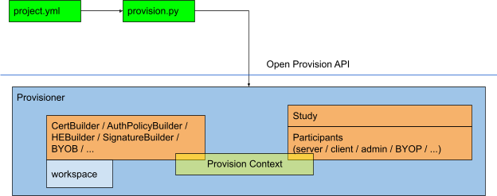

.. _provisioning:

##################################################
NVIDIA FLARE におけるプロビジョニング
##################################################
フェデレーションを構築する上で最初に必要となるステップは、サーバー、クライアント、
管理クライアントのアイデンティティを確立するためのプロビジョニングです。

フェデレーテッドラーニングを運用する際、通信チャネルはプロビジョニング時に生成された共有 TLS 証明書を使用して、
参加者間のアイデンティティを確立し、安全な通信を実現します。

NVIDIA FLARE のプロビジョニングは、すべての参加者が異なる場所から NVIDIA FLARE システムに参加できるように、
相互に信頼されたシステム全体の構成を生成します。これを実現するために、Open Provision API とその Builder モジュールを
基盤としたプロビジョニングツールが NVIDIA FLARE (:mod:`nvflare.lighter`) に含まれており、
各参加者に必要な構成成果物を含むスタートアップキットを作成します。

構成には通常、以下の情報が含まれます(ただしこれらに限定されません):

    - ドメイン名、ポート番号、IP アドレスなどのネットワーク探索情報
    - 参加者やルート認証局の証明書などの認証用クレデンシャル
    - ロール、権限、ルールなどの認可ポリシー
    - 署名などの改ざん防止メカニズム
    - 個々の参加者を簡単に起動するためのデフォルトのコマンドラインオプション付きシェルスクリプトなどの便利なコマンド

開発者が自身の要件に合わせて上記の構成を自由に追加・変更・削除できるようにするために、
私たちは Open Provision API を作成しました。開発者はこの API を活用して、サーバー、クライアント、管理者向けの
パッケージを作成する従来のデフォルトのプロビジョニングに加えて、自身の要件を満たすプロビジョニングタスクを
実行できるようになりました。

*******************************
NVIDIA FLARE Open Provision API
*******************************

アーキテクチャ
================

上の図は、NVIDIA FLARE Open Provision API のアーキテクチャを青色で示しています。2 つの緑色のブロックは、
プロジェクトの構成情報 (project.yml) を収集し、Open Provision API のコンポーネントと連携してプロビジョニングタスクを
実行するサンプルの Python コード (provision.py) です。Provisioner と青枠の中のブロックは、
Open Provision API のクラスまたはそのサブクラスです。

詳細
=======

project.yml
-----------
これは参加者と Builder を記述する単純な yaml ファイルです。Open Provision API 自体はこのファイルの
フォーマットを定義していない点に注意してください。開発者は、参加者と Builder を別のフォーマットで記述した
独自のファイルを作成できます。情報を読み込んで Open Provision API の呼び出しに変換するコード
(上のサンプル図の provision.py)がある限り、開発者はそうした情報を 1 つの URL に保存することさえ可能です。

provision.py
------------
この Python ファイルは、Open Provision API と連携するサンプルアプリケーションです。また、project.yml を読み込み、
コマンドラインオプションをパースし、Open Provision API で定義されたクラス/サブクラスをインスタンス化し、ユーザーに役立つメッセージを表示します。
前述のとおり、開発者は provision.py を変更したり、自身の要件に合った独自のアプリケーションを作成することが推奨されます。
スタンドアロンのアプリケーションを一切使わずに Open Provision API を完全に活用することも可能です。たとえば、
既存のアプリケーションを持っていて NVIDIA FLARE システムのプロビジョニング機能を追加したい開発者は、
Open Provision API への API 呼び出しを追加して必要な出力を生成できます。

Provisioner
-----------
これは、上の図に示すように、Project、Workspace、Provision Context、Builder、Participant のすべてのインスタンスを保持する
コンテナクラスです。このクラスの典型的な使い方は次のとおりです:

.. code-block:: python

    provisioner = Provisioner(workspace_full_path, builders)

    provisioner.provision(project)

Project
-------
Project クラスは参加者に関する情報を保持します。したがって、任意の参加者の情報は
Project インスタンスから取得できます:

.. code-block:: python

    class Project(object):
       def __init__(self, name: str, description: str, participants: List[Participant]):
           self.name = name
           all_names = list()
           for p in participants:
               if p.name in all_names:
                   raise ValueError(f"Unable to add a duplicate name {p.name} into this project.")
               else:
                   all_names.append(p.name)
           self.description = description
           self.participants = participants

       def get_participants_by_type(self, type, first_only=True):
           found = list()
           for p in self.participants:
               if p.type == type:
                   if first_only:
                       return p
                   else:
                       found.append(p)
           return found

Participant
-----------
各参加者は、実行時に NVIDIA FLARE システム内で他の参加者と通信する 1 つのエンティティです。
各参加者は type、name、org、props という属性を持ちます。属性 ``props`` はディクショナリで、
追加情報を格納します:

.. code-block:: python

    class Participant(object):
       def __init__(self, type: str, name: str, org: str, *args, **kwargs):
           self.type = type
           self.name = name
           self.org = org
           self.subject = name
           self.props = kwargs

各参加者の name は一意でなければなりません。これは Project の __init__ メソッドで強制されます。type は、
その参加者が NVIDIA FLARE システム内で稼働する際の振る舞いを定義します。たとえば type = 'server' は、
その参加者がサーバーとして動作することを定義します。典型的な NVIDIA FLARE システムでは、server、client、
admin の 3 つの type が一般的に使用されます。ただし、開発者は必要に応じて 'gateway'、'proxy'、'database' などの
他の type を自由に追加できます。Builder はそうした情報を考慮に入れ、type 属性に基づいて
関連する結果を生成できます。

Builder
-------
上の図の Builder は、典型的な NVIDIA FLARE システムで一般的に使用される zip ファイルを生成する便利な手段として
提供されています。開発者は、自身の要件に合わせてこれらの Builder を追加・変更、あるいは削除することが推奨されます。

各 Builder は、project からの情報、自身の __init__ 引数、および provisioner からデータを生成する責任を持ちます。
たとえば HEBuilder は、サーバーとクライアント向けの tenseal コンテキストファイルを生成する責任を持ちますが、
admin 向けには生成しません。さらに、サーバー用のコンテキストには公開鍵も秘密鍵も含まれませんが、
クライアント用のコンテキストには両方が含まれます。その __init__ 引数は poly_modules_degree、coeff_mod_bit_sizes、
scale_bits、scheme から成ります。これらすべての情報により、HEBuilder は正しくコンテキストファイルを出力できます。

Provisioner はプロビジョニング時に、まずループ内で各 Builder の initialize メソッドを呼び出します。これにより Builder は
情報を準備し、インスタンス変数を設定できます。各 Builder の initialize メソッドを呼び出した後、
Provisioner は別のループで各 Builder の build メソッドを呼び出します。このメソッドには通常、
実際のビルド処理(必要なファイルの生成)が実装されます。最後に、Provisioner は 3 番目のループで各 Builder の
finalize メソッドを逆順で呼び出し、すべての Builder が状態を後始末する機会を得られるようにします。これは、
Builder の initialize メソッドが早く呼び出されたものほど、その finalize メソッドは遅く呼び出されるべきという慣例に由来します。

上記の 3 つのループにおける反復は、常に Provisioner クラスに渡される 2 番目の引数である builders リストによって
決まります。したがって、builders リストの順序が異なると結果に影響します。

たとえば、ある Builder の finalize メソッドが、すべての Builder で共有される wip フォルダをクリーンアップして削除する場合、
その後に呼び出される Builder は wip フォルダにアクセスできなくなります。

.. note:: すべての Builder 間の協調は Open Provision API の開発者の責任です。

すべての Builder は Builder クラスをサブクラス化し、次の 3 つのメソッドのうち 1 つ以上をオーバーライドする必要があります:

.. code-block:: python

    class Builder(ABC):
       def initialize(self, ctx: dict):
           pass

       def build(self, project: Project, ctx: dict):
           pass

       def finalize(self, ctx: dict):
           pass

Workspace
---------
各 Builder は、Provisioner が管理するプロビジョニングワークスペース(Provisioner の第 1 引数を参照)配下の 4 つの
フォルダにアクセスできます。それらは 'wip'(作業中の意味)、'kit_dir'('wip' 内のサブフォルダ)、'state'(異なるリビジョン間で
情報を永続化するために使用)、および 'resources'(読み取り専用/静的な情報用)です。

Provision Context
-----------------
Provision Context は Provisioner によって作成され、すべての参加者と Builder が読み書きできます。ある Builder が
情報を追加し、別の Builder がそれを取得することも可能です。仮の例として、開発者が CertBuilder による証明書と
最初の HE Builder のコンテキストに基づいて別の HE コンテキストのセットを生成する 2 つ目の準同型暗号 Builder を
追加したいとします。これを実現するには、開発者は CertBuilder で証明書を Provision Context に書き込み、
HEBuilder でコンテキストを Provision Context に書き込めばよいのです。その情報は
2 つ目の HE Builder から自動的に利用できるようになります。

Open Provision API のケーススタディ
======================================
始める前に、Builder には任意で実装できる 3 つのメソッド initialize、build、finalize があることを思い出してください。
Provisioner はすべての Builder の initialize メソッドを呼び出し、その後すべての Builder の build メソッドを呼び出します。どちらも
builders リストの順序で実行されます。しかし、すべての Builder の finalize メソッドは Provisioner によって逆順で呼び出されます。
この点を念頭に置いてください。

たとえば Case 2 では、builders はリストであり、append メソッドは WebPostDistributionBuilder を
builder リストの末尾に追加します。前述のとおり、initialize と build のメソッドは builder リストの順序で呼び出される一方、
finalize メソッドは逆順で呼び出されます。したがって WebPostDistributionBuilder の finalize メソッドは、
他の Builder の finalize メソッドより前に、そして他の Builder の build メソッドより後に呼び出されると予想できます。

Case 1: 追加のファイルを生成する
-------------------------------------
開発者が、データベースサーバーに関する構成ファイルを admin 参加者に追加したいとします。その構成は
次のようなものです:

.. code-block:: yaml

    [database]
    db_server = server name
    db_port = port_number
    user_name = admin's name

これはすべての admin 参加者に 1 つのファイルを追加することを必要とするため、開発者は次のような DBBuilder を書けます:

.. code-block:: python

    class DBConfigBuilder(Builder):
       def __init__(self, db_server, db_port):
           self.db_server = db_server
           self.db_port = db_port

       def build(self, project, ctx):
           for admin in project.get_participants_by_type("admin", first_only=False):
               dest_dir = self.get_kit_dir(admin, ctx)
               with open(os.path.join(dest_dir, "database.conf"), 'wt') as f:
                   f.write("[database]\n")
                   f.write(f"db_server = {self.db_server}\n")
                   f.write(f"db_port = {self.db_port}\n")
                   f.write(f"user_name = {admin.name}\n")

そして project.yml の builders セクションにエントリを追加します:

.. code-block:: yaml

    - path: byob.DBConfigBuilder
      args:
        db_server: example.com
        db_port: 5432

Case 2: 既存の Builder を拡張する
-------------------------------------------
開発者が、生成された各フォルダの zip ファイルを POST メソッドで Web サーバーに
プッシュしたいとします。これは次のように新しい Builder を実装するだけで簡単に実現できます
(pip install requests の実行後):

.. code-block:: python

    class WebPostDistributionBuilder(Builder):
       def __init__(self, url):
           self.url = url

       def build(self, project: Project, ctx: dict):
           wip_dir = self.get_wip_dir(ctx)
           dirs = [name for name in os.listdir(wip_dir) if os.path.isdir(os.path.join(wip_dir, name))]
           for dir in dirs:
               dest_zip_file = os.path.join(wip_dir, f"{dir}")
               shutil.make_archive(dest_zip_file, "zip", root_dir=os.path.join(wip_dir, dir), base_dir="startup")
               files = {"upload_file": open(dest_zip_file, "rb")}
               r = requests.post(self.url, files=files)

あとは project.yml の Builders 配下で既存のものを新しい Builder に置き換えるだけです:

.. code-block:: yaml

    - path: byob.WebPostDistributionBuilder
      args:
        url: https://example.com/nvflare/provision

上記 2 つのケースについて、開発者が project.yml ではなく Open Provision API を直接使用することを選ぶ場合は、
次のようにできます(わかりやすさのため一部のコードは省略しています):

.. code-block:: python

    from byob import WebPostDistributionBuilder
    builders = list()
    # Adding other builders
    # ...

    # Using our new WebPostDistributionBuilder builders.append(WebPostDistributionBuilder(url="https://example.com/nvflare/provision"))

    # Instantiate Provisioner
    provisioner = Provisioner(workspace_full_path, builders)

Case 3: 新しい Builder と新しい type の参加者の両方を追加する
------------------------------------------------------------------------
開発者が type = 'gateway' の参加者を追加したいとします。この type の参加者を扱うためには、
gateway 固有の構成を書き込む新しい Builder が必要です。まず、それを project.yml で指定します:

.. code-block:: yaml

    - name: gateway1
      type: gateway
      org: nvidia
      port: 8102

あるいは API スタイルでは:

.. code-block:: python

    participants = list()
    p = Participant(name="gateway1", type="gateway", org="nvidia", port=8102)
    participants.append(p)

'gateway.conf' を書き込む新しい Builder は次のように実装できます(参考):

.. code-block:: python

    class GWConfigBuilder(Builder):
      def build(self, project, ctx):
          for gw in project.get_participants_by_type("gateway", first_only=False):
              dest_dir = self.get_kit_dir(gw, ctx)
              with open(os.path.join(dest_dir, "gateway.conf"), 'wt') as f:
                  port = gw.props.get("port")
                  f.write("[gateway]\n")
                  f.write(f"name = {gw.name}\n")
                  f.write(f"port = {port}\n")

.. _distribution_builder:

Case 4: スタートアップキットの zip アーカイブ作成を有効にする Builder を追加する
--------------------------------------------------------------------------------------------
DistributionBuilder はバージョン 2.2.1 より前の NVIDIA FLARE に含まれていましたが、
デフォルトの Builder からは削除されました。スタートアップキットを zip 化したい場合は、この Builder を利用可能にして project.yml に Builder として追加できます:

.. code-block:: python

    import os
    import shutil
    import subprocess

    from nvflare.lighter.spec import Builder, Project
    from nvflare.lighter.utils import generate_password

    class DistributionBuilder(Builder):
        def __init__(self, zip_password=False):
            """Build the zip files for each folder.
            Creates the zip files containing the archives for each startup kit. It will add password protection if the
            argument (zip_password) is true.
            Args:
                zip_password: if true, will create zipped packages with passwords
            """
            self.zip_password = zip_password

        def build(self, project: Project, ctx: dict):
            """Create a zip for each individual folder.
            Note that if zip_password is True, the zip command will be used to encrypt zip files.  Users have to
            install this zip utility before provisioning.  In Ubuntu system, use this command to install zip utility:
            sudo apt-get install zip
            Args:
                project (Project): project instance
                ctx (dict): the provision context
            """
            wip_dir = self.get_wip_dir(ctx)
            dirs = [
                name
                for name in os.listdir(wip_dir)
                if os.path.isdir(os.path.join(wip_dir, name)) and "nvflare_" not in name
            ]
            for dir in dirs:
                dest_zip_file = os.path.join(wip_dir, f"{dir}")
                if self.zip_password:
                    pw = generate_password()
                    run_args = ["zip", "-rq", "-P", pw, dest_zip_file + ".zip", ".", "-i", "startup/*"]
                    os.chdir(dest_zip_file)
                    try:
                        subprocess.run(run_args)
                        print(f"Password {pw} on {dir}.zip")
                    except FileNotFoundError:
                        raise RuntimeError("Unable to zip folders with password.  Maybe the zip utility is not installed.")
                    finally:
                        os.chdir(os.path.join(dest_zip_file, ".."))
                else:
                    shutil.make_archive(dest_zip_file, "zip", root_dir=os.path.join(wip_dir, dir), base_dir="startup")

上記のコードを ``nvflare.lighter.impl.workspace.DistributionBuilder`` として利用可能にした場合は、project.yml の builders リストの末尾に次を追加します:

.. code-block:: yaml

    path: nvflare.lighter.impl.workspace.DistributionBuilder
    args:
      zip_password: true

カスタム Builder のポイント
--------------------------------
これまでに示したケースからわかるように、独自の Builder を実装するには次のステップだけが必要です:

#. Builder クラスをサブクラス化します
#. 必要なメソッド(initialize、build、finalize)を実装します。すべてを実装する必要はありません。
#. Builder は self.get_wip_dir(ctx) メソッドの戻り値から作業中のスペースを特定できます。この
   スペースはすべての Builder で共有されます。
#. Builder は、self.get_kit_dir(participant, ctx) の戻り値である kit ディレクトリに参加者固有のファイルを書き込みます
#. Builder どうしは互いに協調する必要があります。たとえば WebPostDistributionBuilder は kit ディレクトリ内の
   内容から zip ファイルを生成します。これは、他の Builder が先にその内容を書き込んでおく必要があることを意味します。

.. _bundled_builders:

同梱の Builder
==================
以下は、NVIDIA FLARE パッケージにデフォルトで含まれている同梱 Builder の一覧です。これらは便利なツールとして
提供されています。前述のとおり、開発者は自身の要件に基づいて Builder を追加・変更・削除することが
推奨されます:

    - :class:`WorkspaceBuilder<nvflare.lighter.impl.workspace.WorkspaceBuilder>`
    - :class:`TemplateBuilder<nvflare.lighter.impl.template.TemplateBuilder>`
    - :class:`DockerBuilder<nvflare.lighter.impl.docker.DockerBuilder>` (レガシーの Docker Compose Builder)
    - :class:`StaticFileBuilder<nvflare.lighter.impl.static_file.StaticFileBuilder>`
    - :class:`CertBuilder<nvflare.lighter.impl.cert.CertBuilder>`
    - :class:`SignatureBuilder<nvflare.lighter.impl.signature.SignatureBuilder>`

現在の Docker および Kubernetes のランタイム起動準備は、スタートアップキットの作成後に
``nvflare deploy prepare`` で処理されます。

::

    workspace structure
    └── example_project
        ├── prod_00
        │   ├── admin@nvidia.com
        │   │   ├── local
        │   │   ├── startup
        │   │   └── transfer
        │   ├── nvflare_compose
        │   ├── server1
        │   │   ├── local
        │   │   ├── startup
        │   │   └── transfer
        │   ├── site-1
        │   │   ├── local
        │   │   ├── startup
        │   │   └── transfer
        │   └── site-2
        │       ├── local
        │       ├── startup
        │       └── transfer
        ├── resources
        └── state

prod_NN フォルダにはプロビジョニングの結果が含まれます。番号 NN は、provision コマンドが成功するたびに増加します。

****************************************
プロジェクト yaml ファイル
****************************************

これは、プロビジョニングツールがサーバー、クライアント、管理者用のスタートアップキットを生成するために使用する情報を記述する重要なファイルです。
現在の作業ディレクトリに ``project.yml`` がない場合は、オプションを付けずに ``provision`` を実行してください。
このファイルのサンプルを 1 部作成するかどうかを尋ねられます。

.. code-block:: console

  (nvflare-venv) ~/workspace$ provision
  No project.yml found in current folder.
  Would you like to generate a sample project.yml file? (y/n) 

プロジェクトの要件に合わせて project.yml 構成ファイルを編集してください:

    - "api_version" は 3 または 4 に設定する必要があります。バージョン 4 はマルチスタディ構成のサポートを追加します(:ref:`multi_study_guide` を参照)
    - "name" はこのプロジェクトを識別するために使用されます。
    - "participants" は FL システム内のさまざまな関係者を type によって区別して記述します。すべての参加者について、"name"
      は一意である必要があり、"org" は AuthPolicyBuilder で定義されている必要があります。サーバーの "name" は
      完全修飾ドメイン名の形式である必要があります。``/etc/hosts`` に追加して IP をホスト名にマッピングすれば、
      FQDN ではなく一意のホスト名を使用することも可能です:

        - type "server" は FL サーバーを記述し、"org"、"name"、"fed_learn_port"、"admin_port"、"enable_byoc" を持ちます:

            - "fed_learn_port" は FL サーバーと FL クライアント間の通信用のポート番号です
            - "admin_port" は FL サーバーと FL 管理クライアント間の通信用のポート番号です
        - type "client" は FL クライアントを記述し、各クライアントごとに 1 つの "org" と "name"、および "enable_byoc" の設定を持ちます。
        - type "admin" は管理クライアントを記述し、name は一意のメールアドレスになります。role は "project_admin"、"org_admin"、"lead"、"member" のいずれかである必要があります。
    - "builders" には、すべての Builder と各 Builder に渡す引数が含まれます。詳細は :ref:`bundled_builders` の docstring を参照してください。
    - "studies" (オプション、``api_version: 4`` が必要): スタディごとのサイト登録と管理者ロールのマッピングを持つ名前付きスタディを定義します。完全なスキーマと例については :ref:`multi_study_guide` を参照してください。

.. _project_yml:

デフォルトの project.yml ファイル
====================================

以下はデフォルトの project.yml ファイルの例です。

.. literalinclude:: ../../nvflare/lighter/dummy_project.yml
  :language: yaml

.. attention:: FL サーバーのポートが、参加するすべてのサイトからアクセス可能であることを確認してください。

.. _provision_command:

.. include:: ../user_guide/nvflare_cli/provision_command.rst

.. _provisioning_output:

*************************
プロビジョニングの出力
*************************
NVFLARE 2.2 は「Site Config」の概念をサポートしており、Org Admin がリソース管理 (resources.json)、データプライバシー (privacy.json)、およびセキュリティ制御 (authorization.json) に関する独自のポリシーを管理できるようにします。Site Config の内容は、各サイトの Org Admin によって管理されます。

Org Admin が Site Config を容易に理解・管理できるようにするため、プロビジョニングシステムはデフォルトのポリシーファイルを含む Site Config を作成します。

さらに、Org Admin が NVFLARE のサイトをより簡単にインストール・運用できるように、プロビジョニングシステムはサイトの管理方法を説明する Readme.txt ファイルを作成します。

プロビジョニング処理の出力はパッケージ(Site Installation Kit と呼ばれます)です。Installation Kit は次の構造のフォルダです::

    Installation Kit
        startup 
            Certs, private key, fed_[server|client].json, shell scripts
        local
            resources.json - used by main and job process (on client)
            privacy.json - used by job process only
            authorization.json - used by main process only
        Readme.txt: describe how to use scripts to install startup and site; how to manage content in the "site" folder

スタートアップキットの内容に対する変更

1) authorization.json を "startup" から "site" に移動しました。
2) クライアントサイトについては、"startup" の fed_client.json からリソースマネージャーとリソースコンシューマーの構成を削除し、"site" の resources.json に移しました。
3) サーバーサイトについては、"startup" の fed_server.json からジョブスケジューラーの構成を削除し、"site" の resources.json に移しました。

実行時には、各参加者が使用するワークスペースが更新され、次のようなワークスペース構造になります:

ワークスペースの構造
========================

.. code-block:: shell

    {WSROOT}
        Startup
            Fed_server|client.json
            Site cert, site private key, root certificate, and site 
            Start.sh
            Xxx.sh
            yyy.sh
        local
            Resources.json.default
            Authorization.json.default
            Privacy.json.sample
            Log.config.default
            Resources.json
            Authorization.json
            Privacy.json
            Log.config
            custom/
                local_code.xyz
        Audit.txt
        Log.txt
        1234567 (run)
                Log.txt
                job_meta.json
                App_xxx
                    Fl_app.txt
                    Config
                        Config_fed_client.json
                        …
                    Custom
                            xyz.py
        234562 (run)
                Log.txt
                job_meta.json
                App_xxx
                    Fl_app.txt
                    Config
                    Custom
