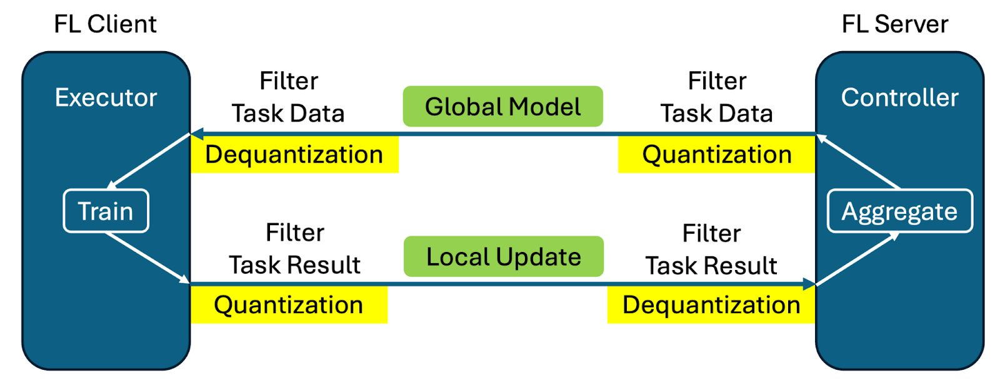
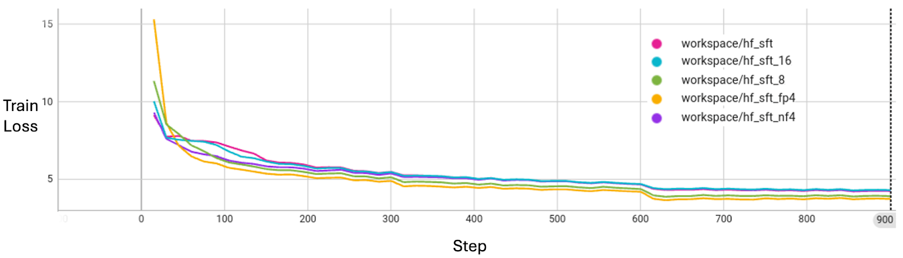
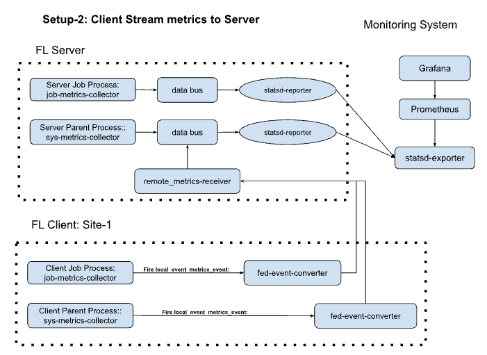

*****************************
FLARE v2.6.0 の新機能
*****************************

メッセージ量子化
================
メッセージ量子化は、送信される更新情報の精度を下げることで、フェデレーテッドラーニングにおける通信オーバーヘッドを削減するソリューションを提供します。この機能は、デフォルトの fp32 のメッセージ精度によってメッセージサイズが不必要に肥大化してしまう大規模言語モデル (LLM) において特に有効です。詳細については :ref:`メッセージ量子化 <message_quantization>` を参照してください。

主な機能:
  - 量子化および逆量子化をフィルター機構で実装
  - ユーザー側でのコード変更は不要 - 同じトレーニングスクリプトが量子化の有無にかかわらず動作します
  - トレーニングプロセスへの影響を最小限に抑えるため、トレーニングと集約は元の精度で実行
  - numpy 配列と torch Tensor の両方をサポート
  - fp32 から fp16 への変換には直接的なクロッピングとキャストを使用
  - bitsandbytes による 8 ビットおよび 4 ビット量子化

以下の表は、1B パラメータの LLM における精度ごとのメッセージサイズ (MB) を示しています。トレーニング損失曲線の整合性に関する詳細は :github_nvflare_link:`LLM の例 <examples/advanced/llm/README.md>` を参照してください。

.. table:: 量子化精度ごとのメッセージサイズ
   :widths: auto
   :align: center

   +-------------+-------------+----------------+-------------+
   | Precision   | Model Size  | Quantization   | fp32 Size   |
   |             | (MB)        | Meta Size (MB) | Percentage  |
   +=============+=============+================+=============+
   | 32-bit      | 5716.26     | 0.00           | 100.00%     |
   | (fp32)      |             |                |             |
   +-------------+-------------+----------------+-------------+
   | 16-bit      | 2858.13     | 0.00           | 50.00%      |
   | (fp16, bf16)|             |                |             |
   +-------------+-------------+----------------+-------------+
   | 8-bit       | 1429.06     | 1.54           | 25.03%      |
   +-------------+-------------+----------------+-------------+
   | 4-bit       | 714.53      | 89.33          | 14.06%      |
   | (fp4, nf4)  |             |                |             |
   +-------------+-------------+----------------+-------------+

メッセージ量子化技術を適用することで、FL は大幅な帯域幅の削減を実現できます。これは、当社の実験における教師ありファインチューニング (SFT) を用いた LLM のトレーニングでも同様です。下図に示すとおり、メッセージ量子化はトレーニング損失に関してモデルの収束品質を損なうことはありません。

ネイティブ Tensor 転送
----------------------
FLARE 2.6.0 ではネイティブ Tensor 転送のサポートが導入され、PyTorch のテンソルをシリアライズのオーバーヘッドなしに直接送信できるようになりました。これにより Tensor から Numpy への変換が不要になり、元の FPnn 形式が保持されます。この機能は現時点では PyTorch のみでサポートされています。

モデルストリーミングの強化
--------------------------
ローカルメモリ使用量の削減
~~~~~~~~~~~~~~~~~~~~~~~~~~
新しいオブジェクトコンテナストリーミング機能は、勾配のディクショナリ全体を一度にメモリ上に保持することを必要とせず、モデルを段階的に処理・送信します。これにより、大規模モデルにおけるメモリオーバーヘッドが大幅に削減されます。詳細については :class:`ContainerStreamer<nvflare.app_common.streamers.container_streamer.ContainerStreamer>` を参照してください。

例として、item-max が 1GB の 70GB モデルの場合:
  - 通常の送信: 70GB + 70GB = 140GB のメモリが必要
  - コンテナストリーミング: 70GB + 1GB = 71GB のメモリが必要

無制限のメモリストリーミングのサポート
~~~~~~~~~~~~~~~~~~~~~~~~~~~~~~~~~~~~~~
利用可能なメモリよりも大きなモデルを扱うため、ファイルベースのストリーミングが導入されました。この機能はファイルをチャンク単位で読み込むため、1 チャンク分のデータを保持できるだけのメモリしか必要としません。メモリ使用量はモデルサイズに依存せず、ファイル I/O の設定にのみ依存します。詳細については :class:`FileStreamer<nvflare.app_common.streamers.file_streamer.FileStreamer>` を参照してください。

1B モデルを送信する場合のメモリ比較:
  - 通常の送信: ピークメモリ 42,427 MB、完了時間 47 秒
  - コンテナストリーミング: ピークメモリ 23,265 MB、完了時間 50 秒
  - ファイルストリーミング: ピークメモリ 19,176 MB、完了時間 170 秒

注意: ストリーミングの強化機能は、まだ高レベル API や既存の FL アルゴリズムの Controller/Executor には統合されていません。この機能を活用するには、ユーザーがカスタムの Controller または Executor を構築できます。

構造化ロギング
--------------
構造化ロギング機能は、以下のようなお客様の課題に対応します:
  - データ可観測性ツール向けの JSON 形式ロギング
  - トレーニングログと通信ログの分離
  - 本番環境でのデバッグのための動的なログレベル変更
  - きめ細かな制御のためのパッケージレベルの階層構造

主な改善点:
  - `fileConfig <https://docs.python.org/3/library/logging.config.html>`_ から `dictConfig <https://docs.python.org/3/library/logging.config.html#logging.config.dictConfig>`_ への変更
  - 新しい FLARE Logger は、さまざまなレベルできめ細かな制御を可能にするため、ドット区切りのロガー名を用いてパッケージレベルの階層に従うように設計されています
  - すべての NVFLARE サブシステム向けの :doc:`デフォルトのロギング設定ファイル <../user_guide/admin_guide/configurations/logging_configuration>` `log_config.json.default` には、コンソールレベルのカラー、ログ、エラーログ、構造化 JSON ログ、FL トレーニングログ用のハンドラーがあらかじめ設定されています
  - FL システムを再起動せずにロギング設定を動的に変更できる :doc:`動的ロギング設定コマンド <../user_guide/admin_guide/configurations/logging_configuration>`
  - さまざまなニーズと後方互換性をサポートするため、現在は以下のデフォルトログファイルがあります:
    - log.txt: 従来の NVFLARE バージョンからのデフォルトログファイル
    - log.json: JSON 形式のログ
    - error_log.txt: エラーを素早く見つけられるように ERROR レベルのログを error_log.txt に出力
    - log_fl.txt: FL タスク固有のログ (システムおよび通信関連のログを除外し、トレーニングなどの FL タスクに関連するログを明確に表示します)
  - シミュレータ向けの定義済みロギングモード:
    - Concise (デフォルト): FL タスクのログのみ
    - Full: 従来のロギング設定
    - Verbose: デバッグレベルのロギング

詳細については、`ロギングのチュートリアル <https://github.com/NVIDIA/NVFlare/blob/2.6/examples/tutorials/logging.ipynb>`_ および :doc:`ロギングのドキュメント <../user_guide/admin_guide/configurations/logging_configuration>` を参照してください。

フェデレーテッド統計の拡張
--------------------------
分位数のサポート: フェデレーテッド統計に分位数計算が導入されました。これは、値がどのように分布しているかを示す重要なポイントを提供することで、データ分布の要約を支援します。分位数は確率分布やデータセットを等しい確率の区間に分割し、データ分布のパターンに関する洞察を提供します。詳細については :ref:`フェデレーテッド統計の概要 <federated_statistics>` を参照してください。

システムモニタリング
--------------------
FLARE モニタリングは、フェデレーテッドラーニングのジョブに対するシステムメトリクスの追跡機能を提供し、ジョブおよびシステムのライフサイクルメトリクスに焦点を当てています。StatsD Exporter を活用して FLARE のジョブおよびシステムのイベントを監視し、Prometheus でスクレイプして Grafana で可視化できます。これは、トレーニングメトリクスではなくシステムレベルのメトリクスに焦点を当てている点で、機械学習の実験管理とは異なります。詳細については :ref:`モニタリング <monitoring>` を参照してください。

Flower 連携 v2
--------------
NVFlare は、クライアントアプリを supernode プロセスから分離した最新の Flower システムアーキテクチャに対応するよう更新されました。ユーザー向けの機能はすべて従来どおりです。この更新の利点の一つは、2 つのシステム間でジョブのステータス情報をより正確に共有できるようになったことです。

この連携により、Flower で開発されたアプリケーションを、コードを一切変更することなく FLARE ランタイム上でネイティブに実行できます。Flower の広く採用されている使いやすい設計ツールおよび API と、FLARE の産業グレードのランタイムを統合することで、エンドツーエンドのデプロイパイプラインが簡素化されます。

この連携の詳細については、当社の `ブログ <https://developer.nvidia.com/blog/supercharging-the-federated-learning-ecosystem-by-integrating-flower-and-nvidia-flare>`_ を参照してください。

HTTP ドライバーの強化
---------------------
HTTP ドライバーは aiohttp を用いて全面的に書き直され、信頼性と効率性が大幅に向上しました。新しい実装は、性能の低さやネットワークエラーからの回復に関する従来の問題を解消し、GRPC および TCP ドライバーと同等の性能を実現しています。

FLARE + BioNemo 2
-----------------
NVFlare の例は `BioNeMo 2 <https://docs.nvidia.com/bionemo-framework/latest/>`_ を使用するようにアップグレードされ、下流タスクにおける大幅な性能向上が可能になりました。統合された BioNeMo ESM2 ベースモデル (650M) は、精度において顕著な向上を示しています:

細胞内局在 (SCL) 予測:
  - BioNeMo 1: 精度 0.773
  - BioNeMo 2: 精度 0.788
  - FL: 精度 0.776 から 0.817 への向上

新機能
~~~~~~
TensorBoard メトリクスストリーミングコールバック
""""""""""""""""""""""""""""""""""""""""""""""""
PyTorch Lightning 向けに、NVFlare を介してトレーニングメトリクスを FL サーバーへストリーミングするコールバックを実装し、トレーニング曲線のリアルタイム可視化を可能にしました。

下流タスクのフィッティング
~~~~~~~~~~~~~~~~~~~~~~~~~~
ローカルでのファインチューニングは過学習しやすく、トレーニング精度が早い段階で検証精度から乖離する傾向があります。これに対して、Federated Averaging (FedAvg) のモデルは継続的な性能向上を示しており、孤立したトレーニングに対するフェデレーテッドな汎化の利点が浮き彫りになっています。

詳細については、当社の :github_nvflare_link:`BioNeMo の例 <examples/advanced/bionemo>` を参照してください。

チュートリアルと教育コンテンツ
------------------------------
以下の内容をカバーする自習型トレーニングチュートリアル:
  - フェデレーテッドラーニング入門
  - フェデレーテッドラーニングシステム
  - セキュリティとプライバシー
  - フェデレーテッドラーニングの高度なトピック
  - さまざまな業界におけるフェデレーテッドラーニング

新しい例
--------
1. フェデレーテッド埋め込みモデルのトレーニング
2. オブジェクトストリーミング
3. システムモニタリング
4. 分散最適化
5. ロギングのチュートリアル

*******************************
2.6.0 への移行: 注意点とヒント
*******************************

Dashboard の変更点
------------------

NVIDIA FLARE 2.6 では、Dashboard にいくつかの変更が加えられました:

#. すべての API エンドポイントに ``/nvflare-dashboard/api/v1/`` というプレフィックスが付くようになりました。たとえば、ログインエンドポイントは ``/api/v1/login`` から ``/nvflare-dashboard/api/v1/login`` に変更されています。
   この変更は Dashboard バックエンドへのすべての API 呼び出しに影響します。クライアントアプリケーションを適宜更新してください。

#. HA モード用の overseer および追加サーバーは削除されました。プロジェクト設定にはメインサーバーの情報のみが含まれるようになりました。

#. ``FLARE_DASHBOARD_NAMESPACE`` 定数がコードベースに追加されました。すべての API エンドポイントは、このネームスペースプレフィックスを使用する必要があります。

FLARE 2.6.0 における ScriptRunner の変更点
------------------------------------------

概要
~~~~

FLARE 2.6.0 では、パイプライン全体でのデータ交換の柔軟性を高めるために、新しい `server_expected_format` パラメータが導入されました。このパラメータは現在、以下で利用可能です:
- `ScriptRunner`
- `ClientAPILauncherExecutor`
- `InProcessClientAPIExecutor`

## 従来の実装
従来、データ形式は以下によって制御されていました:
- Executor における `params_exchange_format`
- `ScriptRunner` における `framework`

これらのパラメータは、NVFlare クライアントとユーザースクリプト間の通信形式のみを定義するものでした。たとえば、`params_exchange_format` を "pytorch" に設定すると、クライアントは PyTorch のテンソルを用いてスクリプトと通信することを意味していました。

しかし、サーバーとクライアント間の通信は常に NumPy 配列に限定されていました。

新しい実装
~~~~~~~~~~

FLARE 2.6.0 では、以下がサポートされるようになりました:
1. エンドツーエンドの PyTorch テンソルパイプライン
2. 各通信境界における柔軟な形式指定
3. ネイティブな PyTorch テンソル転送

新しい `server_expected_format` パラメータは、サーバーとクライアント間の通信で使用される形式を明示的に制御します。"pytorch" に設定すると、サーバーからクライアント、スクリプトに至るまでのパイプライン全体を、形式変換なしに PyTorch テンソルで動作させることができます。

FileStreamer のワイヤープロトコルのキーネームスペース変更
----------------------------------------------------------

チャンクプロトコルを ``FileStreamer`` と新しい ``LogStreamer`` の間で共有する取り組みの一環として、
``KEY_DATA``、``KEY_DATA_SIZE``、``KEY_EOF``、``KEY_FILE_NAME`` の Shareable キーが
``"FileStreamer.*"`` ネームスペースから共有の ``"Streamer.*"`` ネームスペースへ
名称変更されました。

これはワイヤー上での破壊的変更です。異なる NVFlare バージョンで動作している送信側と受信側は、
受信側が受信 Shareable の中で期待するキーを見つけられないため、ファイルストリーミングにおいて
相互運用できません。NVFlare のデプロイではサーバーとクライアントで同じバージョンを使用する必要があるため、
サポート対象の構成には影響しませんが、段階的なロールアウトを行う場合は、
サーバーとクライアントを同時にアップグレードする必要があります。

公開された ``FileStreamer`` API (``stream_file``、``get_file_name`` など) を使用する
コードは影響を受けません。生の ``stream_ctx`` キーを文字列値で読み取っているコードのみ、
新しい ``"Streamer.*"`` という名称を使用するように更新する必要があります
(または、より望ましい方法として ``nvflare.app_common.streamers.streamer_base`` から
``KEY_*`` 定数をインポートしてください)。
