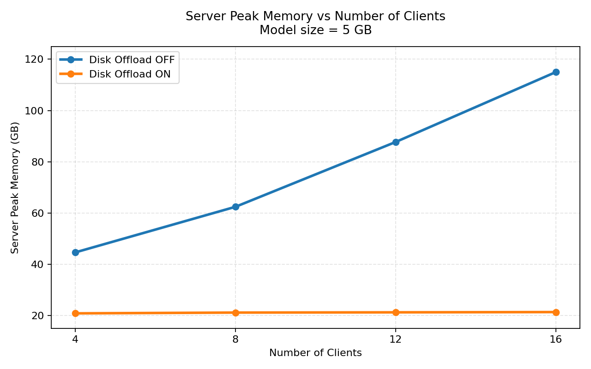

**********************************
FLARE v2.8.0 の新機能
**********************************

NVIDIA FLARE 2.8.0 は、本番環境でのフェデレーテッドラーニングを、組織・スタディ・
ランタイム環境をまたいでより運用しやすくすることに重点を置いています。本リリースでは、
Docker および Kubernetes のジョブランチャー、より幅広い自動化に適した CLI、分散
プロビジョニング、マルチスタディ対応、強化された可観測性、そして追加の本番向け堅牢化が
加わりました。さらに、マルチモーダル、言語モデル、Docker、Kubernetes、プライバシー
指向のフェデレーテッドラーニングワークフロー向けの新しいサンプルとリサーチバンドルも
追加されています。

リリースのハイライト
====================

- **モダンな NVFlare CLI**: ジョブ、システム操作、ローカル設定、スタートアップキット、
  レシピ、分散プロビジョニング、デプロイ準備に対応した ``nvflare`` コマンドグループを
  拡張し、JSON 出力とスキーマをサポートしました。これにより、オペレーターや自動化
  システムはコンソール専用の動作に依存せずに FLARE ワークフローを実行できます。
- **分散プロビジョニング**: 新しい ``nvflare cert`` および ``nvflare package``
  ワークフローにより、参加者は秘密鍵をローカルに保持したまま、Project Admin が証明書
  リクエストを承認して署名済みパッケージを生成できるようになり、組織横断デプロイに
  おけるセキュリティの所有権が向上します。
- **デプロイ準備とランタイムパッケージング**: 新しい ``nvflare deploy prepare``
  フローは、既存のスタートアップキットを Docker および Kubernetes ランタイム向けに
  パッケージ化します。AWS、Azure、GCP 上の Kubernetes 環境も対象となるため、
  プロビジョニングとランタイムパッケージングを別々の再現可能なステップとして扱えます。
- **Docker および Kubernetes のジョブランチャー**: 各サイトは、プロセス、Docker、
  Kubernetes のいずれかのジョブランチャーを設定できます。対応するランチャーを設定すると、
  ホストベースのジョブはサブプロセスとして、Docker ベースのジョブはジョブコンテナとして、
  Kubernetes ベースのジョブは個別のジョブ Pod として実行されます。これにより、本番
  サイトは Docker/Kubernetes の分離とリソース管理に加え、より強固なデータ分離のための
  スタディスコープのデータセットマウントを利用できます。
- **マルチスタディ対応**: ``project.yml`` でのスタディ定義、スタディスコープの
  セッション、スタディを認識する管理操作、そしてスタディ CLI コマンドにより、1 つの
  FLARE デプロイで複数のコラボレーションをホストしても、参加者、認可、データアクセス、
  運用コンテキストが混在しないようになります。
- **ライブログストリーミング**: ジョブの実行中にサイトログとジョブログがサーバーへ
  ストリーミングされるため、リモートの学習失敗を診断するまでの時間が短縮され、CLI
  自動化の応答性も向上します。
- **セキュリティと本番向け堅牢化**: 発信元にバインドされた認証トークン、より安全な
  アーカイブ処理、より厳格な秘密鍵ファイルのパーミッション、安全なロードパス、強化された
  ジョブメタデータ検証、追加のダッシュボード/API 堅牢化により、フェデレーテッド
  デプロイにおける一般的な運用リスクを低減します。
- **フィーチャーエレクション**: 新しいフェデレーテッド特徴選択ワークフローにより、
  クライアントはテーブル形式データセットに対してローカルな特徴選択を行い、生データでは
  なく特徴スコアを共有できます。これにより FLARE は、後段の学習で利用できるグローバルな
  特徴マスクを集約できます。
- **FedAvg 向けテンソルディスクオフロード**: ``enable_tensor_disk_offload=True``
  を有効にすると、FedAvg の集約時におけるサーバーのピークメモリを大幅に削減できます。
  すべてのクライアントのテンソル更新を同時にメモリ上に保持するのではなく、各更新を
  ディスク上の一時 safetensors ファイルに書き出し、集約中に遅延的に読み込みます。
  この効果はモデルサイズとクライアント数に応じて拡大します。
- **大規模モデルのストリーミング信頼性**: 遅延した EOF 応答の後に多数のクライアントが
  リトライする場合でも、大規模テンソルのブロードキャストがより堅牢になりました。完了済みの
  ダウンロード参照は冪等に処理され、サブプロセスの Client API ジョブは、1 回の遅い転送を
  大規模モデルの繰り返しリトライに変えてしまう可能性のある、無制限な結果再送や
  ダウンロード完了待ちの欠如を拒否するようになりました。
- **新しいサンプルとコントリビュートされたリサーチ**: MedGemma、Qwen3-VL、Codon-FM、
  FedUMM、金融サービスの不正検知、Docker ジョブのサンプル、分散プロビジョニングの
  サンプル、Hello JAX、Hello ログストリーミングにより、チームは本番向け・研究向け
  ワークフローをゼロから組み立てるのではなく、動作するパターンから始められます。

NVFlare CLI と自動化
====================

FLARE 2.8.0 では、公開されている ``nvflare`` コマンドラインの範囲が大幅に拡張されました。
CLI は、より一貫したコマンド構成、機械可読な出力のサポート、そしてスクリプトや自動化
システム向けのより優れたエラーコントラクトを備えています。

これが本番運用にとって重要なのは、同じインターフェースを人間、シェルスクリプト、
サービス自動化、その他のツールが一貫して利用できるようになるためです。ジョブ、
システムステータス、スタートアップキットの選択、レシピ、プロビジョニング、デプロイ準備を、
手動のコンソール操作を必要とせずに構造化された形で照会できます。

主な追加点は、ジョブ操作、システム操作、ローカル設定、レシピ探索、分散プロビジョニング、
パッケージ組み立て、デプロイ準備のためのコマンドグループです。多くのコマンドが構造化
出力とスキーマ探索をサポートするようになり、スクリプト、ノートブック、運用ツールでの
利用が容易になりました。

詳細は :ref:`nvflare_cli`、:ref:`job_cli`、:ref:`system_command`、
:ref:`config_command`、:ref:`recipe_command` を参照してください。

実践的な CLI ワークフローについては、
:github_nvflare_link:`NVFlare CLI チュートリアル <examples/tutorials/nvflare_cli.ipynb>`
を参照してください。

デプロイとプロビジョニング
==========================

分散プロビジョニング
--------------------

FLARE 2.8.0 では、参加者が集中型のプロビジョナーからすべてのスタートアップキット素材を
受け取るのではなく、ローカルで秘密鍵と証明書署名要求を生成するケース向けに、分散
プロビジョニングワークフローを導入しました。

これは組織横断のコラボレーションにとって重要です。秘密鍵を Project Admin が生成したり、
組織間で転送したりする必要がなくなるためです。各参加者は自身の鍵素材を作成・保持でき、
鍵の取り扱いリスクを低減しながら、Project Admin は引き続き承認、署名済みパッケージ、
ルート CA の信頼を管理します。既存の集中型プロビジョニングモデルを好むチームは、
そのまま利用を継続できます。

このワークフローには、参加者側の証明書リクエスト、Project Admin による承認、署名済み
パッケージの生成、ルート CA の検証、承認済みパッケージからのスタートアップキット組み立てが
含まれます。鍵の所有権と参加者主導の証明書リクエストが重要となるデプロイを想定しています。

:ref:`distributed_provisioning`、:ref:`cert_command`、:ref:`package_command`
を参照してください。

実行可能な手順の解説は、
:github_nvflare_link:`分散プロビジョニングのサンプル <examples/advanced/distributed_provision>`
を参照してください。

Deploy Prepare
--------------

新しい ``nvflare deploy prepare`` コマンドは、プロビジョニング済みの既存スタートアップ
キットを Docker や Kubernetes といったランタイムターゲット向けにパッケージ化します。
これによりスタートアップキットの生成とランタイム固有のパッケージングが分離され、
ローカル、Docker、Kubernetes、および AWS、Azure、GCP などのクラウドマネージド
Kubernetes 環境をまたいでデプロイの再現性が高まります。

この分離は運用上有用です。同じプロビジョニング済みアイデンティティを、ランタイム固有の
パッケージングフローで再利用できるためです。チームはスタートアップキットを一度準備すれば、
プロビジョニングモデルを変更せずに Docker や Kubernetes のアーティファクトを生成できます。

Docker および Kubernetes ランタイムの準備については、:ref:`deploy_prepare_command`
ユーザーガイドを参照してください。

Docker および Kubernetes でのジョブ実行
---------------------------------------

FLARE 2.8.0 では Docker および Kubernetes のジョブランチャーが追加され、各サイトは
すでに利用しているランタイムの分離機構やリソース制御に FLARE ジョブを合わせられます。
各サイトには、意図するランタイムに対応するジョブランチャーを設定する必要があります。
そのランチャーを設定した場合のパターンは次のとおりです。

- ホストベースの親に対するプロセスジョブランチャー: ジョブはサブプロセスとして実行されます。
- Docker ベースの親に対する Docker ジョブランチャー: ジョブは Docker コンテナとして
  実行されます。
- Kubernetes ベースの親 Pod に対する Kubernetes ジョブランチャー: ジョブは個別の
  Kubernetes ジョブ Pod として実行されます。

これが重要なのは、Docker および Kubernetes のデプロイが、すべてのジョブをローカルの
サブプロセスとして扱うのではなく、それぞれのランタイム分離を利用できるようになるためです。
スタディとデータセットのマッピングもコンテナや Pod に引き継がれるため、各ジョブは自身の
スタディスコープに設定されたデータセットのみを参照でき、スタディ横断のデータ露出が
低減されます。

ハイライト:

- Kubernetes ジョブランチャーを設定すると、Kubernetes デプロイは個別の Pod で
  ジョブを起動できます。
- Docker ジョブランチャーを設定すると、Docker デプロイは個別のコンテナとしてジョブを
  起動できます。
- スタディとデータセットのマッピングにより、Docker コンテナと Kubernetes ジョブ Pod に
  スタディスコープのデータ分離が提供されます。
- CPU、メモリ、ストレージ、GPU の要件を Docker または Kubernetes のリソース管理に
  委譲できます。
- Kubernetes のジョブワークスペース転送は、共有のジョブ PVC に依存しなくなりました。
- ランタイムパッケージング、Helm チャートの更新、Docker ジョブのサンプル、マルチクラウド
  Kubernetes サポート、Brev のスクリプト化デプロイガイドにより、これらのモードを
  AWS、Azure、GCP 環境で試したり運用したりしやすくなっています。

デプロイの詳細は、:ref:`deploy_prepare_command` ユーザーガイドおよび
:ref:`helm_chart` Kubernetes デプロイガイドを参照してください。その他の参考資料として
:ref:`containerized_deployment`、:ref:`brev_deployment`、
:ref:`brev_scripted_deployment` があります。

``nvflare deploy prepare`` を使った実行可能な Docker ワークフローは、
:github_nvflare_link:`Docker ジョブランチャーのサンプル <examples/docker>`
を参照してください。

マルチスタディとランタイム運用
==============================

マルチスタディ対応
------------------

FLARE 2.8.0 では、スタディを認識するデプロイと管理のサポートが追加されました。単一の
デプロイで複数のスタディを定義でき、それぞれが独自の参加サイトと管理ロールのマッピングを
持てます。

これは、同じ FLARE インフラ上で複数のコラボレーションを運用する組織にとって重要です。
スタディスコープにより、参加者のメンバーシップ、認可、管理セッション、運用コマンドが
意図したコラボレーションに紐づけられ、スタディ間の混同や誤ったアクセスのリスクが
低減されます。

この機能は、1 つのデプロイで複数のプロジェクトやコンソーシアムをサポートしつつ、各
スタディの参加者、権限、セッション、コマンド、データアクセスをそのスタディにスコープ
限定することを目的としています。スタディのサポートは、管理ワークフロー、CLI ワークフロー、
FLARE API、本番環境、およびローカルの PoC 開発で利用できます。

設計と構成の詳細は :ref:`multi_study_guide` を、ランタイム管理については
:ref:`study_command` を参照してください。

ライブログストリーミング
------------------------

FLARE は、ジョブの実行中にクライアントからサーバーへジョブログをストリーミングできる
ようになりました。オペレーターはジョブの終了を待たずに、サーバー側のファイルや CLI
コマンドを通じてログを確認できます。

これにより、特にリモートや長時間の学習実行時において、本番ジョブのフィードバックループが
短縮されます。オペレーターは最終的なジョブアーティファクトを待つことなく、実行中に障害、
進捗、サイト固有の挙動を追跡できます。

オペレーターは CLI を通じてジョブログを取得またはフォローでき、ログストリーミングの
挙動をサイト単位で制御できます。これは、リモートジョブのデバッグと本番監視が、各
クライアントマシンへの手動アクセスに依存しないようにすることを目的としています。

:ref:`live_log_streaming` と :ref:`site_config` を参照してください。

実行可能なジョブのサンプルは、
:github_nvflare_link:`Hello ログストリーミング <examples/hello-world/hello-log-streaming>`
を参照してください。

レシピ、API、ML 機能
====================

2.8.0 は 2.7.x からの Recipe API と Client API の方向性を継続し、ワークフローの
カバレッジ拡大と本番向け修正を加えています。これらの変更により、レシピおよび API ベースの
ワークフローを、スタディを認識する環境で自動化、監視、運用しやすくなります。

ハイライトには、スタディを認識する API 挙動の改善、レシピ実行管理の向上、Flower 連携の
更新、FedAvg と PyTorch ワークフロー処理の強化、XGBoost と SVTPrivacy の修正、
そして Python 3.10 から 3.14 に合わせたサポートが含まれます。

:ref:`job_recipe`、:ref:`available_recipes`、:ref:`flare_api`、
:ref:`api_evolution` を参照してください。

チュートリアルのサンプルは、
:github_nvflare_link:`Hello FLARE API ノートブック <examples/tutorials/flare_api.ipynb>`
および :github_nvflare_link:`Job Recipe ノートブック <examples/tutorials/job_recipe.ipynb>`
を参照してください。

フィーチャーエレクション
------------------------

FLARE 2.8.0 では、テーブル形式データセット向けのフェデレーテッド特徴選択ワークフローで
あるフィーチャーエレクションが追加されました。クライアントはローカルで特徴選択を行い、
生データではなく選択された特徴とスコアを共有します。FLARE はその結果を集約して、後段の
フェデレーテッド学習に利用できるグローバルな特徴マスクを作成します。

実行可能なワークフローは、
:github_nvflare_link:`フィーチャーエレクションのサンプル <examples/advanced/feature_election>`
を参照してください。

大規模モデルと LLM ワークフロー
===============================

FLARE 2.8.0 は 2.7.2 での大規模モデル対応を土台に、追加のテンソルオフロード、実行単位に
スコープされた一時ファイルのクリーンアップ、大容量転送のタイムアウトに関するガイダンスの
改善、そして新しいサンプルのカバレッジを追加しています。

これらの改善により、大規模モデルの FL ジョブをより厳しいメモリおよびランタイム制約の下で
運用しやすくなり、新しいサンプルはマルチモーダルおよび言語モデルのワークロードに対する
具体的な出発点をチームに提供します。

大規模モデルのストリーミング信頼性
----------------------------------

ストリーミング層は、正常に完了したダウンロード参照に対する遅延リトライを、致命的な
参照欠落エラーではなく冪等な終端応答として扱うようになりました。これは、クライアントが
ダウンロードを完了しているにもかかわらず、ネットワークやサーバー側の競合により最終的な
EOF 応答が遅延したためにリトライする、高ファンアウトな大規模モデルのブロードキャストに
対処するものです。

この修正は ``DownloadService`` 層に適用されるため、FedAvg、Client API のサブプロセス
ジョブ、テンソルディスクオフロード、あるいは同じストリーミング経路の上に構築された他の
機能のいずれに由来するかにかかわらず、大容量ペイロードの転送に効果があります。
トランザクションのタイムアウトや明示的な削除によるクリーンアップは、引き続き無効な参照
エラーを返します。遅延した終端リトライのためにトゥームストーン化されるのは、正常に完了した
トランザクションのみです。

サブプロセスの Client API ジョブは、リスクのあるリトライ設定をより早い段階で検証する
ようにもなりました。特に、``ClientAPILauncherExecutor`` ジョブでは
``max_resends=None`` が拒否されるようになりました。無制限の再送は大容量ダウンロード
トランザクションの無限列を生み出す可能性があるためです。また
``download_complete_timeout=None`` も拒否されます。サーバーがサブプロセスから
テンソルを引き出し終えるまで、サブプロセスは生存し続ける必要があるためです。大規模
ストリーミングのリクエストタイムアウトを明示的に設定したジョブでは、関連する
パイプ/ダウンロード完了のタイムアウトが設定済みのストリーミングタイムアウトより短い場合に
警告が出るようになりました。レシピが生成する外部プロセスジョブは、上限のある
``max_resends=3`` というデフォルト値を executor の引数にシリアライズし、トップレベルの
``recipe.add_client_config({"max_resends": N})`` による上書きは、サブプロセスの
Client API 設定が書き出される前に適用されます。

サーバーメモリ: テンソルディスクオフロード
------------------------------------------

FLARE 2.8.0 では PyTorch の FedAvg ジョブ向けにテンソルディスクオフロードが導入され、
集約時のサーバーのピークメモリを大幅に削減します。すべてのクライアントのテンソル更新を
同時にメモリ上に保持するのではなく、各更新をディスク上の一時 safetensors ファイルに
書き出し、遅延的に読み込みます。この効果はモデルサイズとクライアント数に応じて拡大します。

5 GB のモデルでの計測では、テンソルディスクオフロードによりクライアント数が増えても
サーバーのピークメモリはほぼ横ばいに保たれる一方、インメモリの集約経路ではクライアント
更新数に応じて増加することが示されています。

有効化するには、``FedAvgRecipe`` または ``FedAvg`` コントローラーで
``enable_tensor_disk_offload=True`` を設定します。FLARE 2.8.0 では、この
ディスクバックのテンソル経路は FedAvg ワークフローでストリーミングされる PyTorch
テンソルに対して利用できます。

デプロイ時の注意: 一時ファイルはサーバープロセスの一時ディレクトリ(``TMPDIR``
または ``/tmp`` などの OS のデフォルト)を使用します。コンテナや Kubernetes では
``/tmp`` が RAM ベース(``tmpfs``)であることが多く、その場合メモリ削減の効果は
失われます。サーバーを起動する前に ``TMPDIR`` をディスクバックのマウント先に
向けてください。デプロイのガイダンスは :ref:`notes_on_large_models` を参照してください。

設定の詳細は :doc:`/programming_guide/tensor_downloader` および
:doc:`/programming_guide/memory_management` を参照してください。

対応するサンプルには、
:github_nvflare_link:`BioNeMo <examples/advanced/bionemo>`、
:github_nvflare_link:`Qwen3-VL <examples/advanced/qwen3-vl>`、
:github_nvflare_link:`MedGemma <examples/advanced/medgemma>`、
:github_nvflare_link:`Codon-FM <examples/advanced/codon-fm>` があります。

セキュリティと堅牢化
====================

本リリースには、セキュリティ、検証、運用面の堅牢化に関する幅広い変更が含まれています。

重点は、ジョブ、スタートアップキット、アーカイブ、資格情報、管理/API トラフィックが
組織の境界をまたぐ環境において、デプロイのリスクを低減することにあります。

主な領域には、ランタイム認証バインディングの強化、より安全なアーカイブおよびパスの検証、
より厳格な秘密鍵ファイルのパーミッション、より安全なデシリアライズとサブプロセス処理、
コンフィデンシャルコンピューティングのアテステーション堅牢化、ダッシュボード/API の
堅牢化、そして管理およびジョブ操作におけるより明確なエラー挙動が含まれます。

信頼性とバグ修正
================

これらの変更は、ジョブの状態、起動、リソースの可視性、障害報告を、ローカル、Docker、
Kubernetes、サーバー接続の各ワークフローにわたってより予測可能にすることで、日々の
運用性を向上させます。

注目すべき改善点には、より一貫したジョブステータスの公開、存在しないジョブや実行中の
ジョブに対するより明確なエラー、より信頼性の高い起動とログストリーミングの挙動、Docker と
Kubernetes のランタイム修正、より優れた GPU 可視性の処理、よりクリーンなクライアント
障害報告、終了イベントがスキップされた場合のペア期間モニタリング指標の修正、そして
刷新された統合テストと CI のカバレッジが含まれます。

新しいサンプルとリサーチ
========================

2.8.0 では、幅広いサンプルとコントリビュートされたリサーチ実装が追加・更新されました。

これらの資産が重要なのは、新しいプラットフォーム機能を、コンテナ化された運用、
マルチモーダルモデル、金融サービス、プライバシー指向の研究といった具体的な領域で FLARE を
評価するチームにとって、実行可能な出発点に変えるためです。

2.8.0 におけるリサーチの更新は次のとおりです。

- :github_nvflare_link:`FedUMM <research/fedumm>`: 統合マルチモーダルモデル向けの
  新しいフェデレーテッドラーニング実装。マルチモーダル基盤モデルのワークフローに向けて、
  パラメータ効率の高い LoRA アダプタのフェデレーションを利用します。
- :github_nvflare_link:`金融サービスの不正検知 <research/fsi-fraud-detection>`:
  合成的な決済トランザクション生成、異種のサイト構成、フェデレーテッドアナリティクス、
  フェデレーテッド学習、解釈可能性、差分プライバシーの実験を備えた、新しい
  プライバシー保護型のフェデレーテッド不正検知実装。
- 既存の :github_nvflare_link:`FedBPT <research/fed-bpt>` リサーチが、FLARE
  ジョブの実行およびエクスポート用の Job API エントリポイントで更新されました。

サンプルとリサーチ資産には次のものが含まれます。

- :github_nvflare_link:`Hello JAX <examples/hello-world/hello-jax>`
- :github_nvflare_link:`Hello ログストリーミング <examples/hello-world/hello-log-streaming>`
- :github_nvflare_link:`Docker でのジョブ実行 <examples/docker>`
- :github_nvflare_link:`分散プロビジョニング <examples/advanced/distributed_provision>`
- :github_nvflare_link:`フィーチャーエレクション <examples/advanced/feature_election>`
- :github_nvflare_link:`MedGemma <examples/advanced/medgemma>`
- :github_nvflare_link:`Qwen3-VL <examples/advanced/qwen3-vl>`
- :github_nvflare_link:`Codon-FM <examples/advanced/codon-fm>`
- :github_nvflare_link:`FedUMM <research/fedumm>`
- :github_nvflare_link:`金融サービスの不正検知 <research/fsi-fraud-detection>`

互換性と移行に関する注意
========================

- Python 3.9 はサポート対象の開発ターゲットとして掲載されなくなりました。FLARE 2.8.0 は
  Python 3.10、3.11、3.12、3.13、3.14 を対象としています。
- 非推奨であった FLAdminAPI は削除されました。新しい自動化には FLARE API、Recipe
  環境、``nvflare`` CLI ワークフローを使用してください。
- HA/Overseer のコードは 2.8 ブランチから削除されました。

2.7 からのクラス許可リストの移行
--------------------------------

NVFLARE 2.8 では、非 BYOC ジョブに対する組み込みのコンポーネントクラス認可が追加
されました。``resources.json`` または ``resources.json.default`` から
``class_allow_list`` が省略されている場合、NVFLARE は組み込みコンポーネントクラスの
厳選されたデフォルトリストを使用します。隣接する ``class_list_enforcement_mode``
設定は ``"enforce"`` または ``"warn"`` を受け付け、省略時は ``"enforce"`` が
既定となります。したがって、両方の設定を省略すると、組み込みリストが enforce モードで
使用されます。

BYOC が有効なユーザーおよびジョブは、2.7 と同じ動作を維持します。BYOC ジョブでは組み込みの
クラス許可リストチェックがスキップされるため、これらの設定はジョブが提供するどのクラスを
ロードできるかを変更しません。

コンポーネントの信頼境界を誰が所有するか、そしてアプリケーションがまだどれだけの探索を
必要とするかに応じて、移行パスを選択してください。

1. **カスタムコンポーネントを持つアップグレード利用者: 組み込みデフォルトリスト + warn、
   その後レビュー済みプレフィックス + enforce。** まず ``class_allow_list`` を省略して
   組み込みデフォルトを有効なままにし、``class_list_enforcement_mode`` を
   ``"warn"`` に設定します。代表的なジョブを実行し、一致しなかったカスタムクラスに関する
   警告を読み、それらのクラスをレビューします。その後、必要な組み込みエントリに加えて、
   レビュー済みのカスタムクラスまたはパッケージのプレフィックスを含む明示的なリストを
   設定し、モードを ``"enforce"`` に切り替えます。このパスでは、オペレーターが最小権限の
   ポリシーを構築する間もアプリケーションを実行し続けられます。

   .. code-block:: json

       {
           "format_version": 2,
           "class_list_enforcement_mode": "warn"
       }

2. **信頼境界を所有するオペレーター: ワイルドカード + いずれのモードでも可。**
   サイトのオペレーターがすべてのコンポーネントクラスを意図的に受け入れる場合は、
   ``class_allow_list`` を ``["*"]`` に設定します。ワイルドカードが存在する場合、
   適用モードは無関係です。他のすべてのリストエントリは無視され、オペレーターが無制限の
   ポリシーを選択したことと、そのポリシーの出所を示す監査イベントが記録されます。

   .. code-block:: json

       {
           "format_version": 2,
           "class_allow_list": ["*"]
       }

3. **ロックダウンされた本番環境: 厳選されたプレフィックス + enforce。** サイトが必要と
   する、レビュー済みの組み込みクラスおよびアプリケーションクラス、またはパッケージ
   プレフィックスのみを設定し、``"enforce"`` を使用します。明示的に設定されたリストは
   組み込みデフォルトを置き換えるため、必要な組み込みエントリは厳選リストにコピーして
   ください。末尾の ``.`` はパッケージ全体を認可し、末尾に付けないエントリは完全修飾の
   クラスパスを表します。

   .. code-block:: json

       {
           "format_version": 2,
           "class_list_enforcement_mode": "enforce",
           "class_allow_list": [
               "nvflare.app_common.workflows.scatter_and_gather.ScatterAndGather",
               "my_app.executors.CustomExecutor",
               "my_app.filters."
           ]
       }

``"warn"`` は 2.8 の保護を緩めるものであり、信頼できる移行環境での探索ステップとしてのみ
使用してください。``"*"`` は、コンポーネントの信頼境界をこの許可リストチェックの外側に
置くという明示的な判断です。サイトのオペレーターがその責任を受け入れる場合にのみ使用して
ください。明示的に設定された不正な形式の ``class_allow_list`` は、いずれの適用モードでも
非 BYOC ジョブにとって設定エラーのままです。監査サービスが一時的に利用できない場合、
監査の書き込みは後続の該当するコンポーネントチェック時にリトライされます。シミュレーターの
実行では、監査機構が no-op であるため警告ログが使用されます。

API と設定の移行に関する追加の注意事項は :ref:`migration_guide` を参照してください。

はじめかた
==========

新しい 2.8.0 のワークフローを試すには:

- 基本的な FLARE の実行は :ref:`quickstart` から始めてください。
- 現在の CLI コマンド群については :ref:`nvflare_cli` を使用してください。
- 参加者が管理する証明書と署名済みスタートアップキットのパッケージングには
  :ref:`distributed_provisioning` を使用してください。
- Docker および Kubernetes のランタイムパッケージングには
  :ref:`deploy_prepare_command` を使用してください。
- マルチテナントのデプロイ構成には :ref:`multi_study_guide` を使用してください。
- :ref:`available_recipes` および ``examples/hello-world`` と
  ``examples/advanced`` 配下の新しいサンプルをご覧ください。
