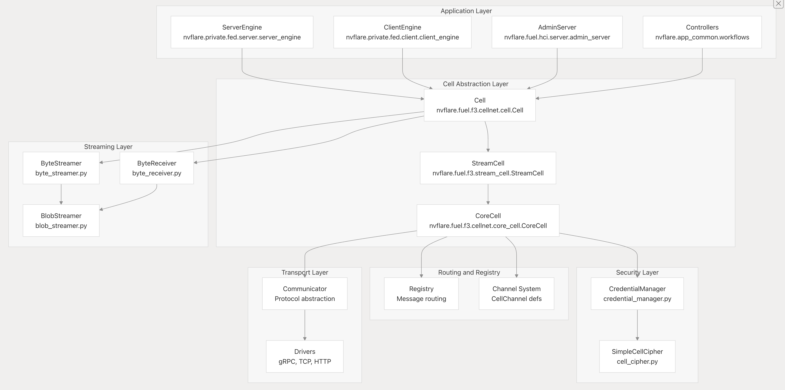

.. _cellnet_architecture:

##############################
CellNet アーキテクチャ
##############################

目的と適用範囲
##############

CellNet は FLARE の統一通信レイヤーであり、分散されたフェデレーテッドラーニングの
コンポーネント間で、セキュアかつスケーラブルなメッセージングを提供します。ネットワーク
トランスポートの詳細を抽象化し、小さなメッセージと大容量データ転送の双方に対して一貫した
API を提供します。

NVFLARE アーキテクチャにおける位置づけ: CellNet は、アプリケーション層(Controller、
Executor、管理コマンド)とネットワークトランスポート層(gRPC、TCP、HTTP のドライバー)の
間に位置します。次のものを含め、すべての NVFLARE コンポーネントは CellNet を通じて
通信します。

- **サーバーからクライアントへのタスク配布**
- **クライアントからサーバーへの結果送信**
- **ピアツーピア通信**
- **管理コマンドの実行**
- **サイト間の補助通信**
- **ジョブのデプロイと管理**

主要な設計目標
##############

- **統一された API**: 小さなメッセージと大容量データストリームの双方に対する単一の
  インターフェース
- **トランスポート非依存**: 複数のネットワークプロトコル(gRPC、TCP、HTTP)をサポート
- **階層的なアドレッシング**: 多階層のセル階層に対応した FQCN ベースのルーティング
- **セキュアな通信**: 暗号化と認証を標準で内蔵
- **フロー制御**: 大容量転送に対する自動チャンク分割とフロー制御

3 層アーキテクチャ
##################

- **CoreCell**: 基本的なメッセージルーティング、接続管理、セキュリティ
- **StreamCell**: チャンク分割とフロー制御を備えた大容量データのストリーミング
- **Cell**: チャネルの自動判別を伴う高レベルなリクエスト/リプライのパターン

階層化されたセルアーキテクチャ
##############################

3 層設計
^^^^^^^^^

CellNet アーキテクチャは 3 つの層で構成され、それぞれが前の層を拡張しています。

**レイヤー 1: CoreCell** - 基本的なメッセージ基盤

CoreCell は、基礎となるメッセージング基盤を提供します。

**主な責務**:

- **メッセージ処理** - チャネル/トピックに基づいて、適切なハンドラーへメッセージを
  ルーティングします
- **接続管理** - リスナー(受信側)とコネクター(送信側)を管理します
- **コールバックレジストリ** - メッセージハンドラーを ``req_reg: Registry`` に格納します
- **エージェントの追跡** - リモートセル用に ``agents: Dict[str, CellAgent]`` を
  維持します
- **リクエストの追跡** - 処理待ちのリクエストを ``waiters: Dict[str, _Waiter]`` で
  追跡します
- **セキュリティ** - 暗号化を ``credential_manager: CredentialManager`` に委譲します

**中核となるメソッド**:

- **send_request** (channel, target, topic, request, timeout, ...) - メッセージを
  送信し、リプライを待ちます
- **fire_and_forget** (channel, topic, targets, message, ...) - 待たずに送信します
- **broadcast_request** (channel, topic, targets, request, ...) - 複数のターゲットへ
  送信します
- **register_request_cb** (channel, topic, cb, ...) - チャネル/トピックに対する
  コールバックを登録します

**レイヤー 2: StreamCell** - 大容量データ転送

StreamCell は、CoreCell の上に大容量データ転送の機能を追加します。

**主要なコンポーネント**:

- **cell**: CoreCell - 基本的なメッセージングのためにラップされた CoreCell
- **byte_streamer**: ByteStreamer - データをチャンク化されたストリームとして送信します
- **byte_receiver**: ByteReceiver - チャンクを受信して再構成します
- **blob_streamer**: BlobStreamer - インメモリの BLOB 向けに最適化されています

**ストリーミングのメソッド**:

- **send_stream** (channel, topic, target, message, ...) - フロー制御付きでバイト
  ストリームを送信します
- **send_blob** (channel, topic, target, message, ...) - BLOB(メモリに収まるもの)を
  送信します
- **register_stream_cb** (channel, topic, stream_cb, ...) - ストリームの受信側を
  登録します
- **register_blob_cb** (channel, topic, blob_cb, ...) - BLOB の受信側を登録します

**ストリーミングプロトコル**:

- 設定可能なチャンクサイズ(デフォルトは 1MB)への自動チャンク分割
- スライディングウィンドウと ACK によるフロー制御
- StreamFuture による進捗の追跡

**レイヤー 3: Cell** - インテリジェントなリクエスト/リプライ

**Cell** クラスは、ストリーミングと非ストリーミングのメッセージに対する統一された
インターフェースを提供します。

**主な特徴**:

1. **動的なメソッドディスパッチ**:

- メソッド呼び出しをインターセプトし、``_is_stream_channel()`` によってそのチャネルが
  ストリーミングを必要とするかどうかを確認します
- 適切な実装へルーティングします:

  - ストリームチャネル → ``_broadcast_request()``、``_send_request()`` など
  - 非ストリームチャネル → ``core_cell.broadcast_request()`` など

2. **チャネルの分類**:

**除外されるチャネル** (非ストリーミング):

- ``CellChannel.CLIENT_MAIN`` - 管理コマンド
- ``CellChannel.SERVER_MAIN`` - タスク配布
- ``CellChannel.RETURN_ONLY`` - 内部リプライ
- ``CellChannel.CLIENT_COMMAND`` - クライアントコマンド
- その他の内部チャネル

3. **リクエストの追跡**:

- 処理待ちのリクエスト用に ``requests_dict: Dict[str, SimpleWaiter]`` を維持します
- ``SimpleWaiter`` がリクエストの状態と受信の進捗を追跡します
- リプライの処理は ``_process_reply()`` を通じて行われます

4. **コールバックの適応**:

- ``Adapter`` クラスが、アプリケーションのコールバックをストリーミング向けにラップします
- ストリームペイロードのエンコード/デコードを処理します
- ``RETURN_ONLY`` チャネル経由でリプライを返送します

5. **FQCN: 完全修飾セル名(Fully Qualified Cell Name)**:

すべてのセルは、ドット区切りの階層的な名前である完全修飾セル名(FQCN)によって識別されます。

``<site_name>[.<job_id>[.<rank>]]``

6. **エンドツーエンドの暗号化**: すべてのメッセージは、セキュアな通信のために暗号化できます。

メッセージの構造とアドレッシング
################################

チャネルとトピックによるアドレッシング
^^^^^^^^^^^^^^^^^^^^^^^^^^^^^^^^^^^^^^

F3 CellNet は、チャネルとトピックという 2 段階のアドレッシング方式でメッセージを
ルーティングします。これはメッセージヘッダーに格納されます。

.. list-table:: **定義済みのチャネル**
   :header-rows: 1
   :widths: 35 25 40

   * - 定数
     - 値
     - 用途
   * - CellChannel.CLIENT_MAIN
     - "admin"
     - 管理コマンド
   * - CellChannel.SERVER_MAIN
     - "task"
     - タスク配布
   * - CellChannel.AUX_COMMUNICATION
     - "aux_communication"
     - アプリケーション定義
   * - CellChannel.RETURN_ONLY
     - "return_only"
     - 内部リプライのルーティング
   * - CellChannel.SERVER_COMMAND
     - "server_command"
     - サーバーコマンド

通信パターン
^^^^^^^^^^^^
- **リクエスト-リプライパターン** -- リクエストを送信し、リプライを待ちます
- **ファイアアンドフォーゲットパターン** -- リプライを待たずにメッセージを送信します
- **ブロードキャストパターン** -- 複数のターゲットへ送信します

ストリーミングコンポーネントの概要
##################################

ストリーミングのシステムは、送信側コンポーネント、受信側コンポーネント、そしてストリームの
抽象化に整理されています。

主要なストリーミングクラス:

.. list-table:: **主要なストリーミングクラス**
   :header-rows: 1
   :widths: 25 40

   * - クラス
     - 用途
   * - ByteStreamer
     - バイトストリームをチャンクとして送信します
   * - ByteReceiver
     - チャンクを受信して再構成します
   * - BlobStreamer
     - ストリーミングのために blob をラップします
   * - TxTask
     - ストリームごとの送信タスク
   * - RxTask
     - ストリームごとの受信タスク

パフォーマンスと統計
####################

CellNet には、監視とデバッグのための包括的な統計収集機能が含まれています。
統計は ``StatsPoolManager`` を通じて収集され、操作の種類とセルの FQCN ごとの
カテゴリに分類されます。
