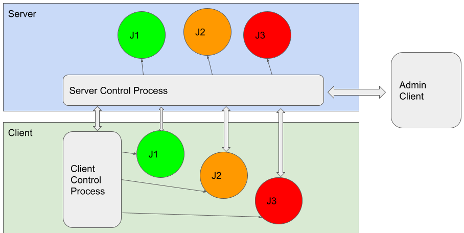
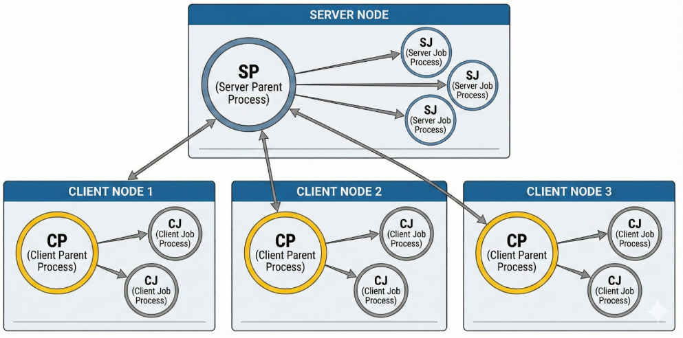
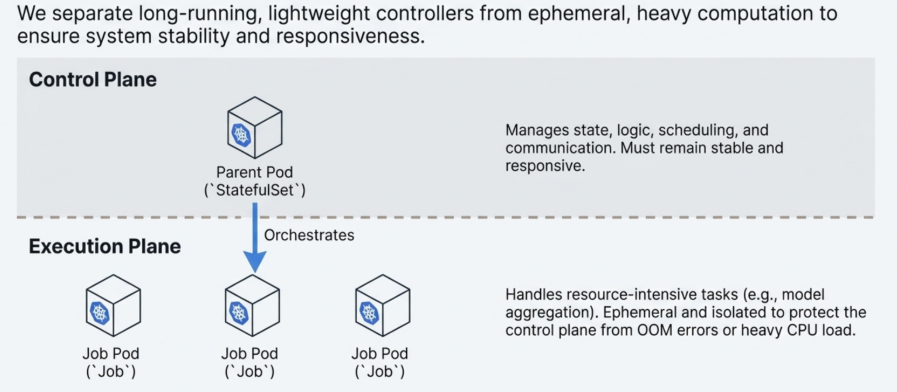
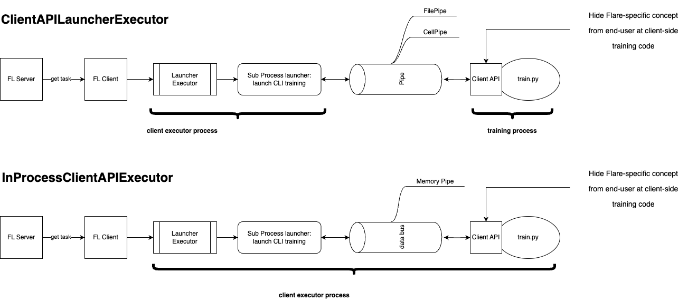

.. _flare_system_architecture:

####################
FLARE アーキテクチャ
####################

.. image:: ../resources/flare_overview.png
   :alt: Architecture Overview
   :height: 400

目的と適用範囲
==============

本ドキュメントでは、NVIDIA FLARE の全体的なシステムアーキテクチャについて、主要なサブシステム、プロセスモデル、
コンポーネント間の相互作用を含めて説明します。分散した参加者間でフェデレーテッドラーニングのワークロードを
このプラットフォームがどのようにオーケストレーションするかを、技術的な観点から概説します。

個別のサブシステムに関する詳細情報は、以下を参照してください。

- 通信インフラストラクチャ: :ref:`cellnet_architecture` を参照
- プロビジョニングとデプロイメント: :ref:`provisioning` を参照
- セキュリティ: :ref:`flare_security_overview` を参照

アーキテクチャの概要
====================

NVIDIA FLARE は、マルチプロセスかつコンポーネントベースのアーキテクチャを持つ分散フェデレーテッドラーニング
プラットフォームです。システムは、ユーザーインタラクション、プロビジョニング、ランタイム実行、通信、
ストレージという明確なレイヤーに整理されています。

FLARE アーキテクチャは、次の 3 つの主要レイヤーで構成されます。

- **基盤レイヤー (Foundation Layer)**: 通信インフラストラクチャ、メッセージングプロトコル、プライバシー保護ツール、およびセキュアなプラットフォーム管理。
- **アプリケーションレイヤー (Application Layer)**: フェデレーションワークフローや学習アルゴリズムを含む、フェデレーテッドラーニングのためのビルディングブロック。
- **ツール群 (Tooling)**: 実験やシミュレーションのための FL Simulator と POC CLI、加えて本番ワークフローのためのデプロイメントおよび管理ツール。

コア設計原則
------------

**コンポーネントベースの設計**

このアーキテクチャでは、JSON 設定ファイルで定義されるプラグイン可能なコンポーネント (``Controller``、``Executor``、``Filter``、``Aggregator``) を使用して
フェデレーテッドラーニングのアルゴリズムを実装します。これにより、コードを変更することなく柔軟に
ワークフローを構成できます。

**マルチプロセスによる分離**

親プロセス (``ProcessType.SERVER_PARENT``、``ProcessType.CLIENT_PARENT``) がシステムのライフサイクルを管理し、
ワークロード実行のために分離されたジョブプロセス (``ProcessType.SERVER_JOB``、``ProcessType.CLIENT_JOB``) を起動します。
これにより、耐障害性とリソースの分離が実現されます。

**セルベースの通信**

プロセス間およびマシン間のすべての通信では、F3 CellNet フレームワークの ``Cell`` クラスを使用します。アドレス指定には
完全修飾セル名 (FQCN) を用い、メッセージは事前定義された ``CellChannel`` の値を通じてルーティングされます。

**複数のデプロイメントモード**

同一のコアクラス群が 3 つのデプロイメントモードをサポートします。``SimulatorRunner`` (スレッドを用いた単一プロセス)、POC モード
(localhost 上の複数プロセス)、および本番環境 (mTLS を用いた分散プロセス) です。

主要コンポーネント
==================

主要システムモジュール
----------------------

.. list-table::
   :header-rows: 1
   :widths: 20 35 45

   * - コンポーネント
     - 主なクラス/モジュール
     - 目的
   * - FL ランタイム
     - ServerEngine, ClientEngine, JobRunner
     - フェデレーテッドラーニングの中核となるオーケストレーションと実行
   * - ジョブ管理
     - ジョブ定義、ストレージ、スケジューリング
     - ジョブのライフサイクルと状態の管理
   * - 通信
     - Cell, CoreCell, StreamCell, Pipe
     - ストリーミングをサポートする、参加者間のセキュアな通信
   * - クライアント統合
     - ClientAPI (flare.receive(), flare.send()), LauncherExecutor
     - ML フレームワークの統合と外部プロセスの管理
   * - 管理 (Administration)
     - Dashboard, Admin Console
     - プログラムおよび GUI ベースのシステム管理
   * - デプロイメント
     - ProvisionerSpec, WorkspaceBuilder
     - 証明書の生成、設定、およびセキュアなデプロイメント
   * - ワークフロー
     - ScatterAndGather, FedAvg, ModelController
     - 組み込みのフェデレーテッドラーニングのアルゴリズムとパターン

マルチプロセスアーキテクチャ
============================

NVIDIA FLARE はマルチプロセスアーキテクチャを採用しており、親プロセスがシステムのライフサイクルを管理し、
ワークロード実行のために分離されたジョブプロセスを起動します。

プロセスタイプ
--------------

.. list-table::
   :header-rows: 1
   :widths: 15 25 60

   * - プロセス
     - コード上のシンボル
     - 説明
   * - SP
     - ``ProcessType.SERVER_PARENT``
     - FederatedServer と ServerEngine を実行するサーバー親プロセス
   * - SJ
     - ``ProcessType.SERVER_JOB``
     - ServerRunner とワークフロー Controller を実行するサーバージョブプロセス
   * - CP
     - ``ProcessType.CLIENT_PARENT``
     - FederatedClient と ClientEngine を実行するクライアント親プロセス
   * - CJ
     - ``ProcessType.CLIENT_JOB``
     - ClientRunner と Executor を実行するクライアントジョブプロセス

|job_arch1| |job_arch2|

プロセスの責務
--------------

**サーバー親プロセス (SP)**

- クライアントの登録とハートビート監視のために ``FederatedServer`` を実行します
- ``JobRunner`` を介してジョブスケジューリングをオーケストレーションする ``ServerEngine`` を保持します
- アクティブな各ジョブに対して、サーバージョブ (SJ) プロセスまたはコンテナを起動します
- クライアントの認証とトークン発行を管理します

**サーバージョブ (SJ)**

- ワークフロー実行のために ``ServerRunner`` を実行します
- ワークフロー Controller (例: ``ScatterAndGather``、``FedAvg``) を実行します
- クライアントジョブへタスクをブロードキャストし、結果を集約します
- 耐障害性のため、ジョブごとに分離されたプロセスとなります

**クライアント親プロセス (CP)**

- サーバーへの登録のために ``FederatedClient`` を実行します
- ジョブ実行を調整する ``ClientEngine`` を保持します
- 割り当てられたジョブに対して、クライアントジョブ (CJ) プロセスまたはコンテナを起動します
- サーバーとの接続ハートビートを維持します

**クライアントジョブ (CJ)**

- タスク実行のために ``ClientRunner`` を実行します
- Cell ネットワークを介してサーバーからタスクをプルします
- ``LauncherExecutor`` を使用してトレーニングプロセスを起動します
- Pipe を介してトレーニングプロセスとの間でタスクデータをルーティングします

**トレーニングプロセス**

- ユーザーの ML トレーニングスクリプトです
- Client API (``flare.init()``、``flare.receive()``、``flare.send()``) を使用します
- FilePipe (ファイルベース) または CellPipe (ネットワークベース) を介して CJ と通信します

プロセスのライフサイクルと起動
------------------------------

ジョブプロセスは、ジョブがスケジューリングされた時点で動的に起動されます。

1. **ジョブ投入**: 管理者が ``nvflare job submit`` でジョブを投入します
2. **スケジューリング**: ``JobRunner`` がポリシーとリソースの空き状況に基づいてジョブを選択します
3. **サーバージョブの起動**: SP がジョブ設定とともに SJ プロセスを起動します
4. **クライアントへの通知**: SP が登録済みクライアントにジョブ開始を通知します
5. **クライアントジョブの起動**: 各 CP がそのジョブのために CJ プロセスを起動します
6. **実行**: SJ プロセスと CJ プロセスがワークフローを実行します
7. **完了**: プロセスが終了し、ステータスを親プロセスに報告します

K8s ネイティブアーキテクチャ: コントロールプレーンと実行プレーンの分離
----------------------------------------------------------------------

.. note::

   K8s ネイティブデプロイメントのサポートは FLARE 2.8.0 で導入されました。デプロイメント手順、
   Helm チャートの生成、親 Pod、および動的に起動されるジョブ
   Pod については、:ref:`helm_chart` を参照してください。

親 Pod はシステムのライフサイクルを管理し、ワークロード実行のためにジョブ Pod (サーバージョブ Pod、クライアントジョブ Pod) を起動します。
サーバーは中央の調整ロジックをホストしており、耐障害性とスケーラビリティを備え、
大容量のデータトラフィックとは分離して高スループットのメタデータトラフィックを処理できるよう設計されています。
次の図は、Kubernetes 環境におけるサーバー親プロセス (SP)、サーバージョブ (SJ)、および関連する Pod を示しています。

通信フレームワーク
==================

通信フレームワークは F3 (FLARE Foundation Framework) および CellNet としても知られており、NVIDIA FLARE における
すべての通信の基盤となるメッセージングインフラストラクチャを提供します。

主な機能は次のとおりです。

- **FQCN アドレス指定**: 階層的なセル名 (例: ``server.job_123``、``client.site-1.job_123``)
- **チャネルベースのルーティング**: タスク配布、コマンド、および補助メッセージ用の事前定義されたチャネル
- **セキュアなメッセージング**: 証明書ベースの認証によるエンドツーエンド暗号化
- **大容量データのストリーミング**: モデルの重みやデータセットに対する、フロー制御を伴う自動チャンク分割

CellNet は 3 層構造のアーキテクチャ (CoreCell → StreamCell → Cell) を採用しており、トランスポートの詳細を抽象化し、
複数のプロトコル (gRPC、TCP、HTTP) をサポートします。

CellNet の内部構造、チャネル、ストリーミングコンポーネント、および通信パターンの詳細については、
:ref:`cellnet_architecture` を参照してください。

メッセージフロー: タスクプルパターン
------------------------------------

FLARE では、プルベースのタスク配布パターンを使用します。

1. **タスク生成**: Controller がペイロードを伴うタスクを生成します
2. **タスクのブロードキャスト**: ServerRunner がタスクの利用可能性をブロードキャストします
3. **タスクのプル**: ClientRunner が ``CellChannel.SERVER_MAIN`` を介してタスクをプルします
4. **タスクの実行**: Executor がタスクを処理し、結果を生成します
5. **結果のプッシュ**: ClientRunner が ``CellChannel.SERVER_MAIN`` を介して結果を送信します
6. **結果の処理**: Controller が結果を集約します

Client API ジョブプロセス
=========================

Client API は、ユーザーのトレーニングスクリプトを FLARE のジョブプロセスに統合するための簡潔なインターフェイスを提供します。
わずか数行のコード変更で、データサイエンティストは中央集権的なトレーニングコードをフェデレーテッドラーニングに変換できます。

主な特徴:

- **最小限のコード変更**: 3 つの中核メソッド (``init()``、``receive()``、``send()``) がすべての FL 通信を処理します
- **2 つの実行モード**: インプロセス (シングル GPU、最大性能) またはサブプロセス (マルチ GPU、プロセス分離)
- **フレームワークのサポート**: PyTorch、PyTorch Lightning、HuggingFace、およびその他のフレームワークで動作します

Client API の詳細なドキュメント、通信パターン、設定オプション、および例については、
:ref:`client_api` を参照してください

ジョブ管理
==========

ジョブの構造
------------

FLARE のジョブは、次の要素で構成されます。

- **meta.json**: ジョブのメタデータ (名前、デプロイマップ、リソース要件)
- **config_fed_server.json**: サーバー側のコンポーネント設定
- **config_fed_client.json**: クライアント側のコンポーネント設定
- **カスタムコード**: アプリケーション固有のコンポーネントとスクリプト

ジョブのライフサイクル状態
--------------------------

.. list-table::
   :header-rows: 1
   :widths: 25 75

   * - 状態
     - 説明
   * - ``SUBMITTED``
     - ジョブが投入され、スケジューリング待ちの状態です
   * - ``DISPATCHED``
     - ジョブがクライアントに割り当てられ、プロセスが開始中の状態です
   * - ``RUNNING``
     - ジョブが実行中の状態です
   * - ``FINISHED_COMPLETED``
     - ジョブが正常に完了した状態です
   * - ``FINISHED_ABORTED``
     - 管理者の要求、または中断として分類される障害によってジョブが中断された状態です
   * - ``FINISHED_EXECUTION_EXCEPTION``
     - 実行時の例外によってジョブが失敗した状態です。たとえば、ランチャーの起動
       失敗や、Kubernetes のジョブ Pod が ``pending_timeout`` を超えて
       ``Pending``/``Unknown`` のまま停滞した場合などです

JobRunner アーキテクチャ
------------------------

.. image:: ../resources/job_runner_architecture.png
   :alt: FLARE Job Runner Architecture
   :align: center
   :height: 300px

``JobRunner`` は次の役割を担います。

- ジョブストア内の投入済みジョブを監視する
- ポリシーとリソースの空き状況に基づいてジョブをスケジューリングする
- サーバープロセスおよびクライアントプロセスへジョブをデプロイする
- ジョブのステータスを追跡し、完了/失敗を処理する

デプロイメントモード
====================

NVIDIA FLARE は 3 つのデプロイメントモードを提供します。これらは同一のコアランタイムを共有しますが、パッケージング、セキュリティ、
およびデプロイメントの複雑さが異なります。

デプロイメントモードの比較
--------------------------

.. list-table::
   :header-rows: 1
   :widths: 15 25 15 25 20

   * - モード
     - ユースケース
     - セキュリティ
     - プロセス
     - セットアップ時間
   * - Simulator
     - 高速なプロトタイピング、アルゴリズムのテスト
     - なし
     - スレッドを用いた単一プロセス (場合によっては複数プロセスを起動することがあります)
     - 数秒
   * - POC
     - ローカルでのマルチクライアントテスト、ワークフローの検証
     - 任意
     - localhost 上の複数プロセス
     - 数分
   * - 本番 (Production)
     - 実世界における分散デプロイメント
     - 完全な PKI/mTLS
     - 複数マシンに分散
     - 1 時間未満 (プロビジョニングを含む)

Simulator モード
----------------

Simulator モードは、スレッドとプロセスを使用して FL システム全体を localhost 上で実行します。

**特徴**:

- ``SimulatorRunner`` による単一プロセス
- クライアントはメモリを共有するスレッドとしてシミュレートされます
- ネットワーク通信を使用します (インメモリのメッセージパッシングは近日提供予定)
- アルゴリズム開発において最も高速なイテレーションが可能です

**Job Recipe での使用方法**:

.. code-block:: python

   recipe = FedAvgRecipe(...)
   env = SimEnv(num_clients=n_clients, num_threads=n_clients)
   recipe.execute(env=env)

**CLI での使用方法**:

.. code-block:: bash

   nvflare simulator -w workspace -n 2 -t 2 <job_dir>

POC モード
----------

POC モードは、localhost 上でサーバーとクライアントのために個別のプロセスを起動します。

**特徴**:

- サーバー親プロセスと、それとは別のクライアント親プロセス
- 実際のネットワーク通信 (localhost 上の gRPC) を使用します
- ジョブプロセスは本番環境と同じ仕組みで起動されます
- TLS は任意です (テスト目的)

**Job Recipe での使用方法**:

.. code-block:: python

   recipe = FedAvgRecipe(...)
   env = POCEnv(num_clients=2)
   recipe.execute(env=env)

**CLI での使用方法**:

.. code-block:: bash

   nvflare poc prepare -n 2
   nvflare poc start
   nvflare job submit -j <job_dir>

本番モード
----------

本番モードは、完全なセキュリティ適用のもとで複数のマシンにまたがってデプロイします。

**要件**:

- サーバーとクライアントのための別々のマシン
- Provisioner によって生成された PKI 証明書
- ルート CA によって署名されたすべての証明書
- 任意: 階層的な接続性のためのリレーノード

**特徴**:

- サーバーは ``nvflare.private.fed.app.server.server_train`` 経由で実行されます
- クライアントは ``nvflare.private.fed.app.client.client_train`` 経由で実行されます
- すべての Cell インスタンスが mTLS (相互 TLS) を使用します
- 完全な認証と認可が適用されます

セキュリティアーキテクチャ
==========================

PKI と証明書の管理
-------------------

NVIDIA FLARE は、セキュアモードにおける相互認証のために PKI を使用します。

**証明書の階層**:

- **ルート CA**: プロビジョニング時に生成される自己署名の認証局
- **サーバー証明書**: ルート CA によって署名され、サーバーを識別します
- **クライアント証明書**: ルート CA によって署名され、クライアントごとに固有です
- **管理者証明書**: ルート CA によって署名され、RBAC のためのロール属性を含みます

**認証プロトコル**:

1. クライアントがサーバーにチャレンジ (ランダムな nonce) を送信します
2. サーバーが自身の秘密鍵で nonce に署名し、身元を証明します
3. クライアントがサーバーを検証し、署名済みのレスポンスとともに登録要求を送信します
4. サーバーが以降のリクエストのための認証トークンを発行します

**トークンベースの認証**:

登録後、すべてのメッセージには次の認証ヘッダーが含まれます。

- ``TOKEN``: クライアントの認証トークン
- ``TOKEN_SIGNATURE``: 検証のためのサーバー署名
- ``SSID``: サービスセッション ID

認可サービス
------------

``AuthorizationService`` は、ロールベースのアクセス制御を適用します。

- ポリシーは ``authorization.json`` で定義されます
- 管理者コマンドは、証明書から取得されるユーザーロールに照らしてチェックされます
- コマンド実行前に権限が適用されます

詳細については、:ref:`flare_security_overview` を参照してください。

構成とカスタマイズ
==================

コンポーネント構成
------------------

FLARE では、コンポーネントを組み立てるために JSON 設定ファイルを使用します。

**サーバー設定** (``config_fed_server.json``):

.. code-block:: json

   {
     "format_version": 2,
     "workflows": [
       {
         "id": "scatter_and_gather",
         "path": "nvflare.app_common.workflows.scatter_and_gather.ScatterAndGather",
         "args": {"min_clients": 2, "num_rounds": 3}
       }
     ],
     "components": [
       {"id": "persistor", "path": "..."},
       {"id": "aggregator", "path": "..."}
     ]
   }

**クライアント設定** (``config_fed_client.json``):

.. code-block:: json

   {
     "format_version": 2,
     "executors": [
       {
         "tasks": ["train", "validate"],
         "executor": {"path": "...", "args": {...}}
       }
     ]
   }

フィルタパイプライン
--------------------

Filter は、プライバシー保護とデータ変換を実装します。

- **タスクデータフィルタ**: Executor がタスクを受け取る前に適用されます
- **タスク結果フィルタ**: Executor が結果を生成した後に適用されます
- **方向**: ``IN`` (サーバー→クライアント) または ``OUT`` (クライアント→サーバー)

**代表的なフィルタ**:

- ``PercentilePrivacy``: 値をパーセンタイルでクリップします
- ``DifferentialPrivacyFilter``: 差分プライバシーのためにノイズを付加します
- ``ExcludeVars``: 特定の変数を共有対象から除外します

その他のリソース
================

- CellNet アーキテクチャ: :ref:`cellnet_architecture`
- セキュリティ概要: :ref:`flare_security_overview`
- プロビジョニング: :ref:`provisioning`
- Job Recipe API: :ref:`job_recipe`
- FLARE CLI: :ref:`nvflare_cli`
