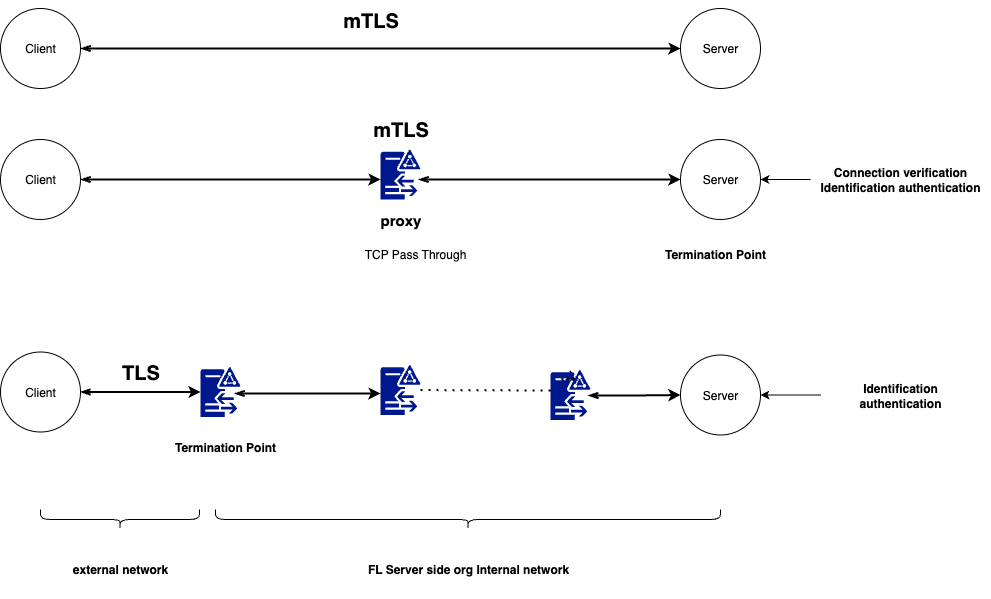

.. _server_port_consolidation:

シングルポートでのサーバーデプロイ
========================================

**FLARE が FL サーバー用に必要とする開放ポートは 1 つだけです。** 単一のポートで、
FL クライアント / サーバー間の通信と、管理クライアント / サーバー間の通信の両方を処理します。

.. note::

   ネットワークポリシー上、トラフィックの種類ごとに別々のポートが必要な場合は、
   オプションで 2 つのポートを個別に設定することもできます。以下の `個別ポートの使用`_ を参照してください。

上の図は、シングルポート、TLS、および :ref:`BYOConn <byoconn>` の各機能によって実現される
接続および認証のメカニズムを示しています。

個別ポートの使用
~~~~~~~~~~~~~~~~~~~~~~~~

管理トラフィックとクライアントトラフィックに異なるネットワークセキュリティポリシーが適用される環境では、
システムを 2 つの個別のポート番号でプロビジョニングすることも可能です。詳細については、
以下のプロビジョニング設定を参照してください。

ポート番号のプロビジョニング
----------------------------------

FL のポート番号は、プロジェクトのプロビジョニング設定ファイル (例: ``project.yml``) の ``fed_learn_port`` プロパティで指定します。以下の例を参照してください。

.. code-block:: yaml

   participants:
    # change example.com to the FQDN of the server
    - name: server
      type: server
      org: nvidia
      use_aio: false
      fed_learn_port: 8002
      host_names: [localhost, 127.0.0.1]
      default_host: localhost

このプロパティが明示的に指定されていない場合、デフォルトは 8002 になります。デフォルトでは、``fed_learn_port`` が ``admin_port`` としても使用されます。ただし、``admin_port`` プロパティを使って別のポート番号を指定することもできます。

.. code-block:: yaml

   participants:
    # change example.com to the FQDN of the server
    - name: server
      type: server
      org: nvidia
      use_aio: false
      fed_learn_port: 8002
      admin_port: 8003
      host_names: [localhost, 127.0.0.1]
      default_host: localhost

管理クライアントの設定
----------------------------

プロビジョニングが完了すると、管理ユーザーはスタートアップキットを受け取ります。これは、管理クライアント (または FLARE API) を使って FLARE サーバーに接続するために使用します。

キット内の ``startup`` フォルダには、ユーザーが変更してはならない重要な設定情報が含まれています。ファイルが変更された場合、管理クライアントはそれを検知し、サーバーに接続しません。

キット内の ``local`` フォルダには ``resources.json.default`` ファイルが含まれており、ここにはユーザーが変更可能な設定パラメータが含まれています。

.. code-block:: json

   {
    "format_version": 1,
    "admin": {
      "idle_timeout": 900.0,
      "login_timeout": 10.0,
      "with_debug": false,
      "authenticate_msg_timeout": 2.0,
      "prompt": "> "
    }
   }

ユーザーはこのファイルを編集し、自分のローカル環境により適したパラメータを設定できます。

アイドルタイムアウト
--------------------------

セキュリティのため、管理クライアントはアイドル状態が長すぎると自動的にシャットダウンします。``idle_timeout`` パラメータは、自動シャットダウンされるまでにクライアントがアイドル状態でいられる時間を指定します。

デフォルト値は 900 秒です。

ログインタイムアウト
--------------------------

管理クライアントは起動時にログインを試みます。ただし、ログイン時に FL サーバーが利用可能であるとは限りません。管理クライアントは、あらかじめ設定されたタイムアウトに達するまで接続を試み続けます。

``login_timeout`` パラメータは、クライアントが終了するまでにログインを試みる時間を指定します。デフォルト値は 10 秒です。

認証メッセージのタイムアウト
----------------------------------

ログイン手順の 1 つが認証です。相互認証のために、管理クライアントと FL サーバーの間で複数のメッセージが交換されます。

``authenticate_msg_timeout`` パラメータは、これらのメッセージのタイムアウト値を指定します。デフォルト値は 2 秒です。

この値を大きくすることを検討するのは、ローカルネットワークが低速な場合のみにしてください。

デバッグの有効化
----------------------

通常、管理クライアントはデバッグ情報を出力せずに動作します。エラーが発生した場合は、デバッグを有効にして詳細な技術情報を出力できます。

デバッグを有効にするには、``with_debug`` パラメータを ``true`` に設定します。

コマンドプロンプト
------------------------

管理クライアントを起動すると、コマンドを入力するためのプロンプト文字が表示されます。この文字は ``prompt`` パラメータで指定します。プロンプト文字は、お好みの任意の文字に変更できます。

コマンドタイムアウト
--------------------------

コマンドはメッセージを通じて FL サーバーに送信され、実行されます。各メッセージのデフォルトのタイムアウトは 5 秒です。ネットワークが低速な場合は、この値を大きくするとよいでしょう。

コマンドタイムアウトは次の方法で変更できます。

- 管理クライアントを実行している場合は、``timeout <value>`` コマンドを発行します
- FLARE API を使用している場合は、``sess.set_timeout(value)`` メソッドを呼び出します
