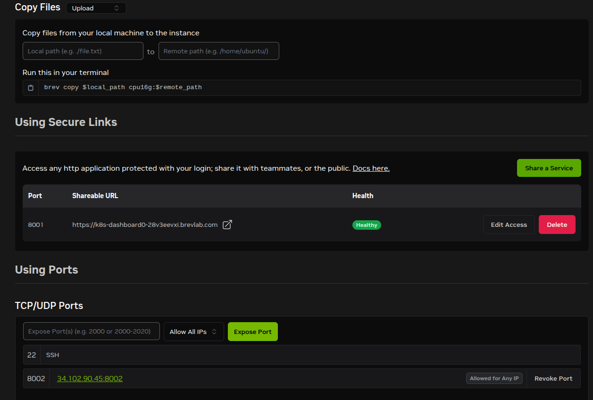
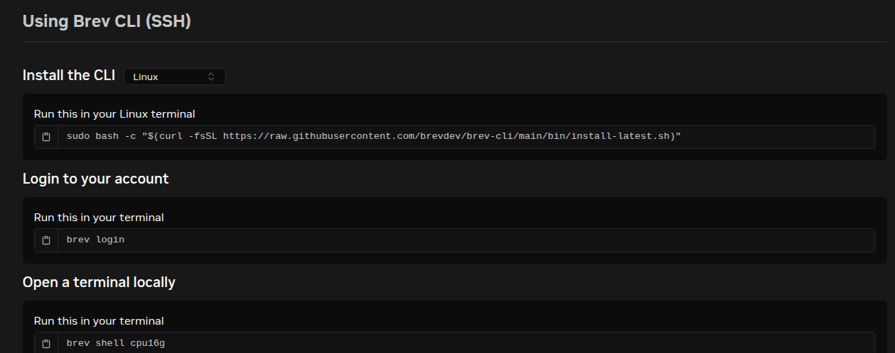

.. _brev_deployment:

#############################
Brev Kubernetes Helm デプロイ
#############################

このガイドでは、2 つの Kubernetes クラスタとして扱う 2 つの Brev シングルノード Kubernetes
環境上で、NVIDIA FLARE のエンドツーエンドのデプロイを行う手順を説明します。

* 1 つのクラスタは FLARE サーバー用
* もう 1 つのクラスタは ``site-1`` という名前の単一の FLARE クライアント用

本ガイドでは、プロビジョニング、``project.yml`` の編集、``nvflare deploy prepare`` による
サーバーとクライアント向けの Helm チャートの生成、Helm ワークスペース用の
PersistentVolumeClaim (PVC) およびジョブデータ用 PVC の作成、準備済みフォルダのワークスペース
PVC へのステージング、そして生成されたチャートのデプロイまでを扱います。

Kubernetes 環境は Brev の Web UI から作成します。Brev 上の正確なコントロールのラベルは変更される
ことがありますが、ワークフローは同じです。環境を作成し、コンピュートを選択し、ソフトウェア構成を
``Single-node Kubernetes`` に切り替え、Brev のシェルを開き、準備済みのキットを環境にコピーし、
各 Brev 環境の内部で ``kubectl`` と ``helm`` を使ってデプロイします。

Brev システムの概要
===================

Brev は、CPU または GPU ハードウェアと、オプションのシングルノード Kubernetes ソフトウェア構成で
作成できるマネージドなコンピュート環境を提供します。このガイドでは、各 Brev 環境を小規模で独立した
Kubernetes クラスタとして使用します。1 つの環境で FLARE サーバーを実行し、各クライアントサイトは
それぞれ独自の環境で実行します。

Brev コンソールは、環境の作成、ハードウェアの選択、``Single-node Kubernetes`` の選択、および
FLARE サーバーポートの公開に使用します。Brev CLI は、ファイルのコピーとシェルのオープンのために
ローカルワークステーションから使用します。

* ``brev copy`` は準備済みの各参加者アーカイブをアップロードします。
* ``brev shell`` は Brev 環境の内部でシェルを開きます。
* ``brev exec`` は環境の準備が整った後に非対話的なコマンドを実行できます。

各 Brev Kubernetes 環境の内部では、``kubectl`` と ``helm`` はその環境のローカルクラスタに対して
動作します。クラスタは互いに分離されているため、各クラスタで同じ Kubernetes ネームスペースと
PVC 名を使用しても安全です。

FLARE サーバー環境には ``fed_learn_port`` 用のインバウンド TCP ポートが必要です。クライアント環境
は通常、インバウンドの FLARE ポートを必要としません。クライアントは ``project.yml`` で設定された
サーバーのエンドポイントへアウトバウンドで接続します。

前提条件
========

例では次の構成を使用します。

* ``server1`` という名前のサーバー 1 つ
* ``site-1`` という名前のクライアント 1 つ
* ``nvflare-server-k8s`` という名前の Brev Kubernetes 環境 1 つ
* ``nvflare-site-1-k8s`` という名前の Brev Kubernetes 環境 1 つ
* 両方のクラスタでのネームスペース ``nvflare``
* 両方のクラスタでのワークスペース PVC 名 ``nvflws``
* 両方のクラスタでのオプションのジョブデータ PVC 名 ``nvfldata``
* サーバー用の外部から到達可能な DNS 名 (例: ``server1.example.com``)
* 両方のクラスタが pull できるレジストリ上のコンテナイメージ
  (例: ``registry.example.com/nvflare:dev``)

各クラスタはそれぞれ独自の Kubernetes API とストレージバックエンドを持つため、両方のクラスタで
同じネームスペースと PVC 名を使用しても安全です。

参考資料:

* `NVIDIA Brev ドキュメント <https://docs.nvidia.com/brev/>`__
* `NVIDIA Brev コンソールのドキュメント <https://docs.nvidia.com/brev/guides/console-reference>`__
* `Brev の接続に関するドキュメント <https://docs.nvidia.com/brev/cli/connectivity>`__
* :ref:`helm_chart`
* :ref:`deploy_prepare_command`

スクリプトによる 3 環境構成のバリエーション
===========================================

``server``、``site-1``、``site-2`` という名前の Brev シングルノード Kubernetes 環境を既に 3 つ
持っている場合、以下のヘルパースクリプトによって、サーバー 1 台とクライアント 2 台に対する同じ
プロビジョニング、deploy prepare、コピー、PVC ステージング、Helm インストールの流れを自動化でき
ます。

* :download:`prepare_brev_startup_kits.sh <brev_scripts/prepare_brev_startup_kits.sh>`
* :download:`launch_brev_nvflare.sh <brev_scripts/launch_brev_nvflare.sh>`

外部サーバーのホスト名と、すべての Brev クラスタが pull できるイメージを指定して、ローカルの
NVFlare チェックアウトから prepare スクリプトを実行します。

.. code-block:: shell

   export SERVER_HOST=server1.example.com
   export IMAGE=registry.example.com/nvflare:dev
   bash docs/user_guide/admin_guide/deployment/brev_scripts/prepare_brev_startup_kits.sh

Brev 環境の名前が参加者名と異なる場合は、環境変数で設定するか、スクリプトに入力を促させてください。

.. code-block:: shell

   SERVER_BREV=nvflare-server-k8s \
   SITE_1_BREV=nvflare-site-1-k8s \
   SITE_2_BREV=nvflare-site-2-k8s \
   bash docs/user_guide/admin_guide/deployment/brev_scripts/prepare_brev_startup_kits.sh

   bash docs/user_guide/admin_guide/deployment/brev_scripts/prepare_brev_startup_kits.sh \
     --prompt-brev-names

続いて、各 Brev 環境の内部で launch スクリプトを実行します。

.. code-block:: shell

   brev shell "${SERVER_BREV:-server}"
   IMAGE="$IMAGE" bash /home/ubuntu/launch_brev_nvflare.sh server

   brev shell "${SITE_1_BREV:-site-1}"
   IMAGE="$IMAGE" SERVER_HOST="$SERVER_HOST" bash /home/ubuntu/launch_brev_nvflare.sh site-1

   brev shell "${SITE_2_BREV:-site-2}"
   IMAGE="$IMAGE" SERVER_HOST="$SERVER_HOST" bash /home/ubuntu/launch_brev_nvflare.sh site-2

現在の Brev CLI にはローカルのポートフォワード用に ``brev port-forward`` がありますが、パブリックな
TCP ポートを公開するコマンドは提供されていません。2 つのサイトを起動する前に、Brev UI の Access
ページを使用して ``server`` 環境の TCP ``8002`` を公開してください。

Brev Kubernetes 環境の作成
==========================

まずサーバー用の Kubernetes 環境を作成し、その後クライアント用の Kubernetes 環境について同じ流れを
繰り返します。Brev UI では、シングルノードの Kubernetes 環境は、GPU および CPU の開発環境に使用する
のと同じ ``GPUs`` ページから作成します。

サーバー用 Kubernetes 環境
--------------------------

#. `Brev コンソール <https://brev.nvidia.com>`__ にサインインします。
#. 上部ナビゲーションの ``GPUs`` を開きます。
#. ``Create Environment`` をクリックします。

   .. figure:: ../../../resources/brev_creating.png
      :alt: Brev GPU Environments page with the Create Environment button.

      Brev の ``GPUs`` ページから開始し、新しい環境を作成します。

#. サーバー環境用のハードウェアを選択します。サーバー側のワークフローが GPU コンピュートを必要と
   しない限り、FLARE サーバーには CPU インスタンスで十分です。

   .. figure:: ../../../resources/brev_instance.png
      :alt: Brev Create Environment page with CPU selected.

      CPU または GPU のインスタンスタイプを選択します。基本的なサーバーデプロイでは、CPU
      インスタンスタイプで十分です。

#. ストレージとリージョンを設定します。

   * ``Name``: ``nvflare-server-k8s``
   * ``Organization`` または ``Project``: 環境を所有する Brev の組織を選択します。
   * ``Provider`` または ``Cloud``: サーバーを実行するクラウドプロバイダを選択します。
   * ``Region``: クライアントクラスタおよび管理オペレーターから到達可能なリージョンを選択します。
   * ``Disk Storage``: コンテナイメージキャッシュ、プロビジョニングされるワークスペース PVC、
     サーバーのジョブストレージ、スナップショット、ログのために十分な容量を選択します。

   .. figure:: ../../../resources/brev_config_instance.png
      :alt: Brev hardware, storage, region, and software configuration page.

      ソフトウェアモードを変更する前に、ディスクストレージとリージョンを設定します。

#. ``Software Configuration`` で ``Edit`` をクリックします。
#. ``Single-node Kubernetes`` を選択します。
#. クラスタのダッシュボードにブラウザからアクセスしたい場合は、``Install Kubernetes Dashboard`` を
   有効のままにします。
#. 組織で必須の初期化スクリプトがない限り、``Run a cluster init script`` は無効のままにします。
#. ``Apply`` をクリックします。

   .. figure:: ../../../resources/brev_select_k8s.png
      :alt: Brev software picker with Single-node Kubernetes selected.

      ``Single-node Kubernetes`` を選択することで、Kubernetes、``kubectl``、``helm`` がすぐに
      使える状態で環境が作成されます。

#. カスタムのネットワークまたは起動オプションを設定する必要がある場合のみ、``Advanced`` を展開
   します。
#. ``Name Instance`` に ``nvflare-server-k8s`` を設定します。
#. ``Deploy`` をクリックします。

   .. figure:: ../../../resources/brev_deploy.png
      :alt: Brev deployment page showing Name Instance and Deploy.

      サーバー環境に名前を付けてデプロイします。

#. 環境のステータスが ``Running`` または ``Ready`` になるまで待ちます。

クライアント用 Kubernetes 環境
------------------------------

同じ Web UI の流れを繰り返し、次の値を使用します。

* ``Name``: ``nvflare-site-1-k8s``
* ``Instance Type``: ``site-1`` が実行するジョブに応じて、CPU または GPU のコンピュートを選択
  します。
* ``Networking``: クライアントクラスタには ``server1.example.com:8002`` へのアウトバウンドアクセス
  が必要です。
* ``Disk Storage``: クライアントのワークスペース、ログ、データ PVC のために十分な容量を選択します。
* ``Software Configuration``: ``Single-node Kubernetes`` を選択します。
* ``Ports``: この基本的なクライアントデプロイでは、インバウンドの FLARE ポートは不要です。
  クライアントはサーバーの ``8002`` へアウトバウンドで接続します。

サーバーポートアクセスと SSH の有効化
-------------------------------------

両方の Kubernetes 環境が稼働したら、サーバー環境の ``Access`` ページを開きます。``Using Ports``
セクションで、FLARE の連合学習ポートである ``fed_learn_port`` ``8002`` を公開します。

このガイドでは ``project.yml`` に ``admin_port`` を設定しません。``admin_port`` を省略した場合、
NVFlare は ``fed_learn_port`` と同じ値を使用します。したがって、Brev のサーバー環境では
``fed_learn_port`` ``8002`` のみを公開すれば十分です。

#. ``TCP/UDP Ports`` を見つけます。
#. ``Expose Port(s)`` に ``8002`` を入力します。
#. アクセススコープを選択します。手早くテストするには ``Allow All IPs`` が便利ですが、実運用の
   デプロイでは既知のクライアント/管理者の送信元 IP に制限してください。
#. ``Expose Port`` をクリックします。
#. 表にポート ``8002`` が表示され、``<server-ip>:8002`` のようなパブリックエンドポイントが表示
   されることを確認します。

   ``Using Ports`` で、サーバーの ``fed_learn_port`` ``8002`` を公開します。同じページには、
   環境にファイルをアップロードするための ``brev copy`` コマンドの形式も表示されます。

ポート ``8002`` のパブリックな ``host:port`` の値をコピーします。``server1.example.com`` をその
エンドポイントのホスト/IP 部分に向けます。``default_host`` にポートを含めないでください。ポートは
既に ``project.yml`` で ``fed_learn_port: 8002`` として設定されています。

環境は ``Access`` ページを通じて SSH の手順も提供します。

   UI に表示される Brev CLI のコマンドを使用して、CLI のインストール、ログイン、Kubernetes 環境
   でのシェルのオープンを行います。

ローカルのワークステーションで Brev CLI がまだ利用できない場合は、インストールして認証します。

.. code-block:: shell

   sudo bash -c "$(curl -fsSL https://raw.githubusercontent.com/brevdev/brev-cli/main/bin/install-latest.sh)"
   brev login

このガイドの残りの部分のために、ローカルのワークステーションで環境変数を設定します。

.. code-block:: shell

   export SERVER_BREV=nvflare-server-k8s
   export CLIENT_BREV=nvflare-site-1-k8s
   export NAMESPACE=nvflare
   export SERVER_HOST=server1.example.com
   export IMAGE=registry.example.com/nvflare:dev

両方の Brev Kubernetes 環境に SSH できることを確認します。

.. code-block:: shell

   brev shell "$SERVER_BREV"
   exit
   brev shell "$CLIENT_BREV"
   exit

各 Brev Kubernetes 環境の内部では、``kubectl`` と ``helm`` はローカルのシングルノードクラスタ用に
既に設定されているはずです。SSH した後に、次のコマンドで確認できます。

.. code-block:: shell

   kubectl get nodes
   kubectl get storageclass

.. _brev_build_push_flare_image:

FLARE イメージのビルドとプッシュ
================================

NVFlare のソースチェックアウトから FLARE のランタイムイメージをビルドし、両方の Brev Kubernetes
クラスタが pull できるレジストリにプッシュします。

``ServerK8sJobLauncher`` と ``ClientK8sJobLauncher`` は、実行中の FLARE コンテナの内部から
Kubernetes の Python クライアントを使用します。カスタムの Dockerfile を使用する場合は、イメージに
この依存関係をインストールしてください。

.. code-block:: dockerfile

   RUN pip install "kubernetes!=36.0.0"

リポジトリの ``docker/Dockerfile.parent`` は、この依存関係を含む NVFlare の ``K8S`` エクストラを
既にインストールしています。イメージをビルドする前に、そのインストール行をそのまま残すか、上記の
明示的な ``pip install kubernetes!=36.0.0`` の行を追加してください。

準備される Brev のランチャーはクラスタ内 Kubernetes 設定
(``job_launcher.config_file_path: null``) を使用するため、親 Pod は自身の ServiceAccount トークン
で認証します。

.. code-block:: shell

   docker build -t "$IMAGE" -f docker/Dockerfile.parent .
   docker push "$IMAGE"

レジストリがプライベートである場合は、両方のクラスタがイメージを pull できることを確認してください。
レジストリとクラスタの構成によっては、ノードレベルのレジストリ認証情報を設定するか、Kubernetes の
イメージ pull シークレットを追加することを意味する場合があります。生成されるチャートはデフォルトでは
``imagePullSecrets`` を追加しないため、ノードから既に信頼されているレジストリを使用するか、環境に
合わせてチャートをカスタマイズしてください。

project.yml の編集
==================

まだ用意していない場合は、サンプルのプロジェクトファイルを生成します。

.. code-block:: shell

   nvflare provision -g

次のデプロイ固有の目的に沿って ``project.yml`` を編集します。

#. クライアントを ``site-1`` の 1 つだけ定義します。
#. サーバーの ``default_host`` に、クライアントクラスタが使用する安定した外部 DNS 名を設定します。
#. サーバー証明書がそのエンドポイントに対して有効になるように、``host_names`` にも同じ DNS 名を
   含めます。
#. ``admin_port`` は未設定のままにして、``fed_learn_port`` にデフォルトで一致させます。Brev の
   サーバーは ``fed_learn_port`` の値のみを公開すれば十分です。
#. プロビジョニングの後に ``nvflare deploy prepare`` を使用して、サーバーとクライアントの
   スタートアップキットから Kubernetes のランタイムファイルを生成します。
#. deploy prepare のランタイム設定では、両方のクラスタが pull できるコンテナイメージを使用します。

例:

.. code-block:: yaml

   api_version: 3
   name: example_project
   description: NVFlare Brev Kubernetes Helm deployment

   participants:
     - name: server1
       type: server
       org: nvidia
       default_host: server1.example.com
       host_names:
         - server1
         - server1.example.com
       fed_learn_port: 8002
     - name: site-1
       type: client
       org: nvidia
     - name: admin@nvidia.com
       type: admin
       org: nvidia
       role: project_admin

   builders:
     - path: nvflare.lighter.impl.workspace.WorkspaceBuilder
       args:
         template_file:
           - master_template.yml
     - path: nvflare.lighter.impl.static_file.StaticFileBuilder
       args:
         config_folder: config
         scheme: tcp
     - path: nvflare.lighter.impl.cert.CertBuilder
     - path: nvflare.lighter.impl.signature.SignatureBuilder

``default_host`` の値は、スタートアップ設定とサーバー証明書に書き込まれるため、プロビジョニングの
前に決めておく必要があります。``server1.example.com`` のような自身で管理する安定した DNS 名を
``project.yml`` で使用し、ポートアクセスを有効にした後、その DNS 名を Brev サーバー環境の公開された
ホストに向けてください。

生成されるサーバーとクライアントのチャートは、設定された ``workspace_pvc`` のみをマウントします。
このガイドでは、その PVC は ``nvflws`` であり、``/var/tmp/nvflare/workspace`` にマウントされます。
``nvfldata`` のような別のデータ PVC は、スタディデータを必要とする起動済みの Kubernetes ジョブ Pod
のためだけに作成してください。

プロビジョニングの実行
======================

provision コマンドを実行します。

.. code-block:: shell

   nvflare provision -p project.yml -w /tmp/nvflare/provision

生成された production フォルダを ``PROD_DIR`` に設定します。

.. code-block:: shell

   PROJECT_NAME=$(grep '^name:' project.yml | awk '{print $2}')
   PROD_DIR=$(find "/tmp/nvflare/provision/${PROJECT_NAME}" \
     -maxdepth 1 -type d -name 'prod_*' | sort | tail -n 1)
   if [ -z "$PROD_DIR" ]; then
     echo "No prod_* folder found for project '${PROJECT_NAME}'" >&2
     exit 1
   fi
   echo "$PROD_DIR"

サーバーとクライアントのスタートアップキットを Kubernetes 向けに準備します。

.. code-block:: shell

   cat >/tmp/nvflare-k8s.yaml <<'EOF'
   runtime: k8s
   namespace: nvflare
   parent:
     docker_image: registry.example.com/nvflare:dev
     parent_port: 8102
     workspace_pvc: nvflws
     workspace_mount_path: /var/tmp/nvflare/workspace
     python_path: /usr/local/bin/python3
   job_launcher:
     config_file_path:
     default_python_path: /usr/local/bin/python3
     pending_timeout: 300
   EOF

   nvflare deploy prepare "$PROD_DIR/server1" --output /tmp/nvflare-prepared/server1 --config /tmp/nvflare-k8s.yaml
   nvflare deploy prepare "$PROD_DIR/site-1" --output /tmp/nvflare-prepared/site-1 --config /tmp/nvflare-k8s.yaml

上記の例では、このガイドに必要なキーのみを設定しています。``parent`` はオプションの ``resources``
(親 Pod の CPU/メモリのリクエストとリミット) と ``pod_security_context`` も受け付け、
``job_launcher`` はオプションの ``job_pod_security_context`` を受け付けます。ランタイム設定の完全な
スキーマについては :ref:`deploy_prepare_command` を、準備されたチャートのインストール方法については
:ref:`helm_chart` を参照してください。

準備されたフォルダには、サーバーとクライアントの下にそれぞれ 1 つの ``helm_chart`` ディレクトリが
含まれているはずです。

.. code-block:: shell

   ls /tmp/nvflare-prepared/server1/helm_chart
   ls /tmp/nvflare-prepared/site-1/helm_chart

各参加者のフォルダは次の構造になっています。

.. code-block:: text

   server1/
     helm_chart/
       Chart.yaml
       values.yaml
       templates/
     local/
     startup/
     transfer/

このステップの間に、``nvflare deploy prepare`` は次の処理を行います。Kubernetes ランチャーを使用する
ように ``local/resources.json.default`` を更新し、有効な ``local/resources.json`` のオーバーライドを
削除し、生成された Kubernetes Service を使用するようにランタイム通信を更新し、必要に応じて
``local/study_runtime.yaml`` のテンプレートを作成し、レガシーな ``startup/start.sh``、
``startup/sub_start.sh``、``startup/stop_fl.sh`` の各スクリプトを削除し (親プロセスは代わりに Helm
チャートによって起動されます)、``helm_chart/`` を生成します。サーバーのキットについては、サーバーの
ジョブ履歴とスナップショットがワークスペース PVC 上で永続化されるように、デフォルトの
``job_manager`` と ``snapshot_persistor`` のストレージパスを ``parent.workspace_mount_path`` の下
(``/var/tmp/nvflare/workspace/jobs-storage`` と
``/var/tmp/nvflare/workspace/snapshot-storage``) へ移動します。このステップの後に
``resources.json.default`` 内のランチャーを手作業で編集しないでください。代わりに
``/tmp/nvflare-k8s.yaml`` を変更して ``nvflare deploy prepare`` を再実行してください。

入力キットが既にカスタムの ``resource_manager``、``resource_consumer``、またはジョブランチャーを
設定している場合、``nvflare deploy prepare`` は警告を表示し、それらのコンポーネントを上記のランタイム
設定で置き換えます。

準備済みキットの Brev 環境へのコピー
====================================

ローカルのワークステーション上で、準備済みのサーバーとクライアントのフォルダをパッケージ化します。

.. code-block:: shell

   tar -czf /tmp/nvflare-server1.tgz -C /tmp/nvflare-prepared server1
   tar -czf /tmp/nvflare-site-1.tgz -C /tmp/nvflare-prepared site-1

Brev 環境の ``Access`` ページの ``Copy Files`` セクションを使用するか、同等の ``brev copy`` コマンド
を実行します。

.. code-block:: shell

   brev copy /tmp/nvflare-server1.tgz "$SERVER_BREV:/home/ubuntu/"
   brev copy /tmp/nvflare-site-1.tgz "$CLIENT_BREV:/home/ubuntu/"

アーカイブには、生成された ``startup/``、``local/``、``helm_chart/`` の各フォルダが含まれます。Helm
チャートは、アーカイブを展開した後に Brev 環境から実行します。ワークスペース PVC にステージングする
必要があるのは ``startup/`` と ``local/`` だけです。

サーバー環境のデプロイ
======================

サーバーの Brev 環境でシェルを開きます。

.. code-block:: shell

   brev shell "$SERVER_BREV"

このセクションの残りの部分は、サーバー環境の内部から実行します。まず、アップロードしたアーカイブを
展開し、デプロイ用の変数を設定します。

.. code-block:: shell

   export NAMESPACE=nvflare
   export IMAGE=registry.example.com/nvflare:dev

   mkdir -p ~/nvflare
   tar -xzf ~/nvflare-server1.tgz -C ~/nvflare
   kubectl get nodes
   helm version

ネームスペースと PVC を作成します。生成されたサーバーチャートには ``nvflws`` ワークスペース PVC が
必要です。``nvfldata`` PVC は後で、スタディデータを必要とする起動済みの Kubernetes ジョブ Pod によって
のみ使用されます。

.. code-block:: shell

   kubectl create namespace "$NAMESPACE" --dry-run=client -o yaml | kubectl apply -f -

   cat > ~/nvflare/nvflare-pvcs.yaml <<'EOF'
   apiVersion: v1
   kind: PersistentVolumeClaim
   metadata:
     name: nvflws
   spec:
     accessModes:
       - ReadWriteOnce
     resources:
       requests:
         storage: 10Gi
   ---
   apiVersion: v1
   kind: PersistentVolumeClaim
   metadata:
     name: nvfldata
   spec:
     accessModes:
       - ReadWriteOnce
     resources:
       requests:
         storage: 50Gi
   EOF

   kubectl -n "$NAMESPACE" apply -f ~/nvflare/nvflare-pvcs.yaml
   kubectl -n "$NAMESPACE" get pvc

Brev の Kubernetes 環境にデフォルトのストレージクラスがない場合は、各 PVC の ``spec`` の下に
``storageClassName: <storage-class-name>`` を追加してください。

サーバーのフォルダは既に Kubernetes 向けに準備されています。その ``local/resources.json.default``
には、``/tmp/nvflare-k8s.yaml`` に由来する ``namespace: nvflare``、
``default_python_path: /usr/local/bin/python3``、``pending_timeout: 300``、
``workspace_mount_path: /var/tmp/nvflare/workspace`` を持つ ``ServerK8sJobLauncher`` が含まれます。
ランチャーはそのネームスペース内に動的なジョブ Pod を作成するため、Helm リリースにも同じネーム
スペースを使用する必要があります。

準備済みのサーバーの ``startup/`` および ``local/`` ディレクトリを ``nvflws`` PVC にコピーします。
チャートは ``-m /var/tmp/nvflare/workspace`` でサーバーを起動するため、PVC のルートには ``startup/``
と ``local/`` が直接含まれている必要があります。``kubectl cp`` は対象コンテナ内に ``tar`` を必要と
するため、一時的なコピー用 Pod のイメージには ``tar`` が含まれている必要があります。``busybox:1.36``
には ``tar`` が含まれています。

.. code-block:: shell

   cat > ~/nvflare/copy-to-pvcs.yaml <<'EOF'
   apiVersion: v1
   kind: Pod
   metadata:
     name: nvflare-pvc-copy
   spec:
     restartPolicy: Never
     containers:
       - name: copy
         image: busybox:1.36
         command:
           - sh
           - -c
           - sleep 3600
         volumeMounts:
           - name: nvflws
             mountPath: /mnt/nvflws
     volumes:
       - name: nvflws
         persistentVolumeClaim:
           claimName: nvflws
   EOF

   kubectl -n "$NAMESPACE" delete pod nvflare-pvc-copy --ignore-not-found=true
   kubectl -n "$NAMESPACE" apply -f ~/nvflare/copy-to-pvcs.yaml
   kubectl -n "$NAMESPACE" wait \
     --for=condition=Ready pod/nvflare-pvc-copy --timeout=120s
   kubectl -n "$NAMESPACE" exec nvflare-pvc-copy -- \
     rm -rf /mnt/nvflws/startup /mnt/nvflws/local
   kubectl -n "$NAMESPACE" cp ~/nvflare/server1/startup nvflare-pvc-copy:/mnt/nvflws/startup
   kubectl -n "$NAMESPACE" cp ~/nvflare/server1/local nvflare-pvc-copy:/mnt/nvflws/local
   kubectl -n "$NAMESPACE" exec nvflare-pvc-copy -- \
     ls -la /mnt/nvflws/startup /mnt/nvflws/local
   kubectl -n "$NAMESPACE" delete pod nvflare-pvc-copy

``startup/`` と ``local/`` は PVC のルートに直接コピーしてください。PVC のルートにネストされた
``server1/`` ディレクトリしか含まれていない場合、サーバー Pod は
``/var/tmp/nvflare/workspace/startup`` と ``/var/tmp/nvflare/workspace/local`` を見つけられません。

サーバーの Helm チャートをインストールします。サーバー Pod が Brev ホスト上で ``fed_learn_port``
``8002`` にバインドされるように、``hostPortEnabled=true`` を設定します。これは Brev の
``Using Ports`` UI で公開したポートです。

.. code-block:: shell

   helm upgrade --install server1 ~/nvflare/server1/helm_chart \
     --namespace "$NAMESPACE" \
     --set image.repository="${IMAGE%:*}" \
     --set image.tag="${IMAGE##*:}" \
     --set service.type=ClusterIP \
     --set hostPortEnabled=true

   kubectl -n "$NAMESPACE" rollout status deployment/server1 --timeout=300s
   kubectl -n "$NAMESPACE" get pods
   kubectl -n "$NAMESPACE" logs deploy/server1

site-1 環境のデプロイ
=====================

クライアントの Brev 環境でシェルを開きます。

.. code-block:: shell

   brev shell "$CLIENT_BREV"

このセクションの残りの部分は、クライアント環境の内部から実行します。まず、アップロードしたアーカイブ
を展開し、デプロイ用の変数を設定します。

.. code-block:: shell

   export NAMESPACE=nvflare
   export IMAGE=registry.example.com/nvflare:dev
   export SERVER_HOST=server1.example.com

   mkdir -p ~/nvflare
   tar -xzf ~/nvflare-site-1.tgz -C ~/nvflare
   kubectl get nodes
   helm version

ネームスペースと PVC を作成します。生成されたクライアントチャートには ``nvflws`` ワークスペース PVC
が必要です。``nvfldata`` PVC は後で、スタディデータを必要とする起動済みの Kubernetes ジョブ Pod に
よってのみ使用されます。

.. code-block:: shell

   kubectl create namespace "$NAMESPACE" --dry-run=client -o yaml | kubectl apply -f -

   cat > ~/nvflare/nvflare-pvcs.yaml <<'EOF'
   apiVersion: v1
   kind: PersistentVolumeClaim
   metadata:
     name: nvflws
   spec:
     accessModes:
       - ReadWriteOnce
     resources:
       requests:
         storage: 10Gi
   ---
   apiVersion: v1
   kind: PersistentVolumeClaim
   metadata:
     name: nvfldata
   spec:
     accessModes:
       - ReadWriteOnce
     resources:
       requests:
         storage: 50Gi
   EOF

   kubectl -n "$NAMESPACE" apply -f ~/nvflare/nvflare-pvcs.yaml
   kubectl -n "$NAMESPACE" get pvc

``site-1`` のフォルダは既に Kubernetes 向けに準備されています。その
``local/resources.json.default`` には、``/tmp/nvflare-k8s.yaml`` に由来する同じランチャー設定を持つ
``ClientK8sJobLauncher`` が含まれます。Helm のネームスペースは、``nvflare deploy prepare`` で使用した
``namespace`` の値と一致させてください。

準備済みの ``site-1`` の ``startup/`` および ``local/`` ディレクトリを、クライアントの ``nvflws``
PVC にコピーします。``kubectl cp`` は対象コンテナ内に ``tar`` を必要とするため、一時的なコピー用 Pod
のイメージには ``tar`` が含まれている必要があります。``busybox:1.36`` には ``tar`` が含まれています。

.. code-block:: shell

   cat > ~/nvflare/copy-to-pvcs.yaml <<'EOF'
   apiVersion: v1
   kind: Pod
   metadata:
     name: nvflare-pvc-copy
   spec:
     restartPolicy: Never
     containers:
       - name: copy
         image: busybox:1.36
         command:
           - sh
           - -c
           - sleep 3600
         volumeMounts:
           - name: nvflws
             mountPath: /mnt/nvflws
     volumes:
       - name: nvflws
         persistentVolumeClaim:
           claimName: nvflws
   EOF

   kubectl -n "$NAMESPACE" delete pod nvflare-pvc-copy --ignore-not-found=true
   kubectl -n "$NAMESPACE" apply -f ~/nvflare/copy-to-pvcs.yaml
   kubectl -n "$NAMESPACE" wait \
     --for=condition=Ready pod/nvflare-pvc-copy --timeout=120s
   kubectl -n "$NAMESPACE" exec nvflare-pvc-copy -- \
     rm -rf /mnt/nvflws/startup /mnt/nvflws/local
   kubectl -n "$NAMESPACE" cp ~/nvflare/site-1/startup nvflare-pvc-copy:/mnt/nvflws/startup
   kubectl -n "$NAMESPACE" cp ~/nvflare/site-1/local nvflare-pvc-copy:/mnt/nvflws/local
   kubectl -n "$NAMESPACE" exec nvflare-pvc-copy -- \
     ls -la /mnt/nvflws/startup /mnt/nvflws/local
   kubectl -n "$NAMESPACE" delete pod nvflare-pvc-copy

クライアントチャートをインストールする前に、クライアント環境がサーバーのホストを解決できることを
確認します。

.. code-block:: shell

   kubectl -n "$NAMESPACE" run dns-test --rm -it \
     --image=busybox:1.36 -- \
     nslookup "$SERVER_HOST"

``site-1`` の Helm チャートをインストールします。

.. code-block:: shell

   helm upgrade --install site-1 ~/nvflare/site-1/helm_chart \
     --namespace "$NAMESPACE" \
     --set image.repository="${IMAGE%:*}" \
     --set image.tag="${IMAGE##*:}"

   kubectl -n "$NAMESPACE" rollout status deployment/site-1 --timeout=300s
   kubectl -n "$NAMESPACE" get pods
   kubectl -n "$NAMESPACE" logs deploy/site-1

後で再プロビジョニングする場合は、新しいフォルダをコピーする前に古い PVC の内容をバックアップまたは
削除してください。証明書、ローカル設定、通信設定は、プロビジョニングされたプロジェクトの状態と
結び付いています。

管理コンソールの接続
====================

``server1.example.com:8002`` に到達できるネットワーク上の場所から管理クライアントを実行します。

.. code-block:: shell

   cd "$PROD_DIR/admin@nvidia.com/startup"
   ./fl_admin.sh

生成された管理者キットは、``project.yml`` で設定されたサーバーホストに接続します。``default_host``
として ``server1.example.com`` を使用した場合、その名前が Brev のサーバー環境のエンドポイントに解決
される必要があります。

Kubernetes ジョブ Pod と nvfldata
=================================

``nvflare deploy prepare`` は、参加者のフォルダが Brev にコピーされる前に、Kubernetes ランチャーを
``local/resources.json.default`` に、``local/study_runtime.yaml`` のテンプレートを書き込みます。
起動されたジョブ Pod が ``nvfldata`` PVC を必要とする場合は、それらのフォルダを ``nvflws`` にコピー
する前に、準備済みのサーバーとクライアントのフォルダ内の ``local/study_runtime.yaml`` を編集して
ください。次の例では、``default`` スタディの ``data`` データセットを ``nvfldata`` にマッピングして
います。

.. code-block:: yaml

   format_version: 2
   studies:
     default:
       datasets:
         data:
           source: nvfldata
           mode: rw

ジョブ Pod のイメージ、Python、CPU、メモリ、エフェメラルストレージの設定は、``k8s`` ランチャー向けに
投入されるジョブの ``meta.json`` の ``launcher_spec`` の下で指定してください。``num_of_gpus`` のような
GPU リソースのリクエストは、:ref:`helm_chart` に合わせて ``resource_spec`` の下で指定してください。

トラブルシューティング
======================

PVC が ``Pending`` のままになる
-------------------------------

Brev のクラスタにデフォルトのストレージクラスがあることを確認するか、``nvflare-pvcs.yaml`` に明示的な
``storageClassName`` を追加してください。

.. code-block:: shell

   kubectl get storageclass
   kubectl -n "$NAMESPACE" describe pvc nvflws

Pod が ``ImagePullBackOff`` になる
----------------------------------

イメージが存在し、両方のクラスタがそれを pull できることを確認してください。

.. code-block:: shell

   docker push "$IMAGE"
   kubectl -n "$NAMESPACE" describe pod -l app.kubernetes.io/name=server1
   kubectl -n "$NAMESPACE" describe pod -l app.kubernetes.io/name=site-1

サーバー Pod が ``startup`` または ``local`` を見つけられない
-------------------------------------------------------------

参加者のフォルダが PVC 内の誤った階層にコピーされています。サーバーのワークスペースのルートには、
次のものが含まれている必要があります。

.. code-block:: text

   /var/tmp/nvflare/workspace/startup
   /var/tmp/nvflare/workspace/local

ヘルパー Pod を使って ``/mnt/nvflws`` を確認し、必要に応じて、展開した準備済みフォルダ
(``~/nvflare/server1/startup`` および ``~/nvflare/server1/local`` など) から ``startup/`` と
``local/`` を再ステージングしてください。

site-1 がサーバーに接続できない
-------------------------------

次の項目を確認してください。

* ``project.yml`` の ``default_host`` が、クライアントが使用する DNS 名と一致していること。
* その DNS 名がクライアントクラスタから解決できること。
* サーバークラスタが TCP ポート ``8002`` を公開していること。
* サーバー証明書の ``host_names`` にその DNS 名が含まれていること。

クライアントクラスタから DNS のチェックを実行します。

.. code-block:: shell

   kubectl -n "$NAMESPACE" run dns-test --rm -it \
     --image=busybox:1.36 -- \
     nslookup "$SERVER_HOST"

``default_host`` または ``host_names`` を変更した場合は、再プロビジョニングし、更新されたフォルダを
再ステージングし、チャートを再デプロイしてください。

クリーンアップ
==============

Helm のリリースを削除します。

.. code-block:: shell

   # Run inside the server Brev environment.
   helm uninstall server1 -n "$NAMESPACE"

   # Run inside the site-1 Brev environment.
   helm uninstall site-1 -n "$NAMESPACE"

ネームスペースと PVC を削除します。

.. code-block:: shell

   # Run inside each Brev environment.
   kubectl delete namespace "$NAMESPACE"

不要になったら、Web UI から Brev のクラスタを削除します。

#. Brev コンソールを開きます。
#. Kubernetes またはクラスタのページを開きます。
#. ``nvflare-server-k8s`` を選択して削除します。
#. ``nvflare-site-1-k8s`` を選択して削除します。
#. 課金または使用状況のページで、リソースが実行されていないことを確認します。
