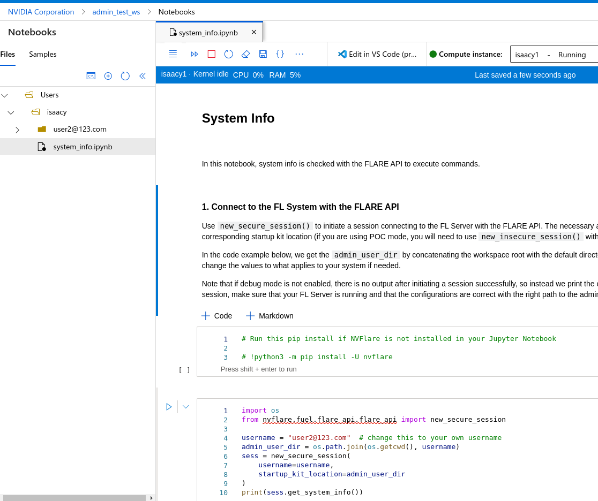

.. _cloud_deployment:

############################################
クラウドデプロイメント
############################################
NVFlare は、セットアッププロセスを簡素化するクラウドデプロイメントツールを提供しています。CLI ツールは、以下を含むクラウドインフラストラクチャを自動的にプロビジョニング・設定できます:

- Azure: リソースグループ、ネットワーク、DNS、VM インスタンス
- AWS: EC2 インスタンス、セキュリティグループ、ネットワーク

これらのツールは以下のデプロイをサポートしています:
- NVFlare Dashboard UI
- FL サーバー
- FL クライアント

NVFLARE のプロビジョニングとデプロイには 2 つの方法があります。1 つ目は、:ref:`プロビジョニング用の NVFLARE CLI ツール <provision_command>` を使う方法です。ただし、
各 FL クライアント向けのスタートアップキットは、メールや sftp などで手動配布する必要があります。

2 つ目は、:ref:`NVFLARE Dashboard Web UI <dashboard_api>` を使う方法です。これにより、プロジェクト管理者は参加者を招待して
FL プロジェクトをセットアップできます。ユーザーは FLARE Dashboard から直接スタートアップキットをダウンロードできるため、手動配布は不要です。

どちらのアプローチでも、NVFLARE アプリケーションをデプロイする前に、ユーザーはスタートアップキットを持っていることになります。スタートアップキットを使って
FL サーバーとクライアントをクラウドにデプロイするには、次のコマンドを実行するだけです(適切な値に置き換えてください):

.. code-block:: shell

    FL Server:    <startup dir>/start.sh     --cloud <csp>  [ --config <config_file> ]
    FL Client:    <startup dir>/start.sh     --cloud <csp>  [ --config <config_file> ]

クラウドへの NVFLARE Dashboard のデプロイ
================================================================
NVFLARE Dashboard を活用してスタートアップキットのプロビジョニングと配布を行う場合は、まず NVFLARE Dashboard をセットアップする必要があります。
あなたがプロジェクト管理者であり、クラウド上に NVFLARE Dashboard Web アプリケーションをセットアップしたいとします。また、クラウドインフラストラクチャに
アクセスして作成するために必要なすべての認証情報を持っているとします。Azure では、Azure サブスクリプションにおけるあなたのロールが、
リソースグループと仮想マシンの作成、およびネットワークセキュリティグループとそのルールの設定を行える必要があります。
AWS では、ロールに AmazonEC2FullAccess が必要です。

Azure での Dashboard の作成
------------------------------------------------------
Azure 上で NVFlare dashboard を実行するには、次を実行します:

.. code-block:: shell

    nvflare dashboard --cloud azure -i nvflare/nvflare:2.7.2

``-i`` の値には、Docker Hub、NGC、クラウドレジストリ、その他のプライベートレジストリでホストされているイメージなど、
クラウド VM が pull できる任意のイメージ参照を指定できます。たとえば、VM からレジストリに到達できる場合は
``registry.example.com/nvflare/nvflare:2.7.2`` を使用できます。

.. note::

    注記: このスクリプトには sshpass、dig、jq も必要です。Ubuntu では以下ですべてインストールできます:

        .. code-block:: shell

           sudo apt install sshpass bind9-dnsutils jq

ユーザーはメールアドレスを入力して Enter を押すだけです。このユーザーは、このメールアドレスと、提供される一時パスワードを覚えておく必要があります。
これは、Dashboard が稼働し始めた後の NVFLARE Dashboard へのログイン認証情報となるためです。

インフラストラクチャを作成する前に、Azure はユーザーに認証情報でのログインを要求します。これは公式の Azure CLI ツールによって処理されます。
インストール方法はこちらのページを参照してください: https://learn.microsoft.com/en-us/cli/azure/install-azure-cli。az login のプロセスでは、次のようなメッセージが表示されます:

.. code-block:: text

    To sign in, use a web browser to open the page https://microsoft.com/devicelogin and enter the code A12GCJZR2 to authenticate.

上記の URL を開き、ランダムなコード(上記の例では A12GCJZR2)を入力してください。その後、ユーザー認証情報と MFA を必要とするログインプロセスを最後まで進めてください。

Dashboard デプロイプロセスの最後は、オンプレミスでの dashboard の起動と同じです。NVFlare のプロジェクト管理者のログイン認証情報と IP
アドレスが表示されます。これで、ユーザーはクラウド上の NVFlare dashboard を使い始めることができます。

.. code-block:: shell

    Starting dashboard
    Dashboard: Project admin credential is hello@world.com and the password is E3pZkD50, running at IP address 20.20.123.123
    To stop it, run az group delete -n nvflare_dashboard_rg

カレントワーキングディレクトリに web.crt と web.key (dashboard 用の証明書と秘密鍵)が存在する場合、スクリプトはそれらを
クラウド VM にコピーし、dashboard は HTTPS モードで実行されます。存在しない場合、dashboard は HTTP モードで実行されます。どちらもポート 443 を使用します。

dashboard とブラウザー間で転送されるデータには機密情報が含まれるため、dashboard を HTTPS で実行することを強く推奨します。

NVFlare dashboard の適切なドメイン名の設定は、NVFlare の範囲外です。ユーザーはドメイン名を購入し、NVFlare dashboard が使用する
パブリック IP アドレスに DNS を向ける必要があります(azure が利用可能なドメイン名を自動的に付与する場合もあります)。上記の
結果を例にすると、パブリック IP アドレスは 20.20.123.123 です。

Dashboard が稼働し始めたら、プロジェクト管理者は :ref:`このドキュメント<nvflare_dashboard_ui>` の手順に従って、
FL サーバーを指定し、他のユーザーをプロジェクトに招待し、最終的に FL サーバーまたは FL クライアントのスタートアップキットをダウンロードできます。

.. note::

    注記: VM、ネットワーク、IP などのすべてのリソースの削除を含めて dashboard を完全に停止するには、次を実行します:

        .. code-block:: shell

           az group delete -n nvflare_dashboard_rg

AWS での Dashboard の作成
----------------------------------------------------
AWS 上で NVFlare dashboard を実行するには、次を実行します:

.. code-block:: shell

    nvflare dashboard --cloud aws -i nvflare/nvflare:2.7.2

.. note::

    注記: このスクリプトには sshpass、dig、jq も必要です。Ubuntu では以下でインストールできます:

        .. code-block:: shell

           sudo apt install sshpass bind9-dnsutils jq

AWS は AWS の access_key と access_secret による認証を管理しているため、AWS インフラストラクチャの作成を開始する前に、これらの認証情報が必要です。

これ以降の操作の流れは、他の環境で :ref:`Dashboard UI<nvflare_dashboard_ui>` を実行する場合と同じです。

クラウドへの FL サーバーのデプロイ
========================================================
あなたがプロジェクト管理者であり、NVFLARE Dashboard から FL サーバーのスタートアップキットをダウンロード済み、または
NVFLARE CLI コマンドを使ってスタートアップキットを生成済みであるとします。ここから、クラウド上に FL サーバーをセットアップします。

Azure への FL サーバーのデプロイ
--------------------------------------------------------
FL サーバーのスタートアップキットを使って、通常のサーバー起動と同じ ``start.sh`` を実行しますが、追加オプション ``--cloud azure`` を付けて Azure 上でサーバーを起動します。

.. code-block:: shell

    ./startup/start.sh --cloud azure

ENTER を押すことで、すべてのデフォルト値をそのまま受け入れることができます。

.. code-block:: none

    This script requires az (Azure CLI), sshpass dig and jq.  Now checking if they are installed.
    Checking if az exists. => found
    Checking if sshpass exists. => found
    Checking if dig exists. => found
    Checking if jq exists. => found
    Cloud VM image, press ENTER to accept default Canonical:0001-com-ubuntu-server-focal:20_04-lts-gen2:latest: 
    Cloud VM size, press ENTER to accept default Standard_B2ms: 
    location = westus2, VM image = Canonical:0001-com-ubuntu-server-focal:20_04-lts-gen2:latest, VM size = Standard_B2ms, OK? (Y/n) 
    If the client requires additional dependencies, please copy the requirements.txt to /home/iscyang/workspace/test/azure2/set1/nvflareserver1.westus2.cloudapp.azure.com/startup.
    Press ENTER when it's done or no additional dependencies. 
    A web browser has been opened at https://login.microsoftonline.com/organizations/oauth2/v2.0/authorize. Please continue the login in the web browser. If no web browser is available or if the web browser fails to open, use device code flow with `az login --use-device-code`.
    Opening in existing browser session.
    ... ...
    ... (deleted for clarity) ...
    ... ...
    Creating Resource Group nvflare_rg at Location westus2
    Creating Virtual Machine, will take a few minutes
    WARNING: Starting Build 2023 event, "az vm/vmss create" command will deploy Trusted Launch VM by default. To know more about Trusted Launch, please visit https://docs.microsoft.com/en-us/azure/virtual-machines/trusted-launch
    WARNING: It is recommended to use parameter "--public-ip-sku Standard" to create new VM with Standard public IP. Please note that the default public IP used for VM creation will be changed from Basic to Standard in the future.
    Setting up network related configuration
    Copying files to nvflare_server
    Destination folder is nvflare@20.30.123.123:/var/tmp/cloud
    Warning: Permanently added '20.30.123.123' (ECDSA) to the list of known hosts.
    Installing packages in nvflare_server, may take a few minutes.

代わりに、``--config`` オプションで設定ファイルを指定することもできます(例: ``--config my_local_settings.conf``)。設定ファイルの形式は次のとおりです:

.. code-block:: shell

    VM_IMAGE=Canonical:0001-com-ubuntu-server-focal:20_04-lts-gen2:latest
    VM_SIZE=Standard_B2ms
    LOCATION=westus2

設定ファイルを指定した場合、デフォルト値は上書きされ、デフォルト値の変更を求めるプロンプトは表示されません。

最後のメッセージ "Installing packages in nvflare_server, may take a few minutes." が表示されてから 1〜2 分後に、次のメッセージとともにサーバーが稼働状態になります:

.. code-block:: shell

    System was provisioned

サーバーを停止してすべてのリソースを削除するには、次を実行します:

.. code-block:: shell

    az group delete -n nvflare_rg

NVIDIA FLARE サーバーは 1 つだけ存在すべきであるため、サーバーのクラウド起動スクリプトは、同じリソースグループまたはセキュリティグループの存在を検出すると失敗します。
これは、以前に起動されたサーバーがユーザーによって終了されていないことを示します。既存のサーバーを適切にクリーンアップする前に、サーバースクリプトを再実行しないでください。

AWS への FL サーバーのデプロイ
----------------------------------------------------
FL サーバーのスタートアップキットを使って、次のスクリプトは設定ファイル ``my_config.txt`` を指定して AWS 上に NVIDIA FLARE サーバーを起動します:

.. code-block:: shell

    ./startup/start.sh --cloud aws --config my_config.txt

ENTER を押すことで、すべてのデフォルト値をそのまま受け入れることができます。

.. code-block::

    This script requires aws (AWS CLI), sshpass, dig and jq.  Now checking if they are installed.
    Checking if aws exists. => found
    Checking if sshpass exists. => found
    Checking if dig exists. => found
    Checking if jq exists. => found
    If the server requires additional dependencies, please copy the requirements.txt to /home/nvflare/workspace/aws/nvflareserver/startup.
    Press ENTER when it's done or no additional dependencies. 
    Generating key pair for VM
    Creating VM at region us-west-2, may take a few minutes.
    VM created with IP address: 20.20.123.123
    Copying files to nvflare_server
    Destination folder is ubuntu@20.20.123.123:/var/tmp/cloud
    Installing packages in nvflare_server, may take a few minutes.
    System was provisioned
    To terminate the EC2 instance, run the following command.
    aws ec2 terminate-instances --instance-ids i-0bf2666d27d3dd31d
    Other resources provisioned
    security group: nvflare_server_sg
    key pair: NVFlareServerKeyPair

指定する設定ファイルの形式は次のとおりです:

.. code-block:: shell

    AMI_IMAGE=ami-03c983f9003cb9cd1
    EC2_TYPE=t2.small
    REGION=us-west-2

.. note::

    注記: AWS の AMI については、Ubuntu の各バージョンに対して以下のイメージを推奨します:
    20.04:ami-04bad3c587fe60d89, 22.04:ami-03c983f9003cb9cd1, 24.04:ami-0406d1fdd021121cd

クラウドへの FL クライアントのデプロイ
==============================================================
FL プロジェクトの組織管理者として、あなたは FL クライアントシステムのセットアップに責任を持ちます。クライアントのスタートアップキットは、
メールや sftp で受け取るか、NVFLARE Dashboard から直接ダウンロードします。

Azure への FL クライアントのデプロイ
------------------------------------------------------------
FL クライアントのスタートアップキットを使って、通常の起動と同じ ``start.sh`` コマンドを実行しますが、追加オプション ``--cloud azure`` を付けて Azure 上でクライアントを起動します。

.. code-block:: shell

    ./startup/start.sh --cloud azure

ENTER を押すことで、すべてのデフォルト値をそのまま受け入れることができます。代わりに、``--config`` オプションで設定ファイルを
指定することもできます(例: ``--config my_local_settings.conf``)。設定ファイルの形式は次のとおりです:

.. code-block:: shell

    VM_IMAGE=Canonical:0001-com-ubuntu-server-focal:20_04-lts-gen2:latest
    VM_SIZE=Standard_B2ms
    LOCATION=westus2

Azure 上でクライアントを起動するプロセス全体は、サーバーの起動プロセスと非常によく似ています。
最後のメッセージ "Installing packages in nvflare_server, may take a few minutes." が表示されてから 1〜2 分後に、
次のメッセージとともにサーバーが稼働状態になります:

.. code-block:: shell

    System was provisioned

クライアントを停止してすべてのリソースを削除するには、次を実行します:

.. code-block:: shell

    az group delete -n nvflare_client_rg

AWS への FL クライアントのデプロイ
--------------------------------------------------------
FL クライアントのスタートアップキットを使って、通常の起動と同じ ``start.sh`` コマンドを実行しますが、追加オプション ``--cloud aws`` を付けて AWS 上でクライアントを起動します。

.. code-block:: shell

    ./startup/start.sh --cloud aws

ENTER を押すことで、すべてのデフォルト値をそのまま受け入れることができます。代わりに、``--config`` オプションで設定ファイルを
指定することもできます(例: ``--config my_config.txt``)。設定ファイルの形式は次のとおりです:

.. code-block:: shell

    AMI_IMAGE=ami-03c983f9003cb9cd1
    EC2_TYPE=t2.small
    REGION=us-west-2

デプロイ後の作業
==============================
dashboard/サーバー/クライアントをクラウドにデプロイした後は、VM に ssh でログインできます。スクリプトを実行したコンピューターとは別のコンピューターから ssh を実行しようとすると、
そのパブリック IP アドレスがインバウンドルールの送信元 IP 範囲に含まれていない可能性があります。その場合は、AWS または Azure の Web からインバウンドルールを更新してください。

FL システムステータスの確認
======================================================
FL サーバーとクライアントのデプロイ後、すべてのシステムが正しく稼働していることを確認するために、サーバーのステータスを確認できます。

サーバーステータスの確認には、FLARE コンソール(別名 Admin コンソール)を使う方法と FLARE API を使う方法の 2 つがあります。
FLARE コンソールコマンドの詳細は :ref:`このページ <operating_nvflare>` を、FLARE API については :ref:`こちら <flare_api>` を参照してください。

FLARE コンソールでのステータス確認
----------------------------------------------------------------
管理者ユーザーのスタートアップキット内の ``fl_admin.sh`` スクリプトで FLARE コンソールを起動し、``check_status server`` コマンドを使って
ステータスを確認できます。

FLARE API でのステータス確認
------------------------------------------------------
Jupyter Notebook に慣れているユーザー向けに、スタートアップキット内に ``system_info.ipynb`` というファイルが追加で含まれています。この Jupyter Notebook は、
Azure ML Notebook 上でも、NVFlare パッケージをインストールしたローカル環境でも実行でき、FLARE API を使ってステータスを確認します。

Azure ML Notebook 上で ``system_info.ipynb`` を実行するには、ユーザーはスタートアップキットを Azure の Web UI にアップロードする必要があります。

GOOGLE Cloud 上の FLARE
---------------------------
これは、NVIDIA FLARE 向けの Google の FL リファレンスアーキテクチャです。

https://github.com/GoogleCloudPlatform/accelerated-platforms/tree/main/platforms/gke/base/use-cases/federated-learning/examples/nvflare-tff
