.. _nvflare_dashboard_ui:

######################################################
NVFLARE Dashboard UI
######################################################

NVFlare Dashboard は NVIDIA FLARE のオプション機能であり、プロジェクト管理者が
Web サイトをデプロイして各サイトの情報を収集し、スタートアップキットを配布できるようにします。

ユーザーはプロジェクトへの参加登録を行って自分の情報を提供し、プロジェクト管理者が登録を承認した後に
自分のスタートアップキットをダウンロードできるため、情報収集とプロビジョニングのプロセスが簡素化されます。
すべてのプロジェクト情報はオンラインで管理でき、プロビジョニングはオンザフライで行われます。

:ref:`ロール <nvflare_roles>` が ``Member`` または ``Lead`` のユーザーは、ユーザーアカウントを登録し、
アカウントが承認された後に FLARE コンソール用のスタートアップキットをダウンロードできます。

:ref:`ロール <nvflare_roles>` が ``Org Admin`` のユーザーは、さらにクライアントサイトの名前とリソース仕様を
指定でき、承認後に各クライアントサイトのスタートアップキットをダウンロードできます。

最後に、``Project Admin`` (プロジェクト管理者)は、プロジェクトのセットアップから、ユーザーへのサインアップの招待後の
ユーザーとクライアントサイトの承認まで、サイト全体の管理を担います(プロジェクト管理者によるサイトのセットアップ方法の
詳細は :ref:`dashboard_api` を参照してください)。``Project Admin`` は、サーバー用のスタートアップキットも
ダウンロードできます。

Member および Lead ユーザーの操作の流れ
================================================================
``Member`` または ``Lead`` ユーザーがプロジェクト管理者からサインアップに招待される時点で、Web サイトはすでにセットアップされているはずです。

.. _dashboard_homepage:

ログインとサインアップのあるホームページ
------------------------------------------------------------------

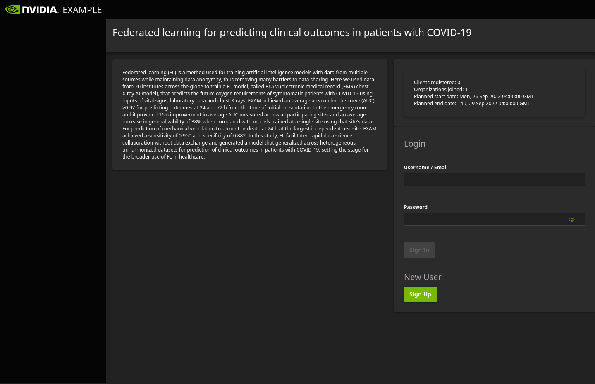

    右側にログインとサインアップのあるホームページ。

NVFlare Dashboard Web サイトのホームページの右側、New User の下に ``Sign Up`` ボタンがあります。ホームページには、
Project Admin が設定したプロジェクトのタイトルと説明のほか、登録済みクライアント、参加組織、
予定されている開始日と終了日といったプロジェクト情報が表示されます。クライアントサイトが承認されると、
プロジェクトの説明の下のホームページに表示されます。

.. _dashboard_new_user_reg:

新規ユーザー登録
--------------------------------

ホームページで ``Sign Up`` をクリックすると、ユーザー登録ページにユーザーのメールアドレス、名前、パスワードを入力するフィールドが表示されます。

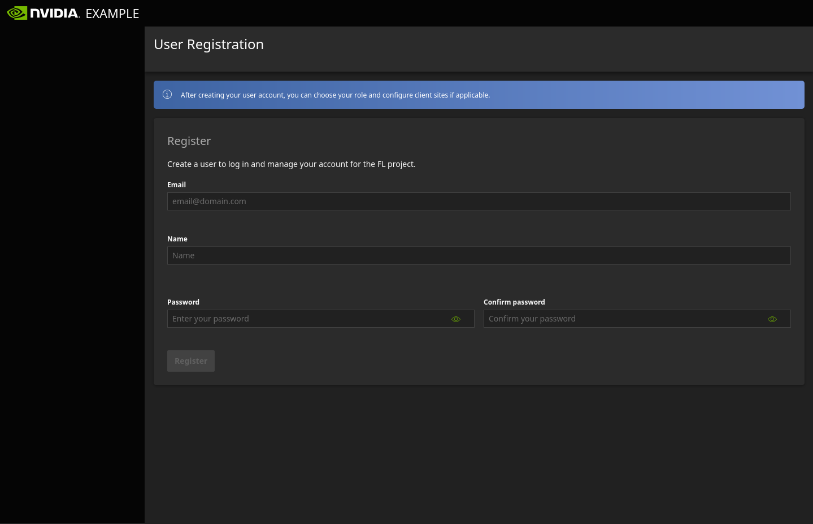

    メールアドレス、名前、パスワードを入力するユーザー登録の最初のページ。

次のページに進み、組織のフィールドを入力してロールを選択します。これらの値を後で更新する必要がある場合は、
Project Admin に連絡して更新してもらう必要があります。

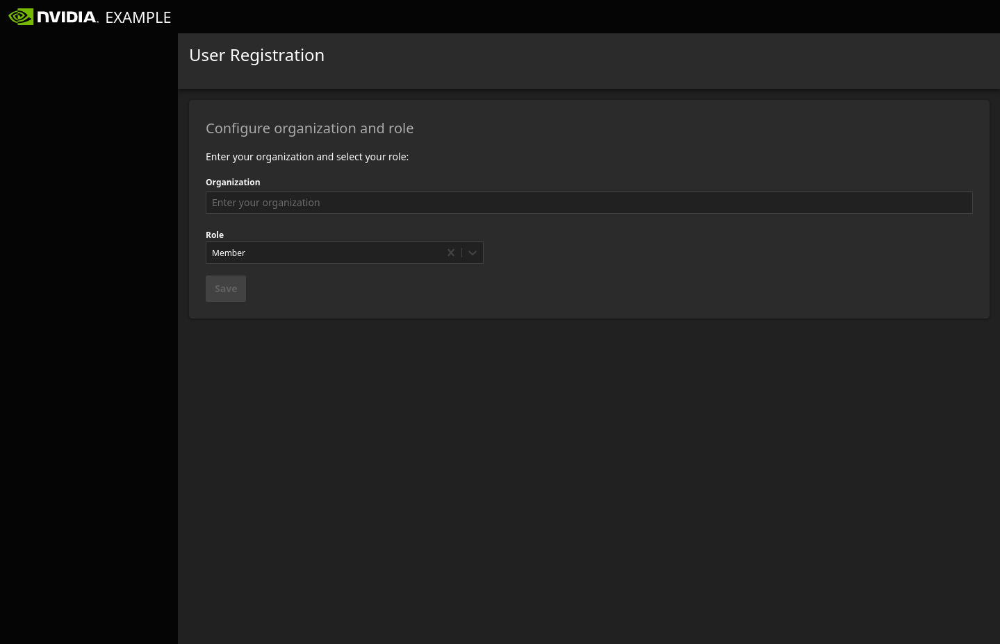

    組織とロールを入力するユーザー登録の 2 ページ目。

このステップの後、登録は完了し、登録した情報が表示されたユーザーダッシュボードに遷移します。

.. _dashboard_user_dashboard_members:

ユーザーダッシュボード
--------------------------------------------

ユーザーダッシュボードでは、``Edit My Profile`` をクリックしてパスワードを更新できますが、その他の変更については Project Admin に連絡して対応してもらう必要があります。

なお、登録直後は、Project Admin に承認されるまでスタートアップキットをダウンロードできません。

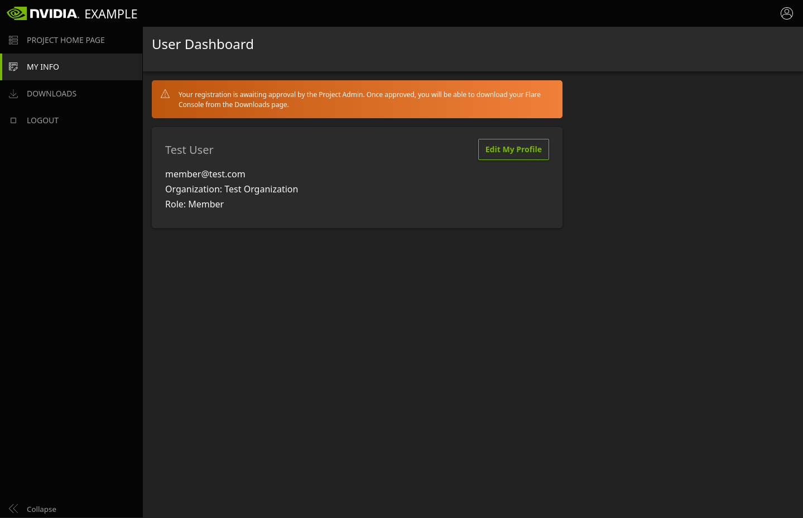

    登録後のユーザー情報。

.. _dashboard_user_download:

FLARE コンソールのダウンロード
------------------------------------------------------------

Project Admin に承認されると、Downloads ページで ``Download FLARE Console`` ボタンが有効になります。これをクリックすると、
ログイン中のユーザー用の FLARE コンソールがダウンロードされます。パッケージは zip 圧縮され、ダウンロードのクリック時に表示される
モーダルウィンドウで提供される PIN によってパスワード保護されます。パッケージの名前は、ユーザーが登録したメールアドレスになります。
なお、FLARE コンソールは、NVIDIA FLARE 2.2 より前は Admin Client と呼ばれていました。

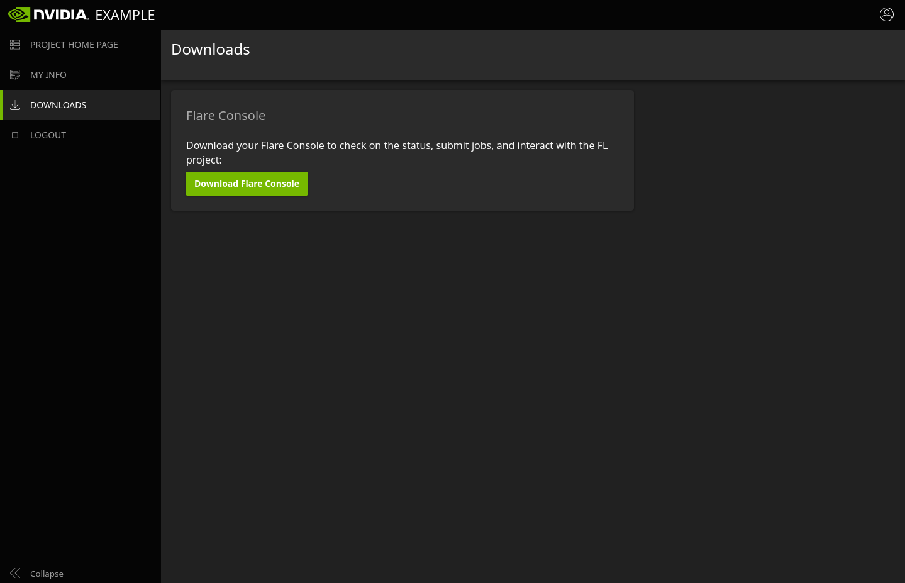

    FLARE コンソールのあるダウンロードページ。

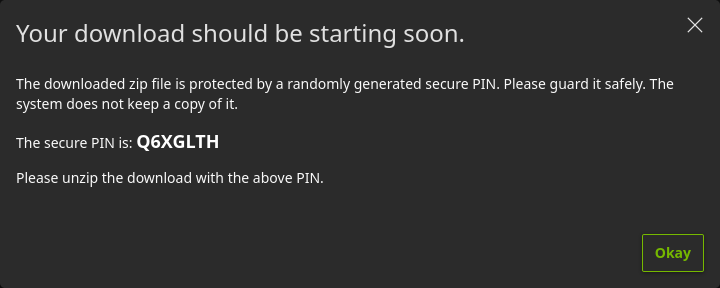

    ダウンロードを解凍するための PIN。

Org Admin ユーザーの操作の流れ
============================================================
``Org Admin`` ロールのユーザーの操作の流れは ``Member`` や ``Lead`` ユーザーと似ていますが、さらにクライアントサイトと
そのリソース仕様を指定し、Project Admin による承認後に各クライアントサイトのスタートアップキットをダウンロードできる点が異なります。

.. _dashboard_org_admin_user_reg:

Org Admin の登録 - クライアントサイトの設定
------------------------------------------------------------------------------------
:ref:`ログインとサインアップのあるホームページ <dashboard_homepage>` と、アカウントを作成して組織とロールを指定する
:ref:`新規ユーザー登録 <dashboard_new_user_reg>` の前半部分は、``Member`` および ``Lead`` ユーザーの場合と同じです。ロールとして ``Org Admin`` を
選択すると、クライアントサイトを指定するインターフェースが表示されます。

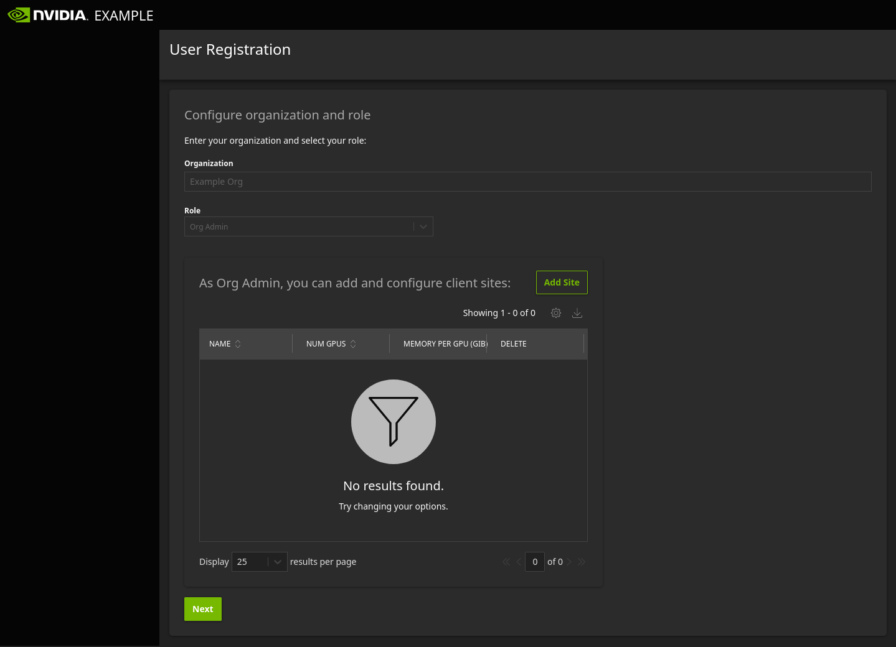

    ロール選択後にクライアントサイトを設定する Org Admin のユーザー登録。

最初はクライアントサイトが存在しないため、テーブルには何も表示されません。クライアントサイトを追加するには、テーブルの右上にある
``Add Site`` をクリックし、テーブル内の新しいクライアントサイトの入力ボックスにクライアントサイト名を入力します。入力欄の外側を
クリックすると値は自動的に更新されます。値を再度クリックすると編集できます。NUM GPU (GPU の数) と MEMORY PER GPU (GPU あたりのメモリ、GiB 単位)の
フィールドもここで編集できます。クライアントサイトの設定が完了したら、下の ``Next`` をクリックして登録を完了すると、ユーザーダッシュボードに遷移します。

Org Admin のユーザーダッシュボード
--------------------------------------------------------------
``Org Admin`` ユーザーのユーザーダッシュボードは、上部は ``Member`` および ``Lead`` ユーザーと同じですが、ユーザー情報の下に
クライアントサイトを追加・編集するインターフェースがあります。

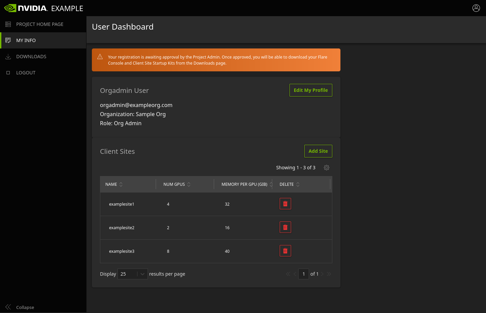

    クライアントサイトを追加・編集するインターフェースのある Org Admin のユーザーダッシュボード。

登録時に設定したクライアントサイトがテーブルに表示され、テーブル内の値のインライン編集も同様に行えます。
フィールドをクリックして編集し、入力欄の外側をクリックすると、更新された値が自動的に保存されます。なお、Project Admin が
クライアントサイトを承認した後は、そのクライアントサイトの名前の編集や削除はできなくなります。

.. _dashboard_org_admin_downloads:

Org Admin のダウンロード
--------------------------------------------------

Project Admin に承認されると、``Member`` および ``Lead`` ユーザーと同様に、Downloads ページで ``Download FLARE Console`` ボタンが
有効になります。FLARE コンソールのダウンロードに加えて、Org Admin は Project Admin が指定したアプリケーションの docker イメージの場所を
確認でき、承認済みのクライアントサイトのスタートアップキットをダウンロードできます。各クライアントサイトのスタートアップキットの名前は、
サイト名に拡張子 ".zip" を付けたものになります。

.. note::

   注記: 各サイトは Project Admin による承認が必要なため、一部のサイトのみ承認され他のサイトは未承認という状態もあり得ます。その場合、
   未承認のクライアントサイトの ``Download Startup Kit`` ボタンは有効になりません。

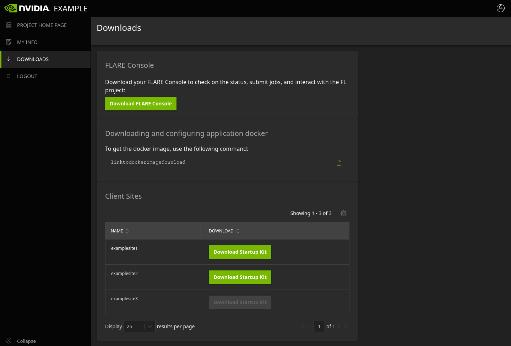

    Org Admin のダウンロードページ。

各パッケージは zip 圧縮され、ダウンロードのクリック時に表示されるモーダルウィンドウで提供される個別の PIN によってパスワード保護されます。

Project Admin ガイド
============================================
``Project Admin`` はサイトの管理者であり、最初にプロジェクトをセットアップするための値を入力し、
その後、必要に応じて編集を行いながらユーザーとクライアントサイトを承認する責任を担います。

FLARE Dashboard の Web サイトパッケージをデプロイした後、Project Admin はデプロイプロセスで提供された
初期(ブートストラップ)認証情報を使ってホームページからログインします。この時点では、プロジェクトの値がまだ何も
設定されていないため、プロジェクトのホームページにはプレースホルダーのタイトルのみが表示されます。

.. note::

   注記: ログイン後、Project Admin には ``Freeze Project`` という追加のオプションが表示されます。プロジェクトを凍結すると
   値を編集できなくなるため、これはすべてのプロジェクトの値が確定した後にのみ実行してください。

.. _dashboard_project_configuration:

プロジェクト設定
------------------------------------
初回ログイン時、Project Admin が最初に誘導されるページはプロジェクト設定(Project Configuration)ページです(プロジェクトの
凍結後は、Users Dashboard に誘導されます)。

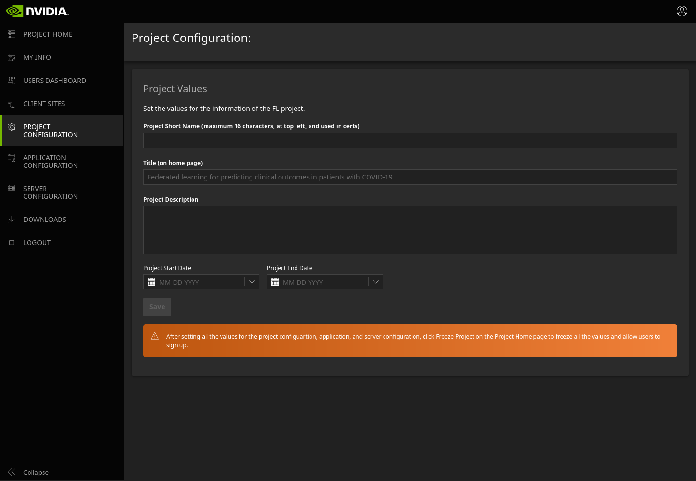

    プロジェクト設定ページ。

プロジェクト設定ページでは、Project Admin は以下を設定できます:

  - Short Name: Web サイトの左上に表示され、証明書にも使用される、最大 16 文字の短い名前
  - Title: プロジェクトのホームページに表示されるプロジェクトのタイトル
  - Description: プロジェクトのホームページに表示されるプロジェクトの説明
  - Start date: プロジェクトの開始日
  - End date: プロジェクトの終了日

.. tip::

   値を入力したら ``Save`` をクリックして変更を保存してください。

.. _dashboard_application_configuration:

アプリケーション設定
----------------------------------------

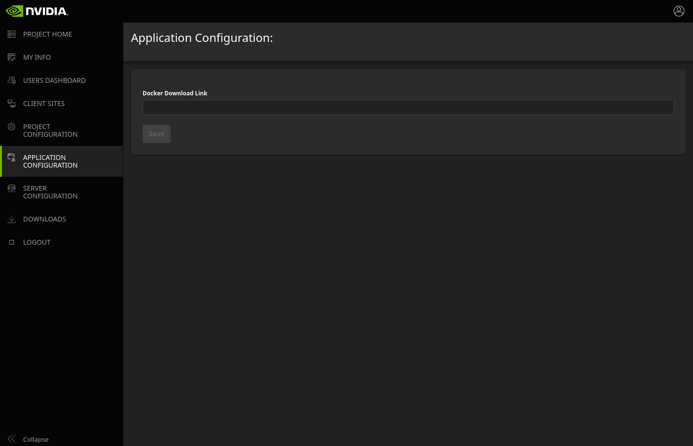

    アプリケーション設定ページ。

アプリケーション設定ページでは、Project Admin は docker イメージのダウンロードリンクを設定できます。これは、
``Org Admin`` ロールのユーザーの Downloads ページに表示されます。

.. _dashboard_server_configuration:

サーバー設定
------------------------

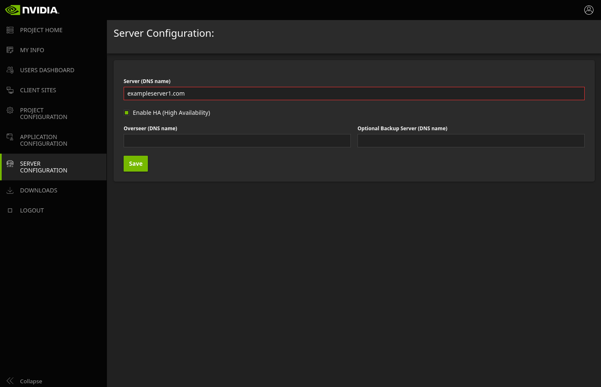

    サーバー設定ページ。

サーバー設定ページでは、Project Admin は FL サーバーの情報を設定できます。

.. _dashboard_users_dashboard:

Users Dashboard
----------------

Users Dashboard では、Project Admin はシステムに登録したすべてのユーザーと、その名前、メールアドレス、組織、
ロール、作成日時、承認ステータス、FLARE コンソールのダウンロード回数を確認できます。

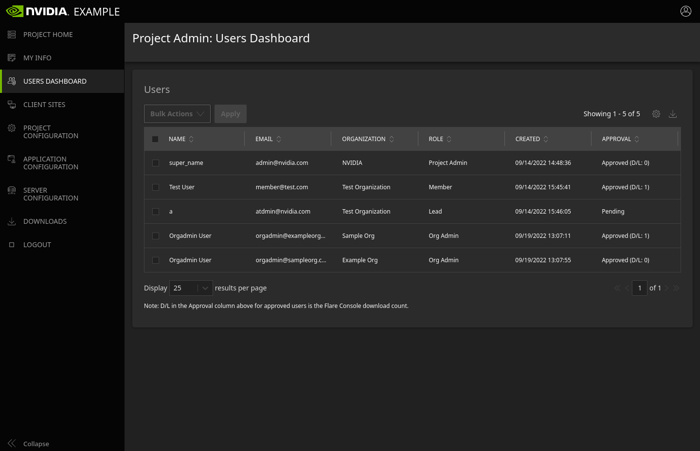

    Project Admin: Users Dashboard。

組織またはロールをクリックすると、Project Admin はインライン編集で値を更新・変更できます。なお、ユーザーは最初に設定した
組織やロールを自分で変更することはできず、これらの値を変更できるのは Project Admin のみです。名前とメールアドレスは
どのユーザーについても変更できないため、変更が必要な場合は、Project Admin がユーザーを削除し、ユーザーに再度サインアップしてもらう必要があるかもしれません。

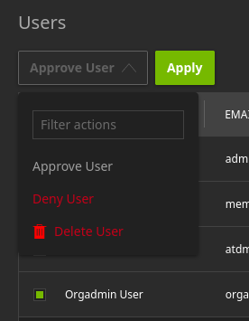

    Project Admin: Users Dashboard での承認、拒否、削除。

Project Admin は、ユーザーレコードの左側のチェックボックスをクリックして単一または複数のユーザーを選択し、
Users テーブルの左上のドロップダウンメニューから目的のアクションを選択して ``Apply`` をクリックすることで、承認(Approve)、拒否(Deny)、削除(Delete)のアクションを適用できます。

ユーザーは、Project Admin に承認されるまで、FLARE コンソールやスタートアップキットをダウンロードできません。

.. _dashboard_client_sites:

Client Sites Dashboard
----------------------

Client Sites Dashboard では、Project Admin はシステム内の各クライアントサイトの名前とキャパシティ仕様に加えて、
そのサイトを作成したユーザーの組織、作成日時、承認ステータス、そのサイトのスタートアップキットのダウンロード回数を確認できます。

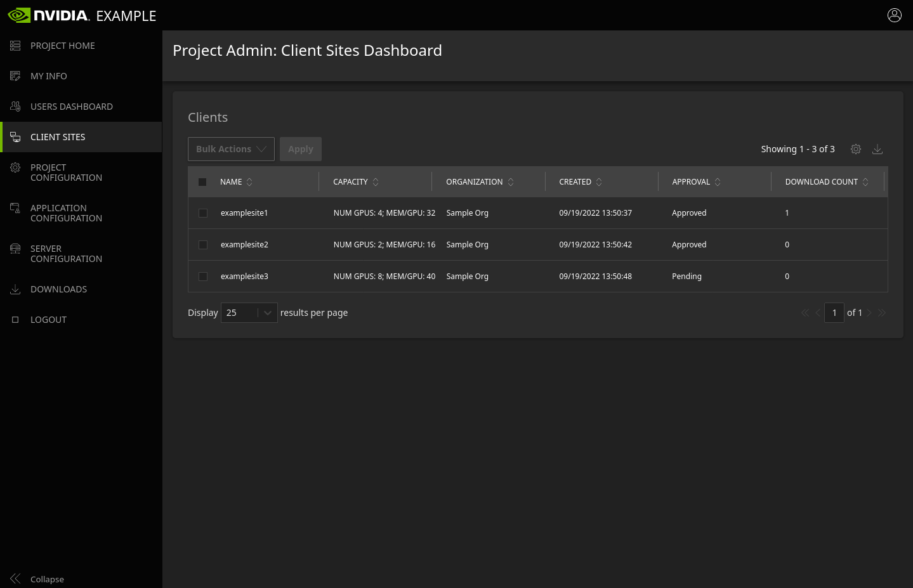

    Project Admin: Client Sites Dashboard。

クライアントサイトの名前をクリックすると、Project Admin はインライン編集でクライアントサイト名を変更できます。なお、
承認済みのクライアントサイトの名前は変更できなくなります。

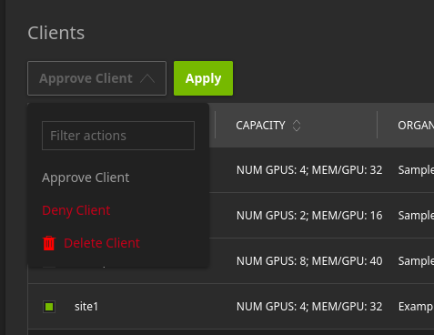

    Project Admin: Client Sites Dashboard でのクライアントサイトの承認、拒否、削除。

Project Admin は、行の左側のチェックボックスをクリックして単一または複数のクライアントサイトを選択し、
テーブルの左上のドロップダウンメニューから目的のアクションを選択して ``Apply`` をクリックすることで、承認(Approve)、拒否(Deny)、削除(Delete)のアクションを適用できます。

Org Admin ユーザーは、クライアントサイトが Project Admin に承認されるまで、そのサイトのスタートアップキットをダウンロードできません。

.. _dashboard_proj_admin_downloads:

Project Admin のダウンロード
------------------------------------------------------

Project Admin にも、他のユーザーと同様にページ上部に ``Download FLARE Console`` ボタンがあります。Org Admin に表示される
アプリケーションの docker イメージの場所は、Project Admin の Downloads ページにも表示されます。これに加えて、Project Admin は
FL サーバーのスタートアップキットをダウンロードできます。

ダウンロードは、プロジェクトの凍結後に可能になります。FL サーバーのスタートアップキットの名前は、
:ref:`サーバー設定 <dashboard_server_configuration>` ページで設定した DNS 名に拡張子 ".zip" を付けたものになります。

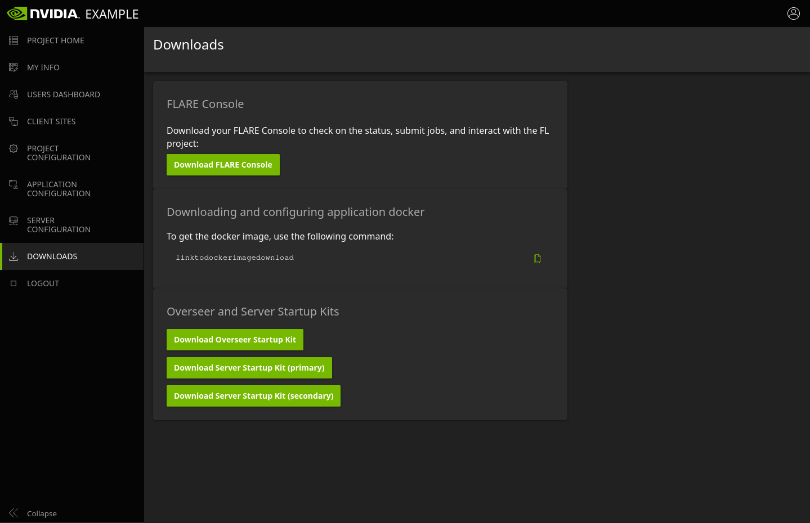

    Project Admin のダウンロードページ。

各パッケージは zip 圧縮され、ダウンロードのクリック時に表示されるモーダルウィンドウで提供される個別の PIN によってパスワード保護されます。
