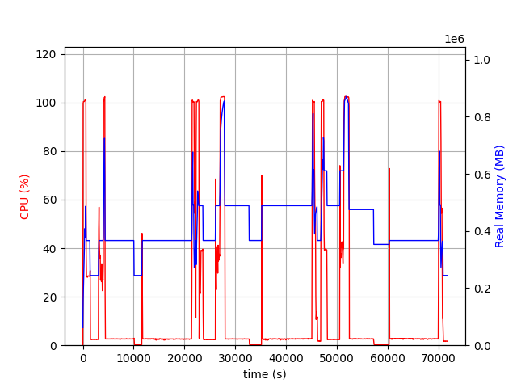
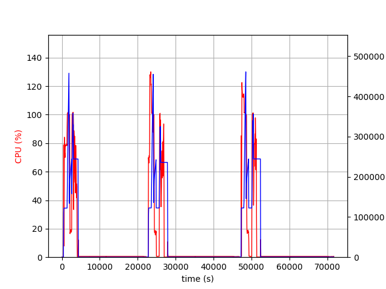
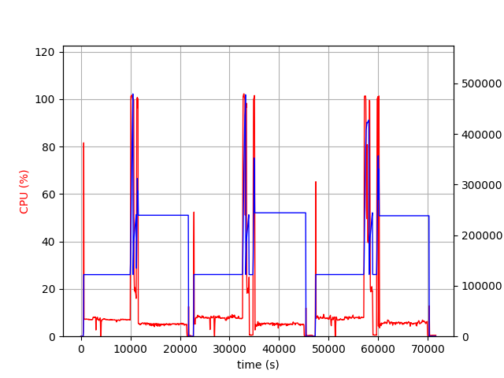

.. _notes_on_large_models:

大規模モデル
============
連合学習のタスクがますます複雑になるにつれて、モデルサイズも増大しています。モデルサイズによっては 2GB を超え、数百 GB に達することもあります。NVIDIA FLARE は、サーバとクライアントのシステムメモリが対応できる限り、
大規模モデルをサポートします。ただし、NVIDIA FLARE ジョブの実行時にこれほど大量のデータを転送する際のネットワーク帯域幅、ひいては所要時間は大きく変動するため、
NVIDIA FLARE の設定とシステムについて特別な考慮が必要です。ここでは、大規模モデルの連合学習ジョブを成功させるためにユーザが考慮すべき設定とシステムを明らかにするため、128GB モデルの学習ジョブについて説明します。

システムのデプロイ
******************
128GB モデル学習の実験を成功させた構成は、1 台の NVIDIA FLARE サーバと 2 台のクライアントで実行されました。サーバは Azure の west-us リージョンにデプロイされました。2 台のクライアントのうち 1 台は
AWS の west-us-2 リージョンに、もう 1 台は AWS の ap-south-1 リージョンにデプロイされました。ネットワーク帯域幅についてさまざまな条件で NVIDIA FLARE システムをテストできるように、
このようにリージョンをまたぎ、クラウドサービスプロバイダをまたぐ形でシステムをデプロイしました。
NVIDIA FLARE サーバの Azure VM サイズは M32-8ms で、875GB のメモリを備えています。NVIDIA FLARE クライアントの AWS EC2 インスタンスタイプは r5a.16xlarge で、512GB のメモリを備えています。また、
すべてのマシンで 128GB のスワップ領域を有効にしました。

``enable_tensor_disk_offload=True`` を使用する PyTorch FedAvg ジョブでは、サーバのメモリ削減は FL サーバの一時ディレクトリが
ディスク上に配置されていることに依存します。サーバの IT 管理者は、サーバを起動する前にサーバプロセスの ``TMPDIR`` を設定して確認する必要があり、
``tmpfs`` や ``ramfs`` のような RAM 上の ``/tmp`` に依存すべきではありません。
サーバのセットアップに関する注意事項は :ref:`連合学習サーバの起動 <starting_fl_servers>` を参照してください。

128GB モデルのジョブ
********************
hello-numpy のサンプルを少し変更し、64 個のキーを持つ辞書であるモデルを生成しました。各キーには 2GB の NumPy 配列が含まれています。ローカルの学習タスクは、
これらの numpy 配列に小さな数値を加算するというものでした。サーバ側のアグリゲータは変更していません。このジョブは少なくとも 2 つのクライアントを必要とし、完了までに 3 ラウンド実行されました。

設定
*******************
サーバと west-us-2 クライアントの間の帯域幅を測定しました。クライアントからサーバへのモデル転送には約 2300 秒、サーバからクライアントへは約 2000 秒かかりました。
ap-south-1 クライアントでは、クライアントからサーバへ約 11000 秒、サーバからクライアントへ約 11500 秒かかりました。このような差異に対応するため、以下の値を更新しました。

    - streaming_read_timeout を 3000 に
    - streaming_ack_wait を 6000 に
    - communication_timeout を 6000 に

`streaming_read_timeout` は、データのチャンクを受信したものの上位レイヤーによって読み取られていない状態を検出するために使用されます。`streaming_ack_wait` は、送信側が 1 つのチャンクについて受信側から返される確認応答をどれだけ待つかを表します。

`communication_timeout` は、単一のリクエストとレスポンスにおける 3 つの連続したステージで使用されます。大きなリクエスト (submit_update) を送信する際、送信側は timeout = `communication_timeout` のタイマーを開始します。
このタイマーが満了すると、送信側はこの期間中に進捗があったかどうかを確認します。進捗があれば、送信側は同じタイムアウト値でタイマーをリセットして再び待機します。進捗がなければ、このリクエストとレスポンスはタイムアウトで返ります。
送信が完了すると、送信側は直前のタイマーをキャンセルし、timeout = `communication_timeout` の `remote processing` タイマーを開始します。これは受信側から返される最初のバイトを待つためのものです。
大規模モデルでは、クライアントが `get_task` リクエストを送信した際、サーバがタスクを準備するのにはるかに長い時間を要します。最初の返却バイトを受信すると、送信側は `remote processing` タイマーをキャンセルし、
新しいタイマーを開始します。送信時と同様に、受信の進捗を確認します。

この実験は hello-numpy をベースにしていたため、ScatterAndGather クラスの引数の 1 つである `train_timeout` を更新する必要がありました。このタイムアウトは学習タスクのスケジューリングを確認するために使用されます。
この実験では、この引数を 60000 に変更しました。

メモリ使用量
*******************
実験中、サーバは 512GB 超、すなわち 128GB × 2 クライアント × 2 (モデルとランタイム領域) を使用する可能性がありました。次の図は、サーバの CPU とメモリの使用量を示しています。

ほとんどの時間においてサーバの使用量は 512GB 未満でしたが、700GB 以上に達するピークが数回ありました。

以下は west-us-2 と ap-south-1 のクライアントです。

west-us-2 のクライアントは、サーバとの帯域幅が高速であるため、約 100 分でモデルの受信と送信を完了し、CPU とメモリの使用量がほとんどないほぼアイドル状態に入りました。
どちらのクライアントも約 256GB、すなわち 128GB × 2 (モデルとランタイム領域) を使用しましたが、大規模モデルの受信の終盤と送信の開始時には、これら 2 つのクライアントは
378GB 超、すなわち 128GB × 3 を必要としました。
