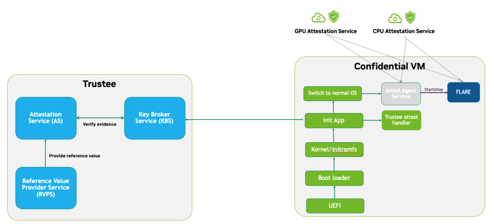
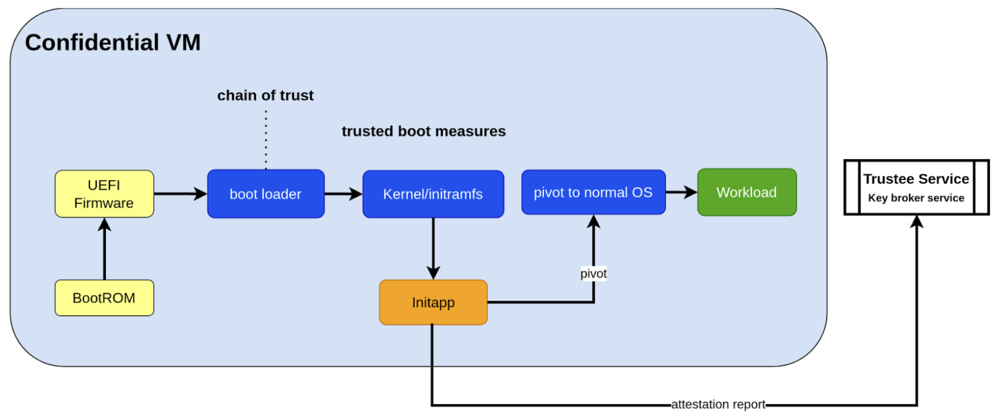
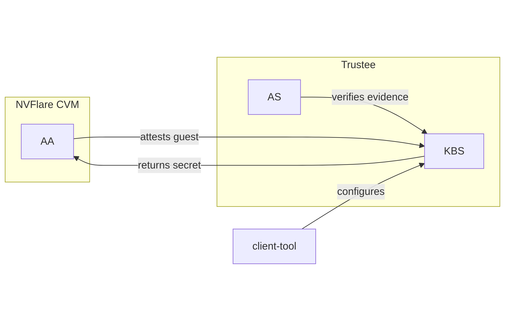
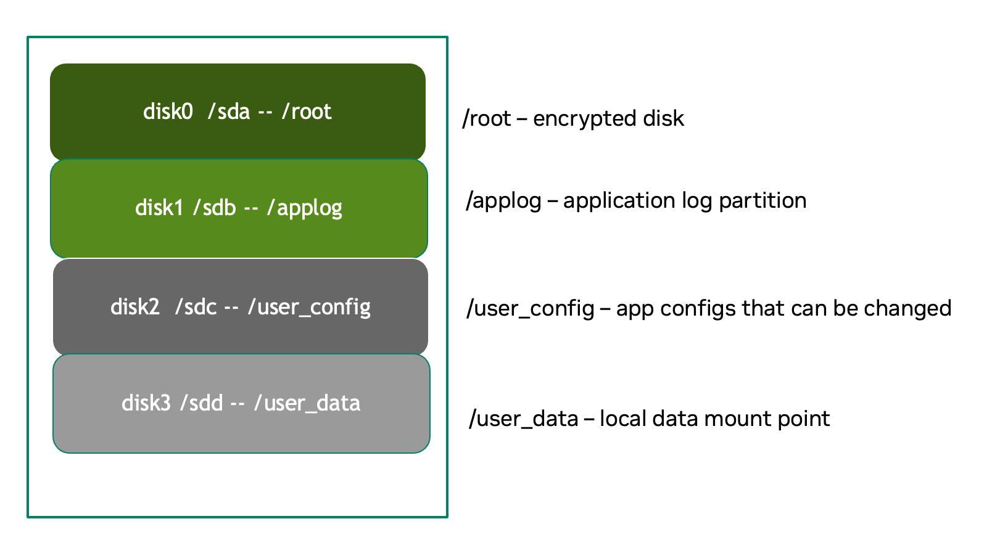
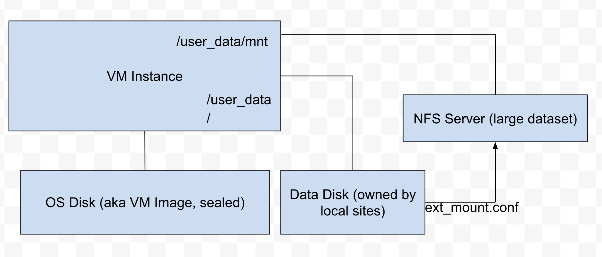

.. _cc_architecture:

##########################################################################
FLARE と機密コンピューティングによる IP 保護セキュリティアーキテクチャ
##########################################################################

.. admonition:: AMD CPU + NVIDIA GPU によるオンプレミス CVM

    現在のアーキテクチャは、オンプレミス展開向けの AMD CPU と NVIDIA GPU を用いた Confidential VM (CVM) を前提としています。
    設計原則は Intel TDX CPU と NVIDIA GPU の組み合わせでも同じですが、現在の実装はオンプレミスの AMD/NVIDIA システムを対象としています。
    TDX のサポートおよびクラウドベースの展開は近日中に提供される予定です。

.. contents::
   :local:
   :depth: 2

はじめに
========

人工知能が各業界で重要な意思決定を担う時代において、機械学習モデルの知的財産 (IP) を保護することは、特に推論および連合学習の場面できわめて重要になっています。これらのモデルは、多くの場合、長年の研究、独自アルゴリズム、そして多大なデータ投資の結晶であり、非常に価値の高い資産です。エッジデバイスやクライアントデバイス上で実行されることが多い推論と、分散したノード間でモデル学習を行う連合学習は、いずれもモデルを信頼できない環境にさらすことになり、IP の窃取やリバースエンジニアリングという重大なリスクを生みます。堅牢な IP 保護がなければ、組織は金銭的損失だけでなく、競争優位性やコンプライアンスへの脅威にも直面します。したがって、学習と推論の全体を通じてモデルの機密性を確保することは、安全な展開、責任あるイノベーション、そして AI システムへの継続的な信頼のために不可欠です。

モデル IP に対するリスクは、展開時およびランタイムのライフサイクルにおける複数の重要なフェーズから生じます。

展開時のリスク
--------------

展開時には、信頼できない環境や検証されていない環境にモデル IP が持ち込まれると、特に脆弱な状態になります。信頼できないホスト、あるいは悪意のあるホスト所有者は、アプリケーションコードを改変したり、実行環境を改ざんしたり、アテステーションや暗号化といったセキュリティメカニズムの有効化を遅らせたりすることで、モデルを傍受できます。モデルがいつどのように復号され、ロードされるのかを厳格に制御しなければ、攻撃者は保護が有効になる前に早期アクセスを得られてしまいます。このため、特にホストが完全には管理されていない環境や、第三者によって運用されている環境では、展開フェーズが重大な露出点となります。

ランタイムのリスク
------------------

展開後であっても、モデル IP はランタイムの脅威にさらされ続けます。ホストシステムは、信頼されているか侵害されているかにかかわらず、十分な防御策が維持されていなければモデルを流出させる可能性があります。攻撃者は脆弱性を悪用してリモートアクセスを取得し、メモリからモデルをコピーしたり、ネットワーク上で傍受したり、ディスク上のチェックポイントから抽出したりする恐れがあります。内部関係者による脅威やマシンへの物理アクセスもデータ流出につながり得ます。機密コンピューティングが提供する VM ベースの Trusted Execution Environment (TEE) は強力な分離保証を提供しますが、これらのメカニズムも万全ではありません。攻撃者が CVM の TEE に直接アクセスできる場合や、TEE 内部のアプリケーションを改変できる場合には、TEE による保護は IP 保護の役に立ちません。ランタイムでモデル IP が流出し得る経路の例を以下に示します。

- 侵害された参加者マシン
- リモート学習マシンへの不正アクセス (直接アクセスまたはネットワークアクセス経由)
- リモートアクセスまたはネットワークからの漏洩
- ストレージからの漏洩 (モデルチェックポイントなど)

設計案とソリューションの概要
============================

課題
----

アプリケーションを Confidential VM (CVM) 上に展開するだけでは、モデル IP を保護するには不十分です。包括的なセキュリティアーキテクチャが必要です。

提案するソリューション
----------------------

以下を組み合わせた安全な展開アーキテクチャです。

- 専用の CVM イメージ
    - ハードウェアからアプリケーションまでのハードウェア裏付けによる信頼の連鎖
    - ネットワーク、ストレージ、アクセスに対する強化されたセキュリティ制御
    - 計測付きブートおよびランタイムアテステーション
- 事前パッケージ化されたワークロードコンテナ
    - FLARE の学習アプリケーションまたは推論サービス
    - モデルの重みと独自コード

セキュリティ保証
----------------

私たちの Minimum Viable Product (MVP) 設計は、展開から実行に至るライフサイクル全体を通じて、侵害された可能性のある環境においてもモデル IP が保護され続けることを保証します。

セキュリティアーキテクチャのコンポーネント
==========================================

IP 保護アーキテクチャ
---------------------

Confidential VM (CVM) イメージを生成する高レベルのアプローチは、VM ベースの Trusted Execution Environment (TEE) アーキテクチャを活用したセキュアな仮想マシン内に、アプリケーションワークロードを埋め込むというものです。強力なセキュリティ保証を確保するため、CVM は完全にロックダウンされます。シェルアクセスは不可、明示的にホワイトリスト化されたポート以外は開放せず、すべてのデータアクセスは暗号化されたディスクパーティションに限定されます。

展開時の改ざんから保護するため、ブートプロセスは機密コンピューティングの信頼の連鎖に基づき、ハードウェアからアプリケーション層まで拡張されます。重要なディスクパーティションは暗号化され、リモートアテステーションが正常に完了するまで復号鍵は保留されます。このアテステーションでは、ベースシステムとアプリケーションの双方が、リモートの trustee サービスにある期待される計測値と照合されます。このチェックに合格して初めて、trustee の key broker サービスが復号鍵をリリースし、CVM は安全に処理を続行できます。

アテステーションは 2 段階で完了します。カーネルが正常にブートすると、アテステーションサービスが第 2 段階のアテステーション (CPU と GPU の両方のアテステーション) を実行します。アテステーションが検証されると、通常のワークロードが開始されます。

前提条件
--------

- CVM イメージを構築する担当者、およびイメージ作成プロセスで使用されるホストマシンを完全に信頼します。これにより、CVM が安全かつ管理された環境で構築されることが保証されます。
- リモートの trustee サービスは、統合された key broker サービスも含めて、安全かつ信頼できるものとします。この設計は trustee サービス自身の保護メカニズムに依存します。
- CVM アプリケーションのブートプロセスの完全性と機密性を検証するにあたり、ブート時の CPU ベースのアテステーションで十分であると仮定します。具体的には、CVM 起動時の一度きりのハードウェア裏付けによるアテステーションで信頼を確立し、継続的なランタイム検証は必要としません。
- 継続的なアテステーションは、アプリケーションレベル (NVFlare のように GPU と CPU の両方のアテステーションを行う) で処理されます。

アーキテクチャ設計
------------------

アプリケーションレベルの完全性確保における主要な課題
^^^^^^^^^^^^^^^^^^^^^^^^^^^^^^^^^^^^^^^^^^^^^^^^^^^^

**既定では信頼の連鎖はカーネルで途切れる:**
機密コンピューティングのハードウェア裏付けによる信頼の連鎖は、通常カーネルで終わります。ユーザーレベルのアプリケーションコードは、既定の計測およびアテステーションのプロセスに含まれません。

**アプリケーション完全性のリスク:**
信頼の連鎖をアプリケーションまで拡張しなければ、ブート時に悪意のある改変が行われる可能性があります。これは、カーネルレベルのアテステーションが成功していたとしても、アプリケーションの完全性とシステム全体の機密性の両方を損なう危険をもたらします。

**アプリケーション計測の必要性:**
エンドツーエンドの信頼を確保するには、アプリケーションレベルの計測値がカーネルによって自動的に算出され、CC 対応ハードウェアによって暗号学的に署名される必要があります。外部の値や手動のハッシュ値に依存すると、攻撃経路を生み出す恐れがあります。

**ユースケース上の考慮点 — ディスク内容は計測されない:**
機密コンピューティングのアテステーションは、ブート時にメモリへロードされるコンポーネントを計測するように設計されています。ディスク上に保存されたアプリケーションバイナリやデータは対象外です。これはアーキテクチャの欠陥ではありませんが、アプリケーション全体の信頼を必要とするユースケースでは対処すべき課題です。

**アプリケーション展開におけるセキュリティ上の含意:**
アプリケーションと関連データがアテステーション対象に含まれていない場合、CVM はそれらの完全性や機密性を保証できず、機微なシナリオでの安全な展開において重大なリスクとなります。

設計アプローチ
^^^^^^^^^^^^^^

本設計では、上記の課題に対して以下のアプローチで対処します。

- **暗号化ストレージ** : CVM は重要なストレージパーティションを暗号化し、機微なコードとデータを不正アクセスから保護します。

- **顧客固有の鍵** : 顧客ごとに固有の復号鍵が紐づけられ、期待されるアテステーション参照値とともにリモートの key broker サービスに安全に保管されます。

- **アテステーションに紐づく鍵リリース** : 復号鍵は CPU ベースのアテステーションが成功した場合にのみリリースされ、CVM とアプリケーションの計測値が一致し、有効な暗号署名を持つ信頼された環境にのみ提供されることが保証されます。

- **2 段階アテステーションと 2 段階鍵リリース** :

  - CPU の検証 → GPU の検証 (信頼の連鎖を CPU から GPU へ拡張)
  - ``dm-verity`` パーティションを用いた 2 段階の鍵リリース

追加のセキュリティ強化
^^^^^^^^^^^^^^^^^^^^^^

- **ディスクセキュリティ** : 暗号化には ``dm-crypt`` を、ディスクパーティションの完全性検証には ``dm-verity`` を活用します。自動マウントは無効化します。
- **アクセス制御** : SSH やコンソールアクセスを含むログイン機構を無効化し、CVM への不正な侵入を防ぎます。
- **ネットワーク強化** : 厳格なファイアウォールルールを設定し、不要なサービスとポートをすべて無効化して、明示的にホワイトリスト化されたネットワークアクセスのみを許可します。

参照値と鍵の保管
----------------

参照値の保管方法には、以下を活用する複数のアプローチがあります。

- リモート key broker サービスを備えた trustee サービス
- Trusted Platform Module (TPM)
- 仮想 TPM (vTPM)

最も一般的な展開シナリオでは、信頼されたホスト (ホスト A) 上で CVM イメージを構築し、それを別の信頼できないホスト (ホスト B) に配布・展開します。この設計では、リモートの trustee サービスを使用することを選択しています。

CVM ブートアッププロセスの設計
------------------------------

ここでは、カーネルを間接的なアテスティング環境として利用し、TEE コンテキスト内の initApp を活用することで、アプリケーションレベルのアテステーションを実現しています。

アテスティング環境としてのカーネル — TEE 内の InitApp を介して
^^^^^^^^^^^^^^^^^^^^^^^^^^^^^^^^^^^^^^^^^^^^^^^^^^^^^^^^^^^^^^

コンセプト概要
""""""""""""""

機密コンピューティング環境 (AMD SEV-SNP、Intel TDX など) では、カーネルはブート時にハードウェア裏付けの信頼の連鎖によってすでに計測されています。カーネルを改変したり、ブートフローのより早い段階に計測ロジックを注入したりする代わりに、私たちはアプリケーションレベルのアテステーションを InitApp と呼ばれる軽量エージェントに委ねます。InitApp は初期ユーザー空間、すなわちカーネルの直後かつアプリケーションワークロードや機微なデータにアクセスする前に実行されます。

主要な設計原則
""""""""""""""

**信頼されたカーネル基盤**

カーネルは信頼の基点として機能します。カーネルはブート時に TEE プラットフォームによって計測され、トラステッドローンチの一部を構成します。

**アテスティングエージェントとしての InitApp**

InitApp は以下を担当します。

- アプリケーションレベルのアテステーションの実行
- trustee サービスおよび key broker との対話

InitApp の配置と計測
""""""""""""""""""""

適切なアテステーションを行うため、InitApp は ``/oem/initapp`` のような外部の場所ではなく、initramfs 内に埋め込まれている必要があります。

**計測の範囲**

アテステーションの計測には以下を含める必要があります。

- カーネル
- カーネル引数 (コマンドライン)
- Initramfs

AMD SEV-SNP では、これは ``kernel-hashes=on`` フラグを用いて設定します。

**設計の根拠**

InitApp を initramfs 内に埋め込むことで、以下が保証されます。

- InitApp がブート時にカーネルメモリへロードされる
- InitApp がアテステーション SDK によって initramfs の一部として自動的に計測される
- 追加の計測メカニズムが不要になる
- initramfs の外に配置すると自動計測が回避され、リプレイ攻撃の脆弱性が生じる

QEMU の起動例
"""""""""""""

.. code-block::

    sudo qemu-system-x86_64 \
      -bios OVMF.amdsev.fd \
      -initrd initrd.img \
      -kernel vmlinuz \
      -append "root=/dev/mapper/crypt_root rw console=ttyS0 pci=realloc,nocrs vm_id=__cvm_id__" \
      -nographic \
      -machine memory-encryption=sev0,vmport=off \
      -object memory-backend-memfd,id=ram1,size=${MEM}G,share=true,prealloc=false \
        -machine memory-backend=ram1 \
        -object sev-snp-guest,id=sev0,cbitpos=${CBITPOS},reduced-phys-bits=1,policy=0x30000,kernel-hashes=on \
      -vga none \
      -enable-kvm -no-reboot \
      -cpu EPYC-v4 \
      -machine q35 -smp $CORES -m ${MEM}G,slots=2,maxmem=512G \
      ...
      <rest of command>

この構成では、
    - ``initrd.img`` がカーネルメモリへロードされ、TEE の計測に含まれることで、InitApp とそのロジックの両方が保護されます。
    - AMD EPYC CPU プロセッサとして EPYC-v4 を使用します
    - OVMF.amdsev.fd を使用します
    - kernel-hashes=on を指定します

計測すべき対象
--------------

Confidential VM (CVM) イメージを準備する際は、信頼されたブートプロセスを維持するために、主要なコンポーネントが計測され暗号学的に検証されるようにすることがきわめて重要です。

AMD SEV-SNP や Intel TDX のような TEE プラットフォームでは、ファームウェアが以下のハッシュを計測し、アテステーションレポートに含めます。

- カーネルバイナリ
- Initramfs (InitApp を含む)
- カーネルコマンドラインパラメータ
- ファームウェア (UEFI/BIOS)
- EFI ブート設定 (プラットフォームと構成による)

これらの計測値はハードウェアに根ざしており、ホストが偽造することはできません。InitApp の改変など、計測対象コンポーネントに何らかの改ざんがあれば、TEE の計測ハッシュが変化します。その結果、Trustee は不一致を検出して鍵のリリースを拒否し、機微なデータの復号を防ぎます。

.. note::

   CVM のディスクイメージ全体に署名したり計測したりする必要はありません。これらの重要なブート時コンポーネントに焦点を当てるだけで、堅牢かつ検証可能な信頼の連鎖を確立するのに十分です。

CVM イメージの計測
^^^^^^^^^^^^^^^^^^

InitApp は ``snpguest`` ツールを使用して CVM イメージの計測を行います。この計測値は、ブートに失敗した場合であっても、常にブートログに出力されます。

計測される内容は次のとおりです。

.. list-table::
   :header-rows: 1

   * - コンポーネント
     - 既定で計測される
     - kernel-hashes=on で計測される
   * - OVMF
     - ✅ はい
     - ✅ はい
   * - カーネル (vmlinuz)
     - ❌ いいえ
     - ✅ はい
   * - initrd/initramfs
     - ❌ いいえ
     - ✅ はい
   * - カーネル引数
     - ❌ いいえ
     - ✅ はい

SEV-SNP の計測値は、以下を対象とした SHA-384 ハッシュです。

- OVMF + ファームウェアの状態
- カーネル
- Initrd
- カーネルコマンドライン
- プラットフォームのローンチポリシー
- ゲストが提供する report_data
- その他

以下の条件が満たされる限り、

- sev-snp-measure と実行時の SEV-SNP ローンチプロセス (すなわち SEV-SNP を有効にした QEMU/KVM) の双方に同一の入力を与えること
- ビルド時と実行時の間にランダム性 (動的なカーネル引数、タイムスタンプ、UUID など) を持ち込まないこと

計測値は完全に一致します。

アテステーションの段階
^^^^^^^^^^^^^^^^^^^^^^

1. **ブート時アテステーション**
   - 範囲: CPU のみ
   - initApp を含む CVM および初期ブートプロセスの完全性を保証します。
   - 起動時に Trustee サービスを用いて実行されます。

2. **ランタイムアテステーション**
   - 範囲: CPU + GPU
   - ランタイム実行中のアプリケーションワークロードを保護するために必要です。
   - 通常はアプリケーションレベルのアテステーションエージェントを伴います。
   - FLARE には機密コンピューティング (CC) マネージャーが統合されており、ランタイムを含む複数の段階でアテステーションを実行して、システムライフサイクル全体で信頼を維持します。

Trustee サービスの統合
======================

概要
----

モデル IP を保護するには、機密コンピューティングのハードウェアだけでは不十分です。追加のインフラストラクチャとサービスが必要であり、なかでも最も重要なのが Trustee サービスです。これには以下のコンポーネントが含まれます。

- アテステーションサービス
- Key Broker サービス

Trustee サービスは、ブートプロセス中に AMD、Intel、ARM の各アーキテクチャにまたがる CPU レベルのアテステーションをサポートしている必要があります。本設計では、CNCF Confidential Containers (CoCo) プロジェクトの Trustee サービスおよびゲストコンポーネントを採用します。
🔗 https://github.com/confidential-containers/trustee

他のオープンソースまたは商用の trustee サービスを使用することもできます。このインフラストラクチャは差し替え可能です。

設計の根拠
----------

この設計は以下の主要な要因に基づいて選択されました。

- 私たちの主眼は、ブートアップ時における initApp の完全性と機密性の保護にあります。
- initApp は GPU とは独立して動作する小さなスクリプトであるため、この段階では GPU アテステーションは不要です。
- key broker サービスとアテステーションの両方を備え、基本的な設定サポートを持つオープンソースの trustee サービスが必要です。現時点で見つけられる選択肢は CoCo Trustee サービスのみです。

NVFlare と Trustee Key Broker Service (KBS) の相互作用
------------------------------------------------------

以下のブロック図は、NVFlare CVM、Attestation Agent (AA)、Key Broker Service (KBS)、Trustee、Attestation Service (AS) の間の相互作用を示しています。

Trustee のポリシー
------------------

「trustee ポリシー」とは、シークレットがどのようにリリースされるか、また機微なデータへのアクセスを許可する前に機密ワークロードの信頼性をどのように検証するかを規定するルールと設定を指します。これは主に 2 種類のポリシー、すなわちリソースポリシーとアテステーションポリシーから構成されます。

- **リソースポリシー** : どのシークレットを特定のワークロードにリリースするかを決定するポリシーで、通常はコンテナ単位でスコープされます。ワークロードが利用できるシークレットを制御し、必要な情報のみが提供されるようにします。
- **アテステーションポリシー** : Trusted Computing Base (TCB) に関するクレームを参照値とどのように比較して、ワークロードの信頼性を判定するかを定義するポリシーです。アテステーションプロセスが、ワークロードが信頼された環境で動作していることをどのように検証するかを規定します。

私たちは、既定のアテステーションポリシーとともに **リソースポリシー** のみを使用すれば十分です。

ポリシーには、必要な計測値 (ハッシュ値) を設定することも、参照値を参照させることもできます。

ポリシーの設定
^^^^^^^^^^^^^^

以下はポリシーの例です。ここで設定するリソースポリシーは、計測値が指定の値に一致する CVM のみがリソース (LUKS 用の鍵) を取得できるようにするものです。

.. code-block:: text

   package policy
   default allow = false

   allow {
       input["submods"]["cpu0"]["ear.veraison.annotated-evidence"]["snp"]["measurement"] == "Cwa8qBJimP2freTTrrpvAZVbEQEyAhPY4fZGgSn9z4qtt0CAGmcS+Otz96qQZ92k"
   }

そして、このポリシーを Trustee サービスに設定するコマンドは次のとおりです。

.. code-block:: bash

   #!/usr/bin/env bash
   TRUSTEE_ADDRESS=<your organization trustee service address>
   PORT=8999

   ROOTCA=keys/rootCA.crt

   sudo kbs-client --url https://$TRUSTEE_ADDRESS:$PORT --cert-file $ROOTCA config --auth-private-key private.key  set-resource-policy --policy-file resource_policy.rego

リソースの設定と取得
^^^^^^^^^^^^^^^^^^^^

KBS クライアントでリソースを設定および取得するコマンドは次のとおりです。

.. code-block:: bash

   kbs-client --url https://$TRUSTEE_ADDRESS:$PORT --cert-file $ROOTCA config --auth-private-key $PRIVATE_KEY set-resource --resource-file $SECRET_FILE --path $URL_PATH
   kbs-client --url https://$TRUSTEE_ADDRESS:$PORT --cert-file $ROOTCA get-resource --path $URL_PATH

.. note::

   ``--path $URL_PATH``: 現時点では、これはアイデンティティの名前空間分離のために使用されます。

CVM の実装詳細
==============

ディスクレイアウトとセキュリティ
--------------------------------

ディスクパーティション
----------------------

.. list-table::
   :header-rows: 1

   * - パーティション
     - マウントポイントまたはホスト上の場所
     - 内容
     - 暗号化
     - 備考
   * - Kernel + Initramfs
     - host
     - カーネルイメージ、initramfs
     - ❌
     - 改ざんすると計測値が変化しブートに失敗します
   * - Boot Log
     - host
     - initramfs と InitApp による初期ブートログ
     - ❌
     - ホストからブート失敗を監視できます
   * - Root Filesystem
     - /root
     - Ubuntu OS のフルインストール
     - dm-crypt
     - 暗号化されたルートファイルシステム
   * - App Log
     - /applog
     - アプリケーションログ
     - ❌
     - 別イメージ。CVM 停止後も読み取り可能
   * - User Config
     - /user_config
     - ユーザー設定ディレクトリ
     - ❌
     - CVM 起動前に変更可能
   * - User Data
     - /user_data
     - ユーザーが提供するデータ
     - ❌
     - 別イメージとして接続。NFS マウントをサポート
   * - Temporary Files
     - /tmp
     - ランタイムの一時ファイル (RAM)
     - TEE
     - TEE によって保護される RAM ディスク
   * - Swap
     - N/A
     - N/A
     - N/A
     - 無効化

ディスクセキュリティ対策
------------------------

**マウントのセキュリティ**

外部デバイスの不正または偶発的なマウントを防ぐため、自動マウントは無効化されています。

**暗号化**

- **ルートファイルシステム** : ``dm-crypt`` で暗号化されます。復号鍵はアテステーションが成功した後にのみリリースされます
- **一時ストレージ** : ``/tmp`` は TEE のハードウェア暗号化によって保護される RAM ディスクです
- **ユーザーデータ** : 設計上は暗号化されません。必要に応じてユーザーが外部でデータ暗号化を制御します

パーティションの詳細
--------------------

**ロギング**

``bootlog`` - ホストマシン上のファイル

このログはブートプロセスを記録し、セットアップ時やデバッグ時、特にブート失敗の診断において不可欠です。ブートログは (CVM 内部ではなく) ホストマシンに保存され、ブートプロセス中に書き込み可能です。

``/applog`` - CVM ディスク上のパーティション

このログはアプリケーションレベルの出力 (FLARE のログなど) を記録します。たとえばクライアントとサーバー間の接続問題を調査する場合など、デバッグを助けるために書き込み可能になっています。ログはホストから参照でき、独立したイメージファイルとして実装されています。これにより、CVM が停止した後もログ解析を継続できます。

**設定**

``/user_config`` - CVM ディスク上のパーティション

user_config パーティションは、ワークロードの挙動を変更し得るユーザー固有の設定を格納するためのものです。このパーティションはホストに公開されており、CVM の外部から変更できます。

たとえば FLARE アプリケーションでは、各サイトがプライバシーポリシーや認証設定など、サイト固有のローカル設定を持ちます。

ユーザーデータボリュームの構成
------------------------------

ユーザーデータは、``/user_data`` にマウントされる暗号化されていないドライブイメージ (``user_data.qcow2``) を介して提供されます。ユーザーは CVM を起動する前に、必要なデータをこのドライブにコピーできます。

**NFS マウントのサポート**

リモートデータへのアクセスのために NFS マウントがサポートされています。``/user_data`` に以下の形式の ``ext_mount.conf`` ファイルが存在する場合、CVM は自動的に NFS ボリュームをマウントします。

.. code-block:: text

   $NFS_SERVER_NAME_or_IP:$EXPORT_DIR

例:

.. code-block:: text

   172.31.53.113:/var/tmp/nfs_export

NFS エクスポートは以下のコマンドで ``/user_data/mnt`` にマウントされます。

.. code-block:: bash

   sudo mount -t nfs -o resvport $NFS_EXPORT /user_data/mnt

.. note::

   ネットワーク経路で NAT が使用されている場合は、NFS エクスポートを insecure として設定してください。

   .. code-block:: bash

      /training_data *(rw,sync,no_subtree_check,insecure)

アクセスとネットワークのセキュリティ
------------------------------------

CVM のロックダウン
^^^^^^^^^^^^^^^^^^

CVM は、不正な侵入や操作を防ぐため、包括的なアクセス制限を備えて設計されています。

**管理者アクセス**

- sudoers ファイルからすべてのユーザーを削除することで、システムは管理者不在 (admin-less) として構成されます
- OS レベルのログインは完全に無効化されています
- SSH (sshd) は無効化されています
- シリアルコンソールアクセスは無効化されています

**ネットワーク制限**

すべてのネットワーク接続は認証され、TLS によって暗号化されることで、アテステーションサービスやアプリケーションエンドポイントとの安全な通信が確保されます。

インバウンドとアウトバウンドの両方のトラフィックに対し、iptables を用いたホワイトリスト方式のポート制御による厳格なファイアウォールポリシーが適用されます。

- **既定ポリシー** : すべてのインバウンドおよびアウトバウンドのポートをブロックします
- **インバウンドのホワイトリスト** : 以下の用途に対して明示的に許可されたポートのみを開放します

  - アプリケーション通信 (FLARE サーバーがクライアント接続を受け付ける場合など)

- **アウトバウンドのホワイトリスト** : 以下の用途に対して明示的に許可されたポートのみを開放します

  - DNS 解決
  - アテステーションサービスとの通信
  - アプリケーションサーバーへの接続 (FLARE クライアントからサーバーへの接続など)
  - 実験トラッキングサービス (MLflow など)
  - 管理・監視サービス (設定されている場合)

この多層防御のアプローチにより、攻撃者がホストレベルのアクセスを得たとしても、ログインしたり、リモート接続したり、許可されていないネットワーク経路で通信したりすることはできません。

アプリケーションレベルのセキュリティ
====================================

基本的な CVM セキュリティに加えて、アプリケーションレベルでの追加のセキュリティも必要です。これはアプリケーションの種類によって異なる場合があります。

一般的なセキュリティ対策
------------------------

すべてのアプリケーションに対して、以下の追加のセキュリティ対策が必要です。
    - **アテステーションサービスエージェント** :
        - 起動時に CPU と GPU の両方のアテステーションサービスを用いて自己アテステーションを実行します。
        - ブートレベルのアテステーションは CPU のみが対象であるため、GPU についてもアテステーションが必要です。
        - システムが侵害されていないことを確認するために、定期的な自己テストを実行します。
    - **コードレベルのセキュリティ** :
        - 動的なコード変更を認めません。

FLARE 固有のセキュリティ
------------------------

連合学習のプロビジョニングプロセス
^^^^^^^^^^^^^^^^^^^^^^^^^^^^^^^^^^

連合学習のプロビジョニングとは、参加する各組織向けのソフトウェアパッケージ (FLARE のスタートアップキット) を準備するプロセスです。クライアントとサーバーは、それぞれ異なるスタートアップキットを受け取ります。パッケージはプロジェクト管理者が所有するシステムで準備され、その後各参加者に配布されます。次に、まず FL サーバーを起動し、FL クライアントサイトがスタートアップキットを起動して FL サーバーに接続します。

明確に区別される 3 つのフェーズがあります。

- **プロビジョニングプロセス** – ソフトウェア成果物 (スタートアップキット) を準備します。
- **配布プロセス** – ソフトウェアパッケージが参加者に配布されます。
- **ランタイムプロセス** – 各参加者のホストマシンで、参加者がパッケージを展開し、FL システムを起動して、FL サーバーと参加者の間の通信を確立します。

用語
^^^^

議論を簡潔にするため、以下の役割を定義します。

- **プロジェクト管理者 (Project Admin)** : プロジェクト全体の立ち上げと管理に責任を持つ個人です。参加者の承認、リソースのプロビジョニング、Confidential VM (CVM) ビルドプロセスの起動などを行います。

- **モデル所有者 (Model Owner)** : 事前学習済みモデルと最終的な学習済みモデルの両方を所有する主体 (個人または組織) です。主にモデルの知的財産の保護に関心があります。

- **データ所有者 (Data Owner)** : 学習に使用されるプライベートデータを所有する主体です。データのプライバシーとセキュリティが主な関心事です。

- **組織管理者 (Org Admin)** : 参加組織の IT 管理者です。ローカル環境のセットアップと、サイト固有の連合学習 (FL) システムインスタンス (FL クライアントなど) の起動を担当します。

プロセス
^^^^^^^^

- **プロビジョニングプロセス** : 生成される CVM イメージはアクセス不可のロックダウン状態になります。これは前述の追加のセキュリティ強化策によって実現されます。
- **配布プロセス** : CLI ベースのプロビジョニングでは、CVM イメージファイルの配布方法は顧客の判断に委ねます。
- **展開・起動** : 参加者は CVM イメージを CC 対応ホストに展開し、学習に必要な NFS データボリュームを追加して、起動スクリプトを実行してシステムを開始します。

.. note:: FLARE Dashboard のサポート
    現在のリリースでは、CVM のプロビジョニングにおいて FLARE Dashboard によるプロビジョニングはサポートされていません。

FLARE のアテステーション検証
^^^^^^^^^^^^^^^^^^^^^^^^^^^^

FLARE の CC マネージャーは、3 種類のアテステーションを実行します。

- **自己アテステーション**
- **クライアントとサーバー間の相互検証**
- **定期的な相互検証**

FLARE のワークロード実行とアクセス制御ポリシー
^^^^^^^^^^^^^^^^^^^^^^^^^^^^^^^^^^^^^^^^^^^^^^

- すべての学習コードおよび推論コードは、ワークロードに含める前に事前レビューと承認を受ける必要があります。
- アプリケーションとその依存関係は、ワークロード用の Docker イメージに事前インストールされています。
- ジョブの実行は、あらかじめ定義されたジョブ設定を送信することによって開始されます。ランタイムでの動的なコード、カスタムコード、ユーザー提供コードは一切許可されません。

IP 保護のユースケースについて
^^^^^^^^^^^^^^^^^^^^^^^^^^^^^

- グローバルモデルやログを含む結果をダウンロードできるのは、プロジェクト管理者のみです。
- 他のすべてのユーザーについてはダウンロード権限が無効化されており、個々のサイトレベルで上書きすることはできません。

参考資料
========

- NVIDIA Deployment Guide for SecureAI: https://docs.nvidia.com/cc-deployment-guide-tdx.pdf
- RATS architecture: https://www.rfc-editor.org/rfc/rfc9334.html
- Google Confidential Space Security Overview: https://cloud.google.com/docs/security/confidential-space
- Confidential containers trustee attestation service solution overview and use cases https://www.redhat.com/en/blog/introducing-confidential-containers-trustee-attestation-services-solution-overview-and-use-cases
- Confidential Container Trustee: https://github.com/confidential-containers/trustee
- Azure confidential computing: harden the linux image to remove sudo users: https://learn.microsoft.com/en-us/azure/confidential-computing/harden-the-linux-image-to-remove-sudo-users
- Microsoft Secure the Windows boot process. https://learn.microsoft.com/en-us/windows/security/operating-system-security/system-security/secure-the-windows-10-boot-process
- Microsoft Secure Boot. 以下のリンクは上記の記事に関連しています。
  - https://learn.microsoft.com/en-us/windows-hardware/design/device-experiences/oem-secure-boot
- SEV-SNP measurement tool: https://github.com/virtee/sev-snp-measure

