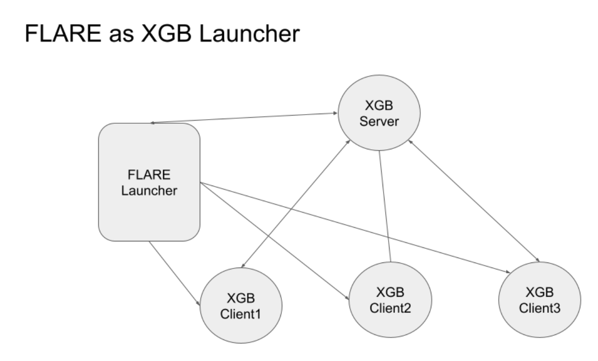
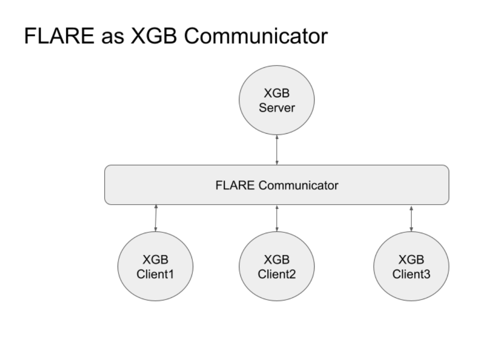
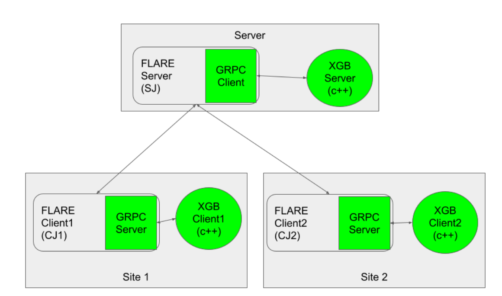

########################################
信頼性の高い連合 XGBoost の設計
########################################

********************************************
XGBoost ランチャーとしての FLARE
********************************************

NVFLARE は、XGBoost システムを起動するための発射台として機能します。
いったん起動すると、次の図に示すように、XGBoost システムは FLARE とは独立して動作します。

このアプローチにはいくつかの潜在的な問題があります。

 - ご存じのとおり、MPI は完璧な通信ネットワークを必要としますが、
   インターネット越しの単純な gRPC は不安定になり得ます。

 - ジョブごとに、XGBoost サーバーはクライアントが接続するためのポートを開放しなければなりません。
   これは実際の運用環境において、追加のポート開放を IT 部門に依頼する負担を生みます。
   仮に固定ポートの開放が許可され、そのポートを再利用したとしても、
   複数の XGBoost ジョブを同時に実行することはできません。
   各 XGBoost ジョブは異なるポート番号を必要とするためです。

******************************************************
XGBoost コミュニケーターとしての FLARE
******************************************************

FLARE は、非常に柔軟でスケーラブル、かつ信頼性の高い通信メカニズムを提供します。
ここに示すように、FLARE を XGBoost のコミュニケーターとして使用することで、
連合 XGBoost の信頼性を高めます。

詳細設計
============

オープンソースの連合 XGBoost (c++) は、通信プロトコルとして gRPC を使用しています。
FLARE をコミュニケーターとして使用するには、XGBoost の gRPC メッセージを FLARE 経由で
ルーティングするだけです。そのために、各 XGBoost クライアントのサーバーエンドポイントを、
FLARE クライアント内のローカル gRPC サーバー (LGS) に変更します。

この図に示すように、各サイトにはローカル gRPC サーバー (LGS) があり、
そのサイト上の XGBoost クライアントに対するサーバーエンドポイントとして機能します。
同様に、FL サーバー上にはローカル gRPC クライアント (LGC) があり、
XGBoost サーバーとやり取りします。XGBoost クライアントと XGBoost サーバーの間の
メッセージ経路は次のとおりです。

  1. XGBoost クライアントが gRPC メッセージを生成し、FLARE クライアント内の LGS に送信します。
  2. FLARE クライアントがそのメッセージを FLARE サーバーに転送します。これは信頼性のある FLARE メッセージです。
  3. FLARE サーバーが LGC を使ってメッセージを XGBoost サーバーに送信します。
  4. XGBoost サーバーが応答を FLARE サーバー内の LGC に返します。
  5. FLARE サーバーが応答を FLARE クライアントに返します。
  6. FLARE クライアントが LGS 経由で応答を XGBoost クライアントに返します。

なお、XGBoost クライアント (c++) コンポーネントは、別プロセスとして実行することも、
FLARE クライアントと同じプロセス内で実行することもできます。
