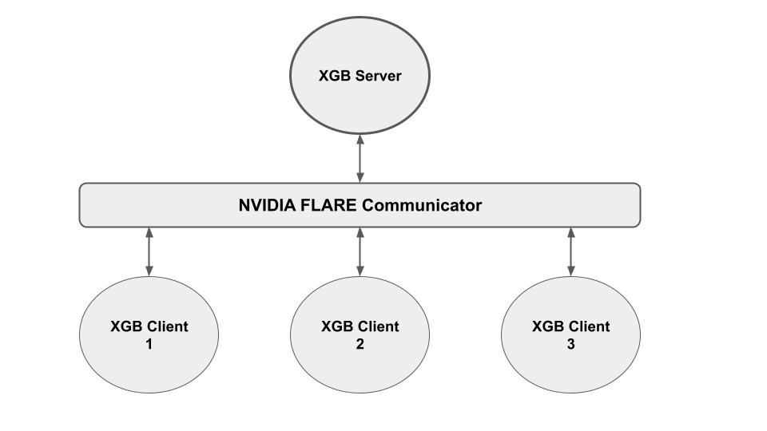
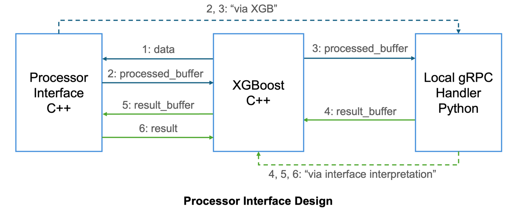
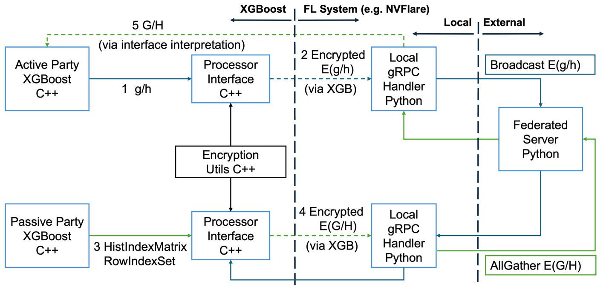
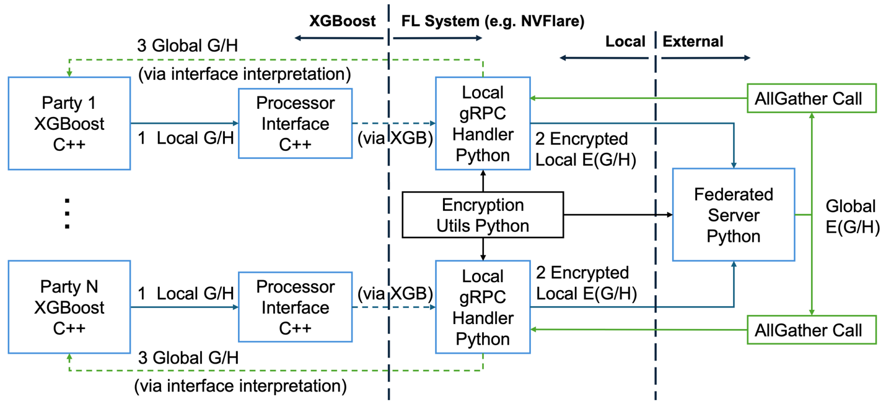

####################################
セキュア連合 XGBoost の設計
####################################

コラボレーションモードとセキュアパターン
==========================================

水平セキュア
-------------

水平 XGBoost では、各パーティが「対等な立場」を持ちます。すなわち、部分的な母集団に対する全特徴量とラベルを保持し、連合サーバーはデータを一切保有せずに集約を行います。
したがってこの場合、モデル学習の観点では連合サーバーが「マイナーな貢献者」であり、クライアント側にはサーバーへ情報が漏洩する懸念があります。
この設定下では、保護は主に連合サーバーに対するローカルヒストグラムの保護となります。

水平コラボレーションにおいてローカルヒストグラムを保護するため、ローカルヒストグラムは集約のために連合サーバーへ送信される前に暗号化されます。
集約は暗号文上で実行され、暗号化されたグローバルヒストグラムがクライアントに返され、そこで復号されてツリー構築に使用されます。

垂直セキュア
-------------

垂直 XGBoost では、アクティブパーティがラベルを保持します。これはパッシブパーティからはアクセスできず、プロセス全体にとって最も価値のある資産とみなせます。
したがってこの場合、モデル学習の観点ではアクティブパーティが「主要な貢献者」であり、この情報がパッシブクライアントへ漏洩する懸念を持ちます。
この場合、セキュリティ保護は主にパッシブクライアントに対するラベル情報の保護となります。

垂直コラボレーションにおいてラベル情報を保護するため、XGBoost の各ラウンドで、アクティブパーティが各サンプルの勾配を計算した後、その勾配はパッシブパーティへ送信される前に暗号化されます。
暗号化された勾配（暗号文）を受け取ると、各パッシブパーティにおける固有の特徴量分布に従ってそれらが累積されます。
その結果得られる累積ヒストグラムはアクティブパーティに返され、復号されて、アクティブパーティでのツリー構築にさらに使用されます。

プロセッサーインターフェースによる暗号化の分離
================================================

現在の設計では、XGBoost の通信はローカル gRPC ハンドラーを介して NVIDIA FLARE コミュニケーター層へルーティングされます。
通信の観点からは、これまで XGBoost 内部で直接やり取りされていたメッセージが FL コミュニケーターによって処理されるようになり、FL システムを経由して XGBoost に出入りする「外部通信」となります。
これにより、XGBoost 内（FL コミュニケーターに入る前）と FL システム内（FL コミュニケーターによる処理）の両方でメッセージ操作を行う柔軟性が得られます。

NVFlare では、XGBoost プラグインは C++ で実装され、FL システムのコミュニケーターは Python で実装されます。特定の HE 手法とコラボレーションモードに向けて実装されたプラグインを取り込むことで、両者を適切に接続するプロセッサーインターフェースが設計・開発されています。

プロセッサーインターフェースの設計

  1. XGBoost から特定の MPI 呼び出しを受け取ると、対応する各パーティがデータ処理（シリアライズなど）のためにインターフェースを呼び出し、必要な情報（g/h のペア、またはローカルの G/H ヒストグラム）を提供します
  2. プロセッサーインターフェースが必要な処理（および暗号化）を行い、処理済みバッファとして結果を返します
  3. 次に各パーティが、そのメッセージを FL システム側のローカル gRPC ハンドラーへ転送します
  4. メッセージのルーティングと計算を伴う FL 通信の後、各パーティは MPI 呼び出しによって結果バッファを受け取ります
  5. 次に各 FL パーティが、受け取ったバッファを解釈のためにプロセッサーインターフェースへ送ります
  6. インターフェースが必要な処理（デシリアライズなど）を行い、適切な情報を復元して、さらなる計算のために結果を XGBoost へ返します

なお、暗号化／復号は、検討対象となる HE ライブラリやスキームに応じて、プロセッサーインターフェース (C++) で実行することも、ローカル gRPC ハンドラー (Python) で実行することもできます。

システム設計
=============
セキュアなソリューション、通信パターン、プロセッサーインターフェースを踏まえ、以下ではセキュア連合 XGBoost（垂直・水平の両方）の設計例を示します。

垂直パイプラインの場合:

  1. アクティブパーティが、自身の保有するラベル情報を用いてまず g/h を計算します
  2. g/h データはプロセッサーインターフェースへ送られ、C++ ベースの暗号化ユーティリティライブラリで暗号化され、FL 通信を介してパッシブパーティへ送信されます
  3. パッシブパーティは、ローカルの特徴量分布に従ってヒストグラム計算のためのインデックス情報を提供し、プロセッサーインターフェースが受け取った E(g/h) を用いて集約を実行します
  4. 結果として得られる E(G/H) は、FL のメッセージルーティングを介してアクティブパーティへ送信されます
  5. アクティブパーティ側のプロセッサーインターフェースで復号され、グローバルヒストグラム情報を用いてツリー構築を実行できます

XGBoost 側で暗号化を行うセキュア垂直連合 XGBoost
この場合、暗号化やセキュア集約などの「重い処理」はプロセッサーインターフェースが担当します。

水平パイプラインの場合:

  1. すべてのパーティがプロセッサーインターフェースを介してローカルの G/H ヒストグラムを FL 側へ送信します。この設計では、プロセッサーインターフェースは複雑な処理を行わず、バッファの準備のみを行います
  2. 連合サーバーへ送信する前に、G/H ヒストグラムは Python ベースの暗号化ユーティリティライブラリを用いてローカル gRPC ハンドラーで暗号化されます
  3. 連合サーバーは、受け取った部分的な E(G/H) に対してセキュア集約を実行し、グローバルな E(G/H) を各クライアントへ配布します。クライアント側ではグローバルヒストグラムが復号され、以降のツリー構築に使用されます

FL 側で暗号化を行うセキュア水平連合 XGBoost
この場合、暗号化は FL システム側で行われます。

