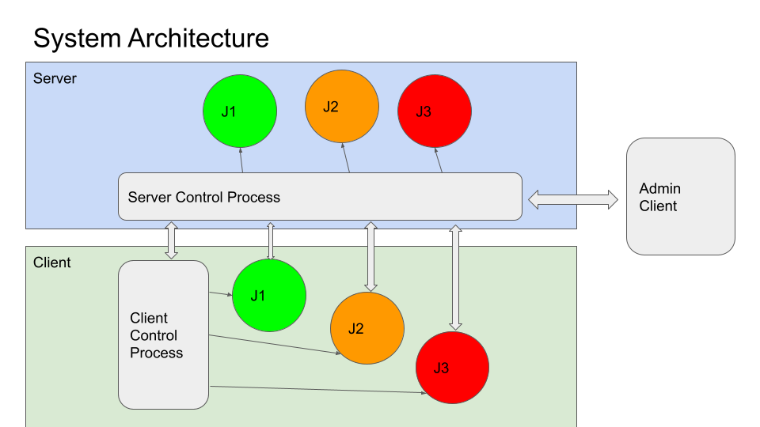

**********************************
FLARE のマルチジョブアーキテクチャ
**********************************

計算リソースの利用効率を最大化するため、FLARE は複数のジョブを同時に実行することをサポートしています。
各ジョブはそれぞれ独立した FL 実験です。

上の図に示すように、サーバーホスト上にはサーバー制御プロセス (SCP) があり、各クライアントホスト上には
クライアント制御プロセス (CCP) があります。SCP は CCP と通信してジョブを管理します（ジョブのスケジュール、
デプロイ、監視、中止）。ジョブが SCP によってスケジュールされると、そのジョブは全サイトの CCP に送られ、
CCP がそのジョブ用の個別プロセスを生成します。これらのプロセスがそのジョブの「ジョブネットワーク」を
形成します。このネットワークはジョブが終了すると消滅します。

図では、サーバーとクライアント上に 3 つのジョブ (J1、J2、J3) が異なる色で示されています。たとえば、
すべての J1 プロセスがジョブ 1 の「ジョブネットワーク」を形成します。

デフォルトでは、同じジョブネットワークのプロセス同士は直接接続されません。代わりに SCP にのみ接続し、
ジョブプロセス間のすべてのメッセージは SCP を経由して中継されます。ただし、ネットワークポリシーが許可すれば、
通信速度を最大化するために、ジョブプロセス間で直接の P2P 接続を自動的に確立することもできます。
基盤となる通信経路はアプリケーションからは透過的であり、直接通信を有効にするには設定変更のみが必要です。
