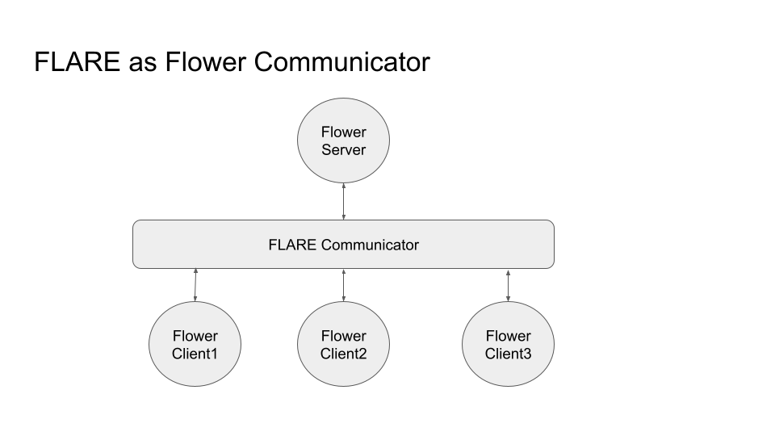

**********
詳細設計
**********

Flower は通信プロトコルとして gRPC を使用しています。FLARE をコミュニケーターとして使用するため、
Flower の gRPC メッセージを FLARE 経由でルーティングします。そのために、各 Flower クライアントの
サーバーエンドポイントを、FLARE クライアント内のローカル gRPC サーバー (LGS) に変更します。

この図に示すように、各サイトにはローカル gRPC サーバー (LGS) があり、そのサイト上の Flower
クライアントに対するサーバーエンドポイントとして機能します。同様に、FLARE サーバー上には
Flower サーバーとやり取りするローカル gRPC クライアント (LGC) があります。Flower クライアントと
Flower サーバーの間のメッセージ経路は次のとおりです。

   - Flower クライアントが gRPC メッセージを生成し、FLARE クライアント内の LGS に送信します
   - FLARE クライアントがそのメッセージを FLARE サーバーに転送します。これは信頼性のある FLARE メッセージです
   - FLARE サーバーが LGC を使ってメッセージを Flower サーバーに送信します
   - Flower サーバーが応答を FLARE サーバー内の LGC に返します
   - FLARE サーバーが応答を FLARE クライアントに返します
   - FLARE クライアントが LGS 経由で応答を Flower クライアントに返します

なお、Flower クライアントは別プロセスとして実行することも、FLARE クライアントと同じプロセス内で実行することもできます。

これにより、NVFlare のランタイム環境内で開発された Flower の ServerApp と ClientApp を、
そのままデプロイできるようになります。コードの変更は一切必要ありません。
