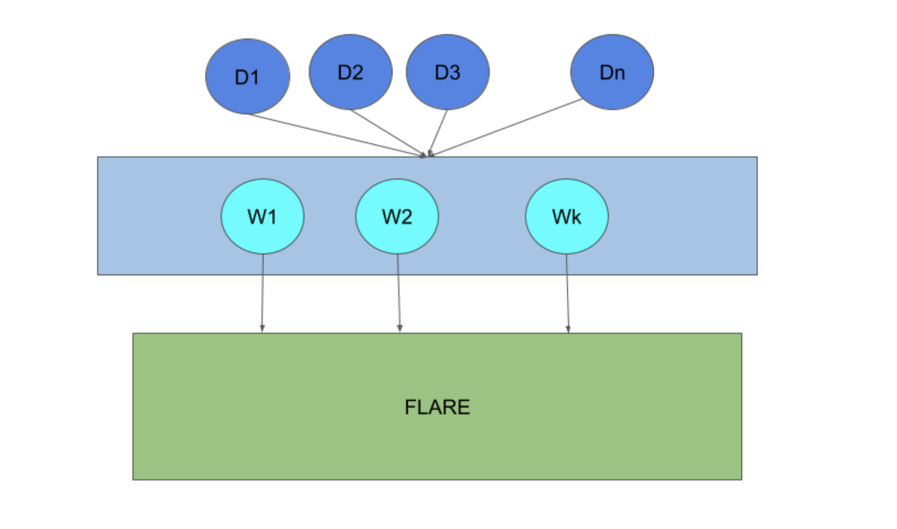
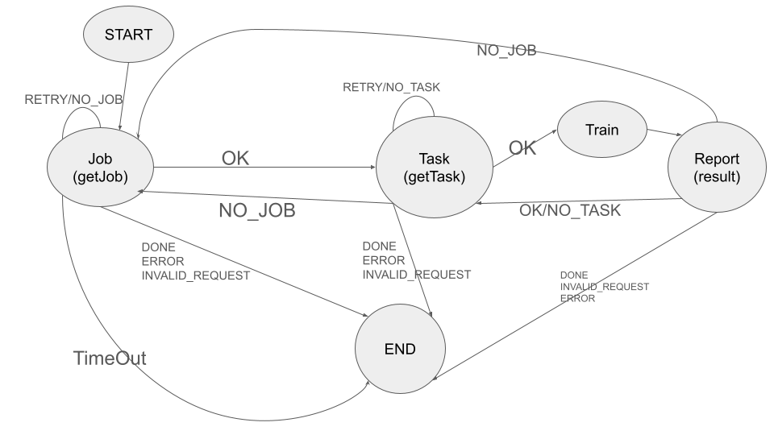
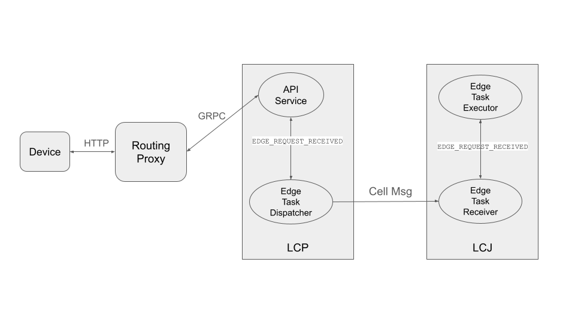
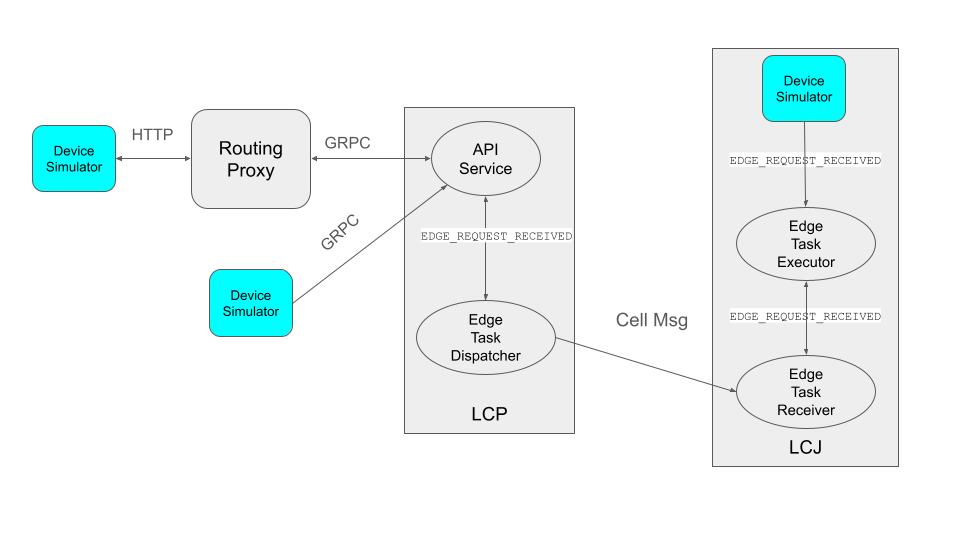

:orphan:

.. _flare_edge:

########################################
エッジデバイス学習 (Jetson / GPU)
########################################

FLARE は連合学習の機能をエッジデバイスにも拡張します。エッジデバイスのアプリケーションには、いくつかの固有の課題があります。

- **スケーラビリティ** : FL クライアント数が比較的少ないクロスサイロのアプリケーションとは異なり、デバイス数は数百万に達する可能性があります。デバイスを単純な FL クライアントとして扱い、FL サーバーに直接接続させることは現実的ではありません。

- **安定性** : FL クライアントが安定しているクロスサイロのアプリケーションとは異なり、エッジデバイスはいつでも接続・切断される可能性があります。そのため、学習戦略は動的な参加に対応する必要があります。

- **計算能力** : クロスサイロのアプリケーションと比べて、エッジデバイスの計算能力は限られています。

- **プラットフォーム依存性** : 複数のエッジデバイスプラットフォーム (例: iOS、Android) が存在し、それぞれ異なるアプリケーション開発環境を持ちます。

デプロイメントアーキテクチャ
==============================

エッジデバイスは数百万台に達し、多数の場所に分散している可能性があります。これらのデバイスは、標準的な Web 技術を使って、どこからでも FLARE のホストシステムに接続できる必要があります。

この図では、デバイス (D1 から Dn) が HTTP プロトコルを使って Web ノード (W1 から Wk) 経由で FLARE に接続します。Web ノードは gRPC 経由で FLARE に接続します。

階層型 FLARE
====================

階層型デプロイメントアーキテクチャの詳細については、 :ref:`flare_hierarchical_architecture` を参照してください。

エッジ学習アルゴリズム
========================

同期集約から非同期集約までの柔軟なオーケストレーションパターン
----------------------------------------------------------------------------

クロスサイロのアプリケーションでは、クライアント数が少なく、クライアントは安定しています。典型的な FedAvg アルゴリズムでは、すべてのクライアントが各ラウンドの学習に参加し、サーバーはすべてのクライアントから学習結果が届くのを待ちます。クライアントからの結果を集約した後、サーバーは新しいバージョンのモデルを生成し、次のラウンドの学習を開始します。これを同期集約と呼びます。

同期集約アルゴリズムは、エッジデバイスベースの学習には適さない場合があります。デバイス数は通常きわめて多く、デバイスクライアントへの接続は安定性に欠ける (デバイスはいつでも接続・切断されうる) ためです。また、デバイスが頻繁に参加・離脱する状況で、大量のクライアントをラウンドごとに協調させるのは困難です。

FLARE は柔軟なオーケストレーションの仕組みを用いて、デバイスベースの学習向けに同期から非同期まで幅広い高度なアルゴリズムをサポートします。一般的なアプローチは次のとおりです。

1. **デバイスの可用性** : サーバー (SJ) は、学習を開始する前に十分な数のデバイスが利用可能になるのを待ちます。デバイスクライアントが起動すると、FL クライアント階層を通じてサーバーに報告されます。

2. **モデルの準備とデバイスの選択** : SJ はモデルの初期バージョンを準備し、(設定された選択プールのサイズに基づいて) 学習対象のデバイス群を選択します。モデルと選択リストは、FL クライアント階層を通じてリーフの CJ に送られます。利用可能なデバイス数が数百万に達する場合でも、選択プールは通常小さく、一般的には数千程度である点に注意してください。

3. **学習と集約** : 選択されたデバイスは学習を開始し、その学習結果をリーフの CJ に報告します。CJ の各階層は定期的に (例: 2 秒ごと) その期間に受け取った結果を集約し、集約結果をクライアント階層内の親 CJ に送信し、最終的にサーバーまで届けます。

4. **モデルの更新とデバイスの入れ替え** : SJ は CJ から集約結果を受け取るたびに、現在のバージョンのモデルを更新します。学習結果を送信したデバイスは選択プールから外され、代わりに他のデバイスがプールに選択されます。十分な数の更新 (設定パラメータ) を受け取ると、SJ は新しいバージョンのモデルを作成し、クライアント階層を通じて新しいモデルと選択リストをリーフの CJ に送信します。選択されたデバイスからのモデル要求には、この新しいモデルバージョンが返されます。

5. **デバイスのばらつきへの対応** : デバイスの性能はさまざまであるため、他より速く学習するデバイスもあります。その結果、遅いデバイスが古いモデルバージョンをまだ学習している一方で、他のデバイスは新しいモデルバージョンを学習していることがあります。複数のバージョンのモデルが異なるデバイスによって同時に学習されうるのです。許容される同時実行モデル数は設定パラメータです。デバイスの結果を受け取ると、それは学習元のバージョンにのみ集約されます。受け取ったバージョンが古すぎる (許容される同時実行バージョンの範囲外である) 場合は破棄されます。次のバージョンのモデルを生成する際、SJ はすべての同時実行モデルバージョンを考慮します。SJ は評価用データセットに対してモデル性能を定期的に評価します。

明示的なラウンドという概念はありません。処理は、満足のいくモデルが得られたか、性能から見て継続する価値がないと判断されるかのいずれかにより、SJ が停止すべきと判断するまで続きます。

この設定可能なオーケストレーションにより、連合学習の全体プロセスを決定するうえで十分な柔軟性が得られます。学習に参加するデバイスが N 台あるとき、次の 2 つの極端なケースを設定できます。

- **同期 FL** : 1) 選択プールが空になったときにのみ選択プールを入れ替える (新しいデバイスを選択してグローバルモデルを配布する)、2) すべてのデバイスの更新を受け取ったときにのみグローバルモデルの新しいバージョンを生成する、と設定します。

- **非同期 FL** : 1) 少なくとも 1 台のデバイスが結果を報告してプールから外れるたびに選択プールを入れ替える、2) 少なくとも 1 台のデバイスの更新でグローバルモデルの新しいバージョンを更新する、と設定します。

- **カスタムオーケストレーション** : これら 2 つの極端なケースの間の任意の値にパラメータを設定することで、バッファ付き非同期集約などの他のオーケストレーションパターンを実現できます。ユーザーは独自の集約手法を定義することもできます。

エッジデバイス連携プロトコル (EDIP)
==========================================

EDIP は、エッジデバイスがホストとやり取りする際に従わなければならない規則を定義します。以下の手順で概要を示します。

ステップ 1 - ジョブの取得
------------------------------

1. **ジョブ要求の開始** : 起動後の最初のステップは、ホストからジョブを取得することです。デバイスクライアントは、ジョブを受け取るか、設定された最大時間を超えるまで ``getJob`` 要求を送信し続けます。ジョブを受け取れなかった場合、クライアントは終了すべきです。

2. **ジョブ名の指定** : ホストへの要求には、あらかじめ定義されたジョブ名を含めなければなりません。LCP はジョブ名を使って一致するジョブを探します。同じジョブ名のジョブが複数ある場合は、ランダムに 1 つが選ばれます。

3. **ヘッダーの提供** : ホストへの要求には、デバイス情報やユーザー情報といった共通ヘッダーも含めなければなりません。いずれもマップ (キー/値のペア) として表現されます。デバイス情報には、デバイスのプラットフォーム、機能、そして最も重要な一意のデバイス ID が含まれます。ユーザー情報にはデバイスのユーザーに関する情報が含まれますが、現在は使用されていません。

4. **ジョブ応答の受信** : ジョブ応答にはジョブ ID が含まれ、学習セッションで使用されます。

5. **ジョブ設定データの処理** : 応答にはジョブ設定データも含まれます。これには、学習コンポーネント (トレーナー、損失関数、オプティマイザなど) やそのパラメータ (学習率、エポック数など) といったジョブの設定情報が含まれます。デバイスクライアントはジョブ設定データを処理し、それに従って学習コンポーネントを作成しなければなりません。

6. **クッキーの取り扱い** : 応答にはクッキーが含まれる場合があります。これは以降の要求でホストに送り返すべき情報です。

ステップ 2 - タスクの取得
------------------------------

ジョブを受け取り、ジョブ設定の処理が完了すると、デバイスは ``getTask`` 要求を送信して、実行するタスクをホストから取得しようとします。

``getTask`` 要求では、クライアントはジョブ ID とクッキー (利用可能な場合) を含めなければなりません。デバイス情報やユーザー情報などの共通ヘッダーも含まれます。

その後、デバイスはホストからのリターンコードに応じて処理を進めなければなりません。

- **OK** : タスクが割り当てられ、応答にタスク情報が含まれます。デバイスはタスクの実行に進まなければなりません。
- **RETRY** または **NO_TASK** : デバイスは後で ``getTask`` 要求を再送しなければなりません。
- **NO_JOB** : 要求したジョブはもう利用できません。デバイスはステップ 1 に戻って次のジョブを取得すべきです。
- **DONE** またはエラー条件全般: デバイスは終了すべきです。

タスクが割り当てられた場合、ホストからの応答にはタスク名とタスクデータ (モデルの重みなど) が含まれます。応答にはクッキーが含まれる場合もあります。

.. note::
   このプロトコルは汎用的なものです。デバイスクライアントは、タスク名とジョブ設定データに定義されたコンポーネントに基づいて、タスクを実行する適切なコンポーネントを選択しなければなりません。

ステップ 3 - タスクの実行と結果の報告
------------------------------------------

タスクを受け取った場合、デバイスは適切に選択したコンポーネントでタスクを実行すべきです。完了すると、デバイスは ``reportResult`` 要求を送信して結果をホストに送り返します。この要求には、ジョブ ID、結果、タスク名と ID、クッキーが含まれます。デバイス情報やユーザー情報などの共通ヘッダーも含まれます。

その後、デバイスクライアントはホストからのリターンコードに応じて処理を進めなければなりません。

- **OK** : 報告が正常に処理されました。デバイスクライアントはステップ 2 に戻って次のタスクを取得すべきです。
- **NO_TASK** : そのタスクはもう利用できません。デバイスクライアントはステップ 2 に戻って次のタスクを取得すべきです。
- **NO_JOB** : そのジョブはもう利用できません。デバイスクライアントはステップ 1 に戻って次のジョブを取得すべきです。
- **END** またはその他のエラー条件: デバイスクライアントは終了すべきです。

これらの手順は、次のような有限状態機械として表すのが最も分かりやすいでしょう。

.. _device_simulation:

デバイスシミュレーション
==========================

デバイスベースのモデル開発には多数のデバイスが必要です。しかし、アルゴリズム開発の段階で大量の実デバイスが常に利用可能であることを期待するのは現実的ではありません。FLARE は、きわめて多数のデバイスを効率的にシミュレートできるデバイスシミュレータを提供しています。

デバイスシミュレータは上記の EDIP に従いますが、加えて ``getSelection`` 要求を使用します。この要求は、現在選択されているデバイス ID をホストから取得します。

実デバイスは、実行するタスクを取得するために ``getTask`` 要求を継続的に送信します。上述のとおり、数百万台のデバイスがある場合、実際にタスクを受け取るのはごく少数です。この挙動をそのままシミュレートすると、無駄なメッセージが大量に発生し、実行するタスクを得るまでに長い時間がかかってしまいます。シミュレータは、すべてのシミュレートデバイスを順番に処理してタスクを取得する代わりに、1 回の ``getSelection`` 要求で選択されたデバイスを即座に取得し、選択されたデバイスについてのみ ``getTask`` 要求を送信します。

シミュレーションのロジック
------------------------------

以下にシミュレータのロジックの概要を示します。

ステップ 1 - ジョブの取得
------------------------------

1. **ジョブ要求の送信** : シミュレータはダミーのデバイス ID を用いて ``getJob`` 要求を送信します。ジョブを受け取るか、要求がタイムアウトするまでこれを続けます。

ステップ 2 - 選択リストの取得
----------------------------------

1. **選択要求の送信** : シミュレータは選択リストを受け取るまで ``getSelection`` 要求をホストに送信します。この要求は、シミュレートするデバイス数をホストに知らせる役割も果たします。

2. **デバイス ID のパターン** : このシミュレータ上のすべてのシミュレートデバイスは、次のパターンを共有します。

   ``<uuid_prefix>#<index_number>``

   ここで ``uuid_prefix`` は一意の UUID であり、 ``index_number`` はシミュレートデバイスのインデックス番号で、1 からこのシミュレータ上のシミュレートデバイス数 (設定パラメータ) までの範囲を取ります。

3. **選択リストの処理** : リーフの CJ が ``getSelection`` 要求を処理する際、クライアント階層を通じてシミュレートデバイスの ID を SJ に報告します。選択リストが利用可能になると、リーフの CJ はそれをシミュレータへの応答に含めます。

4. **デバイスの識別** : 選択リストには選択されたすべてのデバイスが含まれる点に注意してください。実デバイス、他のシミュレータ上のシミュレートデバイス (複数のシミュレータを同時に実行できます)、そしてこのシミュレータのデバイスが混在しています。シミュレータは、そのうち自分に属するデバイスを識別します。

5. **必要に応じた継続** : 選択リストにこのシミュレータのデバイスが 1 つも含まれていない場合、シミュレータは ``getSelection`` 要求の送信を続けます。

ステップ 3 - タスクの取得と実行
------------------------------------

1. **タスク要求の送信** : シミュレータは、自身に属する選択済みデバイスそれぞれについて、順次 ``getTask`` 要求をホストに送信します。

2. **タスクの実行** : タスクを受け取った場合 (選択済みデバイスであっても、ホストに ``getTask`` 要求を送信した時点でタスクがすでに完了している可能性があります)、シミュレータはそのタスクをスレッドプールに投入して実行します。

3. **結果の報告** : タスクが実行されると、シミュレータは ``reportResult`` 要求を通じてホストに結果を報告します。

4. **処理の繰り返し** : すべてのデバイスの処理が終わると、シミュレータは次の選択リストを取得するためにステップ 2 に戻ります。

シミュレーションの完了
--------------------------

シミュレータは、次のいずれかの条件が発生するまで実行を続けます。

- **NO_JOB** のリターンコードを受け取り、ジョブが終了したことが示された場合。
- 何らかのエラーコードを受け取った場合。

シミュレータの設定
====================

シミュレータの挙動は、次のパラメータで設定できます。

- **ジョブ名 (job_name)** : ジョブの名前です。
- **デバイス数 (num_devices)** : シミュレートするデバイスの数です。既定値は 10,000 です。
- **ワーカー数 (num_workers)** : 学習タスクの実行に使用するワーカースレッドの最大数です。既定値は 10 です。
- **GetJob タイムアウト (get_job_timeout)** : ホストから一致するジョブを取得するまでの最大時間です。

シミュレートされたデバイスは、割り当てられたタスクを実行できなければなりません。デバイスに対してタスクを受け取ると、シミュレータはそのデバイスの ``do_task()`` メソッドを呼び出します。シミュレータの設定の一部として ``DeviceFactory`` オブジェクトを提供する必要があり、シミュレータはこれを呼び出して新しいデバイスを作成します。作成されるデバイスは ``do_task()`` メソッドを実装していなければなりません。

ほとんどの場合、 ``DeviceFactory`` を自分で書く必要はありません。代わりに ``TaskProcessor`` を作成するだけで済みます。 ``DeviceTaskProcessor`` を受け取って残りの処理を代行してくれる特別な ``TaskProcessingDevice`` が実装されています。

シミュレーションの実行方法
============================

デバイスとホストの間のエンドツーエンドの通信経路を次の図に示します。

デバイスは HTTP 経由で Web ノード (ルーティングプロキシ) に要求を送信します。

Web ノードは要求に含まれるデバイス ID に基づいて LCP を選択し、gRPC 経由でその LCP に要求を転送します。

LCP 内には 2 つのコンポーネントがあります。API Service と Edge Task Dispatcher です。API Service は Web ノードから要求を受け取り、その要求データとともに ``EDGE_REQUEST_RECEIVED`` イベントを発火します。Edge Task Dispatcher はこのイベントをリッスンし、ジョブ ID に対応する LCJ を見つけて、その LCJ に要求を転送します。

LCJ には 2 つのコンポーネントが含まれます。Edge Task Receiver と Edge Task Executor です。Edge Task Receiver は LCP から要求を受け取り、 ``EDGE_REQUEST_RECEIVED`` イベントを発火します。Edge Task Executor はこのイベントをリッスンして要求を処理し、結果を生成します。その結果は要求と同じ経路をたどってデバイスに返されます。

このエンドツーエンドの通信経路により、シミュレータはさまざまな場所に設置できます。

- リーフの CJ (LCJ) に埋め込む
- LCP に直接接続する
- Web ノードに接続する

これらの選択肢を次の図に示します。

シミュレータを実行する最も効率的な方法は、LCJ に設置することです。Web ノードや LCP へのメッセージホップを回避できるためです。また、最も使いやすい方法でもあります。実デバイスがない場合は、Web ノードを実行する必要すらありません。この方法はアルゴリズム開発に最適です。

シミュレータをルーティングプロキシや LCP に接続する方法は、システムの通信能力のストレステストに役立ちます。

上述の ``tree_prov`` ツールでプロジェクトをプロビジョニングすると、プロビジョニング結果の ``scripts`` フォルダに便利なスクリプトが生成されます。

- ``simulate_rp.sh`` : シミュレータを起動し、ルーティングプロキシに接続します
- ``simulate_lcp.sh`` : シミュレータを起動し、LCP に接続します

``scripts`` フォルダには ``simulation_config.json`` ファイルも含まれます。このファイルには、上述のシミュレーション設定パラメータが含まれます。要件に合わせてこれらのパラメータを編集するとよいでしょう。

以下は ``simulation_config.json`` のサンプルです。

.. code-block:: json

   {
       "endpoint": "http://<end-point-host>:4321",
       "num_devices": 10000,
       "num_workers": 30,
       "processor": {
           "path": "nvflare.edge.simulation.devices.num.NumProcessor",
           "args": {
               "min_train_time": 0.2,
               "max_train_time": 1.0
           }
       }
   }

``simulate_rp.sh`` と ``simulate_lcp.sh`` はいずれも ``simulation_config.json`` ファイルを必要とします。

シミュレータを LCP に手動で設置したい場合は、次の例に示すように ``config_fed_client.json`` で設定する必要があります。
この高度な設定方法では ``nvflare.edge.*`` のコンポーネントを直接使用します。
これらのエッジコンポーネントのクラスは、プロビジョニングされる非 BYOC の ``class_allow_list`` には含まれていません。そのため、
この直接的な設定を使用するジョブは BYOC の認可を通す必要があり、 ``authorization.json`` で BYOC 権限を持つユーザーが
送信しなければなりません。
通常のジョブ作成では、エッジコンポーネントがビルドされる前に BYOC ワークフローでジョブが検証されるよう、
``EdgeFedBuffRecipe`` または ``ETFedBuffRecipe`` でジョブをエクスポートすることを推奨します。

.. code-block:: json

   {
      "format_version": 2,
      "executors": [
          {
              "tasks": [
                  "train"
              ],
              "executor": {
                  "path": "nvflare.edge.executors.edge_model_executor.EdgeModelExecutor",
                  "args": {
                      "aggr_factory_id": "aggr_factory",
                      "max_model_versions": 3,
                      "update_timeout": 5.0
                  }
              }
          }
      ],
      "components": [
          {
              "id": "task_processor",
              "path": "nvflare.edge.simulation.devices.pt_cifar10.PTCifar10Processor",
              "args": {
                  "data_root": "/tmp/nvflare/datasets/cifar10",
                  "subset_size": 100,
                  "communication_delay": {
                      "mean": 5.0,
                      "std": 1.0
                  },
                  "device_speed": {
                      "mean": [
                          10.0,
                          20.0,
                          40.0
                      ],
                      "std": [
                          1.0,
                          2.0,
                          4.0
                      ]
                  }
              }
          },
          {
              "id": "tpo_runner",
              "path": "nvflare.edge.widgets.tpo_runner.TPORunner",
              "args": {
                  "task_processor_id": "task_processor",
                  "job_timeout": 20.0,
                  "num_devices": 100,
                  "num_workers": 5
              }
          },
          {
              "id": "edge_task_receiver",
              "path": "nvflare.edge.widgets.etr.EdgeTaskReceiver",
              "args": {}
          },
          {
              "id": "aggr_factory",
              "path": "nvflare.edge.aggregators.model_update_dxo_factory.ModelUpdateDXOAggrFactory",
              "args": {}
          }
      ],
      "task_data_filters": [],
      "task_result_filters": []
   }

.. note::
   このファイルを手動で作成する必要はありません。代わりに EdgeJob API、 ``EdgeFedBuffRecipe`` 、または
   ``ETFedBuffRecipe`` を使ってジョブ設定を作成し、送信するロールが BYOC ジョブの送信を許可されていることを確認してください。

モデル開発
============

最終的な目標は、連合デバイス学習によって高性能なモデルを開発することです。FLARE は、デバイス固有のプログラミングを必要とせずに PyTorch モデルを開発するための手段を提供します。

ステップ 1 - モデルアーキテクチャの設計
--------------------------------------------

1. **モデル設計** : このステップでは、単一マシンでの学習と同じように PyTorch を使ってモデルを設計できます。ただし、エッジデバイスは一般に計算リソースが限られているため、こうした制約に合わせてモデルアーキテクチャはシンプルかつ軽量に保つべきである点に留意してください。

2. **モバイルデバイスでの学習** : モバイルデバイスでは、学習は現在 ExecuTorch を用いて実装されています。サポートされるレイヤーの一覧は `ExecuTorch の GitHub リポジトリ <https://github.com/pytorch/executorch>`_ を参照してください。PyTorch のものとは異なる場合があります。

ステップ 2 - DeviceModel の作成
------------------------------------

1. **適用範囲** : このステップは、モバイルデバイス向けのモデルを開発する場合にのみ該当します。

2. **ExecuTorch の要件** : ExecuTorch は、学習中にモデルが損失と予測の両方を返すことを要求します。この要件を満たすには、ステップ 1 で定義したモデルを、損失関数と予測ロジックの両方を含むカスタムの ``DeviceModel`` クラスでラップする必要があります。

3. **例** : 以下は、 ``CrossEntropyLoss`` を用いた分類タスク向けに ``DeviceModel`` を作成する例です。

.. code-block:: python

   class DeviceModel(nn.Module):
       """Model wrapper for classification with CrossEntropyLoss."""

       def __init__(self, net: nn.Module):
           super().__init__()
           self.net = net
           self.loss = nn.CrossEntropyLoss()

       def forward(self, input, label):
           pred = self.net(input)
           return self.loss(pred, label), pred.detach().argmax(dim=1)

上記のとおり、既定では ExecuTorch がデバイス学習で使用する ``CrossEntropyLoss`` 損失関数を使用します。

デバイスモデルは ``DeviceModel`` を継承しなければなりません。別の損失関数を選択することもできます。

以下はこれらのモデルを作成する例です。

.. code-block:: python

   import torch
   import torch.nn as nn
   from torch.nn import functional as F

   from nvflare.edge.models.model import DeviceModel

   class Cifar10ConvNet(nn.Module):
       def __init__(self):
           super().__init__()
           self.conv1 = nn.Conv2d(in_channels=3, out_channels=6, kernel_size=5, stride=2)
           # self.pool = nn.MaxPool2d(2, 2)
           self.conv2 = nn.Conv2d(in_channels=6, out_channels=16, kernel_size=5, stride=2)
           self.fc1 = nn.Linear(in_features=16 * 5 * 5, out_features=120)
           self.fc2 = nn.Linear(in_features=120, out_features=84)
           self.fc3 = nn.Linear(in_features=84, out_features=10)

       def forward(self, x):
           x = F.relu(self.conv1(x))
           x = F.relu(self.conv2(x))
           x = torch.flatten(x, 1)  # flatten all dimensions except batch
           x = F.relu(self.fc1(x))
           x = F.relu(self.fc2(x))
           x = self.fc3(x)
           return x

   class TrainingNet(DeviceModel):
       def __init__(self):
           DeviceModel.__init__(self, Cifar10ConvNet())

``Cifar10ConvNet`` は、ステップ 1 で作成する標準的な PyTorch モデルです。
``TrainingNet`` は、ステップ 2 で作成するデバイスモデルです。

ステップ 3 - FLARE ジョブの作成
------------------------------------

このステップでは、レシピを使って FLARE ジョブを作成、または実行します。

モバイルデバイス向けのモデルを開発している場合は ``ETFedBuffRecipe`` を使用する必要があります。それ以外の場合は ``EdgeFedBuffRecipe`` を使用します。

FedBuff [1]_ は、デバイスの選択とモデルの更新を管理するアルゴリズムです。

EdgeFedBuffRecipe
------------------

このレシピは、他のエッジデバイス (例: NVIDIA Jetson デバイス) 上で標準的な PyTorch を用いて学習するジョブを作成するのに役立ちます。
例は `edge examples <https://github.com/NVIDIA/NVFlare/tree/main/examples/advanced/edge>`_ にあります。

.. code-block:: python

   recipe = EdgeFedBuffRecipe(
           job_name=f"pt_job_{fl_mode}{suffix}",
           model=Cifar10ConvNet(),
           model_manager_config=model_manager_config,
           device_manager_config=device_manager_config,
           evaluator_config=EvaluatorConfig(
               torchvision_dataset={"name": "CIFAR10", "path": dataset_root},
               eval_frequency=eval_frequency
           ),
           simulation_config=SimulationConfig(
               task_processor=task_processor,
               job_timeout=20.0,
               num_workers=4,
               # simulation config is for each leaf node
               num_devices=devices_per_leaf,
           ),
           custom_source_root=None,
       )

具体的には、定義すべき主要なコンポーネントが 4 つあります。そのうち ``evaluator_config`` と ``simulation_config`` は分かりやすいものです。

- **Evaluator** : サーバーが ``eval_frequency`` 個のグローバルモデルバージョンを生成するたびに、データセットを使ってグローバルモデルを評価する独立したウィジェットです。
- **Simulation** : 前述のとおり、LCJ 上でデバイスをシミュレートするために使用します。 ``num_devices`` はリーフクライアントごとの値であり、FL に参加するデバイスの総数は ``num_leaf * num_devices`` になります (前に生成したサンプルのツリーを使う場合は ``12 * num_devices`` )。

``model_manager_config`` と ``device_manager_config`` には、サーバーの挙動を制御するためのより多くのパラメータが含まれます。要するに、1) いつ新しいグローバルモデルを生成するか、2) いつ誰にグローバルモデルを送信するか、を制御します。

.. code-block:: python

   model_manager_config = ModelManagerConfig(
               global_lr= ,
               num_updates_for_model= ,
               max_model_version= ,
               max_model_history= ,
          )

- **global_lr** : デバイスからのモデル更新がグローバルモデルにどのように寄与するかを定義します。
- **num_updates_for_model** : 新しいグローバルモデルを生成する前に、サーバーが受け取る必要のあるデバイス更新の数を定義します。
- **max_model_version** : FL ジョブを停止するまでに、サーバーが生成する必要のあるグローバルモデルの数を定義します。
- **max_model_history** : 記録として保持するモデルの数を定義します。これより古いモデルは古すぎるとみなされ、その更新はグローバルモデルに集約されずに破棄されます。

.. code-block:: python

   device_manager_config = DeviceManagerConfig(
   device_selection_size= ,
   min_hole_to_fill= ,
   device_reuse= ,
   )

- **device_selection_size** : 同時進行のアクティブなモデル学習のために常時維持されるデバイスの総数を定義します。
- **min_hole_to_fill** : 現在のグローバルモデルをいつデバイスに配布するかを定義します。デバイスが結果を報告するたびに、そのデバイスはデバイス選択リストから外され、リストに「穴」が生じます。この穴は利用可能なデバイスからサンプリングして埋められ、穴を埋めるために選ばれたデバイスは学習用に現在のグローバルモデルを受け取ります。このパラメータは、サンプリングと現在のグローバルモデルの配布を行うまでに必要な穴の最小数を定義します。
- **device_reuse** : すでに学習に参加したデバイスを再び選択できるかどうかを定義するブール値です。

現実的な例を挙げると、合計 N 台のデバイス (前述のとおり ``12 * num_devices`` ) で M ラウンド実行する標準的な同期 FL パイプラインを構成したい場合、パラメータを次のように設定できます。

``model_manager_config`` の場合:

- **global_lr=1.0**
- **num_updates_for_model=N**
- **max_model_version=M**
- **max_model_history=1**

この設定により、ローカルの更新はスケール係数 1.0 で集約され、グローバルモデルの生成にはすべてのデバイスの更新が必要となり、グローバルモデルのバージョンは M 個 (M ラウンド) になります。また、新しいモデルバージョンを生成する前にすべてのデバイスが報告する必要があるため、追跡すべきグローバルモデルバージョンは 1 つだけで済みます。

``device_manager_config`` の場合:

- **device_selection_size=N**
- **min_hole_to_fill=N**
- **device_reuse=True**

この設定では、N 台すべてのデバイスの選択を維持し、新しいデバイスのサンプリングとモデル配布を行う前に N 台すべてのデバイスが報告する (「穴」になる) のを待ちます。また、常にこれら N 台のデバイスを使用するため ``device_reuse`` を有効にしています。

同様に、これらのパラメータを別の値に設定することで非同期パイプラインをシミュレートできます。詳細は例を参照してください。

参考文献
==========

.. [1] Nguyen, J., Malik, K., Zhan, H., Yousefpour, A., Rabbat, M., Malek, M., & Huba, D. (2023).
   Asynchronous Federated Learning with Bidirectional Quantized Communications and Buffered Aggregation.
   arXiv preprint arXiv:2308.00263. https://arxiv.org/pdf/2308.00263
